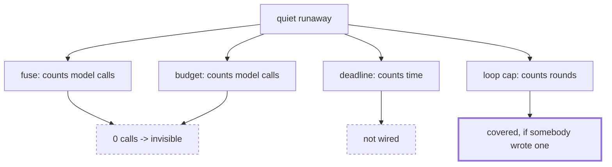

# 5.2 — Criterion 2: every shape has a brake, and the brake is tested

## One-line answer

Four runaway shapes against four brakes is a table with sixteen cells, and the cell that matters is
the one where the quiet runaway is covered only by a loop counter somebody has to have remembered to
write — because Sutra has no run deadline, and a per-node timeout is not one.

## The story

The fire drill is not about the fire. It is about the doors.

Somebody walks the building with a list. Front stairs — open, unlocked, lit. Back stairs — open.
Side exit by the kitchen — and it is blocked by a stack of chairs, which have been there for months,
and which everybody has walked past every day, because a door you never use looks like a wall.

Nobody was negligent. The chairs went there for a reason and the reason has been forgotten. The
value of the drill is not that it tests the doors that get used; it is that it is the only occasion
anybody looks at the one that does not.

## The idea in plain language

Section 1 established four runaway shapes and section 2 established four brakes. This criterion is
the **cross-product**: for every shape, does at least one brake that Sutra actually has stop it?

The reason it has to be a table rather than a list is the finding from
[1.1](../01-four-runaways/1.1-a-runaway-is-a-missing-stop.md): no brake catches every shape, and each
brake's blind spot is the reason the next one exists. A list of brakes tells you what you built. A
table tells you what you are covered for, and those are different questions.

Two words matter in the criterion's phrasing, and both are doing work:

- **"has"** — the table records the brakes that are wired **today**, not the ones that would be good
  to have. A row that is covered by a hypothetical deadline is not covered.
- **"tested"** — a brake nobody has watched fire is a brake nobody knows the state of. Every cell in
  the table below points at a script in this day that ran the shape and watched the brake, so the
  table is a summary of measurements rather than a summary of intentions.

## Why Sutra needs it

Phase 8 gave Sutra autonomous multi-station runs, which is the most capability it has ever had
without supervision. Principle 13 says blast radius before capability, and this criterion is that
principle turned into something with an exit code.

It is also where a real gap gets recorded rather than glossed. Sutra has three of the four brakes.
The fourth — a wall-clock deadline on the whole run — does not exist, and
[1.5](../01-four-runaways/1.5-the-quiet-runaway-the-fuse-cannot-see.md) measured what that means: a
loop that reads two hundred and one pages under a fuse of four, with nothing in the system stopping
it. A gate day that reported "all shapes covered" without saying how would be hiding that.

## The mechanism

The table is generated from what each brake can see, and the two properties that decide it are both
measured facts from earlier in the day.

```python
PRESENT = {"loop cap": True, "fuse": True, "budget": True, "deadline": False}

SHAPES = {
    "tight loop": {"calls": 1, "one_loop": True, "measured_in": "loop.py"},
    "ping-pong": {"calls": 1, "one_loop": False, "measured_in": "pingpong.py"},
    "fan-out bomb": {"calls": 1, "one_loop": False, "measured_in": "fanout.py"},
    "quiet runaway": {"calls": 0, "one_loop": True, "measured_in": "quiet.py"},
}
```

**Line by line:**

- `PRESENT` is the honest inventory. `deadline: False` is the finding, written as data rather than as
  a paragraph somebody might not read. **`FunctionNode` carries a `timeout` field and the workflow
  package exports `NodeTimeoutError`** — verified on the installed `google-adk==2.7.1` on 2026-09-05
  with `python -c "import google.adk.workflow as w; print(sorted(n for n in dir(w) if not
  n.startswith('_')))"` — and neither is a run deadline, because a node that returns quickly two
  hundred times never trips its own timeout.
- `"calls": 1` versus `"calls": 0` — whether the shape makes model calls. This decides whether the
  fuse and the budget can see it, and it is the single property that separates the quiet runaway
  from the other three.
- `"one_loop": True` versus `False` — whether the shape lives inside a single loop, so that a counter
  written into that loop sees all of it. This is
  [1.3](../01-four-runaways/1.3-two-caps-one-rally-twice-the-work.md)'s finding as a boolean: the
  ping-pong is `False`, which is why two intact caps produced a rally of seven.
- `"measured_in"` — every row names the script that ran it. A table cell without a measurement behind
  it is an opinion, and this column is what stops the table becoming one.

```python
def catches(brake: str, shape: str) -> bool:
    """Does `brake` stop `shape`, given what is actually wired today?"""
    if not available(brake):
        return False
    info = SHAPES[shape]
    if brake == "loop cap":
        return bool(info["one_loop"])  # a counter only sees the loop it was written into
    if brake in {"fuse", "budget"}:
        return info["calls"] > 0  # both count model calls, so a free runaway is invisible
    # a run deadline stops anything that keeps running, cost or no cost
    return brake == "deadline"
```

**Line by line:**

- `if not available(brake): return False` — a brake that is not wired catches nothing, which is what
  makes `PRESENT` load-bearing rather than decorative.
- `return bool(info["one_loop"])` — the loop cap's rule, stated as the property it actually depends
  on rather than as a list of shapes. If somebody adds a fifth shape, this line already has an
  opinion about it.
- `info["calls"] > 0` for both the fuse and the budget — **the same condition for two different
  brakes**, which is the compressed statement of why having both does not help with the quiet
  runaway. Two brakes with one blind spot have one blind spot.
- The final `return brake == "deadline"` — a deadline stops everything, which is exactly why its
  absence is the row worth arguing about.

Run it:

```bash
cd days/day-59-runaway-agents-contained/lab
uv run python guards.py; echo "exit: $?"
```

**Line by line:**

- No flags: the brakes Sutra has today.

Measured on 2026-09-05:

```text
brakes wired today: loop cap, fuse, budget
shape              loop cap       fuse     budget   deadline   covered  measured in
tight loop              yes        yes        yes         no       yes  loop.py
ping-pong                no        yes        yes         no       yes  pingpong.py
fan-out bomb             no        yes        yes         no       yes  fanout.py
quiet runaway           yes         no         no         no       yes  quiet.py
```

`findings: 0` and `exit: 0`. **Criterion 2 passes**, and passing is the beginning of the reading
rather than the end of it.

Read the columns. The `loop cap` column has two `no`s, both for shapes that span more than one loop.
The `fuse` and `budget` columns are **identical**, which is the visual form of the point above: they
are two brakes with one blind spot. The `deadline` column is empty because Sutra does not have one.

Now read the `quiet runaway` row across, because it is the whole reason this criterion is a table.
It is covered by exactly one cell. Not by the fuse, not by the budget, and not by a deadline, but by
a loop counter — and a loop counter is not a property of the system, it is a line of code somebody
wrote into one particular loop. Every other row has two or three independent brakes. This row has
one, and its one depends on somebody having remembered.

That is what "covered" costs when you read it honestly, and it is why the row gets a sentence in the
verdict at [5.6](5.6-criterion-6-the-ids-and-the-verdict.md).



## When it breaks

The table is a claim about the system, so it breaks when the system changes underneath it — and the
useful property is that you can make it break on purpose.

Remove the loop cap:

```bash
uv run python guards.py --drop "loop cap"; echo "exit: $?"
```

**Line by line:**

- `--drop "loop cap"` marks one brake as absent. It does not change any shape, any threshold or any
  other brake.

```text
brakes wired today: fuse, budget
shape              loop cap       fuse     budget   deadline   covered  measured in
tight loop               no        yes        yes         no       yes  loop.py
ping-pong                no        yes        yes         no       yes  pingpong.py
fan-out bomb             no        yes        yes         no       yes  fanout.py
quiet runaway            no         no         no         no        NO  quiet.py
    findings: 1
    FINDING: quiet runaway: no brake wired today stops it (quiet.py)
exit: 1
```

One brake removed, one shape uncovered, exit 1. Three of the four rows do not move at all, because
they had two other brakes; the fourth had one.

And the fix that a reader will reach for, so that the table can say whether it works:

```bash
uv run python guards.py --with deadline
```

**Line by line:**

- `--with deadline` adds the brake Sutra does not have, so the table can price the change before
  anybody writes it.

The `deadline` column fills with `yes` down every row, which is the argument for building it: it is
the only brake in the set that is blind to what the steps are made of, and blindness is the property
you want in a last resort.

The way this criterion breaks *badly* is subtler than any of that. It is a table of the shapes
somebody thought of. A fifth shape — one that spends money without model calls, say, by calling a
paid tool — has no row, so it is neither covered nor reported. The table cannot tell you about a
shape it does not contain, and the honest thing a gate can do about that is say so, which is what
this paragraph is.

## In production

**What a professional writes instead.** The same table, generated from **configuration rather than
from a literal** — the `PRESENT` dict is read from the actual runtime settings, so it cannot drift
from what is deployed. That turns the criterion from "somebody updated the table" into "the table
describes production", which is the difference between a document and a check.

They also add a column the lab does not have: **who is notified when this brake fires.** A brake that
stops a runaway and tells nobody has converted an expensive incident into a silent one, and silent
containment gets removed six months later by somebody who cannot see what it is for.

**What degrades at scale.** The number of shapes grows with the number of ways your system can spend
something. Model calls, tool calls, storage, worker time, third-party API quota, human attention in
an escalation queue — each is a resource that can run away, and each needs its own row and its own
brake. The four-by-four table is a starting point sized to a system with one scarce resource.

**The failure mode that only appears with real traffic.** Coverage rots quietly. Somebody adds a node
that calls a tool in a loop, and the quiet-runaway row's single brake — a loop counter in a
*different* loop — does not extend to it. The table still says covered, because the table describes
shapes and not code paths. That is the argument for the inbound-edge audit in
[3.1](../03-brakes-that-do-not-hold/3.1-the-guard-the-agent-can-talk-past.md) being run alongside
this one: this table checks that brakes exist, and that check finds the paths that avoid them.

**The review comment a senior engineer leaves:** *"The quiet-runaway row is covered by one cell and
that cell is a loop counter in a specific function. That is not system coverage, that is somebody
having remembered. Either add a run deadline — and note that the node `timeout` field is not one — or
write down explicitly that we accept this risk and what the trigger for revisiting it is."*

**The interview question:** *"How do you know your containment is complete?"* — *"I do not, and the
honest thing is a table rather than a claim. I list the failure shapes, list the brakes that are
actually wired, and fill in which brake catches which — with a column naming the script that measured
each cell, so the table is a summary of runs rather than of intentions. For our desk that surfaced
one real gap: the quiet runaway, a loop that makes no model calls, is covered by exactly one cell,
because the fuse and the quota breaker both count model calls and therefore share a blind spot, and
we have no run deadline. Three rows have redundant coverage and one has none to spare. The other
thing the table gives you is a red button: drop a brake and the criterion exits non-zero, which is
how I know the check can fail."*

## Check yourself

```bash
cd days/day-59-runaway-agents-contained/lab
uv run python guards.py; echo "exit: $?"
uv run python guards.py --drop "loop cap"; echo "exit: $?"
uv run python guards.py --with deadline
```

Now add a fifth shape to `SHAPES` — a loop that calls a paid third-party tool once per round and no
model — and decide which of the four brakes catches it.

**Out loud, without scrolling up:** say why the `fuse` and `budget` columns are identical, and what
that means for the quiet runaway.

**Next:** [5.3 — Criterion 3: the eval goes red when a brake is removed](5.3-criterion-3-the-eval-goes-red.md).
