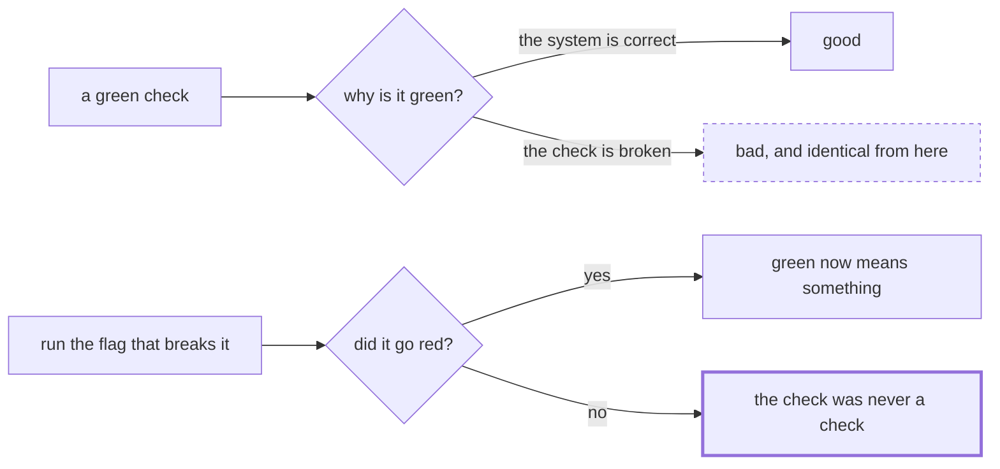

# 5.3 — Criterion 3: the eval goes red when a brake is removed

## One-line answer

A check that has never failed is a check nobody has evidence about, so this criterion is not "the
tests pass" but "here is the command that makes each of them fail, and here is it failing":
`gate.py` exits 1 today, and every other check in this day has a flag that turns it red.

## The story

The smoke alarm in the hallway has a green light on it and has had for four years.

The green light means it has power. It does not mean it can hear anything. The sensor could have
been painted over, or filled with dust, or simply died in a way that leaves the light on, and from
where you are standing — under it, looking up, seeing green — those all look identical to a working
alarm.

There is a button on the front. You press it and it shrieks, and everybody in the flat is briefly
annoyed with you.

That noise is the only evidence you will ever have.

## The idea in plain language

Principle 11 says **evals are tests**, and the sharp end of that principle is a question about
evidence: *how do you know this check can fail?*

A green check has two possible explanations. Either the thing it checks is correct, or the check is
broken. Those two look identical from the outside, for ever, and the only way to distinguish them is
to make the check go red on purpose and watch.

This is more pressing for containment checks than for ordinary tests, for a reason worth stating.
An ordinary test fails often during development, so you get evidence for free — you have watched it
fail on your way to making it pass. A containment check is written after the brake works, passes on
the first run, and then passes every day for a year. **Nobody ever sees it fail**, so nobody ever
learns whether it can.

So the criterion is not "the checks pass". It is: **for every check, name the command that makes it
red, and run that command.** Four checks, four ways to break them:

| Check | The flag that turns it red | What it proves |
| --- | --- | --- |
| `endtoend.py` | `--leaky-intake` | the path and cost assertions are real |
| `guards.py` | `--drop "loop cap"` | the coverage table is not a decoration |
| `loosen.py` | `--revisions 8` | the brake arithmetic is being computed |
| `gate.py` | *(no flag needed today)* | the day's own gate is red before the work |

## Why Sutra needs it

Every criterion in this section ends in an exit code, and an exit code is a thing that gets wired
into `./m check` and then into whatever runs on every commit. Once it is wired, it is load-bearing:
people will stop reading the output and start reading the colour.

That is fine, and it is the point of automation — but it means the moment of wiring is the last
moment anybody will look closely, and it is therefore the moment to establish that red is reachable.
A containment check that cannot go red is worse than no check, because it occupies the slot where a
real one would have gone and it reports success while doing so.

## The mechanism

The day's own gate is the cleanest example, because it is red **right now**, before any of the
build brief has been done.

```python
def findings() -> list[str]:
    out: list[str] = []

    if not MODULE.is_file():
        out.append(f"1-5: {MODULE.relative_to(ROOT)} does not exist yet")
        return out

    source = MODULE.read_text(encoding="utf-8")
    for symbol in REQUIRED:
        if not re.search(rf"^\s*(def |class )?{symbol}\b", source, re.M):
            out.append(f"{MODULE.name} does not define {symbol}")
```

**Line by line:**

- `if not MODULE.is_file()` first, with an early `return` — the check has to survive the module not
  existing, because that is its state on the day it is written. A check that raises when the thing it
  checks is absent is not red, it is broken, and the two get treated differently by CI.
- `"1-5: ..."` — the finding names the range of checks it stands in for, so a reader knows that one
  line is hiding five and does not conclude that only one thing is missing.
- `re.search(rf"^\s*(def |class )?{symbol}\b", source, re.M)` — a text search rather than an import.
  Importing the learner's half-finished module would raise on a syntax error and turn a red check
  into a crash; searching the source degrades gracefully.
- `REQUIRED` as a list — the five things the build brief asks for. Adding a sixth requirement is a
  one-line change here, which is what keeps the gate honest as the day's brief grows.

```python
    for symbol in ["MAX_REVISIONS", "RUN_FUSE", "DAILY_FLOOR"]:
        line = re.search(rf"^{symbol}\s*=.*$", source, re.M)
        if line and "#" not in line.group(0):
            out.append(f"{symbol} has no comment naming the run it came from")
```

**Line by line:**

- This is the ritual half of Principle 7, pointed at a containment constant. Day 50 applied the same
  rule to `TOP_K` and `CHUNK_SIZE`: a bare number is an opinion, and a number with the run it came
  from beside it is a decision.
- `"#" not in line.group(0)` — a deliberately crude test. It cannot tell a good comment from a bad
  one; it can only insist that somebody wrote something. That is the right ambition for a script, and
  the judgement stays with the reviewer.
- The three symbols are exactly the three numbers
  [3.4](../03-brakes-that-do-not-hold/3.4-the-brake-loosened-for-one-ticket.md) showed to be terms in
  an inequality, which is why they are the ones that must carry their provenance.

Run it, today, before anything is written:

```bash
cd days/day-59-runaway-agents-contained/lab
uv run python gate.py; echo "exit: $?"
```

**Line by line:**

- No flags. The module `sutra/containment.py` does not exist, because the build brief has not been
  done.

Measured on 2026-09-05:

```text
    1-5: sutra\containment.py does not exist yet
findings: 1
exit: 1
```

**Red before the work.** That is the shape Principle 11 asks for and it is worth being explicit about
why it is not a formality: this check was run before the module existed, so we know it notices the
module's absence. When it eventually goes green, green will mean something.

Now the three other checks, each broken on purpose. The commands and their measured results:

```bash
uv run python endtoend.py --leaky-intake; echo "exit: $?"
uv run python guards.py --drop "loop cap"; echo "exit: $?"
uv run python loosen.py --revisions 8; echo "exit: $?"
```

**Line by line:**

- `--leaky-intake` makes intake pass an unrecognised ticket onward, so the unknown-ticket case spends
  a model call it should not have. It breaks the *system*, not the check.
- `--drop "loop cap"` removes a brake from the coverage inventory, leaving the quiet runaway with
  nothing.
- `--revisions 8` moves one term of the brake inequality without moving the others.
- All three are flags on the checks rather than edits to the code, which is what makes "prove it can
  fail" a command somebody can run in ten seconds rather than a task somebody will not do.

Measured on 2026-09-05, the three exit codes are `1`, `1` and `1`, with these findings:

```text
    FINDING: 8842: ended at 'escalate' after 1 model calls, expected 'escalate' within 0
    FINDING: quiet runaway: no brake wired today stops it (quiet.py)
    FINDING: the nightly worst case (204) exceeds the daily free tier (20) by 184 requests
```

Three different checks, three different findings, three non-zero exits. Every check in this day has
now been observed failing.



## When it breaks

The criterion breaks when the way of making a check red **stops corresponding to a real failure.**

Here is the shape. Somebody adds a flag to a check purely so that this criterion is satisfiable — a
`--fail` flag that makes the script exit 1 unconditionally. The criterion passes: the check can go
red, demonstrably. And it has proved nothing at all, because the red state was reached by a code path
that has no relationship to the system under test.

The distinction is exact and worth holding onto: **the flag must break the system, not the check.**
Every flag in the table above changes how the desk behaves — a route, an inventory, a constant — and
the check then notices. A flag that changes the check's own verdict is theatre.

The second break is more common and less obvious: the check goes red for a *different reason* than
the one you think. `loosen.py --revisions 8` exits 1, and so does `loosen.py` with no flags at all,
because the shipped configuration already has two findings. If you were using "exit code changed" as
your evidence, you would get no signal from that flag whatsoever — the exit code is 1 either way. The
evidence is in the *findings*, and specifically in the numbers inside them: sixty becomes two hundred
and four. A criterion that reads only exit codes would have missed the whole thing, which is a small
argument for checks that print their reasoning rather than only their verdict.

There is a third failure that this day cannot fix and should name. `guards.py --drop "loop cap"`
removes a brake **from the inventory**, not from the code. It proves the table reacts correctly to a
missing brake; it does not prove that the loop cap in the desk actually works, which is what
[2.2](../02-where-a-brake-goes/2.2-the-loop-counter.md) measured separately. Knowing which of those
two a check establishes is the difference between a gate you can rely on and one you merely trust.

## In production

**What a professional writes instead.** They keep a small suite of **deliberate breakages** that runs
in CI — often called mutation testing when it is automated, and a "chaos test" when it is manual —
and the rule is that a change to a brake must come with a demonstration that the corresponding check
notices. In practice this means the flags above are not developer conveniences, they are part of the
test suite: a test that runs `--drop "loop cap"` and asserts a non-zero exit.

The rule they enforce in review is one sentence: **a new check arrives with the command that makes it
fail.** Not a description of how it might fail — the command, in the pull request, with its output.

**What degrades at scale.** The number of checks grows and the number of ways to break each one grows
faster, so exhaustive breakage stops being feasible. What survives is a rule of proportion:
containment checks get a breakage test, ordinary assertions do not. The reason for the asymmetry is
the one at the top of this part — ordinary tests fail during development and containment checks do
not.

**The failure mode that only appears with real traffic.** Checks rot in one direction. A check that
starts failing gets fixed or deleted within a day, because somebody is blocked. A check that starts
*always passing* — because the thing it examined moved, or a config key was renamed, or the fixture
stopped exercising the path — is never noticed, because green is what everybody expects. Every
long-lived test suite has some of these, and the only thing that finds them is periodically making
them go red.

**The review comment a senior engineer leaves:** *"Good, the gate is red before the module exists.
Now show me the command that makes each of the other three go red, and check that it is breaking the
desk rather than the script — a `--fail` flag would satisfy this criterion and prove nothing. And
note that `loosen.py` exits 1 with and without the flag, so for that one the evidence is the numbers
in the findings, not the exit code."*

**The interview question:** *"How do you know your tests are testing anything?"* — *"I break them on
purpose and watch. It matters more for safety checks than for ordinary tests, because an ordinary
test fails on your way to making it pass, so you get the evidence for free — whereas a containment
check is written after the mechanism works, passes first time, and then passes for a year with
nobody ever seeing it fail. So each of ours has a documented command that makes it red, and the rule
is that the command must break the system rather than the check: a flag that just makes the script
exit non-zero would satisfy the letter of it and prove nothing. One of ours taught me a second thing
— it already exits 1 in its shipped configuration, so the exit code carries no signal for that check
and the evidence has to be the numbers inside the findings."*

## Check yourself

```bash
cd days/day-59-runaway-agents-contained/lab
uv run python gate.py; echo "exit: $?"
uv run python endtoend.py --leaky-intake; echo "exit: $?"
uv run python guards.py --drop "loop cap"; echo "exit: $?"
```

Now pick any one of the four checks and find a **second** way to make it red — one the table does not
list. Write down whether your way breaks the system or the check.

**Out loud, without scrolling up:** explain why a green check has two possible meanings, and state the
rule that distinguishes a real breakage flag from theatre.

**Next:** [5.4 — Criterion 4: the request budget is measured, not estimated](5.4-criterion-4-the-budget-is-measured.md).
