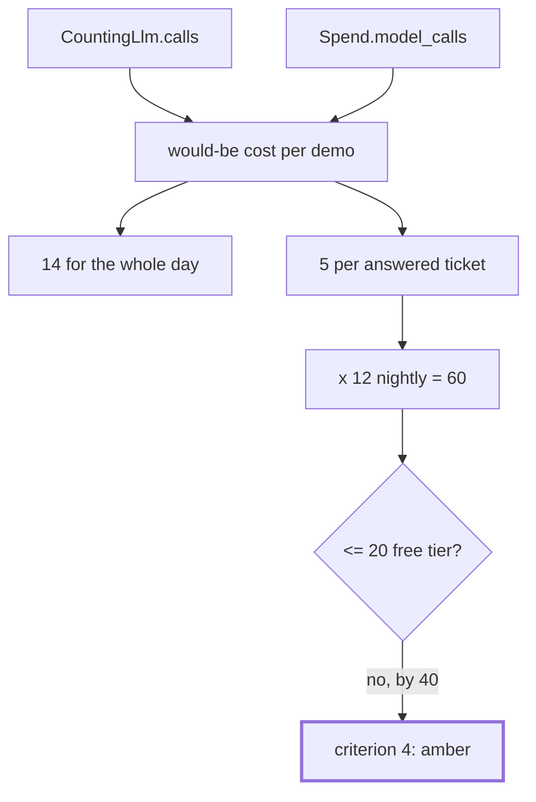

# 5.4 — Criterion 4: the request budget is measured, not estimated

## One-line answer

The day's demos would have cost fourteen provider requests against a free tier of twenty, and cost
**zero**, because every model in the lab is a `BaseLlm` subclass that counts itself — and the number
is printed by a script rather than added up by hand.

## The story

The electricity bill comes and it says **E** next to the amount.

E is for estimated. Nobody came. They took last quarter, adjusted it a bit, and sent you a number
that is a reasonable guess about a house they have not visited since spring.

You go and look at the meter yourself, and it is four hundred units lower than the bill assumes,
because the tenant moved out in July and nobody told the electricity company.

The estimate was not dishonest. It was the best anybody could do without walking to the cupboard
under the stairs. The reading took ninety seconds, and it is the only number that is about your
house.

## The idea in plain language

Principle 15 says **quota is the currency**, and a currency you do not count is one you do not have.

Every day in this curriculum carries a request budget in its hub, and the temptation is to write it
by reasoning: five stations, two of them call a model, two revision rounds, so about five calls per
ticket, times three tickets, call it fifteen. That reasoning is correct here. It is also an estimate,
and estimates have a specific failure mode: **they are computed from the design, and the design is
what you believe rather than what is deployed.**

The criterion is therefore not "the budget is small" but "the budget is a number a script printed".
Three things that requires:

1. **Every model call goes through something that counts.** In this lab that is `CountingLlm`; in a
   real system it is the client wrapper or a plugin.
2. **The count is per demo**, so an expensive one cannot hide inside a cheap one.
3. **The actual provider calls are reported separately from the would-be calls**, because for this
   day those two numbers are different and the difference is the whole point.

That third one deserves a name, because it is a technique rather than a formality. A **would-be
cost** is what the run would have cost against a real provider, produced by a fake model that counts.
It lets you measure the price of a design without paying it, which is what makes it possible to study
runaways at all — [1.1](../01-four-runaways/1.1-a-runaway-is-a-missing-stop.md)'s whole lab design
rests on it.

## Why Sutra needs it

The free tier is twenty generate requests per day per model. Day 2 met that limit as a live 429 and
`docs/PACKAGES.md` records it. Every number in this day is compared against that twenty, and a
comparison is only as good as the number on the left of it.

There is also a sharper reason for a gate day specifically. This day's subject is systems that spend
more than they should. A day about runaway spending whose own spending is an estimate would be making
exactly the mistake it teaches — and [3.4](../03-brakes-that-do-not-hold/3.4-the-brake-loosened-for-one-ticket.md)
has already shown that this project's shipped configuration does not, in fact, fit inside its quota.

## The mechanism

The counting is not added on top of the demos; it is the model itself.

```python
class CountingLlm(BaseLlm):
    model: str = "fake/counting"
    replies: list[str] = ["ok"]
    hard_stop: int = 40
    calls: int = 0

    async def generate_content_async(
        self, llm_request: LlmRequest, stream: bool = False
    ) -> AsyncGenerator[LlmResponse, None]:
        self.calls += 1
        ...
```

**Line by line:**

- `self.calls += 1` in the model's own generate method — the count happens at the only place a call
  can possibly pass through, which is what makes it complete rather than approximate. A counter
  anywhere else can be bypassed by a code path that calls the model differently.
- `class CountingLlm(BaseLlm)` — because it is a real `BaseLlm`, the runtime's **own** counter
  increments too, which is what makes `max_llm_calls` work in
  [2.3](../02-where-a-brake-goes/2.3-the-run-fuse.md). Two independent counts of the same events,
  and in every measurement in this day they agree.

The budget script runs the day's graph-backed demos and totals them:

```python
def main() -> None:
    rows: list[tuple[str, int]] = []
    for ticket, question in QUESTIONS.items():
        spend = Spend()
        run(drive(triage_graph(spend), question))
        rows.append((f"triage {ticket}", spend.model_calls))
    rows.append(("never-satisfied loop under a fuse of 4", polish_run(4)))
```

**Line by line:**

- `spend = Spend()` fresh per ticket — the same discipline as
  [5.1](5.1-criterion-1-end-to-end.md), for the same reason: a shared counter makes a per-demo table
  meaningless.
- `spend.model_calls` — counted by the stations, independently of `CountingLlm.calls`. The desk's
  stations do not call a live model at all in this configuration, so this is the *design's* count,
  and it is what a real deployment would spend.
- `polish_run(4)` returns `model.calls` — the fake model's count, for the one demo that is a real
  agent under a real fuse.
- The runaway demos from section 1 are deliberately **not** in this table, and that is a decision
  worth stating rather than hiding: they are bounded by the lab wall rather than by a brake Sutra
  ships, so including them would report a cost for a configuration nobody would deploy.

Run it:

```bash
cd days/day-59-runaway-agents-contained/lab
uv run python budget.py
```

**Line by line:**

- No flags. It runs the three tickets and the fused loop, and prints one row each.

Measured on 2026-09-05:

```text
demo                                          would-be provider calls
triage 4610                                                         5
triage 4712                                                         5
triage 8842                                                         0
never-satisfied loop under a fuse of 4                              4
TOTAL if these were real calls                                     14
ACTUAL calls to a provider                                          0
free tier                                                          20
```

**Fourteen would-be, zero actual, against twenty.**

The two middle rows are the criterion. Fourteen is the honest price of this day's demonstrations: if
you ran them against Gemini's free tier you would have six requests left. Zero is what was actually
spent, and it is zero because the model is a stub — which is why the runaway demos in section 1 could
be run at all, and why they can be re-run every time somebody changes a brake rather than once, by
whoever had quota left.

Note the `triage 8842` row: **zero.** The unknown ticket costs nothing, which is
[5.1](5.1-criterion-1-end-to-end.md)'s criterion appearing again from a different direction. Honest
refusal is the cheapest path through the desk, and it is pleasant when the ethical argument and the
arithmetic point the same way.

Now the number that the criterion is really for, which is not in this table. Put the desk's measured
cost next to the nightly batch:

```bash
uv run python loosen.py
```

**Line by line:**

- `loosen.py` takes the same five-calls-per-ticket figure that `budget.py` measured and multiplies it
  by the nightly batch size, then compares against the free tier.

```text
    worst case per run : 1 + 2 x 2 = 5 calls
    worst case nightly : 5 x 12 = 60 calls
    free tier          : 20 per day
    FINDING: the nightly worst case (60) exceeds the daily free tier (20) by 40 requests
```

**Criterion 4 is amber, and this is why.** The per-run budget is measured and it is fine. The
*aggregate* budget is measured and it does not fit: a nightly batch of twelve tickets needs sixty
requests against an allowance of twenty. Nothing is broken and no brake has failed. The desk simply
cannot process twelve tickets a night on one free tier, and until today nobody had multiplied the two
numbers together.



## When it breaks

The budget breaks by being **measured on the wrong runs**.

Everything above measures the happy path plus one fused loop. It does not measure a retry storm, a
resumed run, a run that was killed and re-executed, or a day on which the same ticket arrives three
times because a customer is impatient. Each of those multiplies the per-ticket cost by something, and
none of them is in the table.

That is not a flaw in the script; it is the honest scope of a measurement, and the failure is
believing the number covers more than it does. The specific arithmetic to be nervous about:

- **Retries** multiply, and [3.2](../03-brakes-that-do-not-hold/3.2-three-retries-become-twenty-seven.md)
  measured three layers producing twenty-seven calls from one request. A budget measured without
  failures is a budget measured on the cheapest day of the year.
- **Kills and resumes** re-spend. [2.5](../02-where-a-brake-goes/2.5-the-kill-switch-and-what-it-leaves.md)
  measured three calls spent and unrecoverable on a kill at the review station, and a naive resume
  pays for the review again.
- **The batch size** is the multiplier nobody classifies as a cost input, which is
  [3.4](../03-brakes-that-do-not-hold/3.4-the-brake-loosened-for-one-ticket.md)'s finding.

The second break is the one that makes the measurement stop being a measurement: somebody wires the
real provider into one path and leaves the stub in the others. Now the count is partly real and
partly fake and the total means nothing. The defence is that the script prints `ACTUAL calls to a
provider` as its own row — if that row is ever non-zero in a lab run, the number above it is no
longer a would-be cost and the whole table needs re-reading.

## In production

**What a professional writes instead.** The counter is not a test fixture, it is a **plugin in the
production path** — the same `before_model_callback` hook the quota breaker in
[2.4](../02-where-a-brake-goes/2.4-the-circuit-breaker.md) uses, incrementing a counter tagged with
the tenant, the entry point and the model. Then the budget is not a number in a document; it is a
query. "What did the nightly batch cost last night" stops being an estimate and becomes a `group by`.

They also record **cost per successful outcome**, not per run, because runs that fail still spend.
A desk that answers eight tickets out of ten for five calls each has a real cost of `50 / 8` per
answered ticket, not five, and the gap between those two numbers is where the surprise in every
quota postmortem lives.

**What degrades at scale.** Per-process counters diverge, exactly as
[2.4](../02-where-a-brake-goes/2.4-the-circuit-breaker.md) noted for the ledger. Four workers each
counting their own calls give you four numbers, none of which is the answer, and summing them
requires that they are all reporting to the same place at the same resolution.

**The failure mode that only appears with real traffic.** The distribution has a tail, and budgets
are set from the mean. Most tickets cost five calls; the hard ones cost nine or seventeen; and the
hard ones arrive together because they are correlated with whatever is going wrong that day. A budget
set from an average survives an average day, which is not the day it needs to survive.

**The review comment a senior engineer leaves:** *"Fourteen is measured, which is good, but it is
measured on the happy path with no retries and no resumes. Add a row for a run that fails once and
retries, and put cost-per-answered-ticket next to cost-per-run — and note that the nightly figure
already does not fit in the free tier, so the batch size is a decision we are currently making by
accident."*

**The interview question:** *"What does your agent cost per request?"* — *"Measured, five model calls
for an answered ticket and zero for one we refuse at intake, on a free tier of twenty a day. I count
it in the model client itself rather than reasoning from the design, because the design is what I
believe and the client is what runs. The number that changed my mind about something was the
aggregate: five per ticket is fine, and a nightly batch of twelve is sixty against an allowance of
twenty, which nobody had multiplied out. And I would flag two things about any budget like this —
it is measured on the happy path, so retries and resumes are not in it, and the useful denominator is
answered tickets rather than runs, because failed runs still spend."*

## Check yourself

```bash
cd days/day-59-runaway-agents-contained/lab
uv run python budget.py
uv run python loosen.py
```

Now work out the largest nightly batch that fits inside twenty requests at the shipped revision cap,
and say whether that batch size is one the desk could be useful at.

**Out loud, without scrolling up:** explain the difference between a would-be cost and an actual
cost, and say why this day's total is fourteen and zero at the same time.

**Next:** [5.5 — Criterion 5: the freshness check](5.5-criterion-5-the-freshness-check.md).
