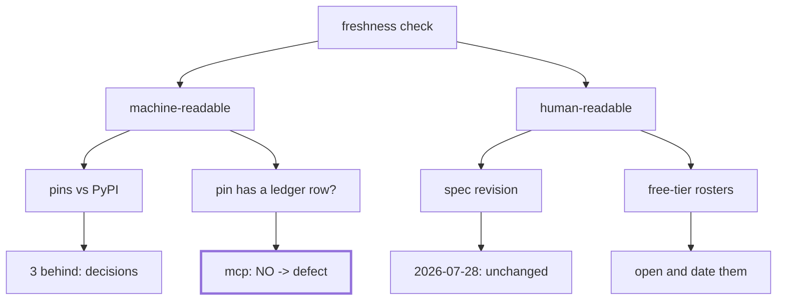

# 5.5 — Criterion 5: the freshness check

## One-line answer

Every phase gate re-verifies the things the ecosystem can move underneath you, and this one found
that all three of Sutra's pins are behind — `google-adk` 2.7.1 against 2.8.0, `google-genai` 2.19.0
against 2.22.0, `mcp` 1.29.1 against 2.1.1 — and that `mcp` is pinned with **no row in
`docs/PACKAGES.md`**, which is a Principle 7 violation standing since Phase 5.

## The story

You open the cupboard to make something and take down the packet of baking powder at the back.

It has been there since you moved in. It looks fine. Baking powder does not go mouldy or smell wrong
or change colour; it just quietly stops working, and the only way you would find out is a cake that
does not rise, two hours from now, with guests arriving.

You turn the packet over. There is a date on the bottom and it was eleven months ago.

The packet did not change. What changed is the date, which is a thing that happens without anybody
touching the cupboard.

## The idea in plain language

A **freshness check** is the periodic re-verification of every fact your project depends on that
somebody else controls.

Plan §15 requires one at every phase gate, and the reason it is a gate ritual rather than a
continuous one is that these facts do not fail loudly. A version pin does not stop working when a new
version ships. A model name does not disappear the day it is deprecated. A spec revision does not
notify you. Everything keeps working, and the gap between what you verified and what is true grows
quietly until something depends on it.

Five categories, and they have different failure modes:

| What | How it moves | What it breaks when it does |
| --- | --- | --- |
| package pins | new releases | nothing today; a wall on the day you upgrade |
| model rosters | providers retire free models | every call, at once, with a 404 |
| free-tier limits | providers change the numbers | your arithmetic, silently |
| spec revisions | a new dated revision ships | interoperability, at the next client |
| skill provenance | a third-party source changes | trust, and Day 29 explains why |

The important distinction, and the one that decides how the check is written: some of these a machine
can read, and some it cannot. A machine can read PyPI. A machine cannot read a rate-limit page behind
a login. **A freshness check that only reports what it can automate has quietly redefined the check
as the subset a script can do**, which is the most common way this ritual becomes theatre. So the
script does both jobs: it checks what it can, and it prints the exact command or URL for what it
cannot, so that "I checked" means something specific.

## Why Sutra needs it

Principle 14 says: **if reality changes, the plan is amended first.** That principle is unenforceable
without a moment where somebody goes and looks, and this is that moment.

Principle 7 says never invent a version, and every pin in `pyproject.toml` has a dated row in
`docs/PACKAGES.md` recording when it was verified. A gate is where those dates get examined rather
than accumulated — and, as it turns out below, where a missing row gets found.

## The mechanism

The script reads the repo's own claims and pairs each with the command that checks it:

```python
CHECKS = [
    (
        "google-adk pin",
        r'"google-adk==([\d.]+)"',
        "curl -s https://pypi.org/pypi/google-adk/json | python -c "
        "\"import json,sys;print(json.load(sys.stdin)['info']['version'])\"",
    ),
    # ... the same shape for google-genai and mcp
]
```

**Line by line:**

- Each entry is `(name, pattern, command)`. The **command travels with the check**, which is the
  whole design: a freshness item that does not carry its own verification command becomes an item
  somebody has to work out how to verify, and therefore an item somebody skips.
- The regex reads the pin out of `pyproject.toml` rather than from a constant in the script, so the
  script cannot drift from the repo.

```python
MANUAL = [
    (
        "MCP spec revision",
        "https://modelcontextprotocol.io/specification/ - is it still 2026-07-28?",
    ),
    (
        "Gemini free tier",
        "https://ai.google.dev/gemini-api/docs/rate-limits - RPM and RPD per model",
    ),
    ("Groq free tier", "https://console.groq.com/settings/limits"),
    ("OpenRouter :free roster", "https://openrouter.ai/models?max_price=0"),
    ("skill provenance", "docs/SKILL_PROVENANCE.md - every pinned hash still the pinned hash"),
]
```

**Line by line:**

- The manual list exists **in the output** rather than in a runbook nobody opens. Printing the things
  the script cannot do is the difference between a check and a subset of a check.
- The MCP entry states the revision it expects — `is it still 2026-07-28?` — so the question is
  answerable by looking rather than by remembering.
- Three of the five are provider pages, and two of those may be behind a login. That is a real
  limitation and the script does not pretend otherwise.

```python
        in_ledger = package in rows
        if not in_ledger:
            findings.append(f"{package}=={version} is pinned with no row in docs/PACKAGES.md (P7)")
```

**Line by line:**

- The one genuinely automatable **policy** check: every pin has a ledger row. Not "is the version
  current" — being behind is a decision, not a defect — but "is the version *recorded*", which is
  Principle 7 and is not a judgement call.

Run it:

```bash
cd days/day-59-runaway-agents-contained/lab
uv run python fresh.py; echo "exit: $?"
```

**Line by line:**

- No flags, no network. It reads the repo and prints the commands. The network half is yours, which
  is the honest division of labour.

Measured on 2026-09-05:

```text
pins, and the command that re-verifies each one:
    google-adk     2.7.1     
        curl -s https://pypi.org/pypi/google-adk/json | python -c "import json,sys;print(json.load(sys.stdin)['info']['version'])"
    google-genai   2.19.0    
        curl -s https://pypi.org/pypi/google-genai/json | python -c "import json,sys;print(json.load(sys.stdin)['info']['version'])"
    mcp            1.29.1       <- NO ROW IN docs/PACKAGES.md
        curl -s https://pypi.org/pypi/mcp/json | python -c "import json,sys;print(json.load(sys.stdin)['info']['version'])"

checks a machine cannot do for you - open each, write the date beside it:
    MCP spec revision        https://modelcontextprotocol.io/specification/ - is it still 2026-07-28?
    Gemini free tier         https://ai.google.dev/gemini-api/docs/rate-limits - RPM and RPD per model
    Groq free tier           https://console.groq.com/settings/limits
    OpenRouter :free roster  https://openrouter.ai/models?max_price=0
    skill provenance         docs/SKILL_PROVENANCE.md - every pinned hash still the pinned hash

    findings: 1
    FINDING: mcp==1.29.1 is pinned with no row in docs/PACKAGES.md (P7)
exit: 1
```

Now the half the script cannot do. Run the three commands it printed, and open the spec page.
Performed on 2026-09-05:

```text
google-adk:   pinned 2.7.1    latest 2.8.0
google-genai: pinned 2.19.0   latest 2.22.0
mcp:          pinned 1.29.1   latest 2.1.1
MCP spec revision: still 2026-07-28  (schema.ts path on the specification page reads schema/2026-07-28/)
```

Five findings, and they are not the same kind of finding, which is the part worth being careful
about:

1. **`mcp==1.29.1` has no row in `docs/PACKAGES.md`.** This is a **defect**. Principle 7 says every
   pin gets a dated row, and this one has stood since Phase 5. It is the only item here that is
   unambiguously wrong.
2. **`google-adk` is one minor version behind.** This is a **decision**, and the right one for a gate
   day: you do not upgrade a framework in the same commit as a phase gate. It gets a row saying it
   was checked and deliberately not moved.
3. **`google-genai` is three minor versions behind.** Same category, same treatment.
4. **`mcp` is a major version behind** — 1.29.1 against 2.1.1 — and this one is different from the
   other two, because a major version is a compatibility question rather than a currency one. Day 52's
   gate found the same thing and recorded that the upgrade is blocked upstream: `google-adk` declares
   `mcp<2,>=1.24`, so moving to 2.x is not ours to do.
5. **The MCP spec revision is unchanged at 2026-07-28**, verified on the specification page today.
   Addendum 01 Part 2 is the standing rule if it moves; it has not.

**Criterion 5 is amber**: one defect with a known fix, three deliberate holds, one clean.



## When it breaks

The freshness check breaks by becoming a ritual that produces no findings, and there are two ways
that happens.

**The check is scoped to what is easy.** If `fresh.py` printed only the pins and exited zero, the
gate would be green and four of the five categories would never have been looked at. That is why the
manual list is in the output: an unchecked item that is *printed* is a decision to skip it; an
unchecked item that is *absent* is not visible at all.

**"Behind" gets treated as a finding.** Three of the five items above are pins that are behind, and
none of them is a problem. If the script exited non-zero for those, the gate would be red on every
run for reasons nobody should act on, and within a month somebody would stop reading it. That is why
the only automated policy check is *has a ledger row* rather than *is current* — being behind is a
decision, and a check should fail on defects rather than on decisions.

The interesting break is the one this gate actually found, and it is worth looking at as a failure of
process rather than of code. A package was pinned, in `pyproject.toml`, in Phase 5, and no row was
written. Nothing failed. `uv sync` worked. Every test passed. The pin has been correct and
unrecorded for four phases, and the reason it surfaced today is not that anything changed — it is
that somebody wrote a script that compares two files nobody had thought to compare.

That is what a freshness check is for. Not the things that broke, which announce themselves, but the
things that quietly never got done.

And it is worth noting that **Day 52's Phase 7 gate found the same defect independently**. Two gates,
two different scripts, one finding. A defect that survives one gate and is caught by the next is
evidence the ritual works; a defect found twice and fixed neither time would be evidence that
findings are being collected rather than acted on, which is
[5.6](5.6-criterion-6-the-ids-and-the-verdict.md)'s problem.

## In production

**What a professional writes instead.** The automatable half runs on a schedule rather than at a
gate — a weekly job that opens a pull request when a pin is behind, which is what dependency bots do
— and the gate then reviews *decisions* rather than discovering *facts*. The manual half stays
manual, because a rate-limit page behind a login is not going to be scraped reliably, but it becomes
a checklist item with a date field, and the date is what gets audited rather than the tick.

The thing they add that this script lacks is a **staleness threshold**: not "is it current" but "when
was it last verified", with a rule that anything unverified for more than a quarter is a finding
regardless of whether it has moved. That converts "we forgot to look" from an invisible state into a
red one.

**What degrades at scale.** The list grows with every dependency, and a list of eighty items is a
list nobody reads. What survives is tiering: things that break loudly (pins) get automation, things
that break silently (free-tier limits, model rosters) get the human attention, and things that break
catastrophically (spec revisions, skill provenance) get both.

**The failure mode that only appears with real traffic.** Provider-side changes do not wait for your
gate. A free-tier model retired on a Tuesday breaks every call on Tuesday, not at your next phase
boundary, and no quarterly ritual will catch it. The freshness check is a *backstop* for slow drift,
not a monitor for fast breakage, and a team that confuses the two has a quarterly process where it
needs an alert.

**The review comment a senior engineer leaves:** *"`mcp` is pinned with no `PACKAGES.md` row and has
been since Phase 5 — that is a Principle 7 defect and it needs the row, with today's date and the
note that 2.x is blocked by `google-adk`'s `mcp<2` constraint. The three behind-but-fine pins should
be recorded as checked-and-held rather than left unmentioned, or the next gate will rediscover them
as if they were new."*

**The interview question:** *"How do you keep a project's assumptions from going stale?"* — *"A
freshness check at every phase boundary, and the design detail that matters is that it prints the
things it cannot automate rather than silently scoping itself to the things it can. Ours checks pins
against PyPI, and separately checks the policy that every pin has a dated ledger row — that second
one is the only automated failure, because being behind is a decision and not having recorded it is a
defect. It found a package pinned four phases ago with no row, which nothing else would ever have
surfaced, because nothing was broken. The manual half is the provider free-tier pages and the spec
revision, which I open and date by hand, and I would add a staleness threshold so that 'nobody
looked' is itself a red state."*

## Check yourself

```bash
cd days/day-59-runaway-agents-contained/lab
uv run python fresh.py; echo "exit: $?"
curl -s https://pypi.org/pypi/google-adk/json | python -c "import json,sys;print(json.load(sys.stdin)['info']['version'])"
```

Now open <https://modelcontextprotocol.io/specification/> and write down the revision you find, with
today's date beside it. Then say what you would do if it were not 2026-07-28.

**Out loud, without scrolling up:** name the five categories a freshness check covers, and explain
why "the pin is behind" is not a finding while "the pin has no ledger row" is.

**Next:** [5.6 — Criterion 6: the IDs, and the verdict written down](5.6-criterion-6-the-ids-and-the-verdict.md).
