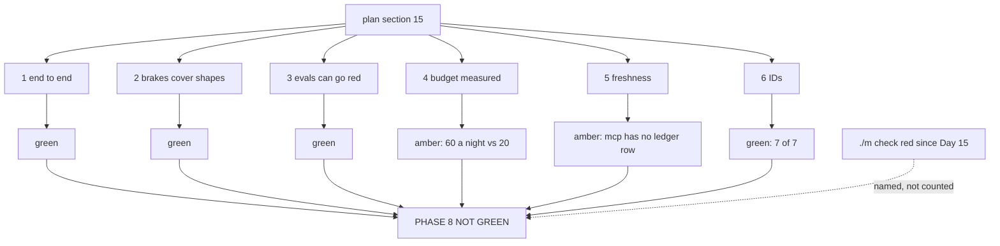

# 5.6 — Criterion 6: the IDs, and the verdict written down

## One-line answer

All seven Phase 8 days declare exactly the IDs the plan assigns them, so criterion 6 is green — and
the verdict for the phase as a whole is **three green, two amber, one red**, where the red belongs to
a ruff error from Day 15 and the phase does not get to round that up.

## The story

The shop does a stock-take on the last Sunday of the month. Shutters down, everybody counting.

The point of it is not the shelves, which anybody can see. It is the gap between the shelves and the
book. The book says forty-one of something and the shelf has thirty-eight, and now there is a
conversation to have — did three get sold without being rung up, did three get broken, did three
never arrive.

Nobody enjoys it and nobody skips it, because the alternative is a book that drifts from the shop by
a little every month until the day somebody promises a customer something that is not there.

## The idea in plain language

Two things happen in this part, and they are different jobs.

The first is the **ID audit**: the plan's day map assigns concept IDs to days, and each day's hub
declares the IDs it closes. Those are two independent records of the same fact, written by different
processes at different times, and comparing them is the only way to find a day that quietly closed
the wrong thing. Plan §15 rule 2 is the standard: *a phase is green only when no ID from this or any
earlier phase is open.*

The second is the **verdict**, and it is the part that has no script. Five criteria have produced
green, green, green, amber, amber. This one adds a sixth. Then somebody has to write a sentence
saying whether Phase 8 is finished, and the entire value of a gate is concentrated in whether that
sentence is honest when the answer is no.

The failure mode a gate exists to prevent has a name worth having: **amber gets promoted to green by
proximity.** Three greens sit next to two ambers and the reader's eye averages them. The defence is
mechanical rather than moral — write the verdict as a count, list the ambers with what would clear
them, and never write a summary sentence that is kinder than the table above it.

## Why Sutra needs it

`docs/TRACEABILITY.md` is generated from the day hubs, and the plan says any open ID from a completed
phase is a bug. That check is only meaningful if somebody runs it at the boundary, which is here.

There is a second reason, specific to this day and slightly awkward. Two of the six criteria came out
amber and one of the ambers — the missing `mcp` ledger row in
[5.5](5.5-criterion-5-the-freshness-check.md) — was **also found by Day 52's Phase 7 gate**. A
finding that survives one gate and is rediscovered by the next is evidence that findings are being
collected rather than acted on, and a gate that does not say so is a gate that has become a ritual.

## The mechanism

The audit reads the plan and the hubs and compares:

```python
def plan_rows() -> dict[int, list[str]]:
    """day -> the IDs the plan's day map assigns to it."""
    out: dict[int, list[str]] = {}
    for line in PLAN.read_text(encoding="utf-8").splitlines():
        match = re.match(r"^\|\s*(\d+)\s*\|\s*(.+?)\s*\|\s*([A-Z]{2,3}-\d+.*?)\s*\|$", line)
        if match:
            out[int(match.group(1))] = re.findall(r"[A-Z]{2,3}-\d+", match.group(3))
    return out
```

**Line by line:**

- It parses `docs/00_MASTER_PLAN.md` rather than taking a copy. The plan is the authority, and a
  script with its own copy of the assignment is a third record that can drift from both of the two it
  was meant to reconcile.
- `re.findall(r"[A-Z]{2,3}-\d+", ...)` on the third column — pulling identifiers out rather than
  splitting on commas, so a row with a 🅿️ marker or a footnote still yields its IDs.

```python
def hub_ids(day: int) -> list[str] | None:
    """The IDs a day's hub declares, or None when the day has no hub yet."""
    folders = sorted(DAYS.glob(f"day-{day:02d}-*"))
    if not folders:
        return None
    hub = folders[0] / "LESSON.md"
    if not hub.is_file():
        return None
    head = hub.read_text(encoding="utf-8").split("\n---", 2)[0]
    line = re.search(r"^ids:\s*(.+)$", head, re.M)
    return re.findall(r"[A-Z]{2,3}-\d+", line.group(1) if line else "")
```

**Line by line:**

- `DAYS.glob(f"day-{day:02d}-*")` — resolve by number and accept any slug, which is plan §17.2's
  rule: the number is the identity and the slug is a label on it.
- `return None` for both "no folder" and "no hub" — and the distinction between `None` and `[]`
  matters downstream. A day with no hub is **unwritten**; a day with a hub declaring nothing is
  **wrong**. Collapsing those two would hide the second inside the first.
- `.split("\n---", 2)[0]` — only the frontmatter is searched, so an `ids:` mentioned in the body
  cannot be mistaken for the declaration.

Run it:

```bash
cd days/day-59-runaway-agents-contained/lab
uv run python ids.py; echo "exit: $?"
```

**Line by line:**

- No flags: Phase 8, days 53 to 59. `--all` widens it to the whole curriculum, which is what you run
  when a gate finds something and you want to know whether it is local.

Measured on 2026-09-05:

```text
 day  plan says                     hub declares                  agrees
  53  ADK-32, ADK-33, ADK-34        ADK-32, ADK-33, ADK-34        True
  54  ADK-35, ADK-36, ADK-37        ADK-35, ADK-36, ADK-37        True
  55  ADK-38, ADK-39, AG-16         ADK-38, ADK-39, AG-16         True
  56  AG-17, AG-18                  AG-17, AG-18                  True
  57  AG-19, AG-20, ADK-40          AG-19, AG-20, ADK-40          True
  58  ADK-41, ADK-42                ADK-41, ADK-42                True
  59  AG-21, SEC-04                 AG-21, SEC-04                 True

days with no hub yet   none
open IDs               none

Every ID the plan assigns to this phase is declared by a written day.
exit: 0
```

**Seven of seven, no open IDs. Criterion 6 is green.**

It is worth saying what that does and does not establish, because an ID audit is easy to over-read.
It establishes that every concept the plan assigned to Phase 8 is claimed by a day that exists, and
that no day claimed something it was not assigned. It establishes nothing whatsoever about whether
those days taught the concept well — that is what reading them is for, and what `./m depth` partly
checks.

There is a detail in this run worth keeping, and it is about what an audit is. When this script was
first run, day 59's own hub did not exist yet, so its row read `-` and the open list held `AG-21` and
`SEC-04`. Nothing was fixed between then and now; the hub was written, and the same command printed a
different answer. **An ID audit is a snapshot of a moving repository**, which is exactly why the
criterion is *run `ids.py` and read it* rather than *open IDs must be zero* written as an assertion.
The second version goes red on a Tuesday because somebody is halfway through the next day, and a
check that cries wolf on ordinary progress is a check people learn to ignore.

### The verdict

Six criteria, and the count comes first so that nothing can be averaged:

| | Criterion | Verdict | Evidence |
| --- | --- | --- | --- |
| 1 | the triage graph runs end to end | 🟢 green | [5.1](5.1-criterion-1-end-to-end.md): 5 calls answered, 0 for an unknown ticket, `exit: 0` |
| 2 | every shape has a brake, and the brake is tested | 🟢 green | [5.2](5.2-criterion-2-every-shape-has-a-brake.md): 4×4 covered — with one row held up by a single cell |
| 3 | the eval goes red when a brake is removed | 🟢 green | [5.3](5.3-criterion-3-the-eval-goes-red.md): four checks, four breakages, all observed |
| 4 | the request budget is measured, not estimated | 🟡 amber | [5.4](5.4-criterion-4-the-budget-is-measured.md): 14 would-be / 0 actual per run, and **60 a night against a tier of 20** |
| 5 | the freshness check | 🟡 amber | [5.5](5.5-criterion-5-the-freshness-check.md): three pins held deliberately, one pinned with **no ledger row** |
| 6 | the IDs | 🟢 green | `ids.py`, above: seven of seven agree, open list empty |

**Four green, two amber.** And one thing that is not in the table, because it is not a Phase 8
criterion and must not be allowed to look like one:

`./m check` is **red**, on `tests/test_persona.py:7` failing ruff `I001`, an unsorted import block.
That file last changed on Day 15 and `docs/PROGRESS.md` already records the error. It is not Phase
8's, it is not fixed here — `tests/` is the learner's own code and no generated day may edit it — and
it is named rather than omitted, because a phase gate that quietly excludes a red check from its own
repository has redefined the gate.

**So: Phase 8 is not green.** The two ambers have named fixes and neither is a Phase 8 defect. The
red is four phases old. That sentence is the deliverable of this part, and it is the sentence that
goes in the ledger row rather than a summary that sounds better.



## When it breaks

The audit breaks quietly in two ways, and neither produces a failure.

**A day declares an ID it did not teach.** `ids.py` compares strings in frontmatter against strings in
a table. A hub that lists `SEC-04` and contains nothing about containment passes this criterion
perfectly. The audit is a check on **bookkeeping**, not on content, and treating a green ID table as
evidence that a phase taught its material is the most available mistake in this whole section.

**Two records agree because one was copied from the other.** If somebody generates a hub's `ids:`
line from the plan's row, the two records stop being independent and the comparison stops meaning
anything. Independence is what makes reconciliation valuable — it is the same reason the stock-take
counts the shelf rather than reading the book twice.

And the way the *verdict* breaks is the one this part named at the top. Here is what it looks like:
somebody writes "Phase 8 gate: 4 of 6 green, 2 minor issues noted, phase complete." Every word is
defensible. "Minor" is a judgement nobody made explicitly, "noted" implies somewhere they are
recorded, and "complete" contradicts plan §15's own rule while sounding like a summary of the table
above it.

The mechanical defence is to write the ambers as **conditions**, not as observations:

- Criterion 4 clears when the nightly batch size is a decision somebody wrote down, with the
  arithmetic — [6.1](../06-in-production/6.1-brakes-are-a-system.md) has the numbers.
- Criterion 5 clears when `mcp==1.29.1` has its dated row in `docs/PACKAGES.md`. The row is written
  out in this day's §11, ready to paste.

Two sentences, two commands, and neither of them can be satisfied by a summary.

## In production

**What a professional writes instead.** The verdict is a **document with a date and a name on it**,
not a paragraph in a commit message, and it lists what was checked, what was found and what was
decided. The decisions matter more than the findings a year later: "we accepted a nightly batch that
exceeds the free tier, on 5 September, because the alternative was a second provider" is a sentence
somebody will need when the batch starts failing.

They also close the loop the hard way: every amber becomes a **tracked item with an owner**, and the
next gate's first action is to read the previous gate's ambers. This day's ledger finding — the same
`mcp` row found by two consecutive gates — is exactly what the absence of that loop looks like, and
it is the cheapest possible thing to fix.

**What degrades at scale.** ID-level bookkeeping stops being the interesting question once the
curriculum has a hundred and ninety-nine of them. What survives is *coverage of the gate criteria*
rather than coverage of the IDs, because a project can close every ID and still ship a system with no
containment — which is precisely why criteria 1 to 5 exist and why this one is last rather than
first.

**The failure mode that only appears with real traffic.** Gates get run under pressure. The gate that
matters is the one run on the day somebody wants to move to the next phase, and that is the day the
ambers look smallest. Everything in this part — the count before the summary, the ambers as
conditions, the red named rather than omitted — is designed for that day rather than for a calm one.

**The review comment a senior engineer leaves:** *"Four green and two amber is not 'complete'. Write
the two ambers as conditions with the command that clears each, and put the `mcp` ledger row in this
commit rather than in the next one — Day 52 already found it, and a finding that survives two gates
is a process problem rather than a package problem."*

**The interview question:** *"What happens at one of your phase gates when something is not ready?"* —
*"It gets written down as not ready, which sounds obvious and is the entire difficulty. Ours came out
four green and two amber, and the temptation is to write 'complete with minor issues noted', where
'minor' is a judgement nobody made and 'noted' implies somewhere they are recorded. So we write the
count first, then the ambers as conditions with the command that clears each. The finding that
actually changed how we work was that one of our ambers — a package pinned with no row in our
version ledger — had already been found by the previous phase's gate. Two gates, one finding, nobody
fixed it. That is not a package problem, it is that our gates were producing findings and nothing was
consuming them, so now the first action of a gate is to read the last one's ambers."*

## Check yourself

```bash
cd days/day-59-runaway-agents-contained/lab
uv run python ids.py; echo "exit: $?"
uv run python ids.py --all | tail -5
```

Now write the one-sentence verdict for Phase 8 in your own words, and check it against the table
above. If your sentence is kinder than the table, work out which word did it.

**Out loud, without scrolling up:** say what the ID audit does **not** establish, and name the one
finding in this gate that a previous gate had already found.

**Next:** [6.1 — Brakes are a system with an invariant](../06-in-production/6.1-brakes-are-a-system.md).
