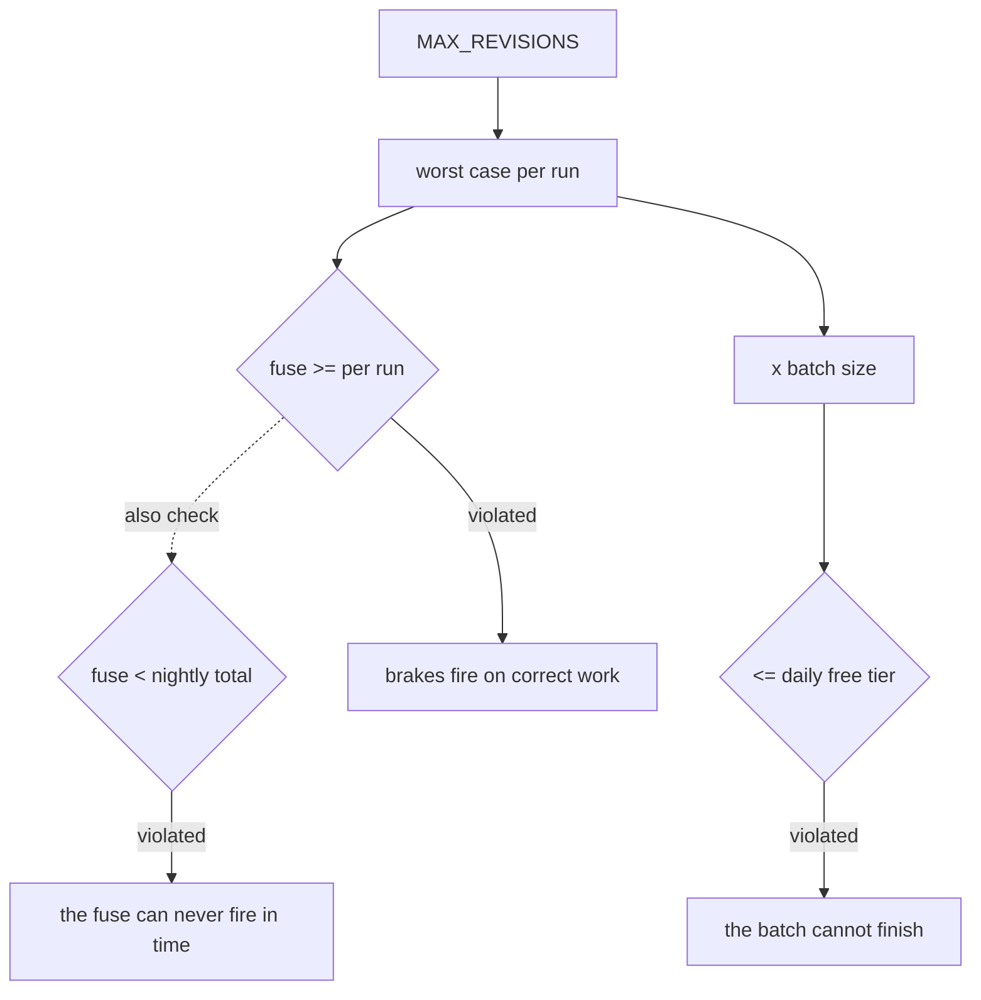

# 6.1 — Brakes are a system with an invariant

## One-line answer

The four brakes in this day are terms in two inequalities rather than four independent settings, so
the discipline that makes them hold is a rule about pull requests: a change to any brake constant
shows the arithmetic, and a script computes it so that the arithmetic is a command rather than an
intention.

## The story

The ladder in the garage has a sticker on it: **maximum load 150 kg**.

That number is not about the ladder alone. Somebody worked it out from the aluminium, and the rungs,
and the angle it is meant to stand at, and the assumption that it is on a floor rather than on a
carpet on a floor. Change any one of those and the sticker is no longer true, even though nobody
touched the ladder.

The shelf you are putting up has its own rating, and the wall plugs have theirs, and the bracket has
one too. Four numbers on four different bits of packaging, none of them referring to each other.
And the shelf does not fall down because the smallest of the four was smaller than what you put on
it — which is a thing you established by luck, because at no point did anybody write the four numbers
on the same piece of paper.

## The idea in plain language

This day has produced four numbers at four altitudes:

| Altitude | Constant | Set by |
| --- | --- | --- |
| loop | `MAX_REVISIONS` | Day 57's writer-and-critic work |
| run | `max_llm_calls` | [2.3](../02-where-a-brake-goes/2.3-the-run-fuse.md) |
| window | `DAILY_FLOOR` and the free tier | [2.4](../02-where-a-brake-goes/2.4-the-circuit-breaker.md), Day 2's live 429 |
| workload | the nightly batch size | nobody, which is the point |

[3.4](../03-brakes-that-do-not-hold/3.4-the-brake-loosened-for-one-ticket.md) showed what happens
when one of them moves. This part is the standing discipline that comes out of it, and it is three
sentences:

1. **The relations are written down as arithmetic, not as prose.**
2. **The arithmetic is a script with an exit code**, so it can run in CI.
3. **A pull request that touches a brake constant shows the numbers in its description.**

The third is a social rule and it is the one that does the work, because the script can only tell you
that the relations broke — it cannot tell you whether breaking them was the intention. A batch size
that no longer fits the quota might be a bug or might be a decision to run half the batch, and the
description is where a human says which.

The reason the rule is about the *description* rather than about a comment in the code is that the
arithmetic is about a change, not about a state. `MAX_REVISIONS = 8  # worst case 17 calls` is a true
comment on a line, and it does not tell the reviewer that the nightly worst case just tripled. The
delta is the reviewable thing.

## Why Sutra needs it

Sutra's four numbers currently do **not** satisfy their relations, and
[5.4](../05-the-gate/5.4-criterion-4-the-budget-is-measured.md) recorded that as an amber. The
nightly worst case is sixty calls against a free tier of twenty. That is not a bug anybody
introduced; it is what happens when four numbers are chosen in four places over six weeks.

So this part is not a warning about a future problem. It is the practice that would have surfaced the
existing one earlier, and it is the practice that keeps it from getting worse when Phase 9 adds
durability and Phase 11 adds a nightly schedule — both of which change terms in these inequalities.

## The mechanism

The relations, as code:

```python
def worst_case_per_run(revisions: int) -> int:
    """One classify, then one draft and one review per revision round."""
    return FIXED + 2 * revisions
```

**Line by line:**

- The formula is validated against a measurement rather than asserted:
  [5.1](../05-the-gate/5.1-criterion-1-end-to-end.md) measured five calls at two revisions and nine
  at four, and `1 + 2 * 2` and `1 + 2 * 4` agree. **A model of a system that has not been checked
  against the system is a guess with a function signature.**
- `FIXED` is named rather than inlined, because the next person to add a model-calling station has to
  change it, and a named constant is somewhere to notice that.

```python
    if per_run > FUSE:
        findings.append(f"the run fuse ({FUSE}) is below the worst case per run ({per_run})")
    if FUSE > nightly:
        findings.append(
            f"the run fuse ({FUSE}) is above the whole nightly worst case ({nightly}), "
            "so it can never fire before the day is gone"
        )
    if nightly > DAILY_LIMIT:
        findings.append(
            f"the nightly worst case ({nightly}) exceeds the daily free tier ({DAILY_LIMIT}) "
            f"by {nightly - DAILY_LIMIT} requests"
        )
```

**Line by line:**

- Three comparisons, and between them they bracket the fuse from **both sides**. It must be at least
  the legitimate worst case, or it fires on correct work; and it must be less than the whole night's
  work, or it can never fire before the resource is gone. A brake with only a lower bound is a brake
  nobody has finished thinking about.
- Every finding prints **both** numbers, and the last one prints the gap. That is the difference
  between a message that starts an investigation and one that ends it.
- The function returns findings rather than raising, and the caller exits on the count — so the same
  code serves as a report for a human and as a check for CI.

Run it at the shipped settings:

```bash
cd days/day-59-runaway-agents-contained/lab
uv run python loosen.py; echo "exit: $?"
```

**Line by line:**

- No flags: this is the desk as it stands, not a hypothetical.

Measured on 2026-09-05:

```text
MAX_REVISIONS=2  max_llm_calls=500  nightly batch=12 tickets
    worst case per run : 1 + 2 x 2 = 5 calls
    worst case nightly : 5 x 12 = 60 calls
    free tier          : 20 per day
    FINDING: the run fuse (500) is above the whole nightly worst case (60), so it can never fire before the day is gone
    FINDING: the nightly worst case (60) exceeds the daily free tier (20) by 40 requests
    findings: 2
exit: 1
```

Two findings, and neither is caused by a mistake. That is the honest state of a system whose limits
were set independently, and the value of the script is that this is now a **fact with a command
attached** rather than something somebody might notice.

The fix is not one number. Work through it:

- Lowering `MAX_REVISIONS` to 1 gives `1 + 2 = 3` per run, `36` a night. Still over twenty.
- Lowering the batch to 4 at the current cap gives `20` a night. Exactly the free tier, with nothing
  left for retries, resumes or anything a human asks for during the day.
- Setting the fuse to `9` — the worst case at four revisions, which leaves headroom above the current
  cap of two — makes the first finding go away and changes nothing about the second.

**No single change fixes it**, which is the diagnostic result: the desk as configured cannot run a
useful nightly batch on one free tier, and the answer is a product decision — a smaller batch, a
second provider, or accepting that the batch runs partially. Day 70's quota router is the second of
those, which is why it exists.



## When it breaks

The discipline breaks in a way that is worth naming precisely, because it looks like success:
**the numbers get changed to satisfy the script.**

Somebody runs `loosen.py`, sees two findings, and lowers the batch size to four. The script goes
green. Nothing has been fixed — the desk now processes four tickets a night instead of twelve, which
is a substantial product change made by somebody trying to make a check pass. The check did its job;
the response was wrong.

That is the reason the third sentence of the discipline is about a description rather than about the
script. A script can enforce a relation. Only a person can say whether the way it was satisfied was
the way anybody wanted.

The second break is scope. These three relations cover the brakes this day built. They say nothing
about:

- **Retries**, which multiply the per-run worst case by up to `attempts ^ layers`
  ([3.2](../03-brakes-that-do-not-hold/3.2-three-retries-become-twenty-seven.md) measured
  twenty-seven).
- **Resumes**, which re-spend the calls a killed run already made
  ([2.5](../02-where-a-brake-goes/2.5-the-kill-switch-and-what-it-leaves.md) measured three).
- **The quiet runaway**, which costs no requests at all and therefore does not appear in any of these
  inequalities.

A model that leaves three of the day's own findings out of its arithmetic is not wrong, but it is
narrower than the system, and a reader who trusts a green `loosen.py` as a complete statement about
cost has trusted it too far.

## In production

**What a professional writes instead.** The relations are a **test in CI**, not a script somebody
runs at a gate. The constants are imported from the same module the runtime uses, so the test cannot
be checking last month's values. And the test's failure message is the arithmetic — the two numbers
and the comparison — rather than `AssertionError: False is not True`, because a failing test that
does not explain itself gets marked flaky.

Beyond that, they stop treating the workload as fixed. The mature version reads the remaining quota
at the start of the batch and processes as many tickets as it can afford at the current measured
worst case, so the relation is enforced at run time rather than assumed at review time. That converts
"the batch cannot finish" from an outage into a smaller batch, and it is the direct ancestor of Day
70's quota router.

**What degrades at scale.** The number of constants grows past the point where the relations can be
written by hand. Per-tenant limits, per-tool limits, per-provider limits, per-priority limits — the
inequalities become a small constraint system, and the honest answer at that point is a budget
*allocator* rather than a set of hand-checked comparisons.

**The failure mode that only appears with real traffic.** Worst cases are rare, so a configuration
that violates its relations works fine most days. It fails on the day enough hard tickets arrive
together — which, as [2.2](../02-where-a-brake-goes/2.2-the-loop-counter.md) and
[1.2](../01-four-runaways/1.2-the-critic-who-is-never-satisfied.md) both noted, is the day something
else is already going wrong.

**The review comment a senior engineer leaves:** *"This raises the revision cap. Put the arithmetic in
the description: worst case per run before and after, nightly total before and after, and what the
fuse becomes. And run `loosen.py` — it is already red at our current settings, so tell me whether
your change makes the existing finding worse, because 'it was already failing' is not a reason to
stop reading it."*

**The interview question:** *"You have several limits at different levels. How do you keep them
consistent?"* — *"By treating them as terms in inequalities rather than as independent settings. Ours
are the revision cap, the run fuse, the daily quota and the batch size, and two relations have to
hold: the fuse must be at least the worst case per run, and the worst case times the batch must fit
in the daily quota. I put the arithmetic in a script that exits non-zero, and the rule is that any
pull request touching a brake constant shows the before-and-after numbers in its description —
because the script can tell you the relation broke and only a person can say whether that was the
intention. Running it on our own configuration was uncomfortable: a nightly batch of twelve needs
sixty calls against an allowance of twenty, and no single constant fixes it, which told us it was a
product decision rather than a tuning one."*

## Check yourself

```bash
cd days/day-59-runaway-agents-contained/lab
uv run python loosen.py; echo "exit: $?"
uv run python loosen.py --revisions 1 --batch 4
```

Now write the pull-request description you would attach to a change raising `MAX_REVISIONS` to 3:
four numbers and one sentence saying what you are asking the reviewer to accept.

**Out loud, without scrolling up:** state the two relations, and say why the fuse needs an upper
bound as well as a lower one.

**Next:** [6.2 — 🅿️ What Phase 9 takes over](6.2-what-phase-nine-takes-over.md).
