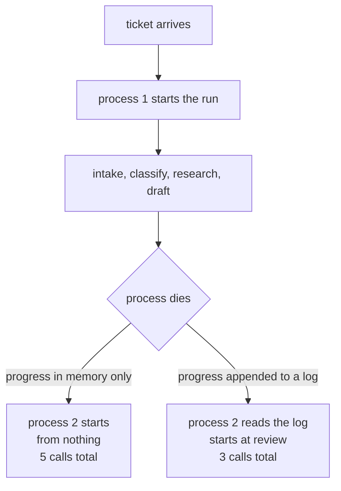

# 1.1 — The run is not the process

## One-line answer

A run that exists only inside a running program dies with that program, and the measurement
is exact: the triage graph killed after its fourth stage costs **five model calls instead of
three**, because the two it had already paid for left no trace anybody can find.

## The story

You ring the shop at the end of the road to place an order, because they deliver and you do
not want to carry a sack of rice.

The man who answers does not write anything down. You can hear that he does not — there is
no pause, no scratch of a pen, just "haan, haan" while you go through it. Rice. Two kinds of
dal. Oil, the tin not the pouch. Tea. The soap your mother likes and nobody else buys, which
takes a while to describe. Sugar. You are eleven items in and it is going fine.

Then the call drops.

You ring back. A different man answers. And here is the thing that decides how annoyed you
are about to be: **does the shop have your order, or did your order live entirely inside the
head of the first man?**

If he was writing it down, the second man picks up the pad and says "you had got to the
soap". If he was not, you start again at the rice. Not because anybody was careless — the
first man was listening perfectly well — but because the only copy of your order was in a
place that the dropped call took with it.

Nothing was lost. Everything was lost. Those are the same sentence, and which one is true
depends entirely on whether anybody wrote anything down.

## The idea in plain language

A **process** is one running program: an operating-system thing, with memory of its own,
that starts, does work, and exits. When you type `uv run python something.py`, that is a
process. When it ends — normally, or because you pressed Ctrl-C, or because the machine lost
power — everything it was holding in memory is gone. Not saved somewhere for later. Gone.

A **run** is a unit of work you care about: this ticket, triaged from arrival to reply. In
everything Sutra has built so far, those two things have been the same object. The triage
graph runs inside one process, the graph's progress lives in that process's memory, and so
killing the process kills the run.

**Durable execution** is the practice of separating them. The run becomes a thing that
exists on disk, that a process picks up, works on, and puts down — so that a *different*
process, started later, can pick up the same run and carry on. The process becomes a worker,
and the run becomes the work.

Three words describe how that is done, and this day gives each of them its own section
because they solve three different problems:

- **Replay** — rebuilding *where was I?* by re-reading a record, rather than by re-doing the
  work. Section 2.
- **Resume** — continuing from the first step the record does not mention. This section and
  the next.
- **Idempotency** — arranging that a step which happens twice has the effect of happening
  once. Section 3, and it is the one people underestimate.

One more term, because the rest of the day leans on it. An **event log** is an append-only
file: you add lines to the end and you never go back and change an earlier one. Day 47
introduced the idea in [3.1 — the ticket torn in
two](../../../day-47-persistent-sessions/parts/03-writes-that-survive/3.1-the-ticket-torn-in-two.md),
where a session's events were written to a database so a restart could find them. Today the
same idea stops being about storage and starts being about **recovery**: the log is not a
backup of the run, the log *is* the run.

## Why Sutra needs it

Day 58 assembles the triage graph: intake, classify, research, draft, review. Five stages,
and three of them spend a model call. Sutra runs on a free tier, where the budget is
denominated in requests per minute and requests per day rather than in money — that was
Day 24's argument, and Day 51 spent a whole day on caching for the same reason.

So a crash is not an inconvenience here. It is a **bill**. Every stage that had already
succeeded and cannot be found again is a request spent twice out of an allowance that does
not refill until tomorrow.

And Day 65 — the gate that closes this phase — will not accept a description of durability.
It will kill the triage graph mid-run, restart it, and check that it comes back. Today is
where the thing it kills gets built.

## The mechanism

The comparison worth making is not "crash versus no crash". Every system crashes. It is
**crash with a log versus crash without one**, on the same run, at the same point.

`nolog.py` runs the five triage stages, kills the process after `draft` — the fourth stage,
so two model calls are already spent — and then starts again from scratch. The `--log`
arm changes exactly one thing: each finished stage appends a line to a file first.

```bash
cd days/day-60-durable-execution/lab
uv run python nolog.py
```

**Line by line:**

- `nolog.py` imports the five stages from `_stages.py`, where each one is an ordinary Python
  function. There is no model call anywhere in this day's lab: `classify`, `draft` and
  `review` are marked as *costing* one request each in a `COST` table, and the script counts
  those costs rather than spending them. That is what makes the arithmetic here reproducible
  rather than approximate.
- The crash is a `Crash` exception raised on purpose after a named stage, not a real
  `SIGKILL`. A raised exception is deterministic and a signal is not, and this part is about
  the arithmetic rather than about the manner of death — [1.2](1.2-died-or-failed.md) is
  where the difference between the two starts to matter.
- The default arm passes `use_log=False`, which makes the runner keep its progress in a
  local dictionary and nowhere else. That is not a strawman. It is what every program does
  until somebody decides otherwise.

Measured on 2026-09-05:

```text
keeping an event log: False
  attempt 1 -> process died after draft
              2 model calls already spent, on intake, classify, research, draft
  log holds -> nothing
  attempt 2 -> finished, spending 3 model calls more
  total     -> 5 model calls for a run that needs 3
  wasted    -> 2 model calls
```

Read the last two lines slowly. The run **needs** three model calls. It **cost** five. The
two extra ones were not spent on a retry of something that failed — `classify` and `draft`
had both succeeded. They were spent re-deriving answers the system had already had and then
dropped on the floor.

Now the same crash, at the same stage, with one line written per finished stage:

```bash
uv run python nolog.py --log
```

**Line by line:**

- `--log` flips `use_log=True`. The runner now calls `record(...)` after each stage, which
  appends one JSON object to `nolog.jsonl` — opened in append mode, closed immediately, one
  line per event.
- Nothing else differs. Same stages, same crash point, same second attempt. Exactly one
  variable moved, which is the only way a comparison like this means anything.

```text
keeping an event log: True
  attempt 1 -> process died after draft
              2 model calls already spent, on intake, classify, research, draft
  log holds -> ['intake', 'classify', 'research', 'draft']
  attempt 2 -> finished, spending 1 model call more
  total     -> 3 model calls for a run that needs 3
  wasted    -> 0 model calls
```

Three calls for a run that needs three. The crash still happened. The process still died. The
difference is that the second process could find out what the first one had achieved.

Here is the whole of it as a picture:



The arrow that matters is the second one, and what makes it possible is not clever recovery
code. It is that somebody wrote something down before it was needed.

## When it breaks

The log is not magic, and the honest failure to show here is the one where the log exists and
still does not save you: **a process killed part-way through writing a line.**

The log is a text file. A line is bytes. A process that dies between the first byte and the
newline leaves a line that is not valid JSON, and the naive reader — the one that calls
`json.loads` on every line and lets it raise — turns a recoverable run into an unrecoverable
one:

```text
Traceback (most recent call last):
  File ".../lab/_log.py", line 34, in read
    events.append(json.loads(line))
                  ^^^^^^^^^^^^^^^^
  File ".../Lib/json/__init__.py", line 346, in loads
    return _default_decoder.decode(s)
  File ".../Lib/json/decoder.py", line 340, in decode
    raise JSONDecodeError("Extra data", s, end)
json.decoder.JSONDecodeError: Unterminated string starting at: line 4 column 14 (char 402)
```

That traceback is the reason `_log.py`'s `read` is written the way it is:

```python
for line in path.read_text(encoding="utf-8").splitlines():
    try:
        events.append(json.loads(line))
    except json.JSONDecodeError:
        break
```

**Line by line:**

- The `try` is not there to hide an error. It is there because a truncated last line is the
  *expected* shape of a log left behind by a process that was killed, and refusing to read
  the whole log because of it would throw away the good lines above it.
- `break`, not `continue`. A partial line means the writer stopped there, so everything after
  it is either absent or garbage. Skipping the bad line and carrying on would risk replaying
  events out of order.
- This only works because the log is **append-only**. A file you rewrite in place can be
  corrupted in the *middle*, and no amount of careful reading recovers from that. Appending
  is what makes "drop the tail" a complete repair.

## In production

**What a professional writes instead.** They do not hand-roll the append. The log goes into
the same durable store the sessions already live in — for Sutra that is the SQLite database
Day 47 set up, in WAL mode — so that one write is one transaction and a half-written row is
impossible rather than merely handled. The file-per-run JSONL in this lab is a teaching
device: it makes the log something you can `cat` and read with your eyes, which a database
row is not. Ship the database.

**What degrades at scale.** One append per finished stage is one disk flush per stage. At a
few hundred tickets a day that is nothing. At a few hundred a second it is the bottleneck,
and the usual answers are batching several events into one write (which loses the last
batch on a crash) or a group commit (which does not, but adds latency). Note what the choice
actually is: **how much work you are willing to lose is a tuning parameter**, and pretending
otherwise is how systems end up with an undocumented one.

**The failure mode that only shows with real traffic.** Two processes picking up the same
run. Nothing in this part prevents it — a run is a file, and two workers that both decide to
resume it will both start from the same line and both do the remaining work. Day 47 met the
same shape in [4.1 — refused, not
overwritten](../../../day-47-persistent-sessions/parts/04-two-workers/4.1-refused-not-overwritten.md),
and the fix is the same one: a run needs an owner, claimed atomically, before anybody starts
working on it.

**The review comment a senior engineer leaves:** *"This writes the log line after the stage
returns. What happens if we die between those two? You have done the work and the log says
you have not, so the resume does it again. That is fine for `classify` and it is not fine for
`review`, because `review` closes the ticket. Either the write and the log entry are one
transaction, or the step is idempotent. Right now it is neither."* That comment is
[3.1](../03-doing-it-twice/3.1-the-uncertainty-gap.md), and it is correct.

**The interview question:** *"What happens to an in-flight agent run when the pod is
rescheduled?"* An honest answer: *"In the version I first built, everything — the run lived
in the process, so a restart began again at stage one. I measured it on our triage flow:
a crash after the fourth of five stages cost five model calls for a run that needs three,
because the two already-paid-for stages left no trace. The fix was to append one line per
finished stage to the session store before moving on, which took the same crash back to
three calls. The subtlety I got wrong first was the ordering: I logged after the side effect
rather than making the side effect repeatable, so the resume closed a ticket twice."*

## Check yourself

```bash
cd days/day-60-durable-execution/lab
uv run python nolog.py
uv run python nolog.py --log
cat nolog.jsonl
```

Now open `_runner.py` and find the line that writes the event. Move it so it runs *before*
the stage instead of after, re-run the `--log` arm, and write down what changes about the
`wasted` number and what changes about whether `review` is safe.

**Out loud, without scrolling up:** explain the difference between a process and a run to
someone who has never written a line of code, using the shop and the dropped call.

**Next:** [1.2 — Died or failed](1.2-died-or-failed.md).
