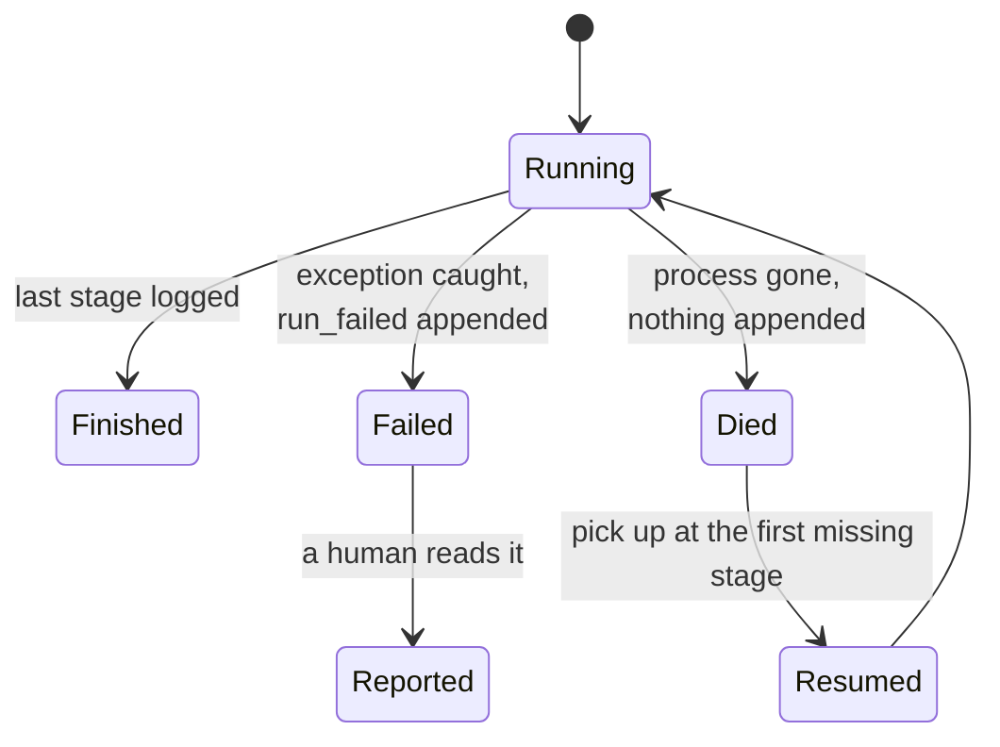

# 1.2 — Died or failed

## One-line answer

A run that **died** should be resumed and a run that **failed** should not, and the only
reason your system can tell them apart is that the failing one had time to write down that it
was failing — which the dying one, by definition, did not.

## The story

Two parcels do not arrive on Tuesday, and the courier company's app says the same word about
both of them: *undelivered*.

You ring up. It turns out they are nothing like each other.

The first parcel was on a van that broke down on the highway. The parcel is fine. It is
sitting in the back of a van on the hard shoulder, and tomorrow a different van will take it
and it will arrive. Nobody needs to do anything. The right response is to wait.

The second parcel reached your gate. The person there refused it, because it was addressed to
someone who moved out last year. It is going back to the warehouse. Sending it again tomorrow
would be pointless: it would come to the same gate and be refused by the same person, and the
day after that too.

Same word on the app. Opposite meanings. One of them is *the delivery was interrupted* and
the other is *the delivery was attempted and the answer was no*. Retry the first. Never retry
the second.

And notice how the company knows which is which. Not by inspecting the parcel. The refused
one has a note against it — a driver stood at the gate, was told no, and typed a reason. The
broken-down van has no note against the parcel at all, because nothing happened to the parcel;
something happened to the van.

## The idea in plain language

Two things can end a run, and they look identical from outside.

**The run died.** The process stopped mid-step for a reason that has nothing to do with the
work: the machine lost power, the container was rescheduled, somebody pressed Ctrl-C, the
kernel killed the process because the box ran out of memory. The work was not wrong. It was
interrupted. Doing it again will probably succeed.

**The run failed.** The work itself did not succeed: a ticket arrived with no id in it, an
archive lookup found nothing, a tool returned an error the code could not handle. Doing it
again will produce the same failure, because nothing about the world changed.

The distinction matters because the correct response is opposite in each case. Resuming a
died run finishes the job. Resuming a failed run burns quota re-deriving the same failure,
and — if there is a retry loop anywhere above it — does so repeatedly. Day 59 gives that
pattern a name and a containment story; today's job is to make sure the two cases are
distinguishable in the first place.

Here is the asymmetry that decides everything, and it is worth stating as plainly as
possible:

> **A run that fails can write down that it failed. A run that dies cannot write down
> anything.**

Failure is a thing your code participates in. You catch the exception, or you check the
result, and on the way out you have a moment in which to append a line saying what went
wrong. Death is a thing that happens *to* your code. There is no moment. `SIGKILL` does not
run your `finally` block, and neither does the power cut.

So the way you tell them apart is not by looking at the run. It is by looking at the **last
line of the log**:

- the log's last line says the run failed → it failed, and somebody should look at it;
- the log's last line is an ordinary finished stage → the process died mid-flight, and the
  run can be picked up;
- the log's last line is truncated → the process died *while writing*, which is the same
  answer as above with one line's less progress.

The absence of a note is the evidence. That is unusual and it is worth sitting with, because
it is the reason the log has to record both good news and bad news. A log that only records
successes cannot distinguish "died" from "failed" at all.

## Why Sutra needs it

Day 65 is the phase gate, and its first criterion is *kill it mid-run; it resumes*. That is
the died case, deliberately produced.

But the triage graph will also genuinely fail, and it will fail on the most ordinary input in
the world: a ticket with a missing field. If the resume logic cannot tell that apart from a
crash, then Sutra's answer to a malformed ticket is to retry it for ever — which is a
runaway, on a free tier, which is exactly the failure Day 59 exists to contain. The two days
are the same problem seen from two sides, and this part is the seam.

There is also a Principle-10 argument. Day 21 built the rule that
[errors surface rather than being
swallowed](../../../day-21-errors-surface-not-swallow/parts/04-failure-lab/4.1-the-swallowed-exception.md).
A resume path that treats every ended run as "died" is swallowing failures at a higher
altitude: nothing is caught, and yet no failure is ever reported, because everything is
retried instead of surfaced.

## The mechanism

`died.py` ends the same run two ways and prints what the log's last line says in each case.

```bash
cd days/day-60-durable-execution/lab
uv run python died.py
```

**Line by line:**

- The default arm raises `Crash` after `classify`, which stands for the process dying: it is
  raised *after* the stage's event is written and nothing is written afterwards.
- `finished(log)` reads the log back and reports the last event. This is the only thing the
  recovering process gets to look at — it cannot interview the dead one.
- `resumable` is computed from that last line alone, which is the point of the exercise.

Measured on 2026-09-05:

```text
process died  process died after classify
log ends with: stage_finished
resumable    : True

the log tells you which one happened only because the failing arm wrote a line
saying so. A process that is killed writes nothing on its way out.
```

Now the other arm. `--bad-input` hands the runner a ticket with no `ticket_id`, so `draft`
raises a `KeyError` — a real failure of the work, not an interruption:

```bash
uv run python died.py --bad-input
```

**Line by line:**

- The stages are unchanged. The only difference is the input, which is what makes this a
  failure rather than a crash: the same code, the same machine, and a ticket it cannot
  process.
- The runner catches that exception and appends a `run_failed` event **before** re-raising.
  Writing the line before re-raising is the whole mechanism; if it re-raised first, the log
  would be indistinguishable from the crash arm.

```text
run_failed  KeyError 'ticket_id'
log ends with: run_failed
resumable    : False

the log tells you which one happened only because the failing arm wrote a line
saying so. A process that is killed writes nothing on its way out.
```

Two runs, two last lines, two different decisions — and the decision is a one-line lookup
rather than an inference.



## When it breaks

The break is the tempting shortcut: catching the exception and appending `run_failed` for
**every** way a run can end badly, including the ones that are really interruptions.

`KeyboardInterrupt` is the one that catches people, because it is not a subclass of
`Exception` in Python, and the moment somebody "tidies up" the handler to a bare `except:` it
starts being caught:

```python
try:
    run(...)
except BaseException as exc:  # the tidy-up that breaks recovery
    record(log, event="run_failed", error=repr(exc))
    raise
```

**Line by line:**

- `BaseException` catches `KeyboardInterrupt` and `SystemExit` as well as ordinary errors.
  Both of those mean *somebody or something stopped this on purpose*, which is the died case.
- The `record` call then writes `run_failed` into the log, which permanently marks a
  perfectly resumable run as one that must not be resumed.
- `raise` re-raises faithfully, so nothing looks wrong at the time. The damage is a line in a
  file that will be believed tomorrow.

Press Ctrl-C during a run with that handler in place and the log ends:

```text
{"error": "KeyboardInterrupt()", "event": "run_failed", "invocation_id": "inv-c"}
```

The run is now unresumable, in the judgement of the only record that survives, because
somebody pressed a key. The fix is to catch `Exception` — the errors that are about the
work — and let `BaseException` through untouched, so that an interruption leaves the log
exactly as silent as a power cut would.

## In production

**What a professional writes instead.** The last line is not the whole story: a real run
record carries a status field (`running`, `failed`, `succeeded`) plus an attempt counter,
updated in the same transaction that writes the event. The reason is that "read the last line
and infer" is a rule that has to be re-implemented, identically, by every consumer — the
resume path, the dashboard, the alerting. Making the status explicit means there is one
answer rather than three implementations of the same guess.

**What degrades at scale.** The attempt counter is what stops the died/failed distinction
being enough on its own. A run that genuinely died three times in a row is very probably not
dying at random — it is dying *because of* something in that run, which makes it a failure
wearing a crash's clothes. Production systems cap the resumes and then stop, which is the
same fail-stop discipline Day 59 argues for, applied here.

**The failure mode that only appears with real traffic.** The out-of-memory kill. It looks
exactly like a power cut — no note, nothing in the log — so every resume path classifies it
as *died* and retries. But the run is being killed *because of its own size*, so it will be
killed again, and again, at the same stage. This is the classic poison message: an
indistinguishable-from-crash failure that is perfectly deterministic. Only the attempt
counter catches it.

**The review comment a senior engineer leaves:** *"You are inferring resumability from the
absence of a log line. That works right up until somebody adds a `finally` that writes
something, or a signal handler that logs on the way out — and then every crash looks like a
clean finish and we silently drop half-finished tickets. Put the status in the record and
make the resume read the status."*

**The interview question:** *"How does your system decide whether to retry a job?"* An honest
answer: *"By whether the job got the chance to say it failed. An exception in the work is
caught and appended to the run's log as a failure before it propagates, so a resume sees it
and refuses. A process death writes nothing, so a resume sees an ordinary last stage and
picks up from there. The trap I hit was catching `BaseException` in that handler, which
marked Ctrl-C as a work failure and made resumable runs unresumable. And the case that
defeats the whole scheme is an out-of-memory kill, which is deterministic but looks exactly
like a crash — for that you need an attempt counter and a cap, not a better classifier."*

## Check yourself

```bash
cd days/day-60-durable-execution/lab
uv run python died.py
uv run python died.py --bad-input
tail -1 died.jsonl
```

Now change `died.py`'s failing arm so it re-raises *before* appending the `run_failed` line,
run it again, and say what the resume logic would now decide about that run — and why that is
the more dangerous of the two mistakes.

**Out loud, without scrolling up:** give the two parcels, and say which one the courier
should send again tomorrow and how the company knows.

**Next:** [1.3 — What is safe to resume](1.3-what-is-safe-to-resume.md).
