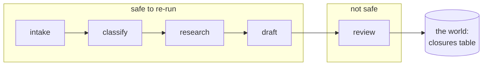

# 1.3 — What is safe to resume

## One-line answer

Four of the triage graph's five stages can be run again with no consequence and the fifth
cannot, and the measurement is blunt: re-running all five produces **two closure rows for one
ticket**, and nothing in the code notices.

## The story

A cook is making one order: chop the onions, fry the masala, cook the dal, and carry the plate
out to the table.

Halfway through, the gas cylinder runs out. Somebody changes it. The cook comes back to a
half-finished order and has to decide where to pick up.

For the first three steps the decision does not matter very much. If she is not sure whether
she chopped enough onions, she chops more; a few extra onions is a small waste and no harm.
If she is not sure the masala was fried properly, she fries it a bit longer. If she is not
sure about the dal, she tastes it. These are all steps she can repeat, or half-repeat, and the
worst outcome is a little wasted time.

The fourth step is not like that at all.

If she is not sure whether she already carried the plate out, she cannot just carry another
one out to be safe. The plate is not in her kitchen any more. It is on somebody's table, and a
second plate is not a small waste — it is a second dish on the bill, a confused customer, and
a conversation with the manager. The only way to find out is to go and look, and going to look
is a different kind of act from anything the first three steps needed.

The kitchen steps are hers. The last step is the world's.

## The idea in plain language

The question "can I resume this?" is really the question "**which steps can I run again
without changing anything I cannot take back?**"

A step is **pure** when running it twice is the same as running it once: it reads its input,
computes an answer, and leaves nothing behind. Chopping onions again is cheap. Classifying a
ticket again produces the same label. Nothing outside the function knows it happened.

A step is **effectful** when it changes something that outlives the run and that somebody else
can see. Carrying the plate out. Closing a ticket. Sending an email. Writing a row. Charging a
card. The defining property is not that it writes — it is that **you cannot un-write it from
inside your own program**.

There is a middle category worth naming, because it is where most real bugs live. A step can
be pure in its *effects* and not pure in its *results*: it leaves nothing behind, but it does
not give the same answer twice. A model call is the obvious example, and it gets its own part
in [2.3](../02-the-log-is-the-run/2.3-three-things-that-break-replay.md). For now the two
categories are enough.

Two more terms, defined here because the rest of the day uses them constantly.

- **Side effect** — a change to the world outside the function that made it. The word is doing
  real work: the effect is *to the side* of the value the function returns, so it does not
  show up in the return value and it does not go away when you throw the return value away.
- **Idempotent** — a step whose second run has no additional effect. The word comes from
  algebra and it has an exact meaning here: doing it twice leaves the world in the same state
  as doing it once. Section 3 is entirely about how a step that is not idempotent is made
  idempotent, because the honest position is that **the effectful step cannot be avoided; it
  can only be made repeatable**.

The reason this part comes before any resume code is that a resume is exactly a decision to
re-run some steps. If you have not sorted your steps into these categories, you have not
decided anything; you have guessed.

## Why Sutra needs it

The triage graph's five stages divide unevenly, and the division is the whole shape of the
rest of this day:

| Stage | What it does | Pure? | Costs a request |
| --- | --- | --- | --- |
| `intake` | normalise the incoming ticket | yes | no |
| `classify` | put a label on it | yes | yes |
| `research` | find the nearest archived ticket | yes | no |
| `draft` | write the reply | yes | yes |
| `review` | approve it and **close the ticket** | **no** | yes |

Four to one. And the one is the last one, which is the worst possible place for it, because it
is the stage a crash is most likely to interrupt *after* the expensive work is done.

Day 44 already saw this coming. Its
[1.4 — the key that makes a write
repeatable](../../../day-44-client-hardening/parts/01-what-may-be-repeated/1.4-the-key-that-makes-a-write-repeatable.md)
built the client-side rule that a write is not retried unless it carries a key, and pointedly
left `close_ticket` out of the safe-to-retry set. That was a promissory note. This day is
where it is paid.

## The mechanism

`safe.py` runs each stage twice and reports two things per stage: whether the second run
produced an identical result, and how many rows appeared in the effect store.

```bash
cd days/day-60-durable-execution/lab
uv run python safe.py
```

**Line by line:**

- The effect store is `effects.db`, a SQLite database with a `closures` table. It stands in
  for whatever real thing closing a ticket touches. A database is used rather than a variable
  because the whole point of an effect is that it survives the process, and a variable does
  not.
- Each stage is called, then called again with the same input. `2nd run identical` compares
  the two returned dictionaries.
- `rows in effect store` is counted after both calls. For a pure stage it must be zero. That
  column is the actual definition of "effectful", made mechanical.

Measured on 2026-09-05:

```text
stage      declared    2nd run identical  rows in effect store
intake     pure        True               0
classify   pure        True               0
research   pure        True               0
draft      pure        True               0
review     effectful   False              2

  closure 1: Likely the same cause as 4521: Session cookie dropped on cross-s...
  closure 2: Likely the same cause as 4521: Session cookie dropped on cross-s...

Two closures. One ticket. Nothing in the code noticed.
```

The first four rows are boring, and boring is the finding: those stages can be re-run freely,
so a resume that re-runs them is wasteful but never wrong. Section 2 is about removing the
waste.

The fifth row is the day. **Two closures. One ticket.** Both rows say the same thing, both
were written happily, no exception was raised, and the second call returned a perfectly
normal-looking success dictionary. If `close_ticket` had been a customer email instead of a
database row, the customer would now have two of them, and the second one would be
indistinguishable from the first.

Look at what `review` returns on each call — that is where the only visible difference is:

```python
result = {"status": "closed", "ticket_id": ticket_id, "closure_seq": cursor.lastrowid}
```

**Line by line:**

- `status` and `ticket_id` are identical across both calls, which is why the caller cannot
  tell. Everything a caller normally checks says the same thing the second time.
- `closure_seq` is `cursor.lastrowid`, the autoincrementing primary key of the row just
  inserted — so it is `1` on the first call and `2` on the second. That is the only signal
  in the entire return value that anything different happened, and no caller looks at it.
- Nothing here raises. The function has no idea it has been called before, because nothing
  ever asked it to have an idea. That is not a bug in `close_ticket`; it is a missing
  requirement, and section 3 supplies it.



## When it breaks

The dangerous version is not the one above, where two rows appear in a table you own. It is
the effect you **cannot see from inside your process at all**, so no amount of checking your
own database tells you whether it happened.

`nokey.py` is that case. The effect is "send a message to the customer", and the store that
would prove it happened lives somewhere else:

```bash
uv run python nokey.py
```

**Line by line:**

- The "outbox" here is a list that stands for a mail provider's queue: writable, and not
  readable in a way that would let the run check whether its own earlier attempt landed.
- The process dies *after* the send and *before* the log line, which is the ordering that
  makes this unrecoverable by inspection. [3.1](../03-doing-it-twice/3.1-the-uncertainty-gap.md)
  is about that gap specifically.

```text
attempt 1: reply sent
           ...the process dies before the log line is written
attempt 2: the resumed run cannot tell, so it sends again

messages in the customer's inbox: 2
  1. Ticket 4610 closed: SameSite=None; Secure
  2. Ticket 4610 closed: SameSite=None; Secure

Note what the compensating arm did NOT do: it did not reduce the count. Undo is
not available outside your own store, so the honest fix adds an event rather than
removing one. The real fix is upstream: put the send behind something you own.
```

And the tempting repair — send an apology — measured:

```bash
uv run python nokey.py --compensate
```

**Line by line:**

- `--compensate` adds a third message saying sorry, which is what a **compensating action**
  is: not an undo, but a new action intended to offset an old one.
- The count is the thing to watch. It goes from two to three. Compensation never subtracts.

```text
messages in the customer's inbox: 3
  1. Ticket 4610 closed: SameSite=None; Secure
  2. Ticket 4610 closed: SameSite=None; Secure
  3. Apologies - you received the message above twice
```

Three messages is a worse outcome than two, and it is still the correct engineering response
once the second message exists. That is why the effort belongs *before* the send.

## In production

**What a professional writes instead.** They stop treating "pure" as a property they can
remember and start treating it as a property they declare. Each step carries a flag —
`effects: none` or `effects: external` — next to its definition, and the resume path reads
that flag instead of relying on whoever is on call at 3am to recall which stage writes. The
declaration also becomes reviewable: a pull request that adds a `requests.post` to a step
declared pure is now a visible contradiction rather than an invisible one.

**What degrades at scale.** The pure/effectful line blurs the moment a "pure" step starts
touching a cache. Re-running a lookup that populates a shared cache is not free: it costs a
request, and if the cache is shared across tenants it is a write with a blast radius. Day 51
made the point about cache keys; the durability version of it is that **a cache write is an
effect you did not put on your list**.

**The failure mode that only appears with real traffic.** The step that was pure when it was
written and quietly stopped being pure. Somebody adds analytics to `classify` — one event per
classification, for a dashboard — and now every resume double-counts classifications. Nothing
breaks, no test fails, and the dashboard is wrong by an amount that depends on your crash
rate. This is why the declaration has to be enforced rather than documented.

**The review comment a senior engineer leaves:** *"`review` does two things: it approves the
draft and it closes the ticket. Approving is pure and closing is not, so the crash window is
wider than it needs to be. Split them, put the effect in its own step at the very end, and
make that step the only one in the graph that needs a key."*

**The interview question:** *"Which parts of your pipeline are safe to retry?"* An honest
answer: *"I sorted them once, properly, and it was four to one — four stages that only compute
and one that closes the ticket. I proved it rather than assumed it: I ran each stage twice
and counted rows in the effect store, and only the last one produced any. The number that
made it real was two closure rows for one ticket, with no exception raised and a normal
success dictionary returned both times. And the sharper version of the lesson is that the
effect I could see in my own database was the easy one — the send to the mail provider was
worse, because I could not even check whether the first attempt had landed."*

## Check yourself

```bash
cd days/day-60-durable-execution/lab
uv run python safe.py
uv run python nokey.py
uv run python nokey.py --compensate
```

Now add a sixth stage to `_stages.py` — one that appends a line to a file — mark it `pure` in
the `PURE` table on purpose, and run `safe.py` again. Write down which column catches the lie.

**Out loud, without scrolling up:** name the four steps in the kitchen, say which one is
different, and say exactly what makes it different — without using the word "database".

**Next:** [2.1 — The log is the run](../02-the-log-is-the-run/2.1-the-log-is-the-run.md).
