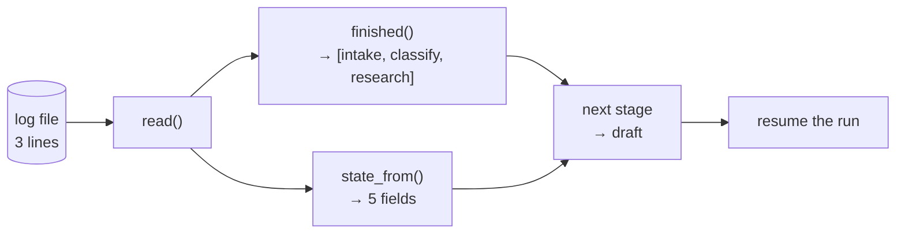

# 2.1 — The log is the run

## One-line answer

Everything a resuming process needs — which stages finished, what they produced, what comes
next — is computed from the log and from nothing else, and on a run killed after `research`
that is **three lines of a text file** rebuilt into five state fields.

## The story

At a government hospital the patient does not own their file; the file lives at the hospital
and the patient's case sheet lives in it.

A woman comes in on Monday with chest pain. The doctor on duty writes: complaint, blood
pressure, what he suspects, what he has ordered. Tuesday she is seen by somebody else
entirely — a different shift, a different person, who has never met her. He does not begin by
asking her what happened on Monday. He reads Monday.

Then he adds Tuesday underneath. He does not go back and change Monday's entry, even if
Monday turns out to have been wrong; if it was wrong he writes *that* down, dated Tuesday,
with his initials. The sheet only ever grows downwards.

That is why the hospital keeps working when the person changes. The knowledge is not in
anybody's head. It is in the sheet, in order, and it is complete enough that whoever reads it
can carry on without having been there.

Notice the two rules that make it work, because they are not obvious and both are
deliberate. **You only ever add to the bottom.** And **you write it down at the time, not
afterwards** — a sheet filled in at the end of a shift, from memory, is a sheet that is wrong
in exactly the places where something went unexpectedly.

## The idea in plain language

An **event log** is an append-only sequence of facts about what has happened. Each entry says
one thing that is now true and was not true before. You never edit an entry; if the world
changes, you append another entry.

The move that makes durability work is to stop treating that log as a *record of* the run and
start treating it as **the run itself**. The distinction sounds like wordplay and it is not:

- If the log is a record, the run is somewhere else — in memory — and the log is a copy that
  might be stale, might be incomplete, and is consulted only when something goes wrong.
- If the log **is** the run, then there is no other copy. The current state of the run is
  *defined* as whatever you get by reading the log from the top and folding the entries
  together, and any in-memory state is a cache of that, rebuilt on demand.

The second arrangement is the one that survives a process dying, because the definition does
not mention the process at all.

That folding operation has a name worth knowing: you **replay** the log to rebuild state. It
is an ordinary `for` loop over the entries, applying each one to an accumulator. Reading a
case sheet from the top is the same operation.

Three questions can be answered from the log alone, and they are exactly the three a
resuming process has:

1. **Which stages finished?** Every entry that says a stage finished, in order.
2. **What is the state?** Fold the `produced` fields of those entries together.
3. **What comes next?** The first stage in the pipeline that the log does not mention.

There is a fourth question the log **cannot** answer, and being honest about it early saves a
lot of confusion later: *what was in flight when the process died?* The log's last entry is
the last thing that finished, not the thing that was happening. Whatever was underway at the
moment of death left no entry, by definition, and so it is invisible.
[2.5](2.5-the-cut-that-includes-the-message-in-the-air.md) is about what it takes to record
that too, and [3.1](../03-doing-it-twice/3.1-the-uncertainty-gap.md) is about the fact that
for effectful steps you sometimes simply cannot know.

## Why Sutra needs it

Day 47 put sessions in a database so that a restart could find them. It stopped one step
short of today's claim: the events were **stored**, but the run's progress still lived in the
process, and the stored events were history rather than instructions.

Making the log authoritative is what lets Day 65's gate work at all. That gate kills the
triage graph mid-run and restarts it, and a restarted process has access to precisely one
thing: whatever is on disk. If "where was I?" is not computable from that, there is nothing
to compute it from.

It is also what ADK does. Section 4 shows that ADK's resumability is not a separate
checkpoint file — it is the session's own event list, with two extra marker fields written
into it. Understanding the hand-rolled version first is Principle 4, and it means section 4
is recognition rather than magic.

## The mechanism

`whatstate.py` crashes a run after `research` and then answers all four questions using only
the log file.

```bash
cd days/day-60-durable-execution/lab
uv run python whatstate.py
```

**Line by line:**

- The run is killed after `research`, so three stages are logged and two are not.
- Everything printed afterwards comes from `read(log)` — the script never touches the
  dictionary the dead run was building. That restriction is artificial in a single process
  and it is the entire point: it forces the code to be honest about what a *new* process
  would have.
- Question 4 is printed as `unknown` rather than guessed, which is the honest answer and the
  hinge of section 3.

Measured on 2026-09-05:

```text
process died after research

1. which stages finished
     intake
     classify
     research
2. what they produced
     ticket_id  4610
     title      Signed out mid-form
     label      auth-bug
     evidence   Session cookie dropped on cross-site redirect. Fixed by...
     neighbour  4521
3. what comes next
     draft
4. what was in flight
     draft -- started? unknown, see part 3.1

the whole of the above came from 3 lines of whatstate.jsonl
```

Five state fields, rebuilt from three lines. Look at the file those three lines live in:

```bash
cat whatstate.jsonl
```

**Line by line:**

- `cat` rather than a pretty-printer, deliberately: the point is that the whole recovery plan is
  three lines of ordinary text that a person can read at 2am without any tooling.
- Each line is one complete JSON object, which is what makes the file append-safe — a writer only
  ever adds a line, and a reader can drop a torn last line without losing the rest.

```text
{"event": "stage_finished", "invocation_id": "inv-b", "produced": {"ticket_id": "4610", "title": "Signed out mid-form"}, "stage": "intake"}
{"event": "stage_finished", "invocation_id": "inv-b", "produced": {"label": "auth-bug"}, "stage": "classify"}
{"event": "stage_finished", "invocation_id": "inv-b", "produced": {"evidence": "Session cookie dropped on cross-site redirect. Fixed by SameSite=None; Secure.", "neighbour": "4521"}, "stage": "research"}
```

Now the folding, which is the whole of replay and is nine lines long:

```python
def state_from(log: Path) -> dict[str, Any]:
    """Rebuild the accumulated state by folding the log forward."""
    state: dict[str, Any] = {}
    for event in read(log):
        if event.get("event") == "stage_finished":
            state.update(event["produced"])
    return state
```

**Line by line:**

- `state` starts empty. Not from a snapshot, not from a default — empty. A resuming process
  begins knowing nothing, and every field it ends up with came from a line in the file.
- The loop is in file order, and file order is the order things happened, because the log is
  append-only. That is why append-only matters: it makes ordering free.
- `event.get("event") == "stage_finished"` filters. The log holds other kinds of entry —
  `run_failed` from [1.2](../01-what-a-run-is/1.2-died-or-failed.md) is one — and folding
  those into state would be nonsense. A log with more than one kind of entry needs the reader
  to say which kinds it is interested in.
- `state.update(...)` is the fold. Later entries win over earlier ones for the same key,
  which is what you want: an entry is a fact recorded at a time, and the most recent fact
  about a key is the current one.
- The function takes a path and returns a dictionary. It touches no global, no class, and no
  process state — so it produces the same answer in the process that wrote the log and in one
  started tomorrow, which is the property the whole day rests on.

And the third question is one line:

```python
return [e["stage"] for e in read(log) if e.get("event") == "stage_finished"]
```

**Line by line:**

- `finished(log)` returns the *names*, in order. The resume loop then skips any stage whose
  name is in that list, which is why the answer to "what comes next" never has to be stored:
  it is derived, so it cannot go stale or disagree with the events.
- Deriving rather than storing is the general rule here. Every stored copy of a fact is a
  chance for two sources to disagree after a crash.



## When it breaks

The log answers "which stages finished" perfectly and answers "what was in flight" not at all,
and the break is what happens when somebody assumes the first answer covers the second.

`whatstate.py --stage review` kills the run after `review` — the effectful stage — so the log
looks complete:

```bash
uv run python whatstate.py --stage review
```

**Line by line:**

- `--stage review` moves the crash to the last stage, after its event is written.
- Everything about the printed state now says the run is finished, because as far as the log
  is concerned it is.

```text
process died after review

3. what comes next
     (nothing, the run is complete)
4. what was in flight
     nothing -- started? unknown, see part 3.1

the whole of the above came from 5 lines of whatstate.jsonl
```

That looks like good news and it is the most dangerous state in the day, because the *other*
ordering — dying after `review`'s effect and before `review`'s log line — produces a log that
is one line shorter and looks like an ordinary interrupted run. Both are recoverable-looking.
Only one of them is safe to resume. `inflight.py` measures exactly that pair, and it is
[3.1](../03-doing-it-twice/3.1-the-uncertainty-gap.md).

There is also a mechanical break worth reaching once. Fold a log whose entries are not all the
shape you assumed:

```text
Traceback (most recent call last):
  File ".../lab/_runner.py", line 44, in state_from
    state.update(event["produced"])
                 ~~~~~^^^^^^^^^^^^
KeyError: 'produced'
```

That is a `run_failed` entry reaching the fold because somebody removed the filter. The
lesson is small and it recurs: **a log is a stream of differently-shaped facts, and every
reader must say which shapes it handles.** A reader that assumes one shape breaks the first
time anybody adds a second kind of entry, which on this day was two parts ago.

## In production

**What a professional writes instead.** The fold is not re-implemented at each call site. It
lives in one function, in one module, and everything — the resume path, the debugging CLI, the
dashboard that shows a stuck run — calls that one function. The reason is that a fold is a
*definition*: it says what the state of a run means. Two implementations of it means two
definitions, and they will drift, and the day they disagree is the day a run resumes into a
state neither of them describes.

**What degrades at scale.** Folding is O(number of events), and it happens on every resume. For
a five-stage run that is nothing. For a long-running agent with thousands of events it is a
real cost paid on every recovery, and the standard answer is a **snapshot**: periodically
write the folded state as a single entry, and start future folds from the newest snapshot
rather than the top. Note the trade this makes — the snapshot is a derived value stored
alongside the facts it was derived from, so it is exactly the kind of duplicated truth this
part just argued against. It is worth it, and it must be regenerable from the events, and it
must carry the schema version that [6.2](../06-failure-lab/6.1-the-resume-that-met-different-code.md)
is about.

**The failure mode that only appears with real traffic.** Log growth from a stage that retries
internally. A `research` step that retries a flaky lookup five times can write five entries
for one stage, and a fold that takes "later wins" quietly does the right thing while a
`finished()` list that assumed one entry per stage now reports `research` three times. Nobody
notices until somebody counts stages to show a progress bar.

**The review comment a senior engineer leaves:** *"This log has no timestamps and no schema
version on the entries. The first time we need to know why a run took an hour, or the first
time we change what `produced` looks like, we will wish we had both — and we cannot add them
retroactively to runs already on disk."*

**The interview question:** *"Where does the state of an in-flight workflow live?"* An honest
answer: *"In the event log, and nowhere else that is authoritative. The in-memory dictionary
is a cache of the fold. I made a point of proving that on our triage flow: after a crash
following the third stage, the recovering process rebuilt five state fields and the name of
the next stage from three lines of JSONL, without touching anything the dead process held.
The thing the log genuinely cannot tell me is what was in flight when it died, because the
in-flight step is by definition the one that never got to write a line — and for the one
effectful stage in our graph that gap is the whole problem."*

## Check yourself

```bash
cd days/day-60-durable-execution/lab
uv run python whatstate.py
cat whatstate.jsonl
uv run python whatstate.py --stage review
```

Now delete the middle line of `whatstate.jsonl` by hand and re-run the fold. Write down which
of the four answers changes and which stays the same, and say what that tells you about
whether the fold validates its input.

**Out loud, without scrolling up:** state the two rules of the hospital case sheet, and say
what each one buys.

**Next:** [2.2 — Replay is not re-execution](2.2-replay-is-not-re-execution.md).
