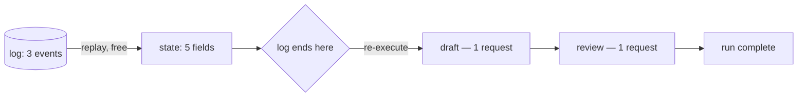

# 2.2 — Replay is not re-execution

## One-line answer

Rebuilding a run's state by reading its log costs **zero model calls and reproduces all seven
fields exactly**, while rebuilding it by running the stages again costs three and reproduces
nothing exactly — and confusing the two is how a "recovery" ends up more expensive than the
original run.

## The story

A teacher takes attendance at nine o'clock and writes the names in the register.

At noon the head teacher wants to know who was present in the morning. There are two ways to
find out.

One is to open the register and read it. It takes a few seconds, and the answer is exactly
what happened at nine.

The other is to stand up in front of the class at noon and call the roll again. This also
produces a list of names. It takes ten minutes, it interrupts the lesson, and — this is the
part that matters — **it does not answer the question that was asked.** Two children went home
sick at eleven. One arrived late at ten. The noon list is a perfectly accurate record of who
is in the room at noon, and it is not the morning's attendance.

Both methods produce a list of names. Only one of them is *reading a record*. The other is
doing the work again and hoping the world has not moved.

## The idea in plain language

**Replay** is rebuilding state by reading recorded outcomes. **Re-execution** is producing
state by performing the work again. They are different operations, and they cost different
things and give different guarantees:

| | Replay | Re-execution |
| --- | --- | --- |
| What it does | reads what happened | makes it happen again |
| Cost | reading a file | whatever the work costs |
| Side effects | none | all of them, again |
| Fidelity | exact, by construction | only if the step is deterministic |

The confusion is easy to fall into because both end with a populated state object, and from
two lines away in the code they look the same. The difference shows up in three places: the
bill, the effect store, and whether the answer is the same one the customer already saw.

A resume uses **both**, and the skill is knowing where the line goes:

- for stages the log already reports as finished → **replay**: take the recorded `produced`
  values;
- for the first stage the log does not mention, and everything after → **re-execute**: there
  is no record, so the work has to happen.

That line is exactly where the log ends. Everything above it is a fact; everything below it is
work not yet done.

One term, because it is about to appear repeatedly. A step is **deterministic** when the same
input produces the same output every time. Replay does not care whether a step is
deterministic — it is not running the step, it is reading its answer. Re-execution cares
enormously, and [2.3](2.3-three-things-that-break-replay.md) is about the three ways that
assumption fails.

## Why Sutra needs it

Sutra's currency is requests, not seconds. Day 24 built the accounting and Day 51 spent a day
on caching, both for the same reason: the free tier is a fixed number of requests per day and
a re-derived answer costs exactly as much as a new one.

So the difference between replay and re-execution is not an elegance argument here. It is the
difference between a crash costing one request and a crash costing three, on a run that will
be crashed on purpose by Day 65's gate and repeatedly in production.

There is a correctness argument as well, and it is the sharper one. `classify` decides which
queue a ticket goes to. If a resume *re-executes* `classify` rather than replaying it, the
ticket can be classified one way before the crash and another way after — and if the first
answer already went somewhere, Sutra has now triaged one ticket two ways.
[2.4](2.4-recording-the-model-so-a-replay-is-a-replay.md) measures that.

## The mechanism

`replay.py` runs the pipeline once for real, then rebuilds the same state twice: once by
reading the log, and once by re-executing. It reports the cost and the fidelity of each.

```bash
cd days/day-60-durable-execution/lab
uv run python replay.py
```

**Line by line:**

- The live run happens first and writes a complete log — five events, three model calls
  charged against the `COST` table in `_stages.py`.
- The replay then calls `state_from(log)` from
  [2.1](2.1-the-log-is-the-run.md), which folds the log and calls nothing.
- `identical` compares the replayed value with the live one field by field. It is a real
  comparison, not a count: a rebuild that produces seven fields with one of them different is
  not a successful rebuild.

Measured on 2026-09-05:

```text
the live run spent 3 model calls and ended with 7 fields
the replay spent 0 model calls and rebuilt 7 fields

field        identical  value
ticket_id    True       4610
title        True       Signed out mid-form
label        True       auth-bug
neighbour    True       4521
evidence     True       Session cookie dropped on cross-site redirect. 
reply        True       Likely the same cause as 4521: Session cookie d
closure      True       {'closure_seq': 1, 'status': 'closed', 'ticket_

next stage to run: (none, the run is complete)
```

**Zero model calls, seven of seven fields identical.** That is what replay buys, and the
`True` column is worth dwelling on: the fidelity is not high, it is *exact*, and it is exact
by construction rather than by luck. The replay did not compute `label`; it read the string
`"auth-bug"` out of a file where a previous run had written it.

Look at `closure` in particular. `{'closure_seq': 1, ...}` — the replay reproduced the closure
result **without closing anything**. There is one row in the effect store, not two, because
the replay never called `close_ticket`. That is the property that makes replay safe for
effectful stages and re-execution dangerous for them, and it is the whole reason section 3
exists for the stages a resume genuinely has to re-execute.

Now the case a real resume actually faces: a log that stops part-way. `--truncate 2` cuts the
last two events off, which is what a crash after `research` leaves behind:

```bash
uv run python replay.py --truncate 2
```

**Line by line:**

- `--truncate 2` drops the final two lines of the log file, leaving three. Nothing else about
  the run changes, so the comparison isolates one variable: how much of the record survived.
- The `identical` column now has to be read differently. `False (absent)` is not a mismatch;
  it means the log never recorded that field, so replay correctly declines to invent it.

```text
the live run spent 3 model calls and ended with 7 fields
the log has been cut back to 3 events, as a crash leaves it
the replay spent 0 model calls and rebuilt 5 fields

field        identical  value
ticket_id    True       4610
title        True       Signed out mid-form
label        True       auth-bug
neighbour    True       4521
evidence     True       Session cookie dropped on cross-site redirect. 
reply        False      (absent)
closure      False      (absent)

next stage to run: ['draft', 'review']
```

Five fields replayed for free; two stages left to re-execute. **That is a resume**: the log's
end is the line, replay above it, re-execute below it.

And here is the arithmetic across every crash point, which is `resume.py`:

```bash
uv run python resume.py
```

**Line by line:**

- It crashes the same run after each of the five stages in turn and compares two recovery
  strategies for each.
- `resume` is replay-then-continue. `restart` is re-execute everything, which is what a system
  without a log is forced to do.

```text
crashed after   log holds   resumes at   resume   restart
intake          1           classify     3        3
classify        2           research     2        3
research        3           draft        2        3
draft           4           review       1        3
review          5           complete     0        3

restart always costs 3 model calls. Resume costs what is genuinely left.
```

The right-hand column is flat and the one beside it is a staircase. That staircase is the
value of the log, priced.



## When it breaks

The break is subtle and it is the reason this part exists at all: **code that looks like
replay and is actually re-execution.**

It happens when the recovery path rebuilds state by calling the stage functions rather than by
reading their recorded output — usually written by somebody who reasoned that the stages are
pure, so calling them is harmless. `rebuild.py` is that mistake in its purest form: a guard
that is supposed to stop a duplicate reply, kept in a Python `set`, and therefore rebuilt by
re-execution rather than replayed.

```bash
uv run python rebuild.py
```

**Line by line:**

- The guard is `sent: set[str]` — a perfectly correct in-memory check that a reply has already
  gone out.
- The process dies and a fresh one takes over. The set is empty in the new process, because a
  set is memory and memory is what dying destroys.
- Nothing raises. The guard runs, correctly, and answers the wrong question.

```text
guard kept in: a Python set
  attempt 1: no reply on record; sending one
  -- process died, a fresh process picks the run up --
  attempt 2: no reply on record; sending one

replies actually sent: 2
log lines rebuilt on resume: 0
The customer has two identical replies, and the code that was supposed to
prevent that ran correctly both times.
```

*"The code that was supposed to prevent that ran correctly both times"* is the sentence to
remember. There is no bug in the guard. The bug is that the guard's state was re-executed into
existence instead of replayed out of the log.

The fix is one line's worth of idea — put the guard's state in the log — and it is measurable:

```bash
uv run python rebuild.py --durable-guard
```

**Line by line:**

- `--durable-guard` records "a reply was sent" as an event, so the guard is rebuilt by folding
  the log rather than by starting from an empty set.
- `log lines rebuilt on resume` goes from `0` to `1`. That single line is the difference
  between one reply and two.

```text
guard kept in: the event log
  attempt 1: no reply on record; sending one
  -- process died, a fresh process picks the run up --
  attempt 2: guard says a reply already went out; sending nothing

replies actually sent: 1
log lines rebuilt on resume: 1
```

## In production

**What a professional writes instead.** The two operations are given two names in the code and
never share a function. Something like `hydrate(log) -> State` and `execute(stage, state) ->
Produced`, with a comment on `hydrate` saying that it must never call a stage. The naming is
the enforcement: a reviewer who sees a stage function imported into the hydration module knows
immediately that something is wrong, which is not true when both live in a function called
`recover`.

**What degrades at scale.** Replay is cheap per event and not free, and a long-lived agent
session accumulates events without bound. The standard fix is periodic snapshotting, and the
standard bug in the fix is a snapshot taken from **re-executed** state rather than replayed
state — which bakes today's answer into a record that claims to describe yesterday's run. If
you snapshot, snapshot the fold.

**The failure mode that only appears with real traffic.** A stage that is pure in testing and
not in production, because in production it reads something that changes. `research` searches
the archive; the archive gains tickets. Re-executing `research` a day later finds a different
neighbour, perfectly deterministically, because the input moved. Nothing about this is visible
in a test suite with a fixed fixture, and it turns "re-executing pure stages is harmless" into
a claim that quietly stops being true.

**The review comment a senior engineer leaves:** *"`recover()` calls `classify()`. That is not
recovery, that is running the pipeline again with extra steps — we pay for the model call and
we can get a different label than the one the customer was already told. Read the recorded
label out of the events. If it is not in the events, that is the bug to fix."*

**The interview question:** *"What is the difference between replaying a workflow and
restarting it?"* An honest answer: *"Replay reads recorded outcomes; restart does the work
again. On our triage flow the replay rebuilt all seven state fields for zero model calls and
produced one closure row, while a restart cost three requests and closed the ticket twice.
A resume is both, split at the point the log stops: replay everything the log knows, re-execute
from the first stage it does not. The mistake I actually shipped was subtler than calling the
wrong function — I kept an already-replied guard in an in-memory set, so after a crash the
guard was rebuilt by re-execution, ran correctly, and sent the customer a second identical
reply."*

## Check yourself

```bash
cd days/day-60-durable-execution/lab
uv run python replay.py
uv run python replay.py --truncate 2
uv run python rebuild.py --durable-guard
```

Now run `replay.py --truncate 4` and write down how many fields survive, how many stages are
left to re-execute, and what that run would cost in requests.

**Out loud, without scrolling up:** explain to somebody why calling the roll again at noon does
not tell you who was present at nine, and say which half of a resume is the register and which
half is calling the roll.

**Next:** [2.3 — Three things that break replay](2.3-three-things-that-break-replay.md).
