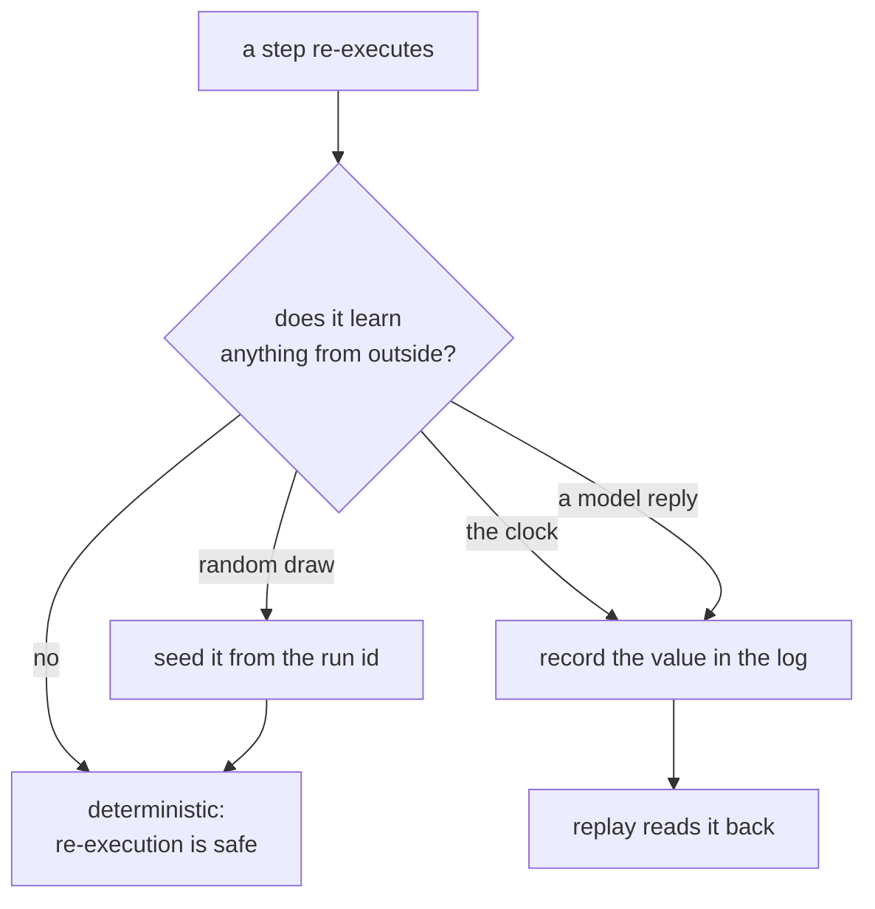

# 2.3 — Three things that break replay

## One-line answer

Three ordinary things make a step give a different answer the second time — the clock,
randomness, and the model — and only the first two have a fix that costs nothing: seeding the
generator makes `sample` reproduce exactly, and **nothing you can do makes `time.time()` do
the same**.

## The story

Your aunt gives you her recipe over the phone and you write down every word.

Two cups of flour. Warm water. Salt. Knead until it is soft. **Ghee, a pinch of hing, and
chilli to taste.** Cook on a medium flame until it smells right.

You make it on Sunday and it is wonderful. You make it again on Wednesday, following the same
written page, line for line, in the same kitchen — and it is different. Not wrong. Different.
More chilli, because Sunday you were cooking for your mother and Wednesday you were not. The
flame was a bit higher because you were in a hurry.

The recipe is the same recipe. You followed it exactly. And "follow the same steps" turns out
not to mean "get the same dish", because three of the instructions were never instructions at
all. *To taste* is a decision, not a measurement. *Until it smells right* depends on the day.
*Medium flame* depends on your stove and your hurry.

If somebody asks you on Thursday what you cooked on Sunday, following the recipe again will
not tell them. Only a note saying *"Sunday: one and a half spoons of chilli"* will.

## The idea in plain language

Replay reads recorded answers, so it cannot drift. Re-execution runs the step again, and it
reproduces the original answer **only if the step is deterministic** — same input, same
output, every time.

Three things break determinism in ordinary code, and they are worth separating because the
fixes are completely different:

1. **The clock.** Any step that reads the current time gets a different answer every time it
   runs, by design. `time.time()`, `datetime.now()`, a duration measured between two calls, a
   deadline computed from *now*. There is no seed for this. The only fix is to **record the
   value and read it back**.
2. **Randomness.** Any step that draws a random number: an id, a sample, a shuffle, a jitter
   on a retry (Day 44's
   [3.2](../../../day-44-client-hardening/parts/03-backing-off/3.2-the-same-wait-is-the-wrong-wait.md)
   added exactly that jitter). This one *does* have a cheap fix: seed the generator from
   something stable, like the run's own id, and every re-execution draws the same numbers.
3. **The model.** A language model asked the same question twice can answer differently. This
   is not a bug and it is not fixable by seeding: it is what the thing is. Day 2 established
   why in
   [4.2 — turning the dial](../../../day-02-llm-mechanics/parts/04-sampling-the-dial/4.2-turning-the-dial.md),
   where temperature and top-p turn a distribution over tokens into a choice. Even at
   temperature zero, providers do not promise bit-identical output across calls.

The three are usually lumped together as "non-determinism" and that lumping is the problem,
because it hides the fact that **one of them is free to fix, one is impossible to fix, and one
is a design decision**. The clock and the model both have the same answer — record the value —
and it is the answer this whole section has been building towards.

Say it plainly, because it is the rule that matters:

> Anything a step **learns from outside itself** — the time, a random draw, a model's reply —
> must be written into the log at the moment it is learned, or that step is not replayable.

## Why Sutra needs it

The triage graph has all three. `classify` and `draft` call a model. Day 44's retry policy
draws jitter. Any stage that stamps a ticket with a timestamp reads the clock.

The consequence is specific and it is not theoretical. If a resume re-executes `classify`
rather than replaying it, the ticket can be labelled `auth-bug` before the crash and something
else after — and the first label may already have routed the ticket to a queue and told a
customer something. [2.4](2.4-recording-the-model-so-a-replay-is-a-replay.md) shows that
happening.

It also decides what Day 65's gate can honestly claim. "Kill it mid-run and it resumes" means
nothing if the resumed run is a *different* run that happens to finish. The gate needs the
resumed run to be a continuation, and continuation is exactly what determinism buys.

## The mechanism

`clock.py` takes three values — a timestamp, a random sample, and (in the next part) a model
reply — and puts each through three treatments: produced by the first run, produced by
re-executing, and read back from the log.

```bash
cd days/day-60-durable-execution/lab
uv run python clock.py
```

**Line by line:**

- `stamp` is `time.time()`. `sample` is `random.randint`. Both are recorded to the log on the
  first run and then reproduced two ways.
- The `replay?` column is the verdict: it asks whether the **re-executed** column matched the
  first run. It is deliberately not about the log column, because the log column is the
  control and is identical by construction.
- The default arm leaves the random generator unseeded, which is what code does unless
  somebody thinks about it.

Measured on 2026-09-05:

```text
seeded random: False
value    first run            re-executed          read from log        replay?
stamp    1788622609.4739237   1788622609.4744291   1788622609.4739237   NO
sample   8886                 6718                 8886                 NO

The 'read from log' column is identical in every arm, because reading a recorded
value is the only operation here that cannot drift. Re-executing is not replay.
```

Look at `stamp` closely. The first run and the re-execution differ in the **fourth decimal
place**: `...4739237` against `...4744291`. Half a millisecond apart. That is the most
dangerous shape a non-determinism bug can have, because it is invisible in any output a human
reads and it is still enough to make two records disagree, to put an event on the wrong side
of a midnight boundary, or to compute a deadline that has already passed.

`sample` differs by a lot — `8886` against `6718` — which is the honest, obvious kind of
failure. And the `read from log` column reproduces both exactly, which is the point of the
whole table.

Now seed the generator:

```bash
uv run python clock.py --seeded
```

**Line by line:**

- `--seeded` calls `random.seed(...)` with the run's invocation id before each arm, so both
  arms draw from the same sequence. The invocation id is used rather than a constant because a
  constant would make *every run in the system* draw the same numbers, which is a different
  and worse bug.
- Nothing else changes. The clock arm is untouched, and that is the finding.

```text
seeded random: True
value    first run            re-executed          read from log        replay?
stamp    1788622633.4398363   1788622633.4418428   1788622633.4398363   NO
sample   7337                 7337                 7337                 yes

The 'read from log' column is identical in every arm, because reading a recorded
value is the only operation here that cannot drift. Re-executing is not replay.
```

`sample` is now `yes`. `stamp` is still `NO`, and it will be `NO` for ever, because there is no
seed for Tuesday afternoon.

That asymmetry is the lesson of this part in one table:

| Source | Fixable by seeding? | The actual fix |
| --- | --- | --- |
| randomness | **yes** | seed from the run id |
| the clock | no | record the value, read it back |
| the model | no | record the reply, read it back ([2.4](2.4-recording-the-model-so-a-replay-is-a-replay.md)) |



## When it breaks

The break worth reaching is the one where seeding is applied to the clock by analogy, because
it looks like it works.

Somebody freezes time at the top of the run:

```python
NOW = time.time()  # "seed" the clock once, use it everywhere


def stamp() -> float:
    return NOW
```

**Line by line:**

- `NOW` is captured once per process and every stage reads it, so within a single run every
  timestamp agrees. That much is genuinely an improvement.
- The failure is that `NOW` is captured **per process**, and a resume is a different process.
  The resumed half of the run gets a `NOW` from the resume, not from the original run, so a
  run that spans a crash has two different "now"s in it and nothing says which is which.
- The frozen clock also silently breaks anything that measures a duration, because every
  interval inside the run is now exactly zero.

The visible symptom is a timeout that never fires or fires instantly:

```text
Traceback (most recent call last):
  File ".../lab/_runner.py", line 71, in run
    raise TimeoutError(f"stage {stage} exceeded its budget: {elapsed:.1f}s of {budget}s")
TimeoutError: stage research exceeded its budget: 0.0s of 30.0s
```

`0.0s of 30.0s` is the tell — a duration of zero that still triggered the check, because the
comparison was written against a clock that no longer moves. The correct fix is not a frozen
clock but a **recorded** one: the timestamp goes into the event when the stage finishes, and a
resume reads it from there rather than asking the operating system again.

## In production

**What a professional writes instead.** Steps do not call `time.time()` or `random.random()`
directly. They receive them, from a context object the runtime supplies — and that object has
two implementations: one that reads the real clock and records what it read, and one that
reads the recorded values back during a replay. This is the shape every durable-execution
engine converges on, and it is worth recognising the pattern rather than only the trick:
**non-determinism is pushed to the edge and captured there**, so the business logic in the
middle is pure and therefore trivially replayable.

**What degrades at scale.** The recording grows. Every clock read and every random draw is now
an entry, and a step that loops a thousand times recording a timestamp each pass produces a
thousand entries for one stage. Real engines batch these into a single "side effect" record
per step, and cap the number, and fail loudly when a step exceeds the cap — because a step
that reads the clock a thousand times is usually a bug anyway.

**The failure mode that only appears with real traffic.** Clock skew between machines. The run
starts on one node and resumes on another whose clock is a few hundred milliseconds behind, and
now the log contains timestamps that go *backwards*. Anything that sorts by timestamp, or
computes a duration by subtracting two of them, produces a negative number and usually a
crash — in the recovery path, which is the worst place to have one. Day 22 met the same monster in
[1.4 — timestamps are not an order](../../../day-22-structured-logging/parts/01-a-line-you-can-query/1.4-timestamps-are-not-an-order.md)
and reached for the same answer: order by a monotonic sequence number that you control, and
treat wall-clock time as a human-readable annotation rather than as a fact you can do
arithmetic on.

**The review comment a senior engineer leaves:** *"This step calls `datetime.now()` twice and
uses the difference as a duration. On a replay both calls return the replay's time, so the
duration is meaningless, and on a resume across a node boundary it can be negative. Record the
duration as a value when the step finishes, and read it back."*

**The interview question:** *"What stops a workflow replay from producing a different
result?"* An honest answer: *"Recording every value the step learned from outside itself.
There are three sources and they are not the same problem. Randomness is free to fix — I
seeded from the run id and the same draw came back, `7337` both times. The clock cannot be
fixed that way; in my measurement the first run and the re-execution differed in the fourth
decimal place, which is small enough to be invisible and big enough to put an event on the
wrong side of a boundary, so the only answer is to record it. And the model is the same
category as the clock: not seedable, so the reply gets written into the log and read back. The
mistake I made first was freezing the clock at the top of the process, which works within one
run and breaks precisely when the run spans two processes — which is the only case that
matters."*

## Check yourself

```bash
cd days/day-60-durable-execution/lab
uv run python clock.py
uv run python clock.py --seeded
```

Now run `clock.py --seeded` twice in a row and compare the `sample` values between the two
runs, not within one. Write down whether they match, and say what that tells you about
seeding from the invocation id rather than from a constant.

**Out loud, without scrolling up:** name the three things that break replay, and say which one
of them a seed can fix and why the other two cannot be fixed the same way.

**Next:** [2.4 — Recording the model so a replay is a replay](2.4-recording-the-model-so-a-replay-is-a-replay.md).
