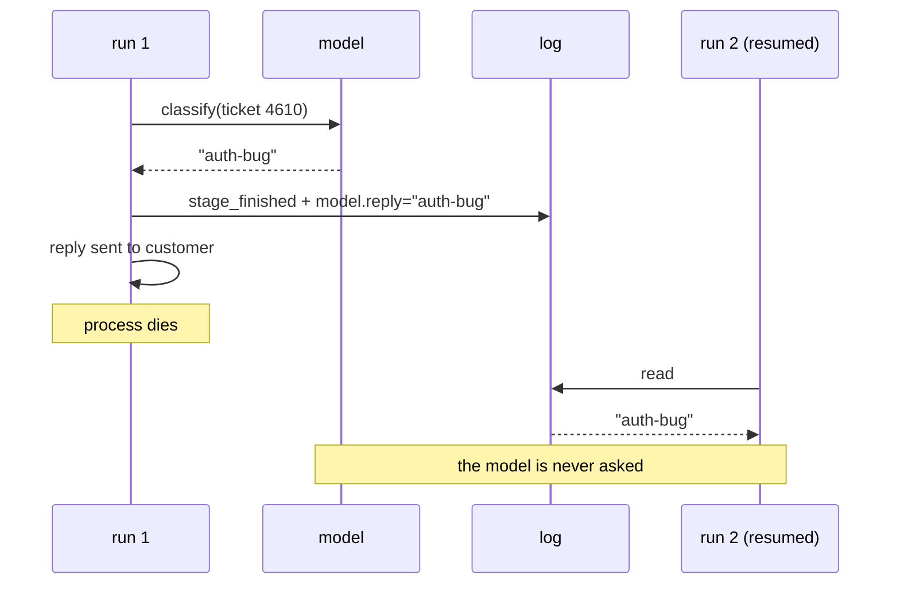

# 2.4 — Recording the model so a replay is a replay

## One-line answer

A resumed run that re-asks the model can get a different answer than the one the customer has
already been given — measured, the same ticket is labelled `auth-bug` before the crash and
`data-loss` after it, and routed to two different teams — so the model's reply is recorded in
the log like any other value learned from outside.

## The story

You go to a tailor to have clothes made. He measures you, writes the numbers in his book, and
cuts the trousers that week.

A month later you come back for the shirt, and the book has gone missing. No drama — he takes
the tape out and measures you again. It takes two minutes.

The numbers are not the same. Half an inch here, a quarter there. He has not made a mistake and
neither have you: you are standing slightly differently, he is pulling the tape slightly
tighter, and half an inch is inside the honest error of a man with a tape measure and a
customer who is trying not to fidget.

For the shirt alone this is fine. The shirt will fit.

The problem is the trousers, which are already cut, to the *first* set of numbers. The set was
supposed to match. Now there are two sets of measurements in the world for one person, one of
them is in cloth and cannot be changed, and the other is in the tailor's book — and the book
is the one that will be used for everything from now on.

Re-measuring was cheap. Re-measuring was also the moment the two halves of the order stopped
agreeing with each other.

## The idea in plain language

[2.3](2.3-three-things-that-break-replay.md) put the model in the same category as the clock:
a value the step *learns from outside itself*, which cannot be reproduced by running the step
again. This part is about what follows from that for a resume.

The rule is simple to state. **A stage that called a model must record the reply as part of its
event.** Then a resume replays the recorded reply instead of asking again, and the second half
of the run is built on the same answer as the first half.

The technique has a name borrowed from testing: a **cassette** — a recorded request-and-response
pair, keyed by the request, played back instead of a live call. The word matters less than the
two properties:

- **Keyed by the request**, so a replay of a *different* question is a miss rather than a
  wrong hit. A cassette keyed only by stage name is a bug waiting for the day a stage asks two
  questions.
- **Played back, not consulted.** The replaying code does not call the model and compare; it
  does not call the model at all. That is what makes the replay cost zero requests, which on a
  free tier is not a detail.

There is an obvious objection and it deserves a straight answer. *Is a recorded reply still
correct?* It is the reply the run actually got, which is a different and better question than
whether it is the reply the model would give now. A resumed run is a continuation of the first
run, so the answer it must use is the first run's answer — the one that is already downstream
in a draft, in a queue, and possibly in front of a customer. Freshness is not the goal here.
**Agreement with what already happened is the goal.**

If the recorded answer was wrong, the fix is to fail the run and start a new one, not to
quietly substitute a better answer half way through and leave the first half of the work built
on the old one. That is the tailor cutting the shirt to new numbers and leaving the trousers
as they are.

## Why Sutra needs it

`classify` decides the queue. `draft` writes the words. Both call a model, and both are
upstream of `review`, which closes the ticket and tells the customer something.

So the failure this part prevents is not abstract: it is one ticket triaged two ways. The
first classification routes it and may already have produced a reply; the resumed
classification can route the same ticket somewhere else, and now two teams believe they own
it and the record contains both.

It is also what makes Day 65's gate meaningful. That gate kills the triage graph mid-run and
requires it to come back. Coming back with a *different* label is not resuming — it is
starting a second run that reuses the first one's ticket. Recording the model's reply is what
makes the resumed run a continuation rather than a coincidence.

And it is quota. Every re-asked question is a request out of a fixed daily allowance, spent to
obtain an answer the system already had and threw away.

## The mechanism

`secondopinion.py` runs the classify stage, crashes after the reply has gone out, and then
resumes twice: once re-asking the model, once reading the recorded reply.

```bash
cd days/day-60-durable-execution/lab
uv run python secondopinion.py
```

**Line by line:**

- The "model" is a stub that returns a different label on its second call. That is not a
  caricature: it is the smallest faithful model of a sampler that can pick a different token,
  and it makes the demonstration deterministic, which a real model call would not.
- The crash lands *after* the reply is sent, which is the ordering that matters. The first
  answer is already outside the system by the time the second answer is produced.
- The default arm re-executes `classify` on resume — the natural thing to write if you have
  not thought about it.

Measured on 2026-09-05:

```text
run 1  classify -> 'auth-bug'  routed to the security queue
       ...the reply is sent, the customer reads it, then the process dies
run 2  classify -> 'data-loss'  (re-executed against the model)
       routed to the data team

Different label, different queue. The ticket has now been triaged two ways,
and the customer has already been told the first one.
```

Two labels, two queues, one ticket, and a customer holding the first answer. Nothing raised.
Both classifications are individually reasonable. The system is now inconsistent with itself
and there is no error anywhere to tell anybody.

The fix is one line of behaviour — read the reply back instead of asking again:

```bash
uv run python secondopinion.py --recorded
```

**Line by line:**

- `--recorded` makes the resume take the label out of the log event that `classify` wrote,
  rather than calling the stub.
- The stub is still there and still willing to give a different answer. It is simply not
  asked, which is why the arm costs zero requests as well as being correct.

```text
run 1  classify -> 'auth-bug'  routed to the security queue
       ...the reply is sent, the customer reads it, then the process dies
run 2  classify -> 'auth-bug'  (read back from the log)
       routed to the security queue

Same label, same queue. The resumed run is a continuation of the first one.
```

Here is the event that makes it work, as it is actually written on disk:

```bash
cat secondopinion.jsonl
```

**Line by line:**

- One line, because only `classify` ran before the crash in this arm.
- Everything the replay needs is in it, and nothing else is: no prompt text, no session, no
  timing — the three fields under `model` and the label under `produced`.

```text
{"event": "stage_finished", "model": {"name": "gemini-2.5-flash", "prompt_sha": "eebf88be", "reply": "auth-bug"}, "produced": {"label": "auth-bug"}, "stage": "classify"}
```

And the call that writes it:

```python
record(
    LOG,
    event="stage_finished",
    stage="classify",
    produced={"label": first},
    model={"name": MODEL, "prompt_sha": sha(PROMPT), "reply": first},
)
```

**Line by line:**

- `produced` is what the *pipeline* needs — the label, folded into state by
  [2.1](2.1-the-log-is-the-run.md)'s `state_from`.
- `model` is what the *replay* needs, and it is deliberately a separate key. Mixing them means
  a later change to what a stage produces silently changes what a replay reads.
- `prompt_sha` is `sha(PROMPT)`, the first eight hex characters of a SHA-256 of the exact
  prompt sent. It is the cassette's key: on replay you check that the prompt you were about to
  send matches the one recorded, and if it does not, the recording does not apply to this
  question and re-using it would be a lie.
- `name` is the model string, `gemini-2.5-flash` — a free-tier model under Addendum 02, named
  here and never called. A recording made against one model is not a recording of another, and
  the day the pinned model changes, every cassette from before that change stops being valid.
- Nothing here stores the prompt text, only its hash. The log is kept for months and the
  prompt holds customer words. That is Day 69's subject, and the decision belongs here where
  the field is designed rather than there where it is discovered.



## When it breaks

The break is a cassette that is keyed too loosely, because it produces a *hit* where it should
produce a miss — and a wrong hit is worse than a live call.

Between the crash and the resume, something upstream moves. The archive is re-chunked, which is
an ordinary consequence of Day 50's tuning, so the retrieved rows are different and the prompt
`classify` would build is no longer the prompt it built the first time. `--stale-context`
reproduces exactly that, and `--loose-key` keys the recording by stage name alone:

```bash
uv run python secondopinion.py --recorded --stale-context --loose-key
```

**Line by line:**

- `--stale-context` swaps the archive rows in the prompt from `4521` to `4521, 4488`. The
  ticket is the same ticket; the question about it is not the same question.
- `--loose-key` makes `replay_reply` return `entry["model"]["reply"]` without comparing hashes
  — which is what a cassette keyed on `{stage: reply}` does.

```text
run 1  classify -> 'auth-bug'  routed to the security queue
       ...the reply is sent, the customer reads it, then the process dies
       (between the crash and the resume the prompt changed: 2b326093)
run 2  classify -> 'auth-bug'  (keyed by stage name only)
       routed to the security queue

The recording was made for a different prompt and was replayed anyway.
Nothing raised. The answer belongs to a question this run did not ask.
```

Read the outcome carefully, because it looks like the *good* outcome. Same label, same queue,
no error, zero requests spent. It is indistinguishable from the correct arm above. The only
thing wrong with it is that the answer was produced for a question containing one archive row
and replayed for a question containing two — and nothing in the output, the log, or the
customer's reply records that substitution.

Now the same situation with the hash check in place:

```bash
uv run python secondopinion.py --recorded --stale-context
```

**Line by line:**

- Identical to the arm above minus `--loose-key`, so exactly one thing differs: whether
  `replay_reply` compares `entry["model"]["prompt_sha"]` with `sha(prompt)`.
- The comparison fails, and the failure is raised rather than absorbed. Principle 10: the run
  stops and says why, instead of finishing with an answer nobody can account for.

```text
run 1  classify -> 'auth-bug'  routed to the security queue
       ...the reply is sent, the customer reads it, then the process dies
       (between the crash and the resume the prompt changed: 2b326093)
Traceback (most recent call last):
  File ".../lab/secondopinion.py", line 127, in <module>
    main()
  File ".../lab/secondopinion.py", line 107, in main
    second = replay_reply("classify", prompt_now, loose_key=loose)
             ^^^^^^^^^^^^^^^^^^^^^^^^^^^^^^^^^^^^^^^^^^^^^^^^^^^^^
  File ".../lab/secondopinion.py", line 76, in replay_reply
    raise ValueError(
ValueError: recorded reply for stage 'classify' was made for prompt sha eebf88be, this run would send 2b326093 - the recording does not apply to this question
```

Both hashes are in the message, which is the difference between an error somebody can act on
and one they can only be annoyed by. The run stops; a human decides whether to start a fresh
run for this ticket. That is the correct outcome, and it is worth noticing that **the failing
arm is the one doing its job**.

## In production

**What a professional writes instead.** The recording is not written by the stage. It is
written by the layer that makes the model call — the same place Day 44's retry policy and
Day 51's cache live — so every model call in the system is recorded by construction and no
stage can forget. This is the recurring shape of the whole day: **the durability concern is
pushed to the edge, so the business logic in the middle does not have to be careful.**

**What degrades at scale.** Recordings are big. A prompt with retrieved context and a reply is
kilobytes, times three model calls, times every run, kept for as long as a run might be
resumed. Two decisions follow, and they are the ones nobody makes until the disk fills:
recordings expire much sooner than the run's own event log, and they are stored by reference —
a hash and a pointer — rather than inline, so the log stays readable and the payloads can be
deleted on a different schedule. Day 69's retention argument lands on exactly this pile.

**The failure mode that only appears with real traffic.** The model is deprecated. A free-tier
model string is retired — Addendum 02 warns that free rosters move, and Day 9's four providers
each have their own timetable — and every recording made against it is now a recording of
something that no longer exists. A run resumed a week later replays fine, which is good, but a
run that needs to re-execute an *unrecorded* stage cannot, and the error surfaces in the
recovery path rather than the happy path. The mitigation is to keep the model name in the
recording, check it on resume, and fail the run explicitly rather than silently substituting
the current model.

**The review comment a senior engineer leaves:** *"The cassette is keyed by stage name. That
means a resume of a ticket whose archive rows have changed since the crash will replay a reply
that was generated for different context, and we will never know. Key it by a hash of the
actual prompt and raise when it does not match."*

**The interview question:** *"Your workflow calls an LLM. How do you replay it?"* An honest
answer: *"You do not replay an LLM, you replay its answer — the reply gets recorded into the
run's event log the moment it arrives, keyed by a hash of the exact prompt and by the model
string, and a resume reads it back instead of calling. The reason is not cost, although on a
free tier it is also cost. I measured the alternative on our triage flow: the same ticket came
back `auth-bug` before the crash and `data-loss` after it, so it was routed to two different
teams while the customer already had the first answer. The subtlety is the key. Keyed by stage
name it is a bug, because a resume after the retrieved context changed will happily replay an
answer to a question it is not asking any more — so the hash has to cover the prompt, and a
mismatch has to raise rather than fall back to a live call."*

## Check yourself

```bash
cd days/day-60-durable-execution/lab
uv run python secondopinion.py
uv run python secondopinion.py --recorded
grep model secondopinion.jsonl
```

Now change the stub model in `secondopinion.py` so that it returns the *same* label both
times, and re-run the default arm. Write down what the output looks like, and say why that
version of the demo would have taught you nothing.

**Out loud, without scrolling up:** explain why the tailor re-measuring is a problem for the
trousers and not for the shirt, and say which one the resumed half of a run is.

**Next:** [2.5 — The cut that includes the message in the air](2.5-the-cut-that-includes-the-message-in-the-air.md).
