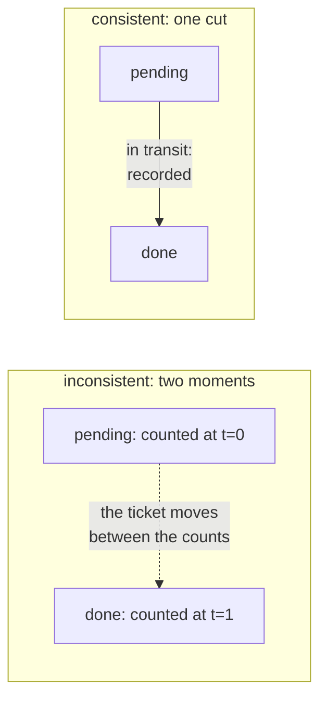

# 2.5 — The cut that includes the message in the air

## One-line answer

A snapshot taken by photographing each part of a system in turn records a state the system was
never in — measured, a desk holding **ten tickets reports eleven, on every single attempt** —
and the repair is not a faster photograph but recording what was in transit between the parts.

## The story

A shop has two counters and one owner, and at closing time he counts the money.

He starts at the first counter. Four hundred rupees. He writes it down and walks to the second
counter. Two hundred. He writes that down too, adds them up, and gets six hundred.

Except that while he was walking between the counters, the boy at the first counter sent a
hundred rupees across to the second one for change, and it had not arrived yet — it was in the
boy's hand, in the middle of the shop, when the owner counted the second till.

The first count was taken before the hundred left. The second was taken before it arrived. So
the hundred is in neither number, and the owner's total is five hundred, and he spends the
evening looking for money that is not missing.

Nothing was stolen. Nobody miscounted. Both counts were accurate at the moment they were taken.
The total is wrong because it is made of two moments and the shop only has one.

And notice what the fix is not. The fix is not to count faster, or to count both tills at
exactly the same instant, which nobody can do. The fix is to count the money **in the boy's
hand** as well.

## The idea in plain language

A **global state** is what the whole system looks like at one moment: what every part holds,
plus what is on its way between them.

The trouble is that "one moment" is not something a distributed system has. There is no
instant that every part shares. There is no way to freeze everything and look. So a snapshot
has to be assembled out of local observations taken at different times, and the question is
whether the assembled picture is one the system could actually have been in.

A picture that could have happened is called **consistent**. A picture that could not is
**inconsistent**, and the shop's five hundred is the canonical example: no arrangement of that
shop at any instant has five hundred rupees in it.

The thing that makes a picture inconsistent is almost always the same: **a message that was in
transit and got counted nowhere**. The sender recorded itself after sending, so it does not
have it. The receiver recorded itself before receiving, so it does not have it either. It falls
between the two observations.

So a correct snapshot must record three things, and the third is the one people forget:

1. what each part holds,
2. **what is in transit between the parts**,
3. and enough ordering that (1) and (2) belong to the same cut.

The word **cut** is worth defining because it is the precise term. Draw the system's history
as one timeline per part, with arrows for messages. A cut is a line drawn across all the
timelines, dividing "before" from "after". The cut is **consistent** when no arrow crosses it
backwards — that is, no message is received before it was sent. An arrow that crosses forwards
is fine, and it is exactly the message in transit that item 2 is about.

This matters to durability because a checkpoint *is* a snapshot. Everything above is the
answer to "what does a checkpoint have to contain to be resumable?", and the answer includes
the in-flight work, not only the parts that were sitting still.

## Why Sutra needs it

The triage graph is not one machine, and this is where that stops being pedantry. Day 58's
graph runs stages that call an MCP server (Day 42 put agents behind that boundary) and a
database. A checkpoint taken between two stages is one observation; the request already sent
to the tool and not yet answered is the message in the air.

Concretely: the run's log says `draft` finished and says nothing about `review`. Was a request
sent to the ticket service? The log — one observer — cannot say, and that is not a gap in the
logging, it is the shop's hundred rupees.
[3.1](../03-doing-it-twice/3.1-the-uncertainty-gap.md) is the next part precisely because this
one shows that the gap is structural rather than a thing better code closes.

Day 65's gate kills the graph mid-run, and *mid-run* means mid-request as often as it means
between stages. A resume that assumes the world is only what the log's last line says will
resume into a state the system was never in.

## The paper behind it

> **Distributed snapshots: determining global states of distributed systems**
> `doi:10.1145/214451.214456` · ACM Transactions on Computer Systems 3(1), 63–75 · 1985 ·
> <https://doi.org/10.1145/214451.214456>

It showed that a system can record a consistent global state **without pausing**, by sending
special marker messages along its channels and using their arrival to decide what belongs in
the snapshot.

The method, its limits, and what survived of it are taught in
[the paper part](../../papers/01-distributed-snapshots.md) — read it after the rest of the day.

## The mechanism

`cut.py` puts eleven tickets — sorry, ten tickets and one in motion — through two shelves and
takes a snapshot two ways. The invariant is simple: **there are always ten tickets**, so any
snapshot that totals something else is describing a desk that never existed.

```bash
cd days/day-60-durable-execution/lab
uv run python cut.py
```

**Line by line:**

- The two "shelves" are `pending` and `done`, and a ticket moves from one to the other. The
  move is not instant: for one step it is in neither shelf, which is the whole experiment.
- The default arm takes the two observations at **two moments** — count `pending`, then count
  `done` — which is what a snapshot assembled from independent local observations does.
- `started at` sweeps the moment the snapshot begins, so the result is not a fluke of one
  unlucky timing. Four different start points, four results.

Measured on 2026-09-05:

```text
how the cut is taken: two moments

started at  pending   in transit    done   total
0           10        not recorded  1      11   <- a desk that never existed
1           9         not recorded  2      11   <- a desk that never existed
2           8         not recorded  3      11   <- a desk that never existed
3           7         not recorded  4      11   <- a desk that never existed

there are always 10 tickets on this desk. The first arm counts the moving
ticket on both shelves; the second counts it exactly once, in the air.
```

Every row says eleven, and the desk has ten. The error is not random and it is not small: the
moving ticket is counted **twice**, once on the shelf it has left and once on the shelf it has
not yet reached, because the two observations were taken at two different times and it was on
one shelf at the first and the other shelf at the second.

Note that this is the *opposite* error from the shop, and both are available. Observe the
sender first and you can double-count; observe the receiver first and you can lose it. Which
one you get depends on the order you happen to walk in, which is a deeply unsatisfying property
for a recovery mechanism to have.

Now record the transit:

```bash
uv run python cut.py --consistent
```

**Line by line:**

- `--consistent` takes both shelf counts as one observation and adds a third column for what is
  in the channel between them.
- Nothing about the desk changes; nothing about the traffic changes. The only difference is
  that the snapshot has somewhere to put the thing that is moving.

```text
how the cut is taken: one moment, transit recorded

started at  pending   in transit    done   total
0           9         #0            0      10
1           8         #1            1      10
2           7         #2            2      10
3           6         #3            3      10
```

Ten, ten, ten, ten. And the `in transit` column names *which* ticket was in the air, which is
what makes the snapshot resumable rather than merely correct: a recovering process needs to
know that ticket `#2` was on its way, so it can decide whether to send it again.



## When it breaks

The break worth reaching is the tempting shortcut: **stop the world, then count.** If nothing
moves, no message can be in transit, so a two-moment snapshot is correct.

It genuinely works, and it is worth being clear that it works, because the reason not to do it
is not correctness. Freezing every stage of the triage graph while a checkpoint is written
means the graph does no work during the checkpoint, and checkpoints happen at every stage
boundary. Under load the system spends its time being photographed.

The subtler break is a stop-the-world that does not actually stop the world. A pause
implemented by a flag that each stage checks means a stage already inside a tool call keeps
going, and the snapshot is taken while a request is outstanding — the exact condition the pause
was supposed to remove.

`--verify` turns the desk's invariant into an assertion checked at the moment the snapshot is
taken, so the two-moment arm stops instead of reporting:

```bash
uv run python cut.py --verify
```

**Line by line:**

- `--verify` compares the snapshot's total against the one thing known to be true about the
  desk — that it holds ten tickets — and raises when they disagree.
- It is checked at snapshot time rather than at resume time, which is the whole value: the
  process that took the bad picture is still running and still has the context to say why.

```text
started at  pending   in transit    done   total
Traceback (most recent call last):
  File ".../lab/cut.py", line 74, in <module>
    main()
  File ".../lab/cut.py", line 63, in main
    raise AssertionError(f"snapshot totals {reported}, invariant says {TOTAL}")
AssertionError: snapshot totals 11, invariant says 10
```

It fails on the very first row, before printing any of them. Run the same check against the
consistent arm — `uv run python cut.py --verify --consistent` — and all four rows print and the
process exits `0`.

That assertion is worth writing into any real checkpoint path. A snapshot that violates a
system invariant is detectable at the moment it is taken and undetectable a week later when
somebody resumes from it — which is the difference between an error and an incident.

## In production

**What a professional writes instead.** They avoid needing a distributed snapshot at all,
because the machinery is real work. The standard move is to make the checkpoint boundaries
places where **nothing is in flight by construction**: a stage completes, its request-response
cycle is closed, and only then is a checkpoint written. That converts the hard problem into an
easy one, at the cost of only being able to checkpoint at those points. Every durable-execution
engine in wide use makes this trade, and it is why [5.2](../05-triage-made-durable/5.2-where-the-boundary-goes.md)
spends its time on where the boundaries go rather than on marker algorithms.

**What degrades at scale.** The in-transit set grows with concurrency. One stage with one
outstanding request is easy to record; Day 54's parallel branches with five outstanding
requests each mean the "message in the air" column is itself a data structure that must be
captured atomically. This is the point at which people stop hand-rolling and adopt an engine.

**The failure mode that only appears with real traffic.** The invariant that nobody checks. A
system counting tickets can assert that the total is constant; a system checkpointing agent
state usually has no such invariant, so an inconsistent checkpoint is written silently and
discovered only when a resume produces impossible output. Finding one invariant you can assert
at checkpoint time — a count, a sum, a monotonic sequence number — is worth more than a lot of
careful reasoning.

**The review comment a senior engineer leaves:** *"This checkpoint is written after the tool
call is dispatched and before the response is handled. There is no field in it for the
outstanding call, so on resume we either drop the request or send it twice, and which one we
get depends on timing. Move the checkpoint after the response, or record the request id in it."*

**The interview question:** *"What makes a distributed snapshot consistent?"* An honest
answer: *"That the recorded state is one the system could actually have been in — no message
received before it was sent. The trap is that you cannot get it by photographing each part in
turn, because something in transit lands in neither photograph, or in both. I measured that: a
two-moment snapshot of a desk holding ten tickets reported eleven every single time, because
the moving ticket was counted on the shelf it had left and on the shelf it had not reached.
Adding a column for what was in the channel took it back to ten. In practice, though, most
production systems dodge the whole problem by only checkpointing at points where nothing is
in flight — which is cheaper than being clever, and is why it is the common answer."*

## Check yourself

```bash
cd days/day-60-durable-execution/lab
uv run python cut.py
uv run python cut.py --consistent
```

Now change `cut.py` so the two-moment arm counts `done` **before** `pending`, and re-run it.
Write down whether the total is now above or below ten, and say what that tells you about
which error you get and why you do not get to choose.

**Out loud, without scrolling up:** explain the shop's missing hundred rupees, and say why
counting faster does not help.

**Next:** [3.1 — The uncertainty gap](../03-doing-it-twice/3.1-the-uncertainty-gap.md).
