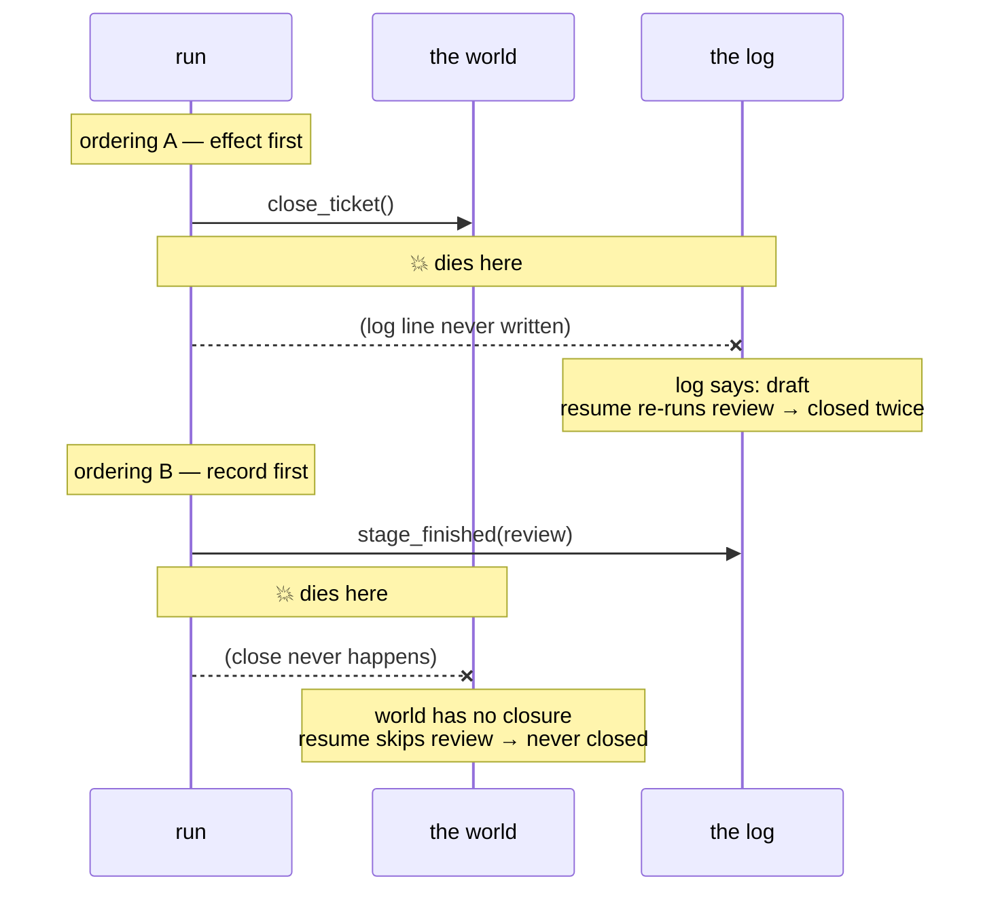

# 3.1 — The uncertainty gap

## One-line answer

Between doing a thing and writing down that you did it there is a gap no ordering can close,
and both orderings are measurably wrong: log-second closes the ticket **twice**, log-first
leaves it **never closed and nothing complains**.

## The story

You are paying the electricity bill on the last day, on your phone, on the road.

You put in the consumer number and the amount, and press pay. The bank page opens. You get the
one-time password, you type it, and you press submit.

Then the screen goes white and stays white. The signal has dropped — one bar, then none. There
is no receipt, no reference number, no message either way. The page just stops.

And you are standing there holding a phone, with exactly one question and no way to answer it:
**did the money go, or not?**

Both answers are entirely plausible. The bank might have taken it and failed to tell you. The
request might never have arrived. And the two mistakes you can make are not the same size: if
you pay again and the first one went through, you have paid twice, and getting that back is a
week of phone calls. If you do not pay again and the first one did not go through, the
connection is cut tomorrow morning.

You cannot tell from where you are standing. That is not carelessness. Nothing you could have
done differently on your phone would have made the answer knowable.

## The idea in plain language

Every effectful step has two parts that cannot happen at the same instant:

1. **the effect** — the ticket is closed, the money moves, the message is sent;
2. **the record** — the log line saying that the effect happened.

Whichever order you put them in, there is a moment between them. If the process dies in that
moment, the effect and the record disagree, and the recovering process reads only the record.

That moment is the **uncertainty gap**. It is not a bug you can fix by being careful, and this
is the sentence worth remembering: **it is a property of doing two things that cannot be one
thing.** Both orderings are available and both are wrong, in opposite directions:

| Order | Died in the gap | The resume then | Result |
| --- | --- | --- | --- |
| effect, then record | effect happened, record missing | re-runs the step | the effect happens **twice** |
| record, then effect | record written, effect missing | skips the step | the effect happens **never** |

Look at what that table is really saying. You get to choose which failure you have. You do not
get to choose to have neither.

Once that lands, the question changes shape, and the change is the whole point of this
section. The question stops being *"how do I know whether it happened?"* — you cannot — and
becomes:

> **How do I make it not matter?**

There are exactly two honest answers. Make the effect and the record **one atomic operation**,
so there is no gap — possible when the effect is in a store you control, and covered in
[3.4](3.4-the-ledger-and-the-atomic-window.md). Or make the step **idempotent**, so that doing
it twice is the same as doing it once, and then choose the ordering that errs towards twice.
That is the rest of this section, and it is the answer that works even when the effect is
somewhere you do not control.

## Why Sutra needs it

`review` is the gap, and it is the only stage in the triage graph that has one
([1.3](../01-what-a-run-is/1.3-what-is-safe-to-resume.md) counted them: four pure, one not).

Sutra also arrives at this day already owing a debt. Day 44 built the client rule that a write
is not retried unless it is known to be safe, in
[1.4 — the key that makes a write repeatable](../../../day-44-client-hardening/parts/01-what-may-be-repeated/1.4-the-key-that-makes-a-write-repeatable.md),
and deliberately left `close_ticket` out of the safe set with a note that it stays out until
it carries a key. Day 44 was about a client deciding whether to retry a request that timed
out. Today is the same gap from the other side: a *resume* deciding whether to re-run a step
that may already have run. Same physics, different vantage point, and the same fix.

And Day 65's gate kills the run at a moment of its choosing. If that moment lands in the gap —
and the gate will make sure it does — the system has to be right anyway.

## The mechanism

`inflight.py` runs `review` with the two orderings and reports, for each, what the log says
and what the world says.

```bash
cd days/day-60-durable-execution/lab
uv run python inflight.py
```

**Line by line:**

- The default arm is **close, then record**: `close_ticket` writes a row into `effects.db`, and
  then the log line is appended. The crash is placed between them.
- `the log says review finished` reads the log — which is all a recovering process has.
- `the world has closure rows` counts rows in the effect store — which is the truth, and which
  the recovering process cannot see, because in a real system that store is behind somebody
  else's API.
- The two are printed side by side so that `log and world agree` is a computed answer rather
  than a claim.

Measured on 2026-09-05:

```text
review does: close, then record
  process died between the close and the log line

  the log says review finished : False
  the world has closure rows   : 1
  log and world agree          : False

  last line of the log:
    {'event': 'stage_finished', 'invocation_id': 'inv-f', 'produced': {'reply': 'Likely the same cause as 4521: Session cookie dropped on cross-site redirect. Fixed by SameSite=None; Secure.'}, 'stage': 'draft'}

  Resume will re-run review. The ticket is closed a second time.
```

The log's last line says `draft`. To any recovering process this is an ordinary run interrupted
before its final stage — indistinguishable from the case where `review` never started. It will
re-run `review`, and the ticket will be closed twice, exactly as
[1.3](../01-what-a-run-is/1.3-what-is-safe-to-resume.md) measured.

Now flip the order:

```bash
uv run python inflight.py --record-first
```

**Line by line:**

- `--record-first` appends the log line and *then* calls `close_ticket`. The crash sits in the
  same place: between the two operations.
- Notice `produced` in the log line below — it is `{}`. That is not an accident of this demo,
  it is forced: a log line written *before* the step runs cannot contain what the step
  produced, because the step has not produced it yet. Record-first buys safety against
  double-execution and pays for it by making the log less informative.

```text
review does: record, then close
  process died between the log line and the close

  the log says review finished : True
  the world has closure rows   : 0
  log and world agree          : False

  last line of the log:
    {'event': 'stage_finished', 'invocation_id': 'inv-f', 'produced': {}, 'stage': 'review'}

  Resume will skip review. The ticket is never closed, and nothing complains.
```

**"The ticket is never closed, and nothing complains"** is the worse of the two outcomes, and
it is worth saying why, because the instinct is that skipping is safer than repeating. A double
close is loud: two rows, two emails, somebody notices. A silent skip produces a run that
reports success, a log that says every stage finished, a green dashboard, and a ticket sitting
open for ever. Nobody finds it until a customer asks.



## When it breaks

The break is the fix people reach for first: **check before you act.** Ask the world whether
the ticket is already closed, and only close it if it is not.

```python
if not already_closed(conn, ticket_id):
    close_ticket(conn, ticket_id, note)
```

**Line by line:**

- `already_closed` is a read against the effect store. It answers correctly, at the moment it
  is asked.
- The gap has not gone anywhere. It has **moved**, to between the check and the action. Two
  resumes running at once both read "not closed", both proceed, and both close.
- It is also strictly worse than no check at all in one respect: it *looks* like a fix, so
  nobody adds the real one. The window is now narrow enough that it will pass every test you
  write and fail in production a few times a month.

This shape has a name worth knowing, because it recurs everywhere: **time-of-check to
time-of-use**, usually written TOCTOU. The check was true when you looked and is not
guaranteed to still be true when you act. Day 64's approval gates meet the same monster in a
security costume — approve one payload, execute another.

There is also a break in the *reasoning* rather than the code, and it is the more common one:
concluding that because record-first can never double-execute, record-first is correct. Run the
arm above again and look at the world column. Zero closure rows, `True` in the log, exit code
0. That is a system that has lied to itself, and it did so by following the rule that was
supposed to keep it honest.

## In production

**What a professional writes instead.** They stop trying to close the gap and start **choosing
which side of it to fall on**, deliberately and in writing. The rule almost everybody lands on
is: *do the effect first, log second, and make the effect idempotent.* That is the
at-least-once arrangement, and it is chosen because a duplicate that is absorbed by a key is
invisible, while a skipped effect is not recoverable by any downstream mechanism. The choice is
recorded in a comment next to the write, because the next person to read the code will
otherwise "fix" the ordering.

**What degrades at scale.** The gap is a fixed window and traffic is a rate, so the number of
runs that land in it grows linearly with volume. At one ticket a day you will never see it. At
a hundred thousand, with a deploy rolling pods every few minutes, you see it daily — and it
will have been happening at the lower volume too, unobserved, which is why the first
sighting always comes with the question "how long has this been broken?"

**The failure mode that only appears with real traffic.** The gap widens without anybody
changing the ordering. Somebody adds a metric emit, or a trace span, or a second log line
between the effect and the record. Each addition is individually reasonable and each one makes
the window bigger. This is why the two operations belong adjacent, with a comment saying so.

**The review comment a senior engineer leaves:** *"There are four statements between
`close_ticket` and the event append, one of which does network I/O. Every one of them widens
the window where we have closed a ticket and cannot prove it. Move the append up against the
call, and put the key on the call so it does not matter."*

**The interview question:** *"You call an external API and the process dies before you record
the response. What now?"* An honest answer: *"You cannot find out whether it happened, so you
stop trying. There are two orderings and both are wrong — I measured both on our triage flow.
Effect-first left the log saying `draft` with one closure row already in the world, so the
resume closed the ticket a second time. Record-first left the log saying `review` finished with
zero closure rows, so the resume skipped it and the ticket was never closed at all, with
nothing complaining. Given the choice I take effect-first, because a duplicate can be absorbed
by an idempotency key and a silent skip cannot be absorbed by anything. The fix that does not
work is checking first — that just moves the gap between the check and the action, and it hides
the problem well enough that nobody puts in the real fix."*

## Check yourself

```bash
cd days/day-60-durable-execution/lab
uv run python inflight.py
uv run python inflight.py --record-first
```

Now write down, for each ordering, what a support agent looking at the ticket queue tomorrow
morning would see — and which of the two they would actually notice.

**Out loud, without scrolling up:** describe the white screen after paying the bill, state the
two mistakes available, and say why neither "always pay again" nor "never pay again" is a
policy you would want.

**Next:** [3.2 — Naturally idempotent, or made so](3.2-naturally-idempotent-or-made-so.md).
