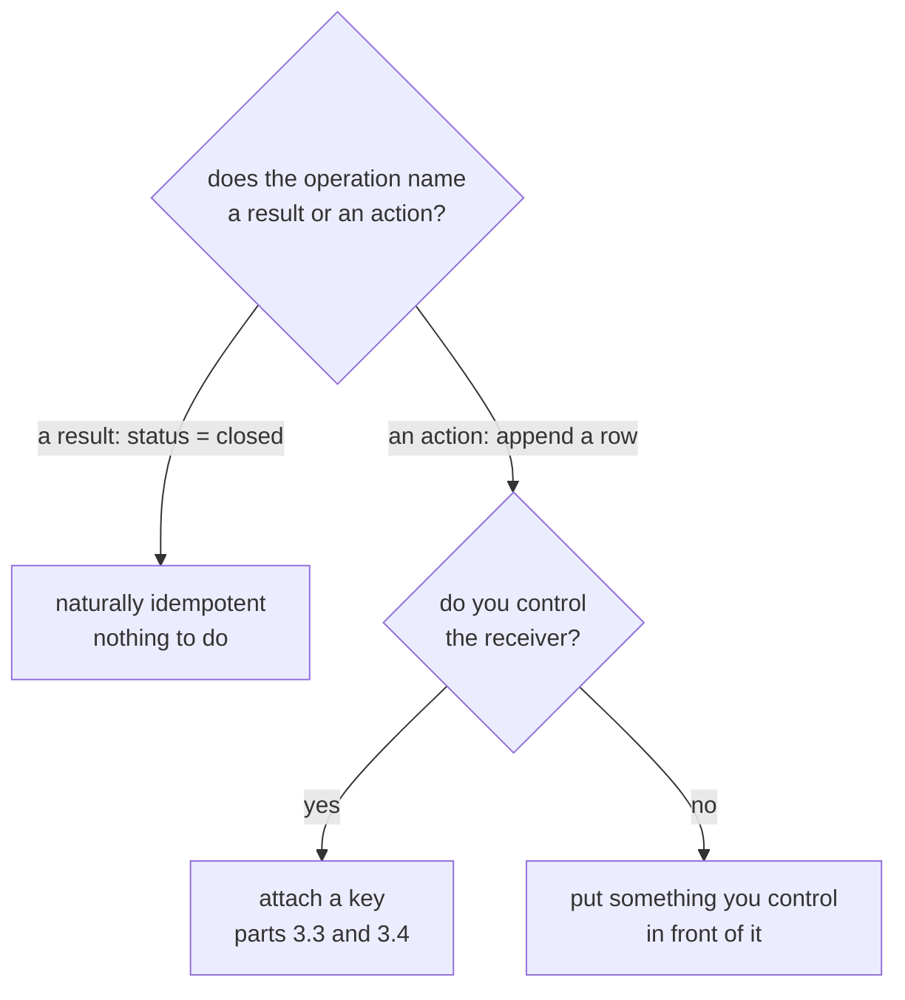

# 3.2 — Naturally idempotent, or made so

## One-line answer

An operation that names the **result** it wants is idempotent for free, an operation that names
an **action** is not, and the measurement is three calls: `closed / closed / closed` against
`1 / 2 / 3`.

## The story

There are two ways to ask somebody to change the ceiling fan.

The first is *"set it to speed two"*. Say it once and the fan is on two. Say it three times and
the fan is on two. Say it while somebody else is also saying it and the fan is on two. You can
shout it down a corridor, unsure whether you were heard, and shout it again, and no harm comes
of it.

The second is *"turn it up one"*. Say it once and the fan goes from one to two. Say it three
times and it is on four, or on maximum, or wrapped around to off, depending on the fan. Now the
number of times you were heard matters, and so does whether anybody else was giving
instructions at the same time.

Both sentences are ordinary and both are useful. But only one of them can be repeated by
somebody who is not sure whether the first attempt landed — and *not being sure whether the
first attempt landed* is the permanent condition of everything in
[3.1](3.1-the-uncertainty-gap.md).

The difference is not about fans. It is that the first sentence describes **where you want to
end up** and the second describes **a change you want applied**.

## The idea in plain language

An operation is **idempotent** when performing it more than once has the same effect as
performing it once. The word is exact and it is worth using precisely: it is a statement about
the *effect on the world*, not about the return value. Two calls may return different things —
one saying "done", the other saying "already done" — and the operation is still idempotent as
long as the world ends up the same.

Operations divide into three groups, and the middle one is where the day's work is:

**Naturally idempotent.** The operation names a final state. `status = closed`. `PUT` a
document at a URL. `set the fan to two`. Repetition is harmless because the second call asks
for the same destination the world is already at. Nothing extra is needed and nothing extra
should be added.

**Not idempotent, and can be made so.** The operation names an action with a cumulative effect:
append a row, increment a counter, add to a list. Repetition compounds. These are made
idempotent by attaching a **name to the intention** — an idempotency key — and having the
receiver remember which names it has already honoured. That is [3.3](3.3-the-key-names-the-intention.md)
and [3.4](3.4-the-ledger-and-the-atomic-window.md).

**Not idempotent, and cannot be made so by you.** The effect is somewhere you do not control
and the receiver offers no key: an email provider that accepts every send, an SMS gateway, a
webhook to a partner. [1.3](../01-what-a-run-is/1.3-what-is-safe-to-resume.md) measured this
one — two identical messages in the customer's inbox, and a compensating apology that made it
three. The only real move here is architectural: put something you *do* control in front of it,
so the un-keyed call happens behind a keyed one.

The useful instinct to take away is a design one rather than a repair one:

> When you are writing the operation yourself, **prefer the sentence that names the result.**
> A tool called `set_status(ticket, "closed")` is idempotent by construction and needs no
> machinery. A tool called `close_ticket(ticket)` that appends a closure row needs all of
> section 3.

Most non-idempotent operations are non-idempotent because of a design choice nobody noticed
they were making.

## Why Sutra needs it

`close_ticket` is in the middle group, and it is worth being precise about why, because it
looks like it should be in the first.

"Closing a ticket" sounds like setting a status, which would be naturally idempotent. But the
implementation in `_effects.py` appends a row to a `closures` table — and it does that because
a real support desk wants a closure *record*: who closed it, when, with what note, so the
history can be read later. That is a perfectly good reason, and it is exactly what turns a
state-setting operation into an appending one.

So the shape of Sutra's problem is: **the audit requirement is what removed the natural
idempotency.** You cannot get it back by simplifying the tool, because the audit trail is not
optional — Day 63 will require it, and Day 64 will require the approval to be in it. The
answer has to be a key.

The `IDEMPOTENT_TOOLS` set from Day 44's
[1.4](../../../day-44-client-hardening/parts/01-what-may-be-repeated/1.4-the-key-that-makes-a-write-repeatable.md)
is the register of which group each tool is in. Today's job is to move `close_ticket` from the
second group into the safe set, honestly.

## The mechanism

`natural.py` runs three operations three times each and shows what the world holds afterwards.

```bash
cd days/day-60-durable-execution/lab
uv run python natural.py
```

**Line by line:**

- Column one is an **assignment**: it sets a status field to `closed`. It is called three
  times against the same record.
- Column two is an **append**: it adds a closure row, the way `_effects.py` really does. Also
  three calls.
- Column three is the same append with a **key** attached, which is the repair the rest of the
  section builds. It is shown here only so the three sit side by side; how it works is
  [3.3](3.3-the-key-names-the-intention.md).
- Each cell is what the world holds *after* that call, not what the call returned. The
  distinction is the whole definition.

Measured on 2026-09-05:

```text
call   assignment (natural)   append (not)   keyed append (made)
1      closed                 1              1
2      closed                 2              1
3      closed                 3              1

The first column is idempotent because the operation names the *result* it wants.
The second names an *action*, so every call is a new one. The third is the second
with a name attached to the intention, which is all an idempotency key is.
```

Three columns, three behaviours, one table. The first column does not change after the first
call — that is idempotence, visible. The second counts up, which is what "cumulative" means
when you look at it rather than reason about it. The third is flat like the first, and it is
flat *because* of the key rather than because of the operation's shape.

Here is the operation from column one, which is the version worth writing when you have the
choice:

```python
conn.execute("UPDATE tickets SET status = ? WHERE id = ?", ("closed", ticket_id))
```

**Line by line:**

- `SET status = ?` names the destination. Running it against a ticket that is already closed
  sets it to closed again, which is a no-op in effect.
- There is no read before the write and no check that it is not already closed — deliberately.
  A check would reintroduce the time-of-check-to-time-of-use window that
  [3.1](3.1-the-uncertainty-gap.md) warned about, and it buys nothing: the statement is already
  safe to run twice.
- `WHERE id = ?` scopes it to one row. An `UPDATE` with no `WHERE` is idempotent too, and is a
  different kind of disaster.

And column two, which is what `_effects.py` actually does:

```python
cursor = conn.execute("INSERT INTO closures (ticket_id, note) VALUES (?, ?)", (ticket_id, note))
```

**Line by line:**

- `INSERT` is the shape of the problem. Every execution creates a row, because that is what
  insert means. There is nothing wrong with the statement; it is doing exactly what was asked.
- `cursor.lastrowid` — used as `closure_seq` in the returned dictionary — is the only evidence
  the caller gets that this was the second insert rather than the first, and
  [1.3](../01-what-a-run-is/1.3-what-is-safe-to-resume.md) showed that no caller looks at it.
- The repair is not to change `INSERT` to `UPDATE`. The closure record is wanted. The repair is
  to give the insert a name so the second one can be recognised.



## When it breaks

The break is an operation that is naturally idempotent and stops being so because of a field
nobody thought about: a timestamp.

```python
conn.execute(
    "UPDATE tickets SET status = ?, closed_at = ? WHERE id = ?",
    ("closed", time.time(), ticket_id),
)
```

**Line by line:**

- `status = ?` is still idempotent. That part is fine.
- `closed_at = time.time()` is not, and it is not for the reason
  [2.3](../02-the-log-is-the-run/2.3-three-things-that-break-replay.md) gave: the clock returns
  a different value every call. The second execution overwrites the real closure time with the
  time of the resume.
- The statement as a whole is now **not idempotent**, because "the same effect" is no longer
  true of the row. And nothing about it looks dangerous — it is one extra column on an update
  that was safe a moment ago.

The symptom is not an exception. It is a number on a dashboard that cannot exist. `--stamp`
runs the real close at 09:12:44 and then a resume at 14:31:07 executing the same `UPDATE`:

```bash
uv run python natural.py --stamp
```

**Line by line:**

- The two timestamps come from a fixed list rather than the real clock, so the demonstration is
  reproducible — the point being made is about *which* value ends up stored, not about what
  time it is now.
- The metric printed is the one a support dashboard actually shows: how long after closing the
  ticket did the customer hear from us. The reply went out at the moment of the real close, so
  this quantity cannot be negative.

```text
closed_at written with COALESCE: False

  original close   closed_at = 2026-09-05T09:12:44
  resume re-runs   closed_at = 2026-09-05T14:31:07
  reply went to the customer at 2026-09-05T09:12:44
  close -> customer told: -5.31 h

  A negative number is not possible, and it is what the dashboard shows.
```

**Minus five hours and nineteen minutes.** Nothing raised, no row was duplicated, and the
`status` column is exactly as correct as it was before. One extra column on a safe statement
produced an impossible number in a report, and somebody will spend an afternoon chasing it
through three systems.

The fix is to stop overwriting a value that is already there:

```bash
uv run python natural.py --stamp --coalesce
```

**Line by line:**

- `COALESCE(closed_at, ?)` keeps whatever is already stored and only uses the new value when
  the column is `NULL`, which makes the whole statement idempotent again.
- The alternative fix is to pass the *recorded* timestamp from the run's log rather than
  reading the clock — [2.3](../02-the-log-is-the-run/2.3-three-things-that-break-replay.md)'s
  rule applied here. Either works; what does not work is reading the clock inside a statement
  that may run twice.

```text
closed_at written with COALESCE: True

  original close   closed_at = 2026-09-05T09:12:44
  resume re-runs   closed_at = 2026-09-05T09:12:44
  reply went to the customer at 2026-09-05T09:12:44
  close -> customer told: +0.00 h

  Non-negative, because closed_at still holds the moment it really happened.
```

## In production

**What a professional writes instead.** Idempotency is decided at the API design stage, not
patched in at the retry stage. A tool that changes something takes the desired end state as an
argument wherever that is possible, and the reviewer's question on any new write tool is
*"what happens if this is called twice?"* — asked before the tool is written rather than after
the first duplicate. Sutra has a place to record the answer: the `IDEMPOTENT_TOOLS` set is a
list of tools somebody has answered that question for.

**What degrades at scale.** The middle group grows. Systems accumulate write operations, and
each one needs a key and a place to remember keys, so what starts as one special case becomes a
cross-cutting concern. The scaling answer is to make the key a required parameter of every
write tool — enforced by the schema, so a tool without one cannot be registered — rather than
a convention that most tools follow.

**The failure mode that only appears with real traffic.** The naturally idempotent operation
that is idempotent per-record and not per-system. `SET status = closed` is safe to repeat for
one ticket. Run it twice and each run fires a database trigger that sends a webhook, and the
partner receives two notifications — so the *operation* was idempotent and the *system* was
not. Idempotency does not compose automatically; it has to hold at the boundary you actually
retry across.

**The review comment a senior engineer leaves:** *"This tool is called `close_ticket` and
appends to a closures table. Two names for two different operations would be clearer, but the
real issue is that the append is what the audit needs, so this is going to need a key. Add
`request_id` to the signature now, while it has one caller, rather than in six months when it
has nine."*

**The interview question:** *"What does idempotent mean, and is your write endpoint
idempotent?"* An honest answer: *"It means doing it more than once leaves the world the same as
doing it once — a property of the effect, not of the return value. Ours was not, and the reason
is instructive: closing a ticket sounds like setting a status, which would be free, but we
append a closure row because the audit trail needs who and when. So the audit requirement is
what removed the natural idempotency, and we could not simplify our way back. I put the three
side by side and ran each three times: the assignment stayed at `closed`, the append counted 1,
2, 3, and the keyed append stayed at 1. The one that bit us later was a timestamp — a perfectly
idempotent `UPDATE` stopped being idempotent the day somebody added `closed_at = now()`, and
the symptom was a negative first-response time on a dashboard."*

## Check yourself

```bash
cd days/day-60-durable-execution/lab
uv run python natural.py
```

Now add a fourth column to `natural.py`: an operation that appends a row **only if no row for
that ticket exists yet**. Run it three times and write down the count — then say what happens if
two resumes run that operation at the same moment, and which of the three groups it really
belongs to.

**Out loud, without scrolling up:** give the two ways of asking for the fan, say which one you
can safely repeat, and say what the general rule is that makes it safe.

**Next:** [3.3 — The key names the intention](3.3-the-key-names-the-intention.md).
