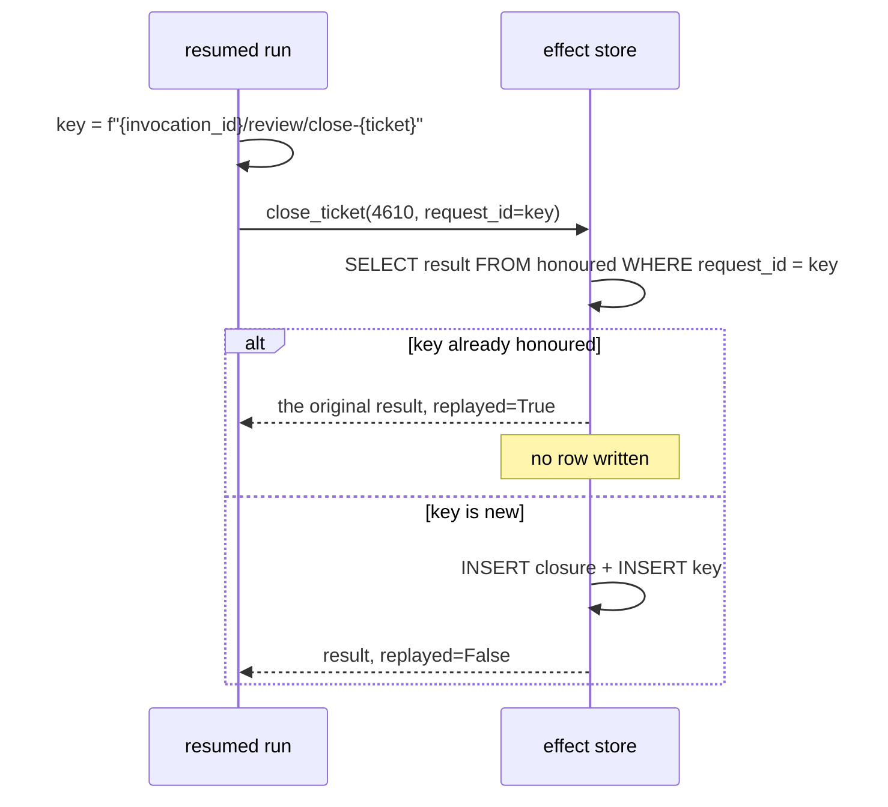

# 3.3 — The key names the intention

## One-line answer

An idempotency key must be **derived from the intention** rather than minted per attempt, and
the difference is the entire mechanism: three attempts with a fresh key each leave **three
closure rows**, three attempts with a key derived from the run leave **one**.

## The story

You take the scooter to the garage because it is making a noise. The man at the counter opens a
job card, writes a number at the top — 4610 — and writes your name, the vehicle number and the
complaint under it.

Over the next two days you ring three times. Each time you say *"job 4610"*, and each time the
same job is looked up, and each time you are told the same thing: waiting for a part.

Now imagine the same garage without the number. You ring and say *"the scooter making a
noise"*. The man cannot find a matching job, so he opens a new one and sends somebody to look
at the scooter. You ring again the next day and say the same words, and he opens a third job.
Three jobs, three mechanics assigned, three entries in the register, one scooter.

He is not being stupid. He has no way to tell that your second call is *the same request as the
first one* rather than a new request that happens to sound similar. The number is what carries
that information, and it has to be given to you the first time and used by you every time
afterwards.

That is the whole idea, and notice where the number comes from: **the garage mints it once, at
the start, and it is attached to the job rather than to the phone call.** A number that changed
on every phone call would be no better than no number at all.

## The idea in plain language

An **idempotency key** is a name for an *intention*, sent along with a request, that lets the
receiver recognise a repeat of that intention and decline to act on it a second time.

The single property that makes it work, and the single thing people get wrong:

> **The key is stable across attempts, because it names the thing you are trying to do — not
> the attempt you are making.**

A key minted at the moment of the call is a name for the call. Two calls get two names, the
receiver sees two different intentions, and the key achieves precisely nothing while looking
like a solution.

So a good key is **derived**, from things that are the same on every attempt:

- the **run** it belongs to — its invocation id, which by definition survives a resume, since
  a resume is defined as continuing that invocation;
- the **step** within the run — because one run may write more than once, and two writes in one
  run are two intentions;
- the **subject** — which ticket, which customer, which row.

Put together, that is a key like:

```text
inv-2026-09-05-h/review/close-4610
```

Read it out loud and it is a sentence: *in run `inv-2026-09-05-h`, at step `review`, close
ticket `4610`.* Anything that is trying to do that exact thing is the same intention, whatever
attempt number it happens to be, and anything trying to do something else gets a different key.

Two consequences follow, and both matter:

**Deriving beats storing.** You could mint a key on the first attempt and write it to the log
so the resume can read it back. That works, and it adds a failure mode: if the crash lands
before the key is written, the resume has no key and must mint a new one, which puts you back
where you started. A key computed from values the resume already has cannot go missing.

**A key is per-step, not per-run.** If `review` closes the ticket and also posts a note, those
are two intentions and they need two keys. A single per-run key would let the first successful
write suppress the second, different write — which is a duplicate-suppression bug rather than a
duplicate bug, and it is much harder to find.

## Why Sutra needs it

Day 44's client hardening built the rule and drew the line: a write is not retried unless it
is known repeatable, and `close_ticket` was left outside the safe set precisely because it
carried no key
([1.4](../../../day-44-client-hardening/parts/01-what-may-be-repeated/1.4-the-key-that-makes-a-write-repeatable.md)).

Today supplies the missing half, and it supplies it from a place Day 44 did not have: **the
run's invocation id**. That is what makes the derivation possible at all. A client retrying a
timed-out request can mint a key and hold it in memory for the duration of the retry loop. A
*resume*, in a new process, has no memory — so its key must be computable from the run's own
identity, which is exactly what an invocation id is for.

`review` is the one stage that needs this, and Day 64 will need the same key shape again when
an approval is attached to a specific pending write.

## The mechanism

`keys.py` makes three attempts at the same close, with two key strategies.

```bash
cd days/day-60-durable-execution/lab
uv run python keys.py
```

**Line by line:**

- The default arm mints a fresh key per attempt — `mint-00000001`, `mint-00000002` — which is
  what a naive `uuid4()` at the call site gives you.
- `replayed` is what the effect store reports: `True` means it recognised the key and did
  nothing new. It comes from the `honoured` table in `_effects.py`.
- The closure row count at the end is the only number that matters, because rows are the
  effect and everything else is commentary.

Measured on 2026-09-05:

```text
key style: minted per attempt
  attempt 1  key=mint-00000001                          replayed=False
  attempt 2  key=mint-00000002                          replayed=False
  attempt 3  key=mint-00000003                          replayed=False

closure rows for ticket 4610: 3
A retry is only a retry if it carries the same name as the thing it is retrying.
```

Three keys, three `replayed=False`, three rows. The idempotency machinery ran perfectly on
every attempt: it looked the key up, found nothing, and correctly concluded that this was a new
intention. It was lied to by the caller.

Now derive the key instead:

```bash
uv run python keys.py --derived
```

**Line by line:**

- `--derived` builds the key as `f"{invocation_id}/review/close-{ticket_id}"`. Every component
  is a value the resuming process already has: the run's id, the step's name, the subject.
- Nothing about the store changes. The same `honoured` table, the same lookup, the same
  `close_ticket`. One string is computed differently.

```text
key style: derived from the run
  attempt 1  key=inv-2026-09-05-h/review/close-4610     replayed=False
  attempt 2  key=inv-2026-09-05-h/review/close-4610     replayed=True
  attempt 3  key=inv-2026-09-05-h/review/close-4610     replayed=True

closure rows for ticket 4610: 1
A retry is only a retry if it carries the same name as the thing it is retrying.
```

**Three rows becomes one**, and attempts two and three come back `replayed=True` — which is
also the answer the caller gets, so a resume can tell the difference between "I closed it" and
"it was already closed by an earlier attempt of me". That distinction is worth having in the
log.

Here is the receiver's side, from `_effects.py`:

```python
if request_id is not None:
    row = conn.execute("SELECT result FROM honoured WHERE request_id = ?", (request_id,)).fetchone()
    if row is not None:
        replayed = json.loads(row[0])
        replayed["replayed"] = True
        return replayed
```

**Line by line:**

- The lookup happens **before** any write. That ordering is the whole guard: a key that has
  been honoured means the effect is already in the world, so nothing further should happen.
- `SELECT result` returns the *original* answer, stored as JSON when the effect first
  succeeded. Returning the original answer rather than a bare "already done" is what makes the
  caller's two code paths identical — a retry gets the same `closure_seq` the first attempt
  got, so anything downstream that recorded it still agrees.
- `replayed["replayed"] = True` marks it. The world is unchanged either way; the flag exists so
  the caller can *log* that this was a repeat, which is how you find out how often your
  uncertainty gap is being hit.
- `if request_id is not None` — the whole guard is skipped for callers that pass no key, which
  is the behaviour [1.3](../01-what-a-run-is/1.3-what-is-safe-to-resume.md) measured at two
  rows. That default is a deliberate teaching choice here and a bad idea in production; the
  production version makes the parameter required, which is in *In production* below.



## When it breaks

The break is a derived key that includes something which is *not* stable across attempts, and
the classic offender is the clock — the same one that broke replay in
[2.3](../02-the-log-is-the-run/2.3-three-things-that-break-replay.md) and idempotency in
[3.2](3.2-naturally-idempotent-or-made-so.md).

```python
key = f"{invocation_id}/review/close-{ticket_id}/{int(time.time())}"
```

**Line by line:**

- Three of the four components are stable. The fourth is a second-resolution timestamp, added
  by somebody who wanted keys to be unique — which they already were.
- A resume that happens in the same second as the original produces the same key and works. A
  resume one second later does not. The bug is therefore **timing-dependent**: it passes tests,
  it passes staging, and it fails exactly when a crash is followed by a slow restart, which is
  the only situation it exists for.

The second offender is a key derived from the *content* of the payload:

```python
key = hashlib.sha256(reply_text.encode()).hexdigest()
```

**Line by line:**

- This looks principled — same content, same key — and it inverts the requirement. Two
  genuinely different intentions that happen to produce identical text now collide and the
  second is silently suppressed. On a support desk, two tickets closed with the same canned
  reply is not a rare event; it is Tuesday.
- It also breaks the other way: if the resumed run re-derives the reply and the model words it
  differently ([2.4](../02-the-log-is-the-run/2.4-recording-the-model-so-a-replay-is-a-replay.md)),
  the key changes and the duplicate goes through.

The failure you can actually reach is the one where two workers resume the same run at the same
instant. Both derive the same key, both look it up before either has written, and both find
nothing — the check-then-act window from [3.1](3.1-the-uncertainty-gap.md), reappearing inside
the fix:

```bash
uv run python atomic.py --race
```

**Line by line:**

- Both workers do the lookup first, and both correctly get "no such key" — the lookup is not
  wrong, it is just answering a question whose answer is about to change.
- Worker A writes the closure and claims the key. Worker B, already past its lookup, writes its
  closure and then tries to claim the same key.
- Nothing in the application code notices. The thing that stops worker B is the schema.

```text
  worker A: lookup found an honoured key? False
  worker B: lookup found an honoured key? False
  worker A: wrote the closure and claimed the key
  worker B: wrote the closure, now claims the key...
Traceback (most recent call last):
  File ".../lab/atomic.py", line 107, in <module>
    main()
  File ".../lab/atomic.py", line 77, in main
    race()
  File ".../lab/atomic.py", line 72, in race
    conn.execute("INSERT INTO honoured VALUES (?)", (KEY,))
sqlite3.IntegrityError: UNIQUE constraint failed: honoured.request_id
```

`UNIQUE constraint failed: honoured.request_id` is the mechanism working, not failing. It is
the database saying *somebody else already claimed this intention*, which is information the
application could not obtain any other way. The correct handler catches `IntegrityError`,
re-reads the `honoured` row, and returns the winner's result — so worker B behaves exactly like
a replay.

What the error also tells you is that **the lookup was never the guard**. A key column without
a unique constraint is a key that works only in the cases where you did not need it.

## In production

**What a professional writes instead.** The key is a required parameter with no default. Not
`request_id: str | None = None` — that signature makes the unsafe call the easy one, and
[1.3](../01-what-a-run-is/1.3-what-is-safe-to-resume.md)'s two closure rows are what an
optional key buys you. The key is also generated in one place, by one function, so that the
derivation rule exists once: something like `idempotency_key(invocation_id, step, subject)`,
which is precisely the function today's build brief asks for and `gate.py` checks is stable.

**What degrades at scale.** The `honoured` table grows by one row per write for ever, and it is
on the hot path of every write, so it needs an index and it needs a retention rule. The
retention rule is the interesting part: you can delete a key once no resume could still
reference it, which means the key's lifetime is tied to the maximum age of a resumable run.
Delete too early and an old resume duplicates; delete never and the table outgrows the data it
protects.

**The failure mode that only appears with real traffic.** Two workers resuming the same run at
the same moment. Both derive the same key, both look it up, both find nothing, and both proceed
— the check-then-act window from [3.1](3.1-the-uncertainty-gap.md), now inside the fix. What
saves you is not the lookup but the **unique constraint**: the second insert fails, and the
handler catches it and reads the winner's result. A key column without a unique constraint is a
key that works only when it is not needed.

**The review comment a senior engineer leaves:** *"`request_id` defaults to `None`, so every
caller that forgets it silently gets the unsafe behaviour, and the one that matters is the
resume path. Make it required. And derive it in the shared helper rather than at the call site,
or in a month there will be four derivations and one of them will include a timestamp."*

**The interview question:** *"How do you build an idempotency key?"* An honest answer: *"From
the things that are identical on every attempt — the run's invocation id, the step name and the
subject — so it names the intention rather than the attempt. That is not a detail: I ran the
same close three times with a fresh key each and got three closure rows, and with the derived
key I got one, with the second and third attempts coming back marked as replays. The reason it
has to be derived rather than minted-and-stored is that a resume runs in a new process with no
memory, so anything it cannot recompute it might not have. The mistakes I have seen are putting
a timestamp in the key, which makes it fail only when the restart is slow, and hashing the
payload, which collides two different tickets closed with the same canned reply. And the lookup
alone is not enough under concurrency — the unique constraint on the key column is what
actually holds."*

## Check yourself

```bash
cd days/day-60-durable-execution/lab
uv run python keys.py
uv run python keys.py --derived
```

Now change the derived key in `keys.py` so it drops the step name and is just
`{invocation_id}/close-{ticket_id}`. Add a second write to the same run — a note, say — under
that key, and write down which of the two writes disappears and why.

**Out loud, without scrolling up:** explain the garage job number, and say what goes wrong if
the garage gives you a new number on every phone call.

**Next:** [3.4 — The ledger and the atomic window](3.4-the-ledger-and-the-atomic-window.md).
