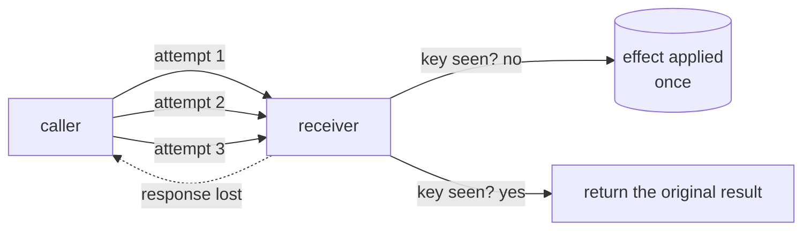

# 3.5 — Exactly-once is about effects

## One-line answer

Nothing can force a request to be **delivered** once — three attempts deliver three times, with
and without deduplication — but the **effect** can be forced to one, and "exactly-once" is only
ever a claim about the second line.

## The story

The courier has one parcel for your flat and you are not in.

He knocks. No answer. He comes back after lunch and knocks again. Still nobody. He comes back
the next morning, and this time your neighbour opens the door and takes it in.

Three visits. One parcel.

Nobody would describe that as a failure, and nobody would say the parcel was delivered three
times. The company's van went to your building three times, its fuel was spent three times, its
driver knocked three times — and exactly one parcel ended up in the flat, because a parcel that
has been handed over is not handed over again.

Now imagine somebody insisting that the courier must visit exactly once. You cannot promise
that. You do not know whether anybody will be in. The only way to guarantee a single visit is
to guarantee a single *attempt*, which means guaranteeing delivery fails whenever the first
attempt does — which is worse.

So the company sells you the thing it can actually deliver: **the parcel arrives once, however
many times we come.**

## The idea in plain language

Three phrases get used interchangeably and they are not the same claim:

- **at-most-once** — the operation is attempted once and never retried. If the attempt is lost,
  nothing happens. No duplicates, and no guarantee it happened at all.
- **at-least-once** — the operation is retried until it is known to have succeeded. It
  definitely happened, and it may have happened more than once.
- **exactly-once** — it happened, once.

The thing to be clear about is that the third one is not a *delivery* guarantee. You cannot
build a system in which a message crosses a network exactly once, because the sender can never
learn the difference between "the request was lost" and "the response was lost", which is
[3.1](3.1-the-uncertainty-gap.md)'s gap stated in networking terms. Any scheme that tries ends
up needing one more acknowledgement than it has.

What *is* achievable, and what everybody means when they say exactly-once in a system that
works, is:

> **at-least-once delivery + an idempotent receiver = exactly-once effect.**

The courier visits as many times as it takes. The parcel is handed over once. The delivery is
at-least-once and the effect is exactly-once, and the second property is bought by the first
plus a rule at the door.

This reframing is the most useful thing in section 3, because it tells you where to spend
effort. Not on making the network reliable, and not on making the resume clever enough to know
whether the previous attempt landed. On **the receiver**, where the effect is applied, and
where a key can be checked.

## Why Sutra needs it

Sutra's resume policy is at-least-once, deliberately, and it is worth being able to defend the
choice rather than merely having made it.
[3.1](3.1-the-uncertainty-gap.md) showed both orderings failing: effect-first closes twice,
record-first never closes. Sutra takes effect-first, so its resumes are at-least-once — and then
the key from [3.3](3.3-the-key-names-the-intention.md), written atomically as
[3.4](3.4-the-ledger-and-the-atomic-window.md) requires, converts that into an exactly-once
effect.

That sentence is what the day is for, and it is the sentence to give in a design review.

It also explains ADK's own position, which section 4 is about. The framework's docstring says
it guarantees at-least-once behaviour once resumed and that tools to be resumed must therefore
be idempotent. That is not the framework being unambitious. It is the framework being correct:
at-least-once is the strongest delivery guarantee anything can offer, and the rest is the
receiver's job — which the framework does not own.

## The mechanism

`atleastonce.py` sends the same request three times, losing the response each time, and counts
two different things: requests delivered, and effects applied.

```bash
cd days/day-60-durable-execution/lab
uv run python atleastonce.py
```

**Line by line:**

- The failure simulated is the nastiest one: the request **arrives and is processed**, and the
  response is lost on the way back. The caller cannot distinguish this from the request never
  arriving, which is exactly why it retries.
- `requests delivered` counts what reached the receiver. `effects applied` counts closure rows.
  Separating those two counters is the whole experiment.
- The default arm has no deduplication at the receiver.

Measured on 2026-09-05:

```text
  attempt 1: request delivered, response lost in transit
  attempt 2: request delivered, response lost in transit
  attempt 3: request delivered, caller sees {'status': 'closed', 'ticket_id': '4610', 'closure_seq': 3}

  dedupe on the server : False
  requests delivered   : 3   <- cannot be forced to 1
  effects applied      : 3   <- can be forced to 1
```

Note `'closure_seq': 3` in what the caller finally sees. The caller believes it made one
successful close and it is holding the sequence number of the third one. Every downstream
record that stores that number now points at a row created by an attempt nobody knew about.

Now turn on the receiver-side key:

```bash
uv run python atleastonce.py --dedupe
```

**Line by line:**

- `--dedupe` makes the receiver check the ledger before acting, exactly as
  [3.3](3.3-the-key-names-the-intention.md) and [3.4](3.4-the-ledger-and-the-atomic-window.md)
  built it.
- The network is unchanged. The retries are unchanged. Three requests still arrive, because
  nothing on the caller's side can know not to send them.

```text
  attempt 1: request delivered, response lost in transit
  attempt 2: request delivered, response lost in transit
  attempt 3: request delivered, caller sees {'status': 'closed', 'ticket_id': '4610', 'closure_seq': 1, 'replayed': True}

  dedupe on the server : True
  requests delivered   : 3   <- cannot be forced to 1
  effects applied      : 1   <- can be forced to 1

'Exactly once' is a claim about the second line, never about the first.
```

Two numbers, and only one of them moved. **Requests delivered is still three** — nothing on the
caller's side could know not to send them, and nothing on the receiver's side could refuse to
receive them. **Effects applied went from three to one.**

The caller's view changed too, and in the way that matters downstream: `'closure_seq': 1,
'replayed': True`. It now receives the *first* attempt's sequence number rather than the third
one's, so anything it stores agrees with what is actually in the closures table. Compare that
with the un-deduplicated arm, where the caller was handed `'closure_seq': 3` and had no way to
know that two other rows existed.

That is exactly-once, and it was produced by a receiver that said no — not by a network that
behaved.



## When it breaks

The break is a system that claims exactly-once and means at-most-once, and it is the more
dangerous mistake because the failure is silent.

It happens when somebody removes the retry to avoid duplicates:

```python
try:
    close_ticket(conn, ticket_id, note, request_id=key)
except TimeoutError:
    log.warning("close timed out; not retrying to avoid a duplicate close")
```

**Line by line:**

- The comment is the bug, stated confidently. A timeout is not evidence that the write
  happened, so declining to retry is not avoiding a duplicate — it is gambling that the write
  landed.
- With the key in place, the retry was safe. This code has the fix and declines to use it.
- `log.warning` means the outcome is recorded and no failure propagates, so the run reports
  success. Day 21's rule about
  [swallowed exceptions](../../../day-21-errors-surface-not-swallow/parts/04-failure-lab/4.1-the-swallowed-exception.md)
  is exactly this in a different costume.

The result is a ticket that is sometimes not closed, at a rate equal to your timeout rate, with
no error anywhere. Compare the two failure modes honestly:

| Policy | What you get | How you find out |
| --- | --- | --- |
| at-least-once + key | the effect, once | you do not need to |
| at-least-once, no key | the effect, sometimes twice | duplicate rows, a customer complains |
| at-most-once | the effect, sometimes never | a customer complains, months later |

The middle row is bad and visible. The bottom row is the one that survives for a year.

## In production

**What a professional writes instead.** The phrase "exactly-once" does not appear in the design
document without the words that make it true. What appears is: *"delivery is at-least-once;
`close_ticket` is idempotent on `request_id`; therefore the effect is exactly-once."* Three
clauses, each checkable. A design document that says "exactly-once" alone is a document nobody
can review, because the reader cannot tell whether the author has done the work or is describing
a hope.

**What degrades at scale.** The number of duplicate deliveries grows with the failure rate,
which grows with fleet size and deploy frequency. This is fine — that is what the key is for —
but it means the ledger's write rate is driven by your *failure* rate rather than your success
rate, which is a capacity planning input people forget. A bad afternoon can multiply ledger
writes several-fold while the useful work stays flat.

**The failure mode that only appears with real traffic.** Exactly-once achieved at one boundary
and lost at the next. The write is idempotent, so one closure row is created; the closure row
fires a trigger, or a change-data-capture stream, or an outbox poller, and *that* is
at-least-once with no key, so the partner receives two notifications. Idempotency does not
compose for free. Every hop needs its own key, and the key has to be derived from something
that survives the hop.

**The review comment a senior engineer leaves:** *"The design says exactly-once. Three
components deep it is at-least-once delivery into a receiver with a unique constraint, which is
the right answer — say that instead. Someone will read 'exactly-once' and build the next
service on the assumption that they do not need a key."*

**The interview question:** *"Can you do exactly-once delivery?"* An honest answer: *"No, and
you do not need to. You cannot force a request to be delivered once, because the sender cannot
distinguish a lost request from a lost response. What you can force is the effect. I measured
it: three attempts, response lost every time, three deliveries in both arms — but with a
receiver-side key the caller got back the first attempt's sequence number marked as a replay,
and there was one closure row instead of three. So the shape is at-least-once delivery plus an
idempotent receiver equals exactly-once effect, and the effort goes into the receiver rather
than the network. The failure I would push back on hardest is the team that removes the retry
to avoid duplicates — that is at-most-once wearing exactly-once's name, and it fails silently
at your timeout rate."*

## Check yourself

```bash
cd days/day-60-durable-execution/lab
uv run python atleastonce.py
uv run python atleastonce.py --dedupe
uv run python keys.py --derived
```

Now change `atleastonce.py` so the response is lost only on the first attempt. Write down what
the caller sees on attempt 2 in each arm, and say which arm lets the caller safely store the
`closure_seq` it is given.

**Out loud, without scrolling up:** explain why the courier visiting three times is not a
failure, and state the equation that turns at-least-once into exactly-once.

**Next:** [4.1 — One field on the App](../04-the-adk-surface/4.1-one-field-on-the-app.md).
