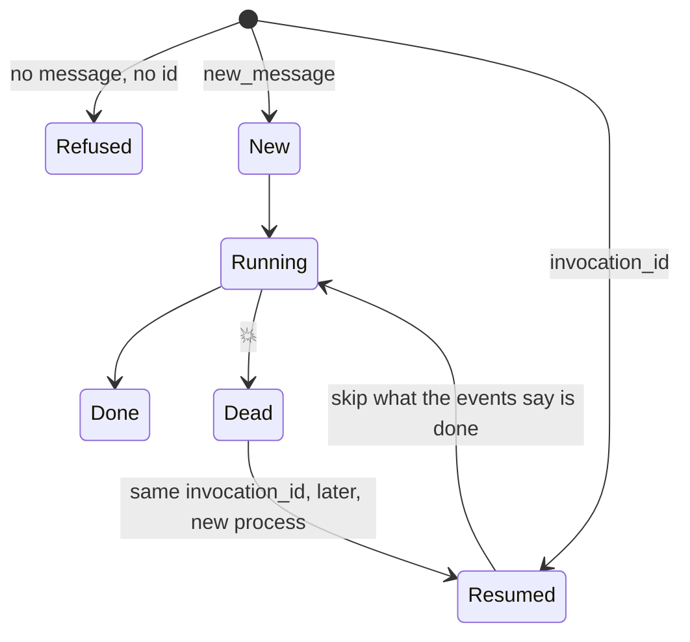

# 4.2 — The invocation id is the claim ticket

## One-line answer

A resume is an ordinary `run_async` call with the **old invocation id and no new message**, and
the runner refuses with a `ValueError` naming both requirements when you give it neither —
which is also the error you get when resumability is off, so the message is not evidence about
the switch.

## The story

At the cloakroom you hand over your coat and get a small numbered brass disc.

The disc is not the coat and it does not describe the coat. Nobody at the counter could
reconstruct your coat from it. It does exactly one job: when you come back, saying the number
gets you *that* coat rather than a coat, and it works even though the person on the counter has
changed since you arrived.

Now try collecting without it. You describe the coat — dark, wool, a bit long. There are four
like it. The man is not being difficult; he genuinely cannot tell which is yours, and the
sensible thing for him to do is refuse rather than guess. You will get your coat back, but a
supervisor will have to be involved.

The disc costs nothing and carries nothing. Everything it is worth comes from the fact that
**both sides agreed on it before the coat was handed over**, and that it stays the same while
everything else — the shift, the person, the queue — changes.

## The idea in plain language

Every run under an ADK runner has an **invocation id**: a string identifying that one run of
that one agent for that one user message. You have seen it since Day 7, on every event, and it
has been trivia until now.

Today it becomes the claim ticket. Resuming is not a special API. It is the same
`runner.run_async(...)` call you already make, with two changes:

- you pass the **`invocation_id`** of the run you want to continue;
- you pass **no new message**, because there is no new message — you are continuing an old one,
  not starting a new one.

That second half is the part that reads oddly at first and is exactly right on reflection. A
`new_message` is what *starts* an invocation. A resume has no new user input; the user said
their piece before the crash, it is in the session, and the run is picking up where it stopped.
So the runner reads the **presence of an invocation id** as the instruction to continue, and the
absence of one as the instruction to start something new.

Which gives four cases, and it is worth having them all in one place:

| `new_message` | `invocation_id` | What the runner does |
| --- | --- | --- |
| given | absent | start a new invocation |
| absent | given | resume that invocation |
| absent | absent | **refuse** — there is nothing to do |
| given | given | **resumes** it — on a resumable app the id wins and the message is not a fresh start |

The third row is a `ValueError`, and it is the honest response: the caller has asked for
something that does not name any work.

The fourth row is the one worth measuring rather than guessing, and it is not what the shape of
the arguments suggests. Passing a new message *and* an old invocation id to a resumable app does
not start a new run: the runner resolves the id and continues the existing invocation. Measured
on 2026-09-05 on the three-node graph from [4.4](4.4-the-node-that-dies-is-the-node-that-does-not-run.md),
a crashed run called again with both arguments completed with `classify` **not** re-run — the
same outcome as passing the id alone. Do not rely on a `new_message` to force a fresh start on a
resumable app; omit the id instead.

## Why Sutra needs it

The invocation id is what makes the derived idempotency key from
[3.3](../03-doing-it-twice/3.3-the-key-names-the-intention.md) possible. That key was
`{invocation_id}/{step}/{subject}`, and its stability across attempts rests entirely on the
resumed run carrying the *same* invocation id rather than a fresh one. If a resume started a new
invocation, every resumed attempt would derive a new key and the whole of section 3 would
collapse — which is why "resume by id" and "idempotency key derived from the id" are two halves
of one design rather than two features.

It is also what a supervisor needs. Something has to remember that run `e-4103838f…` exists and
is unfinished, and hand it back to a worker later. Day 61 makes that store explicit; today the
requirement is visible: **a resumable run is only resumable by somebody who kept its id.** An
id nobody wrote down is a coat with no disc.

## The mechanism

Starting a run and resuming it are the same method:

```python
# starting: a message, no id
async for event in runner.run_async(user_id="u", session_id=session.id, new_message=MESSAGE):
    invocation_id = event.invocation_id

# resuming: the id, no message
async for _ in runner.run_async(user_id="u", session_id=session.id, invocation_id=invocation_id):
    pass
```

**Line by line:**

- `invocation_id = event.invocation_id` inside the first loop is how the id is obtained: it is
  on every event the run emits, so the last one seen is as good as the first. In a real system
  this is captured on the *first* event and written somewhere durable immediately — an id you
  only learn from the last event is an id you do not have when the run dies early.
- The second call passes no `new_message` at all. Passing `new_message=None` explicitly is the
  same thing; what matters is that the runner sees an id and no message.
- `session_id` is the same in both. The invocation lives inside a session, so resuming needs
  both — the session to find the events, the invocation id to find which run within it.
- Both are `async for` loops because `run_async` yields events either way. A resume is a normal
  run that happens to skip the parts that are done, which is
  [2.2](../02-the-log-is-the-run/2.2-replay-is-not-re-execution.md)'s split expressed as an API.

*Verified against `adk.dev/runtime/resume/` on 2026-09-05, which documents the same call shape,
and run against the installed `google-adk==2.7.1`.*

Now the refusal. `adk.py --arm refuse` calls the runner with neither, twice — once with
resumability off and once with it on:

```bash
cd days/day-60-durable-execution/lab
uv run python adk.py --arm refuse
```

**Line by line:**

- The agent is a `SequentialAgent` with no sub-agents rather than an `LlmAgent`, chosen so that
  no model client is constructed and no API key is needed. The refusal happens in the runner,
  before any agent runs, so a model-free agent is enough to reach it — and it keeps the arm at
  zero requests.
- Both iterations use the same session and the same absent arguments. The only variable is
  `is_resumable`.

Measured on 2026-09-05:

```text
arm: refuse   google-adk 2.7.1   model calls: 0

  is_resumable=False ValueError: Running an agent requires either a new_message or an invocation_id to resume a previous invocation. Session: s, User: u
  is_resumable=True  ValueError: Running an agent requires either a new_message or an invocation_id to resume a previous invocation. Session: s, User: u
```

Two things to take from that, and the second is the useful one.

The message is good: it names **both** ways to satisfy the call, and it names the session and
the user, so an operator reading it in a log knows which run to go and look at. Compare that
with a bare `ValueError: invalid arguments`, which is the same information content as silence.

And the message is **identical in both rows**. This error is raised before the resumability
check, so it tells you nothing about whether the switch from
[4.1](4.1-one-field-on-the-app.md) is on. If you are debugging a resume that will not resume,
this error means *you did not pass an id*, and nothing more.



## When it breaks

The break is losing the id, and the way it usually happens is that nobody wrote it down until
the run finished.

The id is available on the first event, and the natural-looking code captures it in the loop —
which is fine right up to the moment the run dies before the loop's body runs at all:

```python
invocation_id = None
try:
    async for event in runner.run_async(user_id="u", session_id=sid, new_message=msg):
        invocation_id = event.invocation_id
except Exception:
    pass
resume(invocation_id)
```

**Line by line:**

- `invocation_id` is only assigned inside the loop, so if the failure happens before the first
  event is yielded, it is still `None`.
- `except Exception: pass` then hides the failure, and `resume(None)` is called with nothing.
- The result is that the run that failed **earliest** — the one most likely to be a genuine
  crash worth resuming — is the one you cannot resume.

Passing `None` as the id gets you back to the third row of the table:

```text
ValueError: Running an agent requires either a new_message or an invocation_id to resume a previous invocation. Session: s, User: u
```

which is a confusing error to receive from code that clearly did pass an `invocation_id`
argument — it just passed `None` as its value.

The fix is not to try harder in the `except`. It is to **choose the id yourself**. `run_async`
accepts an `invocation_id` alongside a `new_message` (row four of the table), so a supervisor can
mint the id, write it to its own store *before* starting the run, and hand it in. Then the id
exists before the run does, and there is no window in which a run is unfindable.

## In production

**What a professional writes instead.** The invocation id is not discovered, it is assigned. A
row is written in a `runs` table — id, status, created — and *then* the runner is called with
that id. This inverts the ownership: the supervisor owns the identity of the work and the
runner executes it, rather than the runner minting an identity the supervisor has to catch. It
also makes the "which runs are unfinished?" query trivial, which is the query the recovery
process actually needs and which no amount of event log gives you directly.

**What degrades at scale.** Finding resumable runs. With one run you keep the id in a variable;
with a hundred thousand you need an index on `status` and a way to bound the scan, and you need
to have thought about what "unfinished" means for a run whose worker died without saying so.
That is a lease, and it is the same shape as Day 47's
[4.1 — refused, not overwritten](../../../day-47-persistent-sessions/parts/04-two-workers/4.1-refused-not-overwritten.md):
claim the run atomically before working on it, or two workers will resume it together.

**The failure mode that only appears with real traffic.** Resuming into the wrong session. The
id pair is `(session_id, invocation_id)` and only the second half is unique-looking, so a
supervisor that stores the invocation id and reconstructs the session id — from a user id and a
convention, say — will eventually reconstruct it wrongly and resume a run against a session that
does not contain its events. What you get is not an error; it is a run that starts from the
beginning because the events it was looking for are not there.

**The review comment a senior engineer leaves:** *"We capture `invocation_id` from the event
stream inside the try block. A run that dies before its first event leaves us with `None` and no
way to find it again — and that is precisely the run we most want to retry. Mint the id, persist
it, then start the run with it."*

**The interview question:** *"How do you resume a workflow?"* An honest answer: *"You call the
same runner method with the old invocation id and no new message — the presence of one and the
absence of the other is how the runtime knows this is a continuation rather than a new run. The
part people underestimate is that the id has to survive outside the run. We captured it from the
event stream at first, which fails exactly when the run dies before emitting anything, so we
moved to minting the id ourselves and writing a row before starting. That also gave us the
query we actually needed — which runs are unfinished — which the event log alone does not
answer. And the id is what makes idempotency keys work, because the key is derived from it, so
a resume that got a fresh id would defeat the deduplication as well."*

## Check yourself

```bash
cd days/day-60-durable-execution/lab
uv run python adk.py --arm refuse
uv run python adk.py --arm resume --carry-on-state
```

The second command prints an `invocation_id`. Run it again and compare the two ids. Then say
what would have to be true for a supervisor to be able to resume that run tomorrow, from a
different process, and which of those things the lab does not do.

**Out loud, without scrolling up:** explain the cloakroom disc — what it carries, what it does
not, and why the counter refuses without it.

**Next:** [4.3 — What ADK writes into the log](4.3-what-adk-writes-into-the-log.md).
