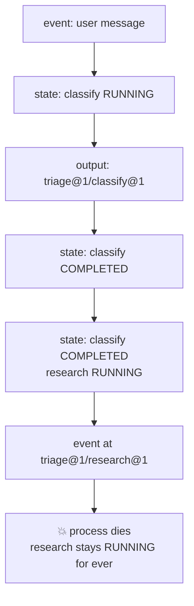

# 4.3 — What ADK writes into the log

## One-line answer

ADK's checkpoint is not a separate file — it is **extra events in the session**, carrying an
`agent_state` field with a per-node status map, and after a crash the dead run's own record
shows `classify` at status **3, completed** and `research` frozen at status **2, running**.

## The story

Somebody in the family is getting married and there is a list of two hundred names to invite.

The list is not rewritten as the work goes on. It stays exactly as it was typed, and the work
is recorded in the margin: a pencil tick when the card is posted, a small `c` when somebody
rings to confirm, a question mark against the ones nobody can find a current address for.

Anybody can pick the list up and know where things stand. Not because there is a second
document called *"invitation progress"* — there is no such document — but because the marks are
**on the list itself**, next to the thing they are about, in the order the names were typed.

And the marks include the awkward ones. A name with a question mark is more useful than a name
with nothing beside it, because "nobody could find an address" and "nobody has got to this one
yet" are different situations and only one of them needs somebody to try again.

## The idea in plain language

[2.1](../02-the-log-is-the-run/2.1-the-log-is-the-run.md) built a log where each entry said *this
stage finished, and here is what it produced*. ADK does the same thing, with two differences
worth knowing.

**The log already existed.** A session's `events` list has been append-only since Day 7. ADK
does not create a checkpoint store; it writes into the record it was already keeping. That is
why turning resumability on is one field rather than a new service — the substrate was there.

**The marks go in the margin.** Progress is not a separate kind of event. It rides on the
existing events, in `EventActions`, which is the small object attached to every event carrying
what the event *did* besides producing content. Three fields matter here:

- **`agent_state`** — a dictionary holding where the agent has got to. For a graph, that is a
  per-node status map.
- **`end_of_agent`** — a flag marking that an agent finished, so a resume knows not to re-enter
  it.
- **`rewind_before_invocation_id`** — used to unwind to an earlier point, which is a different
  feature and not today's.

The status map uses a small enum, and knowing its numbers turns an opaque dump into a readable
one. From the installed package's `NodeStatus`:

| value | name | meaning (from the enum's own docstrings) |
| --- | --- | --- |
| 0 | `INACTIVE` | not ready to be executed |
| 1 | `PENDING` | ready to be executed |
| 2 | `RUNNING` | being executed |
| 3 | `COMPLETED` | executed successfully |
| 4 | `WAITING` | waiting, for example for a user response |
| 5 | `FAILED` | failed |
| 6 | `CANCELLED` | cancelled |

The one to keep an eye on is **2, `RUNNING`** — because a node that was running when the process
died stays that way in the record. Nothing goes back and changes it to `FAILED`, for the reason
[1.2](../01-what-a-run-is/1.2-died-or-failed.md) gave: a process that dies does not write
anything on its way out.

## Why Sutra needs it

This is where the hand-rolled log and the framework meet, and the point of having built the
first is that the second is now readable. `agent_state` is `state_from`'s fold, precomputed and
carried along. `end_of_agent` is `finished`'s list, stored rather than derived — which is the one
place ADK makes the opposite choice from
[2.1](../02-the-log-is-the-run/2.1-the-log-is-the-run.md), and it is a reasonable one for a
runtime that cannot know how expensive your fold is.

Practically, Sutra needs to be able to *read* this. When Day 65's gate kills the triage graph
and something does not come back correctly, the question is "what did the run think it had
done?", and the answer is in these fields. A team that has never looked at them debugs a resume
by adding print statements; a team that has looked at them reads the session.

Day 61 goes further into the checkpoint surface. Today establishes only where it lives and what
it holds.

## The mechanism

`adk.py --arm events` runs the three-node graph, lets it die in the middle node, then re-reads
the session from the session service and prints every event with its marker fields.

*Verified against `adk.dev/graphs/dynamic/` on 2026-09-05, which states that "Dynamic workflows
track each node execution. Successful sub-nodes are automatically skipped when resuming the
workflow"; the field names and the status values below are read from the installed
`google-adk==2.7.1`.*

```bash
cd days/day-60-durable-execution/lab
uv run python adk.py --arm events
```

**Line by line:**

- The session is re-fetched with `get_session` *after* the crash rather than inspected in
  memory. That is deliberate and it is the whole methodology of this day: a recovering process
  reads the store, so the demonstration must read the store too.
- `event.node_info.path` is printed where it exists. Workflow events carry a node path;
  non-workflow events carry `None` and fall back to the author.
- `event.actions.end_of_agent` and `event.actions.agent_state` are the two marker fields, printed
  raw rather than summarised, because the shape is the thing being taught.

Measured on 2026-09-05:

```text
arm: events   google-adk 2.7.1   model calls: 0

  the run died: RuntimeError: process died in research

  author       path                   end_of_agent  agent_state
  user         -                      None          None
  triage       -                      None          {'nodes': {'classify': {'status': 2, 'interrupts': [], 'resume_inputs': {}}}}
  triage       triage@1/classify@1    None          None
  triage       -                      None          {'nodes': {'classify': {'status': 3, 'interrupts': [], 'resume_inputs': {}}}}
  triage       -                      None          {'nodes': {'classify': {'status': 3, 'interrupts': [], 'resume_inputs': {}}, 'research': {'status': 2, 'interrupts': [], 'resume_inputs': {}}}}
  triage       triage@1/research@1    None          None
```

Six events, and the story of the run is readable straight off them.

Row 1 is the user's message. No markers — nothing has happened yet.

Row 2 is a **state event**: no node path, no content, just `agent_state` saying
`classify: status 2`. `classify` is now `RUNNING`. Notice that this event exists *before*
`classify` produces anything, which means the record says "I am about to do this" before the
doing — the record-first ordering from
[3.1](../03-doing-it-twice/3.1-the-uncertainty-gap.md), chosen here because knowing what was
attempted is what a resume needs.

Row 3 is `classify`'s actual output, at path `triage@1/classify@1`, carrying no markers. The
work and the bookkeeping are separate events.

Row 4 flips `classify` to `status 3`, `COMPLETED`.

Row 5 is the one to look at hardest. It carries **both** nodes: `classify` still at 3, and
`research` newly at `status 2`. The whole map is rewritten each time, so any single state event
is a complete picture rather than a delta — which is what makes a resume able to read the
*latest* one and stop, instead of folding all of them.

Row 6 is an event at `triage@1/research@1`, and then the log stops, because the process died.

And here is the sentence that matters for the rest of the section:

> **`research` is frozen at `status: 2`.** There is no row 7 turning it into `3` and no row
> turning it into `5`. The last thing this run recorded about `research` is that it started.

That is an accurate record. `research` *did* start and *did not* finish. What
[4.4](4.4-the-node-that-dies-is-the-node-that-does-not-run.md) measures is what the resume then
does with a node in that state, and the answer is surprising.

Note also that `end_of_agent` is `None` on every row. It is the marker for an *agent* finishing,
and this graph's nodes are plain functions — so the field exists, is checked, and simply never
fires here. Seeing a field stay empty is worth as much as seeing it populated: it tells you which
mechanism you are actually exercising.



## When it breaks

The break is reading these fields as though they were a delta and folding them, the way
[2.1](../02-the-log-is-the-run/2.1-the-log-is-the-run.md)'s hand-rolled log required.

```python
state: dict = {}
for event in session.events:
    if event.actions.agent_state:
        state.update(event.actions.agent_state)
```

**Line by line:**

- `state.update(...)` merges at the *top* level, and the top level is the single key `nodes`. So
  each state event's `nodes` dictionary replaces the previous one wholesale.
- On this run that happens to give the right answer, because row 5 already contains everything.
  It gives the right answer for the wrong reason, which is the worst kind of correct.
- On a graph with parallel branches — Day 54's fan-out — two branches can emit state events
  whose `nodes` maps each describe only their own side, and the merge then loses one of them.
  The bug appears only under concurrency, which is to say only in production.

What you get is a resume that re-runs a completed branch, and the symptom is not an exception —
it is a duplicated effect, which lands you back in section 3 with a key you now genuinely need.

There is a second, blunter break: assuming `status: 2` means the node failed. It does not. It
means the node was last seen running, and that is true both of a node whose process died and of
a node that is running **right now** in another worker. Reading a live run's session and
concluding that its in-flight node is dead is how two workers end up executing the same node —
the lease problem from
[4.2](4.2-the-invocation-id-is-the-claim-ticket.md)'s production notes, arriving through a
different door.

## In production

**What a professional writes instead.** They do not parse `agent_state` in application code at
all. It is an internal representation of an experimental feature
([4.1](4.1-one-field-on-the-app.md) quoted the warning), the shape is not part of any published
contract, and code that reads it will break on an upgrade. It is for **reading with your eyes**
when a resume misbehaves, and for that it is excellent. Anything the application genuinely needs
to know — has this run finished, which stage is it on — belongs in the application's own `runs`
table, written by the application.

**What degrades at scale.** Two state events per node, each carrying the *whole* node map, means
the events grow quadratically with graph size: a fifty-node graph writes a hundred state events,
each holding fifty entries. That is a real cost in session storage and in every read of the
session, and it is the concrete reason Day 20's compaction and Day 47's session-size questions
become load-bearing once resumability is on.

**The failure mode that only appears with real traffic.** Session size crossing a storage limit
mid-run. The state events push a long session past whatever the backing store allows, the append
fails, and the failure happens *in the checkpointing path* — so a run that was fine becomes a run
that cannot record its progress, and then cannot be resumed. The mitigation is to bound run
length and to alert on session size, not to hope.

**The review comment a senior engineer leaves:** *"This code reads `event.actions.agent_state`
and switches on `status == 3`. That is an experimental internal field and the enum values are
not a public contract — the next `google-adk` bump can renumber them and our recovery path will
silently take the wrong branch. Keep our own status in our own table."*

**The interview question:** *"Where does the framework keep its checkpoint?"* An honest answer:
*"In the session's own event stream, not in a separate store — the events carry an `agent_state`
field with a per-node status map, and the whole map is rewritten on each state event rather than
being a delta. I dumped a session after a deliberate crash: `classify` sat at status 3,
completed, and `research` at status 2, running, frozen there because a process that dies does
not get to write that it failed. Two things follow. Reading it is genuinely useful for
debugging a bad resume. And parsing it in application code is a mistake — it is an experimental
internal shape, so anything we actually depend on goes in our own runs table."*

## Check yourself

```bash
cd days/day-60-durable-execution/lab
uv run python adk.py --arm events
```

Now count the events, then edit `build()` in `adk.py` to add a fourth node to the chain, and run
the arm again. Write down how many events appear and how many entries the last `agent_state`
carries, and say what that implies for a graph with fifty nodes.

**Out loud, without scrolling up:** explain why the marks go on the invitation list rather than
in a separate progress document, and say which two node statuses a resume must be able to tell
apart.

**Next:** [4.4 — The node that dies is the node that does not run](4.4-the-node-that-dies-is-the-node-that-does-not-run.md).
