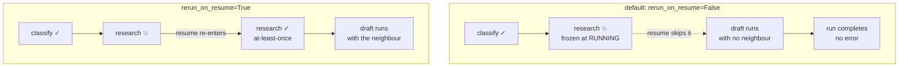

# 4.4 — The node that dies is the node that does not run

## One-line answer

By default a resumed ADK graph **skips the node that was running when the process died** and
continues with its successor — measured, `research` runs once across both attempts, `draft` runs
anyway, and the value `research` was supposed to produce is simply missing — and
`@node(rerun_on_resume=True)` is the switch that changes it.

## The story

Four runners, one baton, a relay.

The first runner comes round the bend and holds the baton out. The second reaches back for it.
There is a moment where both hands are on it, and in that moment the second runner starts to go
— and the baton drops.

Now think about what the third runner sees. She is standing in her box looking down the track,
and the second runner is coming towards her at full speed, exactly on schedule. She sets off.
She puts her hand back. She is running her leg of the race properly and there is nothing in the
baton she is carrying, because there is no baton.

The team finishes. All four legs were run. Somebody watching the last runner cross the line
would say it went well.

The leg that failed is the only one that did not get run again. Everybody downstream of it
carried on perfectly, carrying nothing.

## The idea in plain language

[4.3](4.3-what-adk-writes-into-the-log.md) showed the record a crashed run leaves: the node that
was in flight is frozen at `status: 2`, `RUNNING`. It never became `COMPLETED` and it never
became `FAILED`, because nothing was alive to write either.

The question this part answers is what a resume does with a node in that state, and the default
answer is not the one most people would guess. **It does not re-run it.** The graph advances to
the node's successor.

The reasoning behind it is not perverse, and it is worth stating fairly: a node that was
`RUNNING` may have had effects, so re-running it is the *unsafe* choice unless the author has
said it is safe. Defaulting to not re-running is defaulting to at-most-once for that one node,
which avoids duplicates — at the cost of the node's work never being done at all.

That cost is real and it is silent, because the successor node runs regardless. Whatever the
dead node was supposed to produce is simply absent, and the rest of the graph proceeds with a
gap where a value should be.

The switch is a parameter on the node decorator:

```text
@node(rerun_on_resume=True)
```

With it, the node is re-entered on resume: **at-least-once for that node**, which is exactly the
guarantee [4.1](4.1-one-field-on-the-app.md) read out of `ResumabilityConfig`'s docstring, and
exactly the guarantee that requires the idempotency work of section 3. The two halves of the day
meet here: the framework's caveat about tools needing to be idempotent is a caveat *about this
flag*.

So the choice per node is the one section 3 framed:

| `rerun_on_resume` | the dead node | its work | what you must provide |
| --- | --- | --- | --- |
| `False` (default) | skipped | may never happen | nothing — and a silent gap |
| `True` | re-entered | happens at least once | idempotency, if it has effects |

## Why Sutra needs it

The triage graph's `review` stage closes the ticket, and it is the stage most likely to be
interrupted, because it is last. Under the default, a crash inside `review` means the graph
resumes, finishes, reports success — and the ticket is never closed. That is exactly the
outcome [3.1](../03-doing-it-twice/3.1-the-uncertainty-gap.md) called the worse of the two,
arriving here through the framework's default rather than through an ordering mistake.

And `research` is the stage that makes the gap visible: it produces the archive neighbour that
`draft` writes the reply from. Skip `research`, and `draft` writes a reply with no evidence in
it, confidently, and nothing raises.

So Sutra's answer is to set `rerun_on_resume=True` on the stages that must happen, and pay for
it with the idempotency key — which is why the build brief asks for
`idempotency_key(...)` before it asks for anything else, and why `gate.py` checks that the key
is stable rather than merely present.

## The mechanism

`adk.py --arm rerun` builds the same three-node graph twice, changing exactly one thing, and
counts how many times each node's body actually executes across the crash and the resume.

*Verified against `adk.dev/graphs/dynamic/` on 2026-09-05, which documents `rerunOnResume` and
states that on resume "already-completed child activations are automatically skipped due to
checkpointing"; the behaviour below is measured against the installed `google-adk==2.7.1`.*

```bash
cd days/day-60-durable-execution/lab
uv run python adk.py --arm rerun
```

**Line by line:**

- Each arm builds a fresh graph and a fresh counter, so the two rows are independent runs rather
  than one run measured twice.
- `research` raises on its first execution and succeeds afterwards, so the crash is deterministic
  and the resume has every reason to succeed.
- `draft saw neighbour` is the column that matters. `research` writes `ctx.state["neighbour"]`
  after the point where it raises; `draft` reports whether it found that value.

Measured on 2026-09-05:

```text
arm: rerun   google-adk 2.7.1   model calls: 0

  rerun_on_resume  research runs  draft runs  draft saw neighbour
  False            1              1           False
  True             2              1           True
```

Read the top row carefully, because every number in it is a small surprise.

**`research runs: 1`.** Across a crash *and* a resume, the node that died executed exactly once
— on the attempt that killed it. The resume did not go near it.

**`draft runs: 1`.** The successor ran anyway. The graph did not stop, did not raise, did not
report anything unusual. The run completed.

**`draft saw neighbour: False`.** And that is the damage. `draft` executed with the value it
needed missing, because the node that produces it was skipped. In the triage graph this is a
reply drafted with no archive evidence — a confident answer built on nothing, which is
Principle 10's exact opposite and the reason this is the day's failure part.

The bottom row is the same graph with one parameter changed:

```python
@node(rerun_on_resume=True)
def research(ctx: Context) -> Event: ...
```

**Line by line:**

- `rerun_on_resume=True` is passed to the decorator, not to the function. It is a property of
  the node's place in the graph rather than of the call.
- The function body is unchanged. This is not a code change, it is a declaration about how the
  runtime should treat a failure of this node.
- `research runs: 2` follows immediately: once before the crash, once on the resume. That is
  at-least-once, visible as a number.
- `draft runs: 1` stays at one, which is the reassuring half — turning the flag on for one node
  did not make its successors run twice.



## When it breaks

There is a second break in the same area, and it catches you *before* you get as far as the
skipped node: the resumed successor receives `None` on its edge.

[2.1](../02-the-log-is-the-run/2.1-the-log-is-the-run.md) drew the distinction between what
travels along an edge and what sits in the session's state. On a resume that distinction becomes
load-bearing, because **the edge value is in-memory state and the session state is not** — and
`ResumabilityConfig`'s docstring said in so many words that *"any temporary / in-memory state
will be lost upon resumption"*.

`adk.py --arm resume` carries the value on the edge:

```bash
uv run python adk.py --arm resume
```

**Line by line:**

- `research` here is declared `def research(node_input: str)`, taking its input from the edge —
  the ordinary way to write a node.
- The crash and the resume are identical to the arm above. The only change is where the value
  travels.

```text
arm: resume   google-adk 2.7.1   model calls: 0

  the value travels on : the edge
  attempt 1 died       : RuntimeError: process died in research
  resume died          : ValidationError: 1 validation error for str
  node runs, both attempts combined: {'classify': 1, 'research': 1}
```

The resume dies, and here is the full error:

```text
pydantic_core._pydantic_core.ValidationError: 1 validation error for str
  Input should be a valid string [type=string_type, input_value=None, input_type=NoneType]
    For further information visit https://errors.pydantic.dev/2.13/v/string_type
```

`input_value=None` is the whole message. The successor's `node_input` was annotated `str`, the
resume had no edge value to give it — `classify`'s output was not restored — and pydantic
refused to coerce `None`. This is the *good* outcome, incidentally: a type annotation turned a
silent gap into a loud stop.

Move the same value into the session state and the resume completes:

```bash
uv run python adk.py --arm resume --carry-on-state
```

**Line by line:**

- The node now declares no `node_input` parameter at all and reads `ctx.state` instead. Declaring
  the parameter is what triggers the coercion, so removing it is part of the fix rather than
  cosmetic.
- `ctx.state` is persisted in the session, so a resume in a new process still has it.

```text
arm: resume   google-adk 2.7.1   model calls: 0

  the value travels on : ctx.state
  attempt 1 died       : RuntimeError: process died in research
  resume died          : (nothing - it completed)
  node runs, both attempts combined: {'classify': 1, 'research': 1, 'draft': 1, 'neighbour_seen': 0}
```

It completed — and `neighbour_seen: 0` is the same silent damage as before, waiting for the flag
from the top of this part. Getting past the crash is not the same as getting the work done.

**The rule the two arms together produce:** anything a resumed node needs must be in
`ctx.state`, not on the edge. The edge is a convenience within one process.

## In production

**What a professional writes instead.** Every node gets an explicit `rerun_on_resume`, set
deliberately, with the reasoning next to it — `True` for anything whose work must happen, plus
an idempotency key if it has effects; `False` only for a node that is genuinely optional or
genuinely unsafe to repeat. Leaving it unset means taking the default by accident, and the
default is the one that loses work. The same review that asks "what happens if this runs twice?"
now also asks **"what happens if this never runs?"**, and both questions have to be answered.

**What degrades at scale.** With `rerun_on_resume=True` on a node that calls a model, every
resume spends that request again. On a free tier that is the budget from Day 24 being charged
for recovery, and a run that resumes five times has paid for that node five times. The
mitigation is [2.4](../02-the-log-is-the-run/2.4-recording-the-model-so-a-replay-is-a-replay.md)'s
recorded reply: re-enter the node, find the recorded answer, spend nothing.

**The failure mode that only appears with real traffic.** The silent gap downstream. A skipped
node's missing value is often not `None` in a way anything checks — it is an empty list, a
default, an absent optional field — and the successors handle it politely. The result is a small
percentage of runs that complete with degraded output, at exactly your crash rate, and nothing
in the logs distinguishes them. The defence is to assert on the *presence* of what a stage needs
at the top of the next stage, rather than tolerating absence.

**The review comment a senior engineer leaves:** *"None of these nodes set `rerun_on_resume`, so
a crash inside any of them means that stage is skipped on resume and the graph finishes without
it. For `review` that means the ticket is never closed and the run reports success. Set it
explicitly on every node and add a key to `review`."*

**The interview question:** *"What happens to the step that was running when the process died?"*
An honest answer: *"In ADK's graph runtime, by default, nothing — it is skipped and the graph
continues with its successor. I measured it: across a crash and a resume the failing node's body
executed exactly once, its successor ran anyway, and the value the failing node was supposed to
produce was missing. The run completed with no error. The default is defensible, because a node
that was running may have had effects and re-running it is unsafe unless you say so, but it
trades a duplicate for a silent gap and the gap is the one nobody notices. The fix is
`rerun_on_resume=True` on the nodes whose work must happen, which is at-least-once and therefore
needs the idempotency key. The other thing that bit me was the edge: a resumed node's
`node_input` is not restored, so a successor annotated `str` got `None` and pydantic raised.
Anything a resume needs has to be in the session state."*

## Check yourself

```bash
cd days/day-60-durable-execution/lab
uv run python adk.py --arm rerun
uv run python adk.py --arm resume
uv run python adk.py --arm resume --carry-on-state
```

Now set `rerun_on_resume=True` on `draft` as well as `research` in `adk.py`, and run the `rerun`
arm again. Write down whether `draft runs` changes, and explain why that is the answer you should
have expected.

**Out loud, without scrolling up:** describe the dropped baton, say which runner's leg does not
get run again, and say what the third runner is carrying.

**Next:** [5.1 — Five stages, three kinds](../05-triage-made-durable/5.1-five-stages-three-kinds.md).
