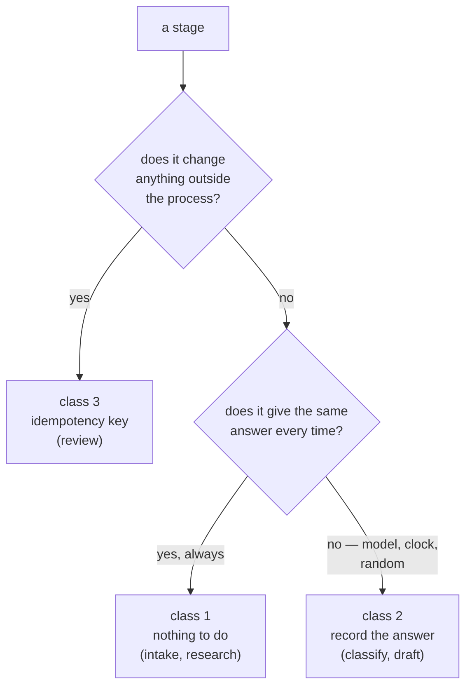

# 5.1 — Five stages, three kinds

## One-line answer

The triage graph's five stages sort into three durability classes — **freely replayable**,
**replayable only if the answer was recorded**, and **effectful** — and each class gets a
different `rerun_on_resume` setting and a different obligation.

## The story

At the barber's, four things happen to your head and only one of them is final.

He wets your hair. If he is not sure he wet it enough, he wets it again — no harm. He combs it
one way and then the other way to see how it falls; combing it a third time costs nothing but a
few seconds. He turns your head towards the light to look at the shape, and if he wants to look
again, he looks again.

Then he cuts.

Everything before the cut can be repeated as many times as he likes, and the only cost is time.
The cut cannot be repeated at all — not because it is difficult, but because there is no
operation that puts hair back. If he is unsure whether he already took a bit off the left side,
the *safe* move is not to take a bit off the left side; it is to stop and look.

And there is a fourth kind of thing in that shop, which is the interesting one. He asks you what
you want. You say something. If he forgets and asks again halfway through, you might answer
slightly differently — a bit shorter, actually — and now the two halves of the haircut were done
to two different instructions.

## The idea in plain language

Everything this day has built comes down to a sorting exercise: **put every stage of your
pipeline in one of three classes**, because the class decides what you do about it.

**Class 1 — freely replayable.** Pure, and deterministic. Same input, same output, no trace left
anywhere. Re-running it costs whatever it costs in time and nothing else. There is no obligation
here beyond noticing that it is true.

**Class 2 — replayable only if the answer was recorded.** Pure in its *effects* — it leaves
nothing behind — but not deterministic, so re-running gives a different answer. Anything that
calls a model, reads a clock, or draws a random number.
[2.4](../02-the-log-is-the-run/2.4-recording-the-model-so-a-replay-is-a-replay.md) is the whole
of the obligation: record the answer at the moment it arrives, and replay the recording.

**Class 3 — effectful.** Changes something outside the process that outlives the run. The
obligation is [3.3](../03-doing-it-twice/3.3-the-key-names-the-intention.md)'s key, written
atomically with the effect per
[3.4](../03-doing-it-twice/3.4-the-ledger-and-the-atomic-window.md).

The reason to insist on three classes rather than the two of
[1.3](../01-what-a-run-is/1.3-what-is-safe-to-resume.md) is that class 2 is the one people miss.
It looks like class 1 — nothing is written, nothing is charged to any store, a test that checks
for side effects finds none — and it behaves like class 3 in the way that matters, because
re-running it changes the run's outcome. The barber asking you again is neither a repeated comb
nor a second haircut, and it is the one that produces a head with two opinions on it.

Each class also implies a `rerun_on_resume` from
[4.4](../04-the-adk-surface/4.4-the-node-that-dies-is-the-node-that-does-not-run.md), and this
is the table that the rest of the day exists to justify:

| Class | Example | `rerun_on_resume` | What you owe |
| --- | --- | --- | --- |
| 1 — freely replayable | `intake`, `research` | `True` | nothing |
| 2 — record the answer | `classify`, `draft` | `True` | a recorded reply, keyed by prompt |
| 3 — effectful | `review` | `True` | an idempotency key, written atomically |

Notice that the third column is `True` all the way down. That is the argument of
[4.4](../04-the-adk-surface/4.4-the-node-that-dies-is-the-node-that-does-not-run.md) applied:
the default skips the dead stage and leaves a silent gap, and every one of these stages must
actually happen. **The classes do not change whether a stage re-runs. They change what you have
to do before you can afford to let it.**

## Why Sutra needs it

This is the day's deliverable, and it is a table rather than a program. Day 61's checkpoints,
Day 64's approval gate and Day 65's gate all act on this classification, and none of them can
derive it: no framework can tell you whether your stage has effects, and no test can tell you
whether a stage is deterministic without running it enough times to be unlucky.

It is also the answer to a question Day 58 left open. That day assembled the graph and gave each
stage an input and output contract. This one adds a second contract to each stage — *what does
it cost to run this again?* — and the two together are what makes the graph operable rather than
merely runnable.

## The mechanism

`safe.py` sorts the stages by effect, and `secondopinion.py` sorts them by determinism. Together
they produce the classification.

```bash
cd days/day-60-durable-execution/lab
uv run python safe.py
```

**Line by line:**

- The `rows in effect store` column separates class 3 from classes 1 and 2. It is a count of
  what appeared in `effects.db` after running each stage twice.
- The `2nd run identical` column *looks* like it separates class 1 from class 2, and does not —
  see below. It is included so that the limit of a purely mechanical sort is visible.

Measured on 2026-09-05:

```text
stage      declared    2nd run identical  rows in effect store
intake     pure        True               0
classify   pure        True               0
research   pure        True               0
draft      pure        True               0
review     effectful   False              2
```

The effect column does its job: `review` is class 3, alone.

The `2nd run identical` column says `True` for `classify`, and `classify` is **class 2**, not
class 1. It says `True` because the lab's `classify` is a deterministic rule standing in for a
model call, so the script is measuring the stand-in rather than the real thing. Which is exactly
the trap this part is about: **a determinism test passes on a stub and tells you nothing about
the stage it stands for.**

The real behaviour of that stage is what
[2.4](../02-the-log-is-the-run/2.4-recording-the-model-so-a-replay-is-a-replay.md) measured:

```bash
uv run python secondopinion.py
```

**Line by line:**

- The stub here is built to answer differently on its second call, which is the honest model of
  a sampler.
- The consequence — two labels, two queues — is what makes `classify` class 2 rather than
  class 1.

```text
run 2  classify -> 'data-loss'  (re-executed against the model)
       routed to the data team

Different label, different queue. The ticket has now been triaged two ways,
and the customer has already been told the first one.
```

So the classification is not read off a single table. It comes from two questions asked of each
stage, and the second one cannot be answered by running the code:



Applied to the triage graph, stage by stage, with the reasoning rather than the verdict:

- **`intake`** — normalises the ticket. Reads its input, returns a shape. Class 1.
- **`classify`** — a model decides the label. No store is touched, so it looks like class 1, and
  the second call can differ. **Class 2.**
- **`research`** — searches the archive. Class 1 *today*, and worth a flag: it is class 1 only
  because the archive does not change during a run. The day somebody re-indexes between a crash
  and a resume, `research` becomes class 2, and
  [2.4](../02-the-log-is-the-run/2.4-recording-the-model-so-a-replay-is-a-replay.md)'s
  `--stale-context` arm is exactly that situation.
- **`draft`** — a model writes the reply. Class 2, for the same reason as `classify`, and with a
  sharper consequence: the reply may already have been sent.
- **`review`** — closes the ticket. **Class 3**, the only one.

## When it breaks

The break is a stage that changes class without anybody re-sorting it, and the two directions
are not equally visible.

**Class 1 becoming class 3** is the loud one: somebody adds a write, and the duplicate rows show
up. Unpleasant, and findable.

**Class 1 becoming class 2** is the quiet one, and `research` is the stage it will happen to.
Today it is a deterministic word-overlap search over a fixed archive. The moment the archive is
re-indexed — which Day 50 spent a whole day tuning, so it *will* be re-indexed — a resume that
re-runs `research` can find a different neighbour than the run found before the crash, and the
draft that was already written cites one ticket while the resumed state names another.

There is no error. The way you find out is to check, and the check is the prompt hash from
[2.4](../02-the-log-is-the-run/2.4-recording-the-model-so-a-replay-is-a-replay.md):

```bash
uv run python secondopinion.py --recorded --stale-context
```

```text
ValueError: recorded reply for stage 'classify' was made for prompt sha eebf88be, this run would send 2b326093 - the recording does not apply to this question
```

That is the mechanism catching a class change at runtime: the inputs moved, so the recording no
longer applies, so the run stops rather than continuing on a mixture of old and new. A stage
with no recording and no hash has no such check, and the mixture happens silently.

The rule worth taking: **class 1 is a claim about the world, not about the code.** A pure
function over a changing corpus is not deterministic across time, and durability is entirely
about across-time.

## In production

**What a professional writes instead.** The class is declared next to the stage and enforced by
the test suite. A stage marked class 1 gets a test that runs it twice and asserts identical
output *and* asserts nothing appeared in any store; a stage marked class 2 gets a test that its
recording is written and that a replay uses it. The declaration is the design artefact and the
test is what stops it rotting — because the failure mode above is entirely a documentation
problem that nobody notices until it is a correctness problem.

**What degrades at scale.** The number of class 2 stages grows fastest, because everything
eventually talks to something that moves: a feature flag, a config service, a recommendation
model, a ranking that gets retrained. A pipeline of twenty stages with three class 3 stages and
twelve class 2 stages needs a recording layer, not a convention, and that layer is where the
storage cost of [7.1](../07-in-production/7.1-what-a-checkpoint-costs.md) actually lands.

**The failure mode that only appears with real traffic.** Partial re-execution across a class
boundary. A resume re-runs `research` (class 1, cheap, no key) and replays `draft` (class 2, from
its recording), so the draft is built on the *old* evidence while the state carries the *new*
neighbour. Every stage did the right thing individually. The run's state is internally
inconsistent, and only a downstream check — does the reply cite the ticket the state names? —
would find it.

**The review comment a senior engineer leaves:** *"`research` is marked as freely replayable
because the archive is static. It is static today. Put the retrieved row ids in the event and
compare them on resume, or the first re-index turns this into a silent correctness bug we will
find from a customer complaint."*

**The interview question:** *"Which parts of your pipeline can you re-run?"* An honest answer:
*"I sort every stage into three classes rather than two, because the middle one is the one that
gets missed. Freely replayable: pure and deterministic, nothing owed. Replayable only from a
recording: pure in effects but not deterministic — anything with a model, a clock or a random
draw — and the obligation is to record the answer when it arrives. Effectful: needs an
idempotency key written atomically with the effect. On our triage flow that was two, two and one.
The subtlety I got wrong first was treating a search over our archive as freely replayable. It is
pure code over a corpus that gets re-indexed, so it is deterministic within a run and not across
a crash — which is the only interval durability cares about."*

## Check yourself

```bash
cd days/day-60-durable-execution/lab
uv run python safe.py
uv run python secondopinion.py
```

Now take the five stages and write the table out yourself, from memory, with a fourth column:
*what breaks if I get this stage's class wrong in each direction.* Compare it with the table
above.

**Out loud, without scrolling up:** name the three classes, give the triage stage that belongs
to each, and say which class the barber asking you a second time belongs to.

**Next:** [5.2 — Where the boundary goes](5.2-where-the-boundary-goes.md).
