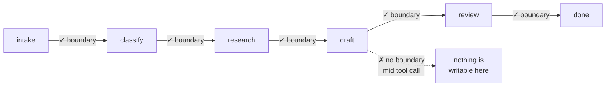

# 5.2 — Where the boundary goes

## One-line answer

A checkpoint boundary is a place where **nothing is in flight**, and the whole engineering
decision is how much work you are willing to lose between two of them — measured on the triage
graph, a per-stage boundary costs at most one request of rework and a per-run boundary costs
three.

## The story

The long-distance bus does not stop wherever you want it to. It stops at seven places between
here and there, and the driver will not open the door in between.

If you fall asleep and wake up past your stop, the cost is the distance to the next one. With
stops every twenty minutes that is a short walk back. With one stop in the middle of the
journey, it is most of an afternoon.

So more stops are better, from a passenger's point of view. Except that each stop costs the bus
ten minutes — slowing, the door, people getting their bags, pulling out again — and a bus with
forty stops takes twice as long and nobody catches it.

And there is a place the bus genuinely cannot stop, which is the part people forget when they
ask for more stops. Halfway across the long bridge, there is no verge, no shelter and nowhere to
walk to. It is not that the company will not stop there. It is that stopping there does not
produce a place where somebody can get off and stand.

## The idea in plain language

A **checkpoint boundary** is a point in a run where the state can be written down completely.
"Completely" is the load-bearing word, and
[2.5](../02-the-log-is-the-run/2.5-the-cut-that-includes-the-message-in-the-air.md) is what it
means: a snapshot that misses what is in transit describes a state the system was never in.

Which gives the rule for *where* boundaries can go, before any question of how many:

> **A checkpoint boundary is a place where nothing is in flight.**

A stage boundary qualifies: the previous stage has returned, its tool calls have completed, its
value is in hand, and the next stage has not begun. The middle of a tool call does not qualify —
there is a request outstanding and no way to record it or the response that may already be on its
way back. That is the bridge.

This is why real systems do not implement marker algorithms for agent checkpoints. They arrange
for the boundaries to be places where the hard problem does not arise, and then the checkpoint is
just "write down the state". It is a smaller idea than the one the paper solves, and it is the
right idea when you control where the boundaries are.

Given a set of legal boundaries, the remaining question is **how many to use**, and it is a
straight trade with numbers on both sides:

| | Checkpoint at every stage | Checkpoint once per run |
| --- | --- | --- |
| Work lost by a crash | at most one stage | the whole run |
| Writes per run | one per stage | one |
| Session growth | larger | smaller |
| Resume precision | exact | none — it starts again |

There is no correct answer in general. There is a correct answer once you know what a stage
costs and what a write costs, which is why this part measures both rather than recommending.

## Why Sutra needs it

Sutra's stages cost model requests, and requests are the currency (Day 24, Addendum 02). So the
left-hand column of that table is denominated in the scarcest thing the project has, and the
right-hand column is denominated in disk — which the project has plenty of.

That asymmetry decides it. **Checkpoint at every stage boundary**, because losing a stage costs
something that does not refill until tomorrow, and writing an extra event costs bytes.

Day 61 builds the checkpoint surface properly and Day 65 kills the run at these boundaries on
purpose. Day 64 adds a boundary of a different kind: an approval gate is a checkpoint the run
*stops at* rather than passes through, and it has to be a legal boundary for exactly the reason
above — you cannot wait for a human with a tool call outstanding.

## The mechanism

The cost of a boundary is what a crash after it costs to recover. `resume.py` sweeps every stage
boundary and prints that, against the alternative of no boundaries at all.

```bash
cd days/day-60-durable-execution/lab
uv run python resume.py
```

**Line by line:**

- Each row crashes the run after a different stage, then recovers two ways.
- `resume` is the per-stage-boundary policy: replay what the log has, re-execute the rest.
- `restart` is the one-boundary-per-run policy: there is no usable intermediate state, so the run
  begins again.

Measured on 2026-09-05:

```text
crashed after   log holds   resumes at   resume   restart
intake          1           classify     3        3
classify        2           research     2        3
research        3           draft        2        3
draft           4           review       1        3
review          5           complete     0        3

restart always costs 3 model calls. Resume costs what is genuinely left.
```

The `restart` column is flat at three because that is the whole run's cost, always. The `resume`
column is the staircase, and the worst case in it is **three** — a crash after `intake`, before
anything expensive has happened — which is the same as a restart. Every other row is cheaper, and
the last two are one and zero.

So per-stage boundaries are never worse than per-run and are usually better. What do they cost?

```bash
uv run python size.py
```

**Line by line:**

- One event per finished stage, with what the stage produced, trimmed so that long payloads are
  recorded as a length rather than inline.
- The multiplication at the bottom is 200 tickets a day, kept for 90 days — a small desk's real
  traffic rather than a round number.

```text
  stage      bytes on disk
  intake     142
  classify   112
  research   138
  draft      112
  review     114
  TOTAL      618

  one run                        618 bytes
  200 runs a day             123,600 bytes
  kept for 90 days       11,124,000 bytes
```

**618 bytes per run.** Eleven megabytes for a quarter of a year of a small desk's traffic. Set
that against a model request you cannot buy back, and the trade is not close.

Which produces Sutra's rule, with the numbers that justify it:



## When it breaks

The break is putting a boundary where nothing is in flight *usually*.

A stage that dispatches a background task and returns is the classic case. The stage has
returned, so it looks like a legal boundary — and there is a request outstanding that the
checkpoint knows nothing about. Day 36's long jobs are exactly this shape: the tool returns a
handle and the work continues elsewhere.

The observable damage is what `kills.py` measures at the one point in the triage run that has
something in flight when the checkpoint would be taken:

```bash
uv run python kills.py
```

**Line by line:**

- The first four rows kill the process at stage boundaries — legal checkpoint points.
- The fifth kills it **inside** `review`, after the ticket has been closed and before the event
  is written, which is [3.1](../03-doing-it-twice/3.1-the-uncertainty-gap.md)'s gap and is the
  one place in this run where the boundary is not clean.
- `honest` asks whether the run's own record agrees with what the effect store holds.

```text
idempotency key on the write: False
a clean run needs 3 requests and produces 1 closure

  killed         requests   closures   honest
  classify       3          1          yes
  research       3          1          yes
  draft          3          1          yes
  review         3          1          yes
  inside review  4          2          NO
```

Four clean rows and one that is not. **Two closures, and `honest: NO`** — the run's log and the
world disagree, which is the definition of a checkpoint taken at an illegal boundary.

Note the `requests` column on that row too: **4 instead of 3**. Even a crash at a bad boundary
only wastes one request, because everything before it was checkpointed properly. Good boundaries
elsewhere limit the damage of the bad one.

Now the same sweep with the key from
[3.3](../03-doing-it-twice/3.3-the-key-names-the-intention.md):

```bash
uv run python kills.py --keyed
```

**Line by line:**

- Nothing about the boundaries changes. The kill points are identical.
- The only difference is that `review` passes a derived `request_id`, so the second attempt at
  the effect is recognised.

```text
idempotency key on the write: True
a clean run needs 3 requests and produces 1 closure

  killed         requests   closures   honest
  classify       3          1          yes
  research       3          1          yes
  draft          3          1          yes
  review         3          1          yes
  inside review  4          1          yes
```

**One closure, honest again.** The illegal boundary is still illegal — the request is still spent
twice, which is why the row still reads `4` — but the *effect* is exactly-once, which is
[3.5](../03-doing-it-twice/3.5-exactly-once-is-about-effects.md) doing precisely what it claimed.
That is the honest summary of this day: you cannot make every boundary clean, and a key makes the
unclean ones survivable.

## In production

**What a professional writes instead.** Boundaries are a property of the graph, declared once,
rather than a decision made per stage by whoever wrote it. In ADK that falls out of the node
model: a node boundary *is* a checkpoint boundary, which is why
[4.3](../04-the-adk-surface/4.3-what-adk-writes-into-the-log.md) found state events either side
of each node and none inside them. The design work is therefore not "where do I checkpoint" but
**"where do I cut the graph into nodes"** — and the answer is to cut it so that each node's
external calls complete inside it.

**What degrades at scale.** Checkpoint frequency competes with throughput. Every boundary is a
durable write, and durable writes are the slowest thing in the pipeline once the pipeline is
fast. At high volume the answer stops being "every stage" and becomes "every stage that costs
more than the write", which is a threshold you can compute: checkpoint before anything expensive,
skip it before anything cheap.

**The failure mode that only appears with real traffic.** A boundary that is legal in the happy
path and not under a timeout. A stage that makes a call with a five-second timeout completes
cleanly almost always — and when the timeout fires, the request is *still in flight at the
server* while the stage has returned and the checkpoint has been taken. Day 44's
[1.2 — a timeout is an unknown](../../../day-44-client-hardening/parts/01-what-may-be-repeated/1.2-a-timeout-is-an-unknown.md)
is the same fact from the client's side. The boundary was legal in every test and illegal exactly
when it mattered.

**The review comment a senior engineer leaves:** *"This node dispatches the re-index and returns
the handle, and we checkpoint after it. The checkpoint records that the node finished and records
nothing about the job it started — so a resume has a handle to a job it did not start and cannot
account for. Either wait for the job inside the node, or put the handle in the state so the
resume can adopt it."*

**The interview question:** *"How often do you checkpoint?"* An honest answer: *"As often as
there are places where nothing is in flight, which for us is every stage boundary. The trade is
work-lost against write-cost, and for us it is not close: a lost stage is a model request out of
a fixed daily allowance, and a checkpoint is 618 bytes — about eleven megabytes for a quarter of
a year at our volume. The part that takes actual thought is *where the boundaries are allowed to
be*, not how many. A stage that dispatches work and returns looks like a clean boundary and is
not, and I have a measurement for what that costs: killing our run at a clean boundary leaves one
closure and an honest record, and killing it inside the write leaves two closures and a record
that disagrees with the world. With an idempotency key the same kill leaves one closure again —
so the residual cost of the bad boundary is one wasted request rather than a duplicate."*

## Check yourself

```bash
cd days/day-60-durable-execution/lab
uv run python resume.py
uv run python size.py
uv run python kills.py
uv run python kills.py --keyed
```

Now run `size.py --keep-output` and compare the totals. Then work out how many runs a day it
would take for the untrimmed log to cost more than one wasted model request, and say which of the
two you would optimise first.

**Out loud, without scrolling up:** explain why more bus stops are better and why they are also
worse, and name the place on the route where a stop is not possible at all.

**Next:** [6.1 — The resume that met different code](../06-failure-lab/6.1-the-resume-that-met-different-code.md).
