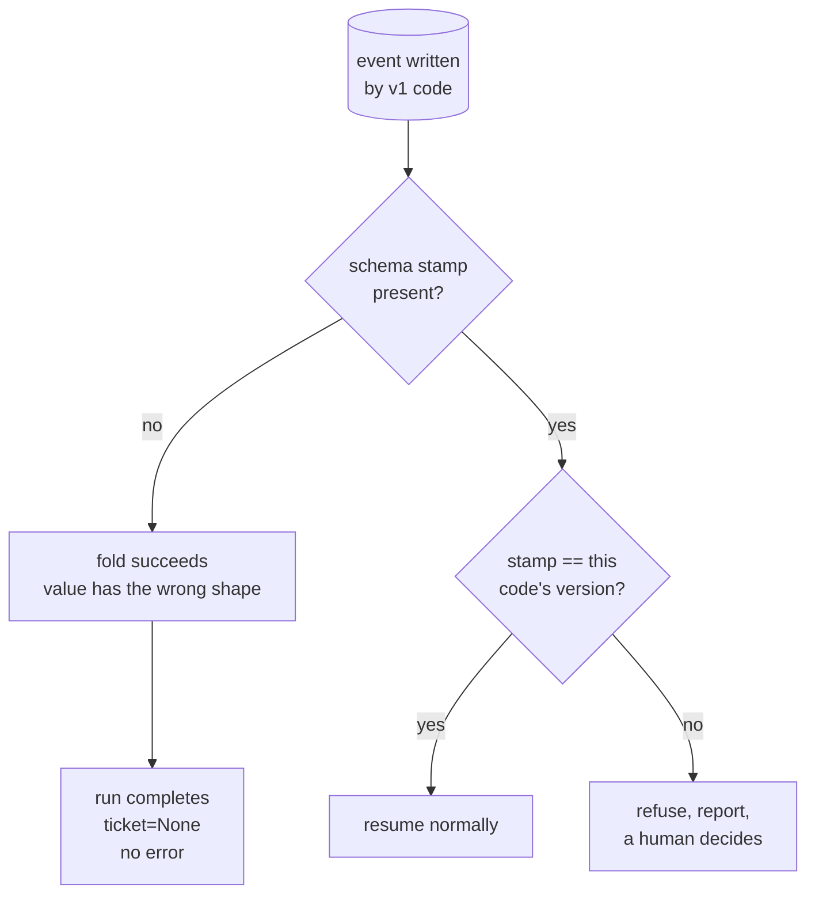

# 6.1 — The resume that met different code

## One-line answer

A log written by yesterday's code and resumed by today's is read without complaint and produces
a wrong answer — the resumed run drafts against `ticket=None` and nothing raises — and the fix
is a **schema stamp on every event**, which turns a silent wrong answer into a refusal.

## The story

The mixer stops working and you take it to the repair shop with the model number written on a
slip of paper.

The man looks it up, goes into the back, and comes out with a part. It goes in. The lid does not
sit down properly, but it nearly does, and if you press it the machine runs. He says it is fine.

It is not fine. It is last year's part. The model number is the same because the company did not
change the number, and they did change the shape of the coupling by two millimetres. The part
fits well enough to install and badly enough to fail, and it will fail in a month, in a way that
looks like a different fault.

Nobody lied. The slip said the right model. The shop had a part for that model. The two things
that had to match were the part and the *particular machine in front of him*, and neither the
slip nor the box had anything on it that would have caught the difference.

## The idea in plain language

A resume reads a record that a **previous version of your program** wrote.

Most of the time that is unremarkable, because the crash and the resume are minutes apart. But
"minutes apart" is not a property of the system, it is a property of a good day. A run that is
retried the next morning, or one that sits in a queue over a deploy, or one that a person picks
up out of a dead-letter list a week later, is being resumed by code that has changed since it was
written.

And the change that hurts is not a change to the resume logic. It is a change to **what an event
means**:

- a field that used to be a string is now an object with the string inside it;
- a field is renamed;
- a stage is split into two stages, so the names in `finished` no longer match the pipeline;
- a value is now stored normalised where it used to be stored raw.

Each of these is an ordinary, reviewable, correct change. Each one makes every event written
before it unreadable by the code after it — and unreadable in the worst possible way, which is
*readable enough to proceed*. JSON does not object to a string where an object was expected. The
fold in [2.1](../02-the-log-is-the-run/2.1-the-log-is-the-run.md) does not object either; it
copies keys.

The remedy is not to freeze the format. Formats change; that is what shipping is. The remedy is
to make the mismatch **detectable**, which takes one field:

> Every event carries the **schema version of the code that wrote it**, and a resume compares it
> with the version it is running. Different means stop.

Stopping is the point. A resume that refuses is a run in a queue with a clear reason; a resume
that proceeds is a wrong answer with nobody's name on it. This is Principle 10 applied to the
recovery path, which is the path where it is hardest to apply, because the recovery path is
already the sad path and the temptation to be lenient there is strong.

## Why Sutra needs it

`docs/PACKAGES.md` pins `google-adk==2.7.1`, and
[4.1](../04-the-adk-surface/4.1-one-field-on-the-app.md) quoted the framework's own warning that
`ResumabilityConfig` is experimental and may change without notice. So Sutra has two versions to
worry about, not one: the shape of its own events, and the shape of the framework's.

adk.dev's own resume page states the constraint in its own words, fetched on 2026-09-05:
*"Do not modify a stopped agent workflow before resuming it. For example adding or removing
agents from workflow that has stopped and then resuming that workflow is not supported."* That is
this part's subject, written as a rule the framework cannot enforce for you — nothing in ADK
knows which version of your graph wrote the events it is reading.

Day 65's gate is where this bites in practice. That gate kills a run and resumes it, and the
person running the gate will be editing the graph between the two halves, because that is what
you do while working on something. Without a stamp, an edit mid-gate produces a confusing failure
that looks like a durability bug.

## The mechanism

`version.py` writes a log in v1's shape and resumes it with v2's code.

```bash
cd days/day-60-durable-execution/lab
uv run python version.py
```

**Line by line:**

- v1 recorded `{"neighbour": "4521"}` — a bare ticket number, which is what
  [5.1](../05-triage-made-durable/5.1-five-stages-three-kinds.md)'s `research` stage produces
  today.
- v2 records `{"neighbour": {"id": "4521", "score": 0.62}}`, because a later day wanted the
  similarity score alongside the id. That is Day 50's tuning work arriving in the data shape, and
  it is a perfectly ordinary change.
- The resume then does what today's `draft` stage does: reaches into the neighbour for its `id`.
- The default arm has no schema stamp, so nothing compares anything.

Measured on 2026-09-05:

```text
schema stamp in the log: False
  TypeError: string indices must be integers, not 'str'
  resumed with neighbour='4521'
  drafted against ticket=None

  Nothing raised on the way in. The log was read, the state was rebuilt,
  and the field the resumed code wanted was simply not the shape it expected.
```

Three lines, and the middle one is the problem.

`resumed with neighbour='4521'` — the log was read successfully. The fold from
[2.1](../02-the-log-is-the-run/2.1-the-log-is-the-run.md) ran without complaint, because a fold
copies keys and does not inspect values. Every mechanism this day built worked correctly.

`drafted against ticket=None` — and the run continued anyway. In this demo the `TypeError` is
caught and turned into a `None`, which is deliberately the *charitable* version of what real code
does: a real `draft` stage is more likely to use `.get("id")` on a string-that-should-be-a-dict,
or to format the whole neighbour into a prompt, and produce a reply that cites nothing while
looking entirely normal.

Now the stamp:

```bash
uv run python version.py --stamped
```

**Line by line:**

- `--stamped` writes `"schema": 1` into the event and compares it with `CODE_VERSION = 2` at read
  time.
- The comparison is `!=`, not `<`. A log written by a *newer* version than the running code is
  just as unreadable as an older one, and a resume rolled back during an incident is exactly when
  that happens.

```text
schema stamp in the log: True
  refused: log schema 1, this code writes 2
  the run is not resumed. It is reported, and a human decides.
```

**The run is not resumed. It is reported.** That is the entire improvement, and it is worth being
clear that it is not a repair: the run still does not finish. What changed is that its failure is
visible, attributed, and actionable, instead of being a ticket drafted against nothing.



## When it breaks

There is a version mismatch a stamp does **not** catch, and it is worth knowing before trusting
the stamp too much: a change that keeps the shape and changes the meaning.

Suppose `score` moves from cosine similarity to a reranker's score — same field, same type,
different scale. The schema version has no reason to change, because the schema did not change.
Every stamp matches. And a resume that compares a v1 score against a v2 threshold takes a
different branch than the original run would have.

The failure looks like nothing at all: no error, no refusal, a plausible answer. The only
defences are to bump the version on *semantic* changes as well as structural ones — a discipline,
not a mechanism — and to record derived decisions rather than the inputs to them, so the resume
replays "we decided to use ticket 4521" instead of re-deriving it from a number whose meaning
moved. That second one is [2.4](../02-the-log-is-the-run/2.4-recording-the-model-so-a-replay-is-a-replay.md)'s
rule pointed at a new target.

The other break is the stamp that is checked and then ignored:

```python
if event.get("schema") != CODE_VERSION:
    log.warning("resuming a v%s log with v%s code", event.get("schema"), CODE_VERSION)
```

**Line by line:**

- The check is present and correct. Somebody did the work.
- `log.warning` and then falling through is the same as not checking, with extra noise. The run
  proceeds into exactly the state the check identified as wrong.
- Day 21's rule about
  [swallowed exceptions](../../../day-21-errors-surface-not-swallow/parts/04-failure-lab/4.1-the-swallowed-exception.md)
  covers this: the difference between a warning and a raise is the difference between a fact
  nobody acts on and a fact the system acts on.

## In production

**What a professional writes instead.** The version is not a hand-maintained integer that
somebody remembers to bump. It is derived from something that cannot be forgotten — a hash of the
event schema definition, or the graph's own structure — so that changing the shape changes the
version automatically. Where the schema is defined by a model class, the class is the source of
truth and the version comes from it. The hand-maintained integer is the version that is correct
until the first busy week.

**What degrades at scale.** Refusing every mismatched run means a deploy that changes the schema
strands every in-flight run, and at scale there are always in-flight runs. So real systems add
**migrations**: a function that reads a v1 event and returns a v2 one, kept for as long as v1
events might exist, and the resume path applies the chain. That turns "refuse" into "upgrade and
continue", and it is worth being clear that the migration is only writable *because* the stamp
told you which version you had.

**The failure mode that only appears with real traffic.** The mixed-version fleet. During a
rolling deploy, half the workers are v1 and half are v2, so a run started on v1 can be resumed on
v2 and then resumed again on v1. A stamp that only compares "is this mine?" refuses in both
directions and the run bounces between workers, failing on each, until it exhausts its attempts —
which looks like a poison message and is really a deployment artefact. The fix is that the
version check has to know about a *range* of readable versions, not one.

**The review comment a senior engineer leaves:** *"These events have no version field. The first
time we change what `produced` holds, every run in the queue becomes unreadable in a way that
does not raise — and we will find out from output quality, not from an alert. Add the version now
while the log is small enough that we can backfill it."*

**The interview question:** *"What happens if you deploy while a workflow is mid-run?"* An honest
answer: *"By default, something worse than a crash. The resumed run reads events written by the
old code, and a fold does not type-check, so a field that changed shape is read successfully and
used wrongly. I reproduced it: v1 wrote the neighbour as a bare ticket id, v2 expected an object,
and the resume drafted against `None` with no error anywhere. The fix is a schema version on
every event and a refusal on mismatch, which converts a silent wrong answer into a stopped run
somebody can look at. Two things I would add before calling it done: derive the version from the
schema rather than maintaining it by hand, and write migrations rather than refusing for ever,
because at any real volume a schema change with a hard refusal strands every run in the queue.
And the mismatch a stamp cannot catch is a field whose *meaning* changed while its shape did
not — for that you have to record the decision rather than the input."*

## Check yourself

```bash
cd days/day-60-durable-execution/lab
uv run python version.py
uv run python version.py --stamped
```

Now change `CODE_VERSION` in `version.py` to `1` and run the stamped arm again. Then change it to
`3` and run it once more. Write down which of the two is more likely in a real incident, and what
that implies about using `!=` rather than `<`.

**Out loud, without scrolling up:** explain how the repair shop fitted the wrong part while
everybody involved did their job correctly, and say what would have had to be written on the box
to catch it.

**Next:** [6.2 — Four kills, four answers](6.2-four-kills-four-answers.md).
