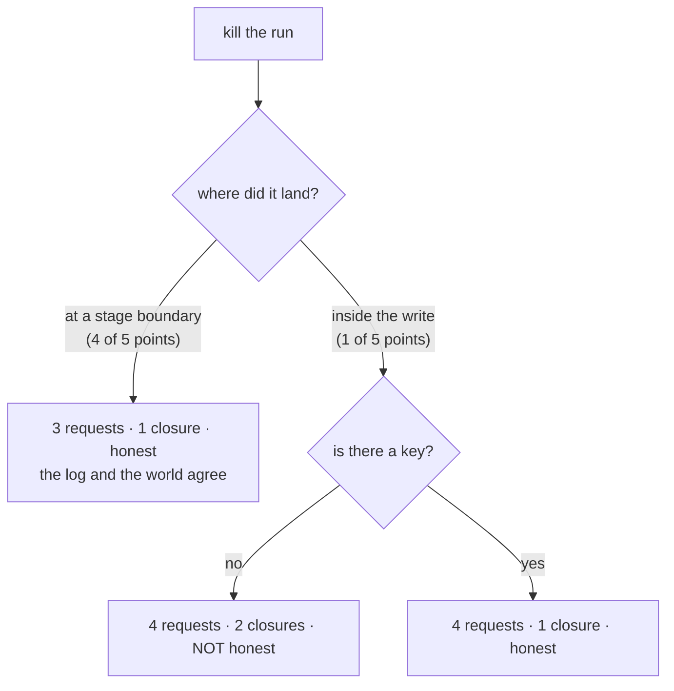

# 6.2 — Four kills, four answers

## One-line answer

Killing the same run at five different moments produces four identical good outcomes and one
bad one — **two closures and a record that disagrees with the world** — and the whole of this
day is the difference between those two rows.

## The story

Once a month the building's generator is tested, and the test is not "does it start".

The test is: cut the mains at a time nobody has agreed in advance, and see what the building
does. The lifts, the water pump, the corridor lights, the man on the gate whose barrier is
electric. Each of those is fine on its own and the test is about the ones that are not fine
together — the pump that restarts before the tank valve has reset, the lift that parks between
floors.

A test where somebody announces it at eleven and everybody stands ready is not a test of the
building. It is a test of the generator, which was never the thing in doubt.

So the caretaker does not announce it. He picks a moment, pulls the switch, and walks around
with a notebook writing down what is wrong. Last month it was the pump. This month it might be
nothing. The notebook is the point: not that the building survived, but *which* thing did not,
and what that costs.

## The idea in plain language

This part is the day's rehearsal for Day 65's gate, and its method is the caretaker's: **kill
the same run at every moment that is different in kind, and write down what each one costs.**

"Different in kind" is doing the work in that sentence. Killing a run at a hundred random
instants tells you less than killing it at five chosen ones, because the outcomes are determined
by *where the kill falls relative to the boundaries*, not by the clock. For the triage graph
there are exactly two categories and five instants worth trying:

- **at a stage boundary** — after a stage's event is written, before the next begins. Four of
  these, one per completed stage, and they should all behave identically.
- **inside the effectful stage** — after the ticket is closed and before the event is written.
  One of these, and it is the only one that can go wrong, because it is the only kill that lands
  in [3.1](../03-doing-it-twice/3.1-the-uncertainty-gap.md)'s gap.

Three questions get asked of each kill, and they are the three that matter operationally:

1. **What did it cost?** Requests spent across both attempts, against the three a clean run needs.
2. **What did it do to the world?** Closure rows for one ticket. Anything but one is wrong.
3. **Is the record honest?** Does the run's own log agree with what the effect store holds? A
   run that is *wrong* is bad; a run that is wrong and *says it is right* is the thing Principle
   10 exists to prevent.

The third question is the one that separates a durability test from a smoke test. A run can
recover, finish, report success and still have left two closures behind — and only the third
question catches that.

## Why Sutra needs it

Day 65's gate is *kill it mid-run; it resumes; a human approved the write.* Today owns the first
two clauses, and the gate will not accept an assertion.

Building the sweep here rather than there means the gate day inherits a tool instead of a claim.
It also means the failure is found now, while the day's author is looking for it, rather than on
the gate day when the pressure is to declare the phase green.

And there is a plan rule behind it. §17.7 requires every day to carry at least one part whose
subject is a deliberate failure. This is that part for the mechanism half of the day — the row
that reads `NO` is the reason the other twelve parts exist.

## The mechanism

`kills.py` sweeps the five kill points, resumes each, and answers the three questions.

```bash
cd days/day-60-durable-execution/lab
uv run python kills.py
```

**Line by line:**

- `POINTS` lists the five instants. The first four are stage names and mean *after this stage's
  event is written*; the fifth is `"inside review"` and means *after the ticket is closed and
  before the event is written*.
- Reaching that fifth point needed a second knob on the runner, `crash_inside`, because
  `crash_after` raises only at boundaries — **a stage-boundary kill cannot reach the uncertainty
  gap**, which is itself worth knowing: a test harness that only kills between steps will never
  find this bug.
- Each row is a fresh effect store and a fresh log, so the rows are five independent experiments
  rather than one accumulating one.
- `honest` compares "does the log say `review` finished?" with "does the world hold exactly one
  closure?". Agreement in either direction is honest; disagreement is not.
- The default arm passes **no** idempotency key, which is the state of the code before today's
  build brief is done.

Measured on 2026-09-05:

```text
idempotency key on the write: False
a clean run needs 3 requests and produces 1 closure

  killed         requests   closures   honest
  classify       3          1          yes
  research       3          1          yes
  draft          3          1          yes
  review         3          1          yes
  inside review  4          2          NO

  'inside review' is the dangerous row: the effect happened and the log line
  did not, so the resume re-runs the write (part 3.1). Only a key fixes it.
```

Four rows of good news and one row that is the whole day.

**The four boundary kills are perfect.** Three requests — the same as a clean run, so nothing was
wasted — one closure, honest record. That is the log from
[2.1](../02-the-log-is-the-run/2.1-the-log-is-the-run.md) and the resume from
[2.2](../02-the-log-is-the-run/2.2-replay-is-not-re-execution.md) doing exactly what they promised,
at four different moments, with no special handling for any of them.

**The fifth row fails on two of the three questions.** `closures: 2` — the ticket was closed
twice, because the resume could not tell that the first attempt had already closed it.
`honest: NO` — and this is the worse half — the run's log says `review` never finished while the
world holds a closure row for it. The run reports one thing and the world contains another, and
nothing anywhere raised.

`requests: 4` is the third number and it is the mildest problem: one extra request, because
`review` was paid for twice. Worth noting the ordering of severity, because it is the opposite of
what a cost-conscious reader expects: the wasted request is the *least* of the three failures.

Now the same sweep with the key from
[3.3](../03-doing-it-twice/3.3-the-key-names-the-intention.md), written atomically as
[3.4](../03-doing-it-twice/3.4-the-ledger-and-the-atomic-window.md) requires:

```bash
uv run python kills.py --keyed
```

**Line by line:**

- `--keyed` passes `keyed=True` into the runner, which derives
  `f"{invocation_id}/review/close-{ticket_id}"` and hands it to `close_ticket`.
- Nothing about the kill points changes, nothing about the boundaries changes, and nothing about
  the ordering changes. One string is passed that was not passed before.

```text
idempotency key on the write: True
a clean run needs 3 requests and produces 1 closure

  killed         requests   closures   honest
  classify       3          1          yes
  research       3          1          yes
  draft          3          1          yes
  review         3          1          yes
  inside review  4          1          yes
```

**`closures: 1`, `honest: yes`.** The dangerous row is now as good as the other four on the two
questions that matter, and `requests: 4` is unchanged — which is precisely correct and worth
saying out loud: the key deduplicates the **effect**, not the **request**. The second attempt at
`review` still happens, still costs a request, and is turned away at the door. That is
[3.5](../03-doing-it-twice/3.5-exactly-once-is-about-effects.md)'s equation, visible in a table:
at-least-once delivery, exactly-once effect.



## When it breaks

The break is the sweep itself giving a clean result for the wrong reason, and it is the trap this
part nearly fell into.

The first version of `kills.py` had four points, all of them stage boundaries. Every row passed,
with and without a key, and the table looked like proof that the run was durable. It was proof of
nothing: the harness could not reach the one moment where the bug lives, because
`crash_after` raises *after* the event is written and the gap is *before* it.

That is a general problem with crash testing and it deserves stating plainly:

> **A harness that can only kill at the points you designed will only ever confirm that those
> points are safe.**

The fix was a second knob — `crash_inside`, which raises between the stage returning and its
event being appended — and the moment it existed the fifth row went red. Nothing about the system
changed. The test got the ability to ask a question it could not previously ask.

The same trap has a sharper version in a real system, where kills are real signals rather than
raised exceptions. `SIGTERM` handled gracefully drains to a boundary and exits cleanly, which is
correct behaviour and means a `SIGTERM`-based chaos test measures the *drain*, not the crash. The
kill that finds this bug is `SIGKILL`, or pulling power, and a test suite that only sends
`SIGTERM` will report a durability it does not have. Day 65's gate has to use the ungraceful one.

## In production

**What a professional writes instead.** The sweep is a test, in CI, that runs on every change to
the graph — not a script somebody ran once on the day durability was implemented. It is
parameterised over kill points so that adding a stage adds rows automatically, and the assertion
is on all three columns rather than on "it finished". The reason it belongs in CI rather than in
a runbook is that the recovery path has no other coverage: nothing in normal operation exercises
it, so without this test it is dead code until the day it is the only code that matters.

**What degrades at scale.** The number of interesting kill points grows with concurrency. With
Day 54's parallel branches there is no single "inside the write" — there are as many as there are
branches, plus the join, plus the window where one branch has finished and another has not. The
sweep stops being a list and becomes a search, and at that point the honest move is to stop
enumerating and start randomising: kill at a random instant, many times, and assert the
invariants rather than the outcomes.

**The failure mode that only appears with real traffic.** The kill that lands during the resume.
Every row above kills the *first* attempt. In production a resume can be killed too — a worker
picks up a run, gets halfway, and is rescheduled — and a second resume then reads a log that a
resume wrote. Nothing in this sweep tests that, and it is where a re-entrancy bug in the recovery
path would live. The extension is one more parameter: kill the resume as well as the run.

**The review comment a senior engineer leaves:** *"Every kill point in this test is a stage
boundary, which is where we already know we are safe. Add one that fires between the side effect
and the event append, because that is the only window this whole design is about — and make the
test assert that the log and the effect store agree, not just that the run completed."*

**The interview question:** *"How do you test that your system is durable?"* An honest answer:
*"By killing it on purpose at points chosen for being different in kind, and asserting three
things each time: requests spent, effects in the world, and whether the run's own record agrees
with the world. On our triage flow, four kills at stage boundaries all came back clean — three
requests, one closure, honest — and one kill inside the write came back with two closures and a
record that disagreed. Adding the idempotency key took that row to one closure and honest while
leaving the request count at four, which is the right outcome: the key deduplicates the effect,
not the request. The thing I would flag to anyone building this is that my first harness could
only kill at stage boundaries, so it passed completely and proved nothing — and the real-world
version of that mistake is testing with `SIGTERM`, which drains gracefully to a boundary and
measures the drain instead of the crash."*

## Check yourself

```bash
cd days/day-60-durable-execution/lab
uv run python kills.py
uv run python kills.py --keyed
```

Now add a sixth point to `POINTS` in `kills.py` that kills *inside* `draft` rather than inside
`review`, and run it again. Write down which of the three columns changes and which does not, and
explain the difference using the classes from
[5.1](../05-triage-made-durable/5.1-five-stages-three-kinds.md).

**Out loud, without scrolling up:** explain why the caretaker does not announce the generator
test, and say which of this part's five kill points corresponds to the pump that restarts too
early.

**Next:** [7.1 — What a checkpoint costs](../07-in-production/7.1-what-a-checkpoint-costs.md).
