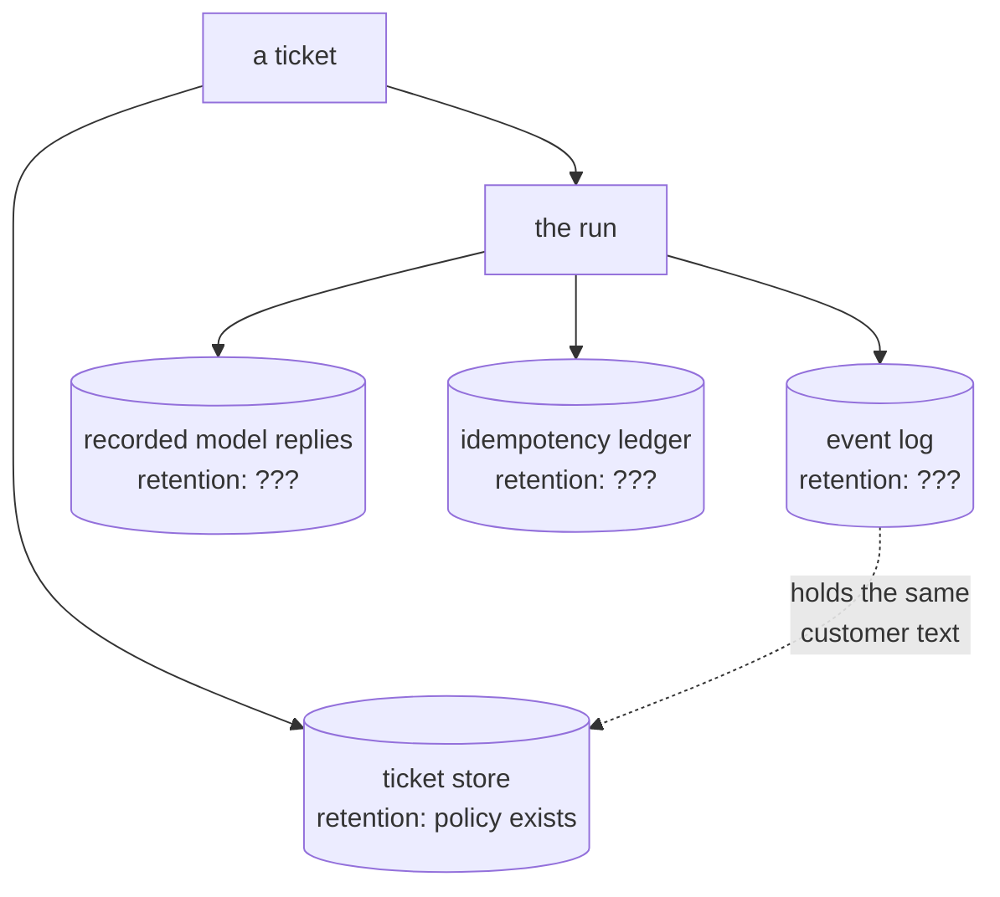

# 7.1 — What a checkpoint costs

## One-line answer

Durability is paid for in bytes of customer text kept for as long as a run might be resumed —
**618 bytes a run, eleven megabytes for ninety days of a small desk** — and the number is small
enough that the real decision is retention rather than storage.

## The story

The housing society keeps a visitor register at the gate. Name, flat, time in, time out, one
line each.

It is a good system and nobody thinks about it until the register is full, which happens every
few months, and then somebody has to decide what to do with the old one. It goes in a cupboard in
the office. The next one fills up and joins it. After four years there is a shelf of them.

Nobody planned the shelf. Every individual decision was correct: keep the register, because you
need to know who came in; keep the old ones, because occasionally somebody asks about last
March. What nobody ever decided is **how long**, and so the answer became *for ever*, by default,
one book at a time.

And the books are not blank paper. Every line is a name, a phone number and where somebody went.
The shelf is not a storage problem. It is a shelf of other people's details that the society
never decided to keep and cannot now say why it has.

## The idea in plain language

Turning on durability adds a cost, and it is worth being precise about what the cost is, because
people usually reach for the wrong one.

It is not compute. Appending an event is cheap. It is not really *money* either, at the volumes
most systems run at — the arithmetic below shows how small it is.

The cost is **a copy of the run's content, kept somewhere, for a period nobody has yet decided**.
That is three separate problems wearing one hat:

- **Size.** How many bytes per run, times runs per day, times days kept.
- **Growth shape.** Whether it grows with your traffic (fine, predictable) or with your *failure
  rate* (harder, and it spikes exactly when you are already having a bad day).
- **Content.** What is actually in those bytes. For a support desk, the answer is: what customers
  wrote, what the agent drafted back, and the retrieved rows in between. That is the material Day
  69 will be about, and the decision that determines how bad it is gets made here, when the event
  shape is designed.

The last one is the one this part is really about. A checkpoint is not neutral bytes. It is the
same customer text as the ticket, copied into a second place with a different lifetime and often
different access controls — and the copy is invisible in every diagram that shows where customer
data lives.

Two design choices follow, and both cost nothing at the time and a great deal later:

**Store references, not payloads.** An event that says *"research finished, neighbour is ticket
4521"* is complete for replay purposes. An event that says that *and* embeds the 900 characters
of ticket 4521 has copied the archive into the log for no additional recovery value.

**Decide the retention rule the day you turn durability on.** Not when the disk fills. The rule
has a defensible form — *a run's events are deleted N days after the run reaches a terminal
state, where N is longer than the longest resume we allow* — and the point of writing it down
early is that N is derivable then and becomes a negotiation later.

## Why Sutra needs it

Sutra's whole budget discipline is denominated in requests, not bytes (Day 24, Addendum 02), so
there is a real temptation to treat storage as free and log everything. This part is the
counterweight, and it is a small one: the numbers below genuinely are small, and the honest
conclusion is that **Sutra should log generously and delete on a schedule**, rather than log
sparsely.

But the schedule has to exist. The repo goes public in Phase 14 (plan §13), and Day 69 draws the
data boundaries. A log that has been accumulating customer text since Day 60 with no retention
rule is a problem discovered on Day 69 rather than designed on Day 60, and the difference is
whether the fix is a config line or a migration.

## The mechanism

`size.py` runs one triage ticket end to end and measures the log it leaves, then multiplies by a
small desk's real traffic.

```bash
cd days/day-60-durable-execution/lab
uv run python size.py
```

**Line by line:**

- The run is a real one: five stages, real `produced` payloads, the same runner every other part
  uses.
- `trimmed()` replaces any value longer than forty characters with `<N chars>`, which is the
  store-a-reference discipline made mechanical. The default arm applies it.
- The multiplication uses 200 tickets a day and 90 days. Both are stated as constants at the top
  of the file so they can be argued with rather than believed.

Measured on 2026-09-05:

```text
trimming stage output: True

  stage      bytes on disk
  intake     142
  classify   112
  research   138
  draft      112
  review     114
  TOTAL      618

  one run                        618 bytes
  200 runs a day             123,600 bytes
  kept for 90 days       11,124,000 bytes

  The number is small. The number is also the reason a retention rule exists
  before it is needed rather than after: every byte above is customer text.
```

**618 bytes.** For that, a crash at any stage boundary costs nothing but the stage that had not
run — [5.2](../05-triage-made-durable/5.2-where-the-boundary-goes.md) priced the alternative at up
to three model requests. Eleven megabytes for a quarter of a year is not a number anybody needs
to optimise.

Now without the trimming:

```bash
uv run python size.py --keep-output
```

**Line by line:**

- `--keep-output` logs each stage's full payload inline instead of recording a length.
- Only two stages change: `research`, which carries the archive text, and `draft`, which carries
  the reply. The three that produce short values are unaffected — which is the useful shape of the
  result.

```text
trimming stage output: False

  stage      bytes on disk
  intake     142
  classify   112
  research   206
  draft      210
  review     161
  TOTAL      831

  one run                        831 bytes
  200 runs a day             166,200 bytes
  kept for 90 days       14,958,000 bytes
```

**618 to 831 bytes, a 34% increase**, and all of it in the two stages that touch content. Fifteen
megabytes instead of eleven — still nothing, in storage terms.

Which is exactly why the storage argument is the wrong argument. The right one is in the last
column of the first block: *every byte above is customer text*. The untrimmed version has put the
customer's words and the drafted reply into a **second** store with a **different** lifetime, and
the 34% is not the cost. The cost is that a request to delete a customer's data now has two places
to reach, and one of them is not in any diagram.



Three stores with question marks, created by this day, all holding copies of the same words.

## When it breaks

The break is the retention rule that is set without reference to the resume window, and it breaks
in whichever direction you guessed wrong.

**Too short**, and a resume finds nothing — and the way it fails is the bad way, because
nothing raises. `read()` on a missing log returns an empty list by design
([1.1](../01-what-a-run-is/1.1-the-run-is-not-the-process.md) built it that way so a truncated
log stays readable), so `finished()` returns no stages, so the resume concludes that nothing has
run and **starts the whole run again**.

You can watch that happen by deleting the log between the two attempts:

```bash
uv run python nolog.py --log      # a normal resume: 3 requests total, 0 wasted
rm nolog.jsonl                    # the retention job ran between the crash and the resume
uv run python nolog.py            # what the resume now sees
```

**Line by line:**

- The first command is the good case from [1.1](../01-what-a-run-is/1.1-the-run-is-not-the-process.md):
  the log survives, the resume costs one further request, nothing is wasted.
- `rm` stands in for a retention job that deleted a run's events while the run was still
  resumable. It is the whole bug, in one command.
- The third command is the same code reading an absent log, which is byte-for-byte the situation
  a resume is in after the deletion — and it reports the restart cost.

The second run's arithmetic is the arithmetic of a run that has forgotten itself: `5 model calls
for a run that needs 3`, `wasted 2`. A run that was most of the way through is silently begun
again, at full price, and every effectful stage is re-entered — where the idempotency key from
[3.3](../03-doing-it-twice/3.3-the-key-names-the-intention.md) saves the ticket from being closed
twice, and nothing saves the requests.

**Too long**, and nothing breaks at all, which is the problem. The ledger and the log accumulate,
the cost stays invisible because it is small, and the first person to notice is whoever has to
answer a question about what customer data the system holds.

The rule that ties the two together is worth writing down explicitly, because it is derivable
rather than a matter of taste:

> retention ≥ maximum resume age + maximum retry window + a margin

and every term on the right is a number the system already has, or should. A retention rule set
without reference to them is a guess that will be wrong in one of the two directions above.

## In production

**What a professional writes instead.** Three retention rules, not one, because the three stores
in the diagram have genuinely different lifetimes. The **event log** lives as long as a run might
be resumed. The **recorded model replies** are the biggest and least reusable, and can expire
sooner — a run older than the resume window will never replay them. The **idempotency ledger** is
the longest-lived and the smallest: a key must outlive every attempt that could still arrive
carrying it, which is longer than the resume window because a retry can be queued behind one.
Setting all three to the same number is the common shortcut and it makes two of them wrong.

**What degrades at scale.** The growth shape changes character. Log volume tracks traffic, which
is predictable; recorded-reply volume tracks traffic times *retry count*, which tracks your
failure rate — so the pile grows fastest during an incident, when the system is least able to
absorb it. Anybody who has watched disk fill during an outage has watched this specific
mechanism, and the mitigation is a cap on stored attempts per run rather than a bigger disk.

**The failure mode that only appears with real traffic.** The deletion that is not a deletion. A
retention job removes events older than N days, and a run that has been sitting in a
dead-letter queue for N+1 days is then resumed by an operator doing exactly the right thing —
finding a stuck run and retrying it. It restarts from nothing, silently, because there is no
distinction in the code between "this run has no events" and "this run's events were deleted". A
terminal marker that outlives the events is what prevents it.

**The review comment a senior engineer leaves:** *"We are logging the retrieved archive text into
the event as well as into the prompt. Recovery only needs the row ids — it can re-fetch the text
— so we are copying customer content into a second store with no retention policy to buy nothing.
Store the ids and add the retention rule in the same change."*

**The interview question:** *"What does durability cost you?"* An honest answer: *"Less than
people expect in storage and more than people expect in obligations. I measured ours: 618 bytes
per run trimmed, 831 untrimmed, which is about eleven megabytes for ninety days at our volume —
nothing. So the storage argument is the wrong argument. The real cost is that we now hold three
new copies of customer text — the event log, the recorded model replies, and the idempotency
ledger — each with its own correct lifetime, and none of them appear in the data-flow diagram
anybody drew. I would set three separate retention rules rather than one, because the ledger has
to outlive the resume window and the recorded replies do not, and I would derive the numbers from
the maximum resume age rather than picking ninety days because it sounds right."*

## Check yourself

```bash
cd days/day-60-durable-execution/lab
uv run python size.py
uv run python size.py --keep-output
```

Now change `TICKETS_PER_DAY` in `size.py` to the volume of a system you have actually worked on,
re-run it, and write down the ninety-day figure. Then write the three retention rules from *In
production* as three numbers for that system, and say which one you are least sure about.

**Out loud, without scrolling up:** explain how the society ended up with a shelf of registers
without anybody deciding to, and name the decision that was never made.

**Next:** [7.2 — What a reviewer asks](7.2-what-a-reviewer-asks.md).
