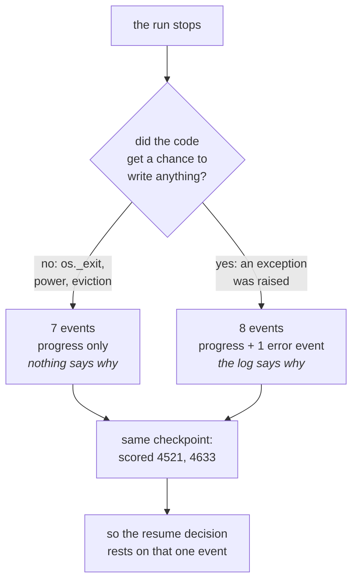

# 1.1 — The call that dropped and the call that ended

## One-line answer

A run that is killed and a run that raises leave **the same checkpoint** in the log — measured, the
identical `{"scored": ["4521", "4633"]}` — and differ by exactly one extra event, which is the only
thing telling you whether picking it up again is sensible or reckless.

## The story

You are on the phone to your sister about a family thing that needs sorting out. Halfway through a
sentence the line goes dead.

You look at the handset. You do not know what happened. Maybe the network dropped. Maybe her
battery died. Maybe she is in a lift. You call back, she picks up, and you both say "sorry, you
went" and carry on from roughly where you were. Nobody thinks about it again.

Now a different call. Halfway through the same sentence she says, quite clearly, *"I don't want to
talk about this."* And hangs up.

The phone in your hand looks exactly the same. Call ended. Same screen, same duration, same
everything. But you would be a fool to call straight back and carry on from the middle of the
sentence, and you know it without being told. The difference is not in the phone. The difference is
that in the second call, **something was said before the line went down**, and that something is the
whole of what you know.

## The idea in plain language

Day 60's [1.2](../../../day-60-durable-execution/parts/01-what-a-run-is/1.2-died-or-failed.md) drew
this line as a principle: a run that **died** should be resumed and a run that **failed** should
not, and the only reason you can tell them apart is that the failing one had time to write down
that it was failing.

This part measures what that actually looks like in the log, because the principle has a
consequence that surprises people the first time they see it.

Two words first, defined here and used for the rest of the day.

- A **run** is one attempt at a piece of work, from the message that started it to the answer that
  finishes it. Day 60's [1.1](../../../day-60-durable-execution/parts/01-what-a-run-is/1.1-the-run-is-not-the-process.md)
  established the point that matters: the run is **not** the operating-system process. A process is
  a thing the machine can kill. A run is a thing that can outlive being killed.
- A **checkpoint** is a written record, made while the run is going, of how far it had got. Today's
  whole subject is what is in one and who is allowed to read it.

Now the finding. When a run stops early, there are two quite different reasons, and they leave
almost identical evidence:

1. **The process was destroyed.** Power, container eviction, `kill -9`, a closed laptop. Nothing in
   your code ran. No exception was raised, no handler fired, no buffer was flushed. Whatever had
   already reached the disk is all there is.
2. **The code raised.** A tool timed out, a value was wrong, a bug. Python raised an exception,
   the framework caught it, and — this is the part that matters — **the framework wrote that down**.

Both stop the run at the same place. Both leave the same progress record. The second one leaves one
extra entry saying *this went wrong, and here is what went wrong*.

Everyone's instinct is that the second case is the better one, because you have more information.
That instinct is correct about diagnosis and, as [5.3](../05-failure-lab/5.3-the-clerk-who-wrote-rejected-in-pen.md)
measures, exactly backwards about recovery.

## Why Sutra needs it

The triage graph that Day 58 assembled runs on a laptop that gets closed and, later in the
curriculum, in a container that gets rescheduled. Both of those are case 1. A tool that raises
because a ticket has a malformed reference is case 2.

Sutra needs to treat them differently, and the code that decides has to make the decision from the
log, because by the time anybody looks, the process that could have explained itself is gone. Day 65
turns this into a phase-gate criterion: kill the triage graph at four different moments and see
whether it comes back correctly each time. You cannot answer that question without first being able
to tell what kind of stop you are looking at.

## The mechanism

`twostops.py` runs the same three-station drill twice, stopping it a different way each time.

Station one summarises the ticket, station two scores four candidate duplicates from the archive and
writes a checkpoint after each, station three reports. Arm one raises a `RuntimeError` inside station
two after the second candidate. Arm two destroys the process with `os._exit(9)` at exactly the same
point.

```bash
cd days/day-61-pause-resume-checkpoints/lab
uv run python twostops.py
```

**Line by line:**

- `twostops.py` re-executes itself as a **subprocess** for each arm. That is not tidiness: `os._exit`
  destroys the interpreter it is called in, so the arm that dies has to be something other than the
  script doing the measuring.
- The exception arm monkey-patches the dedupe agent to raise after its second yielded event, so both
  arms stop after exactly two candidates. Holding the stopping *point* constant is what makes the
  two stores comparable.
- Both arms write to their own JSON file, so neither measures the other's leftovers.

Measured on 2026-09-06:

```text
--- the run stops by an exception ---
  summarise: 'customer signed out mid-form during single sign-on'
  dedupe: agent_states keys = []
  dedupe: loaded checkpoint None
  dedupe: scored 4521 -> 3
  dedupe: scored 4633 -> 2
  process exit code: 1
  events written:    8
  last checkpoint:   {"scored": ["4521", "4633"], "results": {"4521": 3, "4633": 2}}
  error events:      1
    RuntimeError: died in dedupe  at drill@1/dedupe@1

--- the run stops by a hard kill ---
  summarise: 'customer signed out mid-form during single sign-on'
  dedupe: agent_states keys = []
  dedupe: loaded checkpoint None
  dedupe: scored 4521 -> 3
  dedupe: scored 4633 -> 2
  *** the process is killed here ***
  process exit code: 9
  events written:    7
  last checkpoint:   {"scored": ["4521", "4633"], "results": {"4521": 3, "4633": 2}}
  error events:      0
```

Read the two `last checkpoint` lines first. They are **character for character identical**:

```text
{"scored": ["4521", "4633"], "results": {"4521": 3, "4633": 2}}
```

Two candidates scored, two not. The progress record cannot tell you which arm produced it, because
the progress record is about the *work*, and the work stopped in the same place both times.

Everything that distinguishes the two runs is in the two lines underneath:

| | exception | hard kill |
| --- | --- | --- |
| process exit code | 1 | 9 |
| events written | **8** | **7** |
| error events | **1** | **0** |

**Seven events against eight.** One event is the entire difference between these two stores, and
that event is the one that says `RuntimeError: died in dedupe at drill@1/dedupe@1`.

The exit code is worth a sentence on its own, because it is the piece of evidence people reach for
and it is the piece that is not there when you need it. `1` and `9` do distinguish the arms
perfectly — from the outside, by whoever launched the process. But a resume happens somewhere else,
in a different process, possibly on a different machine, reading only the log. The exit code was
never written down. It is not a field in the store. By the time anybody asks *should this be
resumed?*, the number that would have answered cleanly is gone, and the only surviving witness is
whether the dying run managed to file a report about itself.

That is the shape of the whole day: **the log is the only thing that outlives the process, so
anything the log does not say, nobody can ever find out.**



## When it breaks

The break is treating the exit code as the answer, and it breaks the moment the resume stops being
run by the same shell that launched the job.

Here is the version of this you can reach on purpose. Look for the exit code in the store:

```bash
cd days/day-61-pause-resume-checkpoints/lab
grep -c "exit_code" stop_exit.json stop_raise.json
```

**Line by line:**

- `grep -c` counts matching lines rather than printing them, which is all this question needs.
- Both files are the complete session as it exists on disk — everything a resuming process could
  possibly read.

```text
stop_exit.json:0
stop_raise.json:0
```

Zero and zero. The number that told you everything in the table above is in neither file.

The second break is subtler and it is the one that bites in review. Because both arms leave the same
checkpoint, a resume that looks only at the checkpoint will happily restart **both**. That is
correct for the killed run and wrong for the failed one, and it will look like it is working,
because restarting a failed run usually just fails again in the same place — until the day the
failure was caused by something transient, and the retry succeeds, and now you have a system that
sometimes recovers from bugs by accident and nobody knows which failures are real.

## In production

**What a professional writes instead.** They do not infer the stop reason at resume time; they
record an explicit **terminal status** on the run — `completed`, `failed`, `abandoned` — and write
it as its own event. A run with no terminal status at all is the killed case, positively identified
rather than guessed. That inverts the logic: instead of hunting for evidence of failure, you treat
*absence of a finish* as the resumable signal, which is the only one of the two that a dying process
can produce reliably, because it requires the dying process to do nothing.

**What degrades at scale.** With one run on a laptop, "did it finish?" is answered by looking. With
a few thousand runs a day, it is answered by a query, and the query needs an index on something. A
store that records failure but not abandonment has one class of run — the killed one — that is only
identifiable by its *lack* of a row, and lacks-a-row does not index.

**The failure mode that only appears with real traffic.** A process that is killed while it is
writing. The two arms here are clean because the kill lands between two flushes. In a real store,
under load, a kill can land in the middle of one, and now you have a store with a half-written last
record. Every resume path needs to survive reading a truncated tail, and the way you find out
whether yours does is by testing it, not by hoping the window is small — the window is small and it
is hit constantly, because there are a great many runs.

**The review comment a senior engineer leaves:** *"This decides whether to resume by checking for an
error event. That means a run killed by the scheduler and a run killed by a bug are the same to you,
because neither wrote an error the second time. Record a terminal status when a run ends, any way it
ends, and treat a run with no terminal status as the only resumable kind. Right now the absence of
evidence is doing two different jobs."*

**The interview question:** *"How does your system tell the difference between a job that crashed
and a job that failed?"* An honest answer: *"By what got written before it stopped, and I measured
how thin that is. I killed the same run two ways — an exception and `os._exit` — and both left an
identical progress checkpoint. The only difference in the whole store was one extra event, eight
against seven, carrying the traceback. The exit codes were 1 and 9 and neither appears anywhere in
the store, so the resuming process cannot see them. What I would build now is a terminal status
written at the end of every run, so that a missing status positively means 'killed' instead of
'we found no evidence either way'."*

## Check yourself

```bash
cd days/day-61-pause-resume-checkpoints/lab
uv run python twostops.py
python -c "import json,sys; b=json.load(open('stop_raise.json'))['sutra_drill']['learner']['S1']; print([e['error_code'] for e in b['events'] if e.get('error_code')])"
```

Now change the exception arm to raise after the **third** candidate instead of the second, re-run,
and write down both the checkpoint and the event count. Then say which of the two numbers moved and
why the other one did not.

**Out loud, without scrolling up:** a run stopped and you are holding only its log. What single
piece of evidence tells you whether it was killed or whether it failed, and why is the process exit
code not available to you?

**Next:** [1.2 — The token you keep while you fetch a photocopy](1.2-the-token-you-keep-while-you-fetch-a-photocopy.md).
