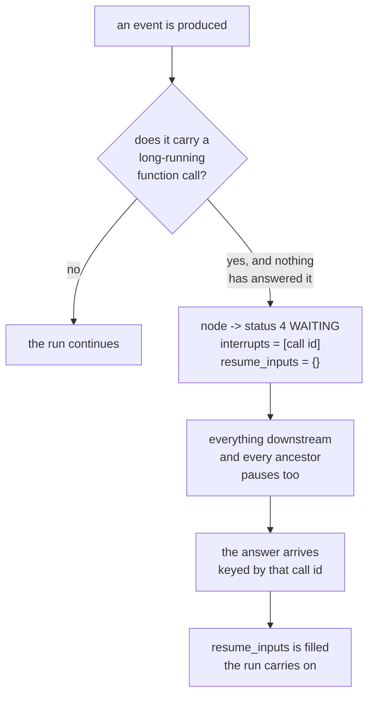

# 1.2 — The token you keep while you fetch a photocopy

## One-line answer

There is no `runner.pause()` in ADK: an invocation pauses **only** when an event carries a
long-running function call nobody has answered yet, and the node is then frozen at status
`4 WAITING` with that call's id sitting in `interrupts` and a slot called `resume_inputs` waiting
for the reply.

## The story

You are at a government office window with a folder of papers. The clerk goes through them, and
near the bottom she stops and says: *"This one needs a photocopy of the back page too. The shop is
downstairs."*

She does not tear up your file. She does not send you to the end of the queue. She writes something
on the top of your file, puts it in a tray beside her, and hands you back your token — number 47.
Then she calls number 48.

You go downstairs, get the photocopy, come back up, and give the copy and the token to the same
clerk. She takes your file out of the tray and carries on from the page she stopped at.

Two things made that work, and neither is obvious until you look for them. The file was **set aside
in a specific place**, not left on the general pile, so it is findable. And it was set aside with a
note saying **what it is waiting for** — not "paused", but "waiting for a photocopy of the back
page". If the note said only "paused", the clerk would have to read the whole file again to work out
what to ask you for.

## The idea in plain language

[1.1](1.1-the-call-that-dropped-and-the-call-that-ended.md) covered runs that stop because something
went wrong. This part is about a run that stops because it is **supposed to**.

A **pause** is a stop the system chose. The run is not broken and it is not finished; it is waiting
for something that has not arrived, and it intends to carry on when it does.

The first thing to understand about ADK is what is *not* there. There is no `runner.pause()`, no
`invocation.suspend()`, no flag you set to freeze a run. You cannot pause an ADK invocation from the
outside at an arbitrary moment, and looking for the method is the most common way to waste an
evening on this subject.

What exists instead is one specific, narrow condition. A **long-running function call** is a tool
call that the framework does not expect an answer to immediately — the tool says, in effect, *"I have
started something; the answer will come from somewhere else, later."* When an event carries one of
those and nothing has answered it, the invocation pauses.

That is the entire pause mechanism. A pause is not a state you request; it is a state you **arrive
in** by asking a question nobody has answered yet.

Three terms, which the rest of the day uses:

- **status** — where a node had got to when the record was written. It is a number, and
  [2.2](../02-inside-the-box/2.2-opening-the-fuse-box.md) reads them off a real file.
- **`interrupts`** — the list of call ids this node is blocked on. The clerk's note saying *what*
  the file is waiting for.
- **`resume_inputs`** — the slot the answers come back in, keyed by those ids. The tray where the
  photocopy goes when you return with it.

The reason this narrowness matters to you rather than being trivia: it means **every human-in-the-
loop pattern Day 62 builds, and every approval gate Days 63 and 64 build, has to be expressed as a
long-running function call.** There is no other way to make an ADK run wait. If you want a run to
stop and wait for a person, you do not reach for a pause primitive — you arrange for the run to ask
a question, and the pause is a consequence.

## Why Sutra needs it

Day 62 is about the four shapes a human can occupy in a run, and Day 64 builds an approval gate on
the triage graph's write step. Both of those are runs that must stop, wait for a person who may be
asleep, and carry on. If a reader arrives at Day 62 believing there is a pause switch, every
mechanism there will look like an odd workaround instead of the direct expression of how the runtime
works.

There is also a negative result that this part exists to deliver early: because a pause requires an
unanswered call, **a graph cannot be paused between two ordinary nodes.** There is no seam there.
That constrains where an approval gate can physically go, which is Day 63's design problem, and it
is better learned here from the enum than there from a failure.

## The mechanism

`pausepoint.py` reads the answer out of the installed package rather than out of a document. It
prints the status enum, every field of the graph's node-state record, and the runtime's own
statement of the pause condition. Verified against `adk.dev/runtime/resume/`, fetched 2026-09-06,
which says an invocation is interrupted by *"dropped network connections, power failure, or a
required external system going offline"* and describes resuming by invocation id — the enum below is
where the mechanism actually lives.

```bash
cd days/day-61-pause-resume-checkpoints/lab
uv run python pausepoint.py
```

**Line by line:**

- The script imports `NodeStatus` and `NodeState` from `google.adk.workflow`. Both are private
  modules — the leading underscore in `_node_status` says so — which is a deliberate choice here:
  this part is reading the runtime's internals to explain them, not proposing that Sutra's code
  import them.
- `inspect.getdoc(InvocationContext.should_pause_invocation)` prints the framework's **own**
  docstring rather than a paraphrase of it. On a question like "what exactly causes a pause", the
  primary source is one line of Python away, so quoting anything else would be a choice to be less
  accurate.
- The last two lines build a `NodeState` in each of the two states and dump them with
  `exclude_defaults=True`, so the output shows only the fields that actually differ.

Measured on 2026-09-06:

```text
NodeStatus - the seven states a node can be checkpointed in:
  0  INACTIVE   not ready to be executed
  1  PENDING    ready to be executed
  2  RUNNING    being executed
  3  COMPLETED  executed successfully
  4  WAITING    waiting (e.g. for a user response or re-trigger)   <- a pause lives here
  5  FAILED     failed
  6  CANCELLED  cancelled

Every field NodeState carries - this is the whole graph checkpoint:
  status         default=<NodeStatus.INACTIVE: 0>
  input          default=None
  attempt_count  default=1
  interrupts     default=[]
  resume_inputs  default={}
  run_counter    default=0
  run_id         default=None
  parent_run_id  default=None

The pause condition, from InvocationContext.should_pause_invocation:
  Returns whether to pause the invocation right after this event.
  "Pausing" an invocation is different from "ending" an invocation. A paused
  invocation can be resumed later, while an ended invocation cannot.
  Pausing the current agent's run will also pause all the agents that
  depend on its execution, i.e. the subsequent agents in a workflow, and the
  current agent's ancestors, etc.
  Note that parallel sibling agents won't be affected, but their common
  ancestors will be paused after all the non-blocking sub-agents finished
  running.
  Should meet all following conditions to pause an invocation:
    1. The current event has a long running function call.

A node that is waiting, against one that is merely running:
  waiting: {'status': 4, 'interrupts': ['call-7f3a']}
  running: {'status': 2}
```

Three things in that output are worth stopping on.

**The condition is a list with one item in it.** *"Should meet all following conditions to pause an
invocation: 1. The current event has a long running function call."* That is the framework's own
sentence, and there is no second condition. Everything Days 62 to 64 do with humans routes through
this single line.

**`WAITING` is a status, not an absence of one.** A paused node is not a node the runtime has
forgotten about. It is recorded, in the log, at `4`, and it is distinguishable from `2 RUNNING` —
which is what [1.1](1.1-the-call-that-dropped-and-the-call-that-ended.md)'s killed run left behind.
That distinction is the machine-readable version of the difference between *the clerk set your file
aside* and *the clerk collapsed while holding it*.

**The difference between the two records is two fields.** `{'status': 4, 'interrupts': ['call-7f3a']}`
against `{'status': 2}`. A pause is a status change plus a note saying what is being waited for. The
`resume_inputs` slot is empty in the waiting record because nothing has answered yet; that is the
tray, and it is where Day 62's answer will land.

The docstring's fourth sentence is the one that catches people out later, so read it now: *"Pausing
the current agent's run will also pause all the agents that depend on its execution."* A pause is not
local. One node waiting on a photocopy stops everything downstream of it, and everything that
contains it, all the way up.



## When it breaks

The break is looking for the switch. There is no `pause` on the runner, and the way you find that
out should be by asking the object rather than by searching the internet, where the answer will be
about a different framework:

```bash
cd days/day-61-pause-resume-checkpoints/lab
uv run python -c "from google.adk.runners import Runner; print([n for n in dir(Runner) if 'paus' in n.lower() or 'susp' in n.lower() or 'stop' in n.lower()])"
```

**Line by line:**

- `dir(Runner)` lists every attribute the class actually has in the installed 2.7.1, which settles
  the question in one line and stays correct when the version changes.
- The filter covers the three words people reach for — pause, suspend, stop — so a negative result is
  a negative result about the whole idea rather than about one spelling.

```text
[]
```

An empty list. Not "there is a method but it is named something else" — there is nothing of that
shape at all, and a reader who was about to write `runner.pause()` now knows in one command.

The second break is more expensive because it fails silently: **expecting a plain node to pause.**
An ordinary node that simply takes a long time is `2 RUNNING`, not `4 WAITING`, and nothing about it
is resumable in the sense this day means. If you design an approval step as "the node waits until
someone updates a database row", the run is not paused — it is a process sitting in a loop, holding
memory, and it dies with the container. The status enum is the whole explanation, and Day 62 is
where the correct shape gets built.

## In production

**What a professional writes instead.** They stop thinking of the pause as the feature and start
thinking of the **unanswered call id** as the feature. The id in `interrupts` is a durable, external
handle: it can go into a notification, sit in a queue, be shown on a web page, and come back hours
later from a different process. Designing the id — what it identifies, whether it is guessable, how
long it is valid — is the actual engineering work, and Day 64 has to do it properly because an
approval whose id can be forged is not an approval.

**What degrades at scale.** Paused runs accumulate. Every one is a row in a store and an obligation
somebody has to discharge, and unlike a running node it consumes no CPU to remind you it exists. A
system with no query for *"how many runs are waiting, and for how long"* will quietly grow a backlog
of them, and the first time anybody counts is usually during an incident about something else.

**The failure mode that only appears with real traffic.** The answer that arrives twice, and the
answer that arrives for a run that has already been abandoned. Both are ordinary once there are
enough runs and enough humans, and both are decided by whether `resume_inputs` is keyed by an id the
answering party had to quote — which it is. Day 60's idempotency argument
([3.3](../../../day-60-durable-execution/parts/03-doing-it-twice/3.3-the-key-names-the-intention.md))
applies to the answer as much as to the action.

**The review comment a senior engineer leaves:** *"This node blocks on a database poll and calls
that a pause. It is not a pause — the node is at status RUNNING and the process is pinned for the
whole wait, so this dies on the next deploy and loses the run. If it has to wait for a person, it
has to ask a question the runtime can see, so the node reaches WAITING and the process can go
away."*

**The interview question:** *"How do you pause an agent run?"* An honest answer: *"In ADK you don't,
directly — there is no pause method on the runner, and I checked with `dir()` rather than assuming.
A run pauses as a consequence of emitting a long-running function call that nothing has answered:
the node goes to status 4, WAITING, the call id lands in `interrupts`, and the answer comes back
through `resume_inputs` keyed by that id. The framework's own docstring lists exactly one condition
for a pause. The practical consequence is that anything involving a human has to be shaped as a
question the runtime can see, and everything downstream of the waiting node, plus all its ancestors,
pauses with it."*

## Check yourself

```bash
cd days/day-61-pause-resume-checkpoints/lab
uv run python pausepoint.py
uv run python -c "from google.adk.workflow._node_status import NodeStatus; print(len(NodeStatus), [m.name for m in NodeStatus])"
```

Now look at the two dumps at the bottom of the output and write down which fields a `WAITING` node
carries that a `RUNNING` node does not. Then find, in the seven statuses, the two that mean the run
is over and will not be picked up again.

**Out loud, without scrolling up:** what is the one and only condition that makes an ADK invocation
pause, and what does that force you to do if you want a run to wait for a human being?

**Next:** [1.3 — Bring the cloth or bring the receipt](1.3-bring-the-cloth-or-bring-the-receipt.md).
