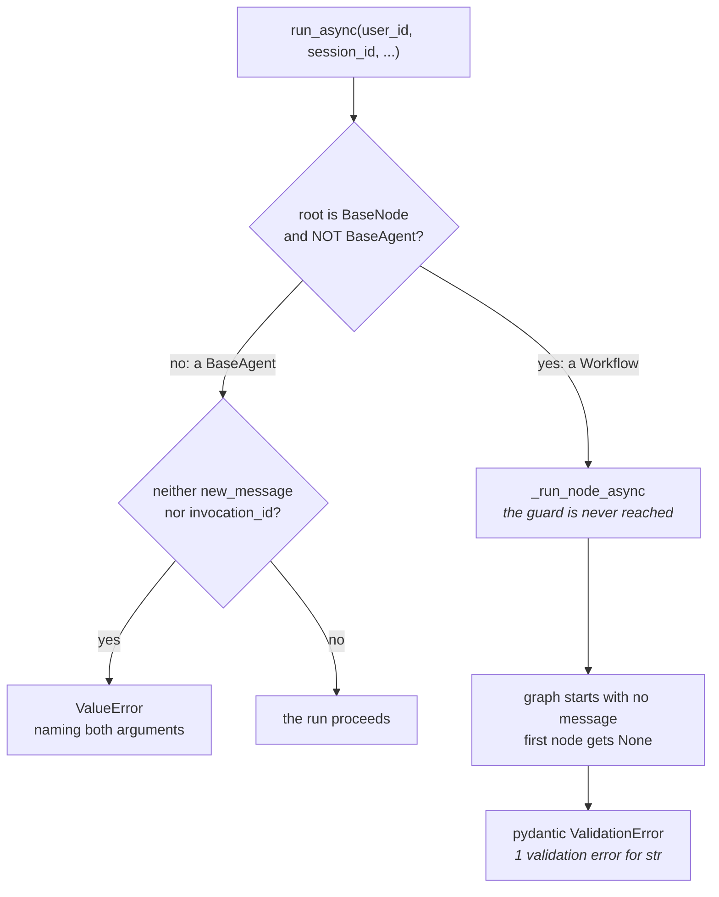

# 1.3 — Bring the cloth or bring the receipt

## One-line answer

A start and a resume are the **same method with different arguments**, and giving it neither is
refused in two different ways depending on the shape of your root — a `BaseAgent` root gets the
documented `ValueError`, while a `Workflow` root never reaches that guard and fails later with a
pydantic `ValidationError` about a missing string.

## The story

There is a tailor at the end of the market who does two kinds of business at the same counter.

Bring him cloth and he measures you, writes a docket, and starts something new. Bring him the docket
from last month and he goes to the rail at the back, finds your half-finished shirt, and carries on
with it. Same man, same counter, same conversation opener.

Bring him neither — walk up with empty hands and say "carry on then" — and he looks at you and waits.
He is not being difficult. He genuinely cannot act. There are forty shirts on that rail and no way
to know which one is yours, and there is no cloth to start a new one from. The request is not
refused because it is against the rules. It is refused because it does not contain enough
information to mean anything.

What he does *next* is the part worth noticing. If he is the sort who has been doing this for
thirty years, he says "docket?" straight away. If he is new, he goes to the rail, looks along it,
comes back, and then says he cannot find it. You end up in the same place either way, but only one
of them told you what was actually wrong.

## The idea in plain language

Day 60's [4.2](../../../day-60-durable-execution/parts/04-the-adk-surface/4.2-the-invocation-id-is-the-claim-ticket.md)
established the shape: a resume is an ordinary `run_async` call carrying the old **invocation id**
and no new message. An **invocation id** is the identifier the runtime assigns to a run when it
starts, and it is the only handle by which that run can ever be found again.

So there are two useful calls and they differ only in what you hand over:

| you pass | it means |
| --- | --- |
| `new_message` | start something new |
| `invocation_id` | carry on with that one |

And there are two useless calls: passing neither, and passing an id that was never issued.

The interesting part — and the reason this part exists rather than being a line in Day 60 — is that
ADK 2.7.1 rejects the useless calls **differently depending on what your root agent is**, and one of
the two rejections is the one the documentation promises while the other is not.

Two terms, because the distinction turns on them:

- A **`BaseAgent`** is the classic ADK agent class: something with a `_run_async_impl` that yields
  events. The custom scoring agent in today's drill is one.
- A **`Workflow`** is the graph — the 2.x composition layer that Day 53 introduced, holding nodes and
  edges. It is a **node**, and it is *not* a `BaseAgent`.

That last sentence is not pedantry. It decides which branch of the runner your call goes down, and
therefore which error you get.

## Why Sutra needs it

Every resume in the rest of Phase 9 is this call. Day 64 resumes a run after a human approves
something; Day 65 kills the triage graph four times and resumes it four times. If the argument rules
are fuzzy, every one of those becomes trial and error.

The root-shape difference matters for a more specific reason. Sutra's triage graph is a `Workflow`,
so **the error message a Sutra developer will actually meet is the pydantic one**, not the friendly
`ValueError` that says what to pass. A reader who has memorised the documented message will not
recognise the failure when it happens to them.

## The mechanism

`handle.py` makes the same call four ways, each in its own fresh store so nothing measures a
leftover, then repeats the "neither argument" call against the two root shapes.

```bash
cd days/day-61-pause-resume-checkpoints/lab
uv run python handle.py
```

**Line by line:**

- Each arm gets its own JSON store and its own session, created fresh. Sharing one store between
  arms would let arm two's run be found by arm three, and the measurement would be of the leftover
  rather than of the argument.
- The drill narrates every station it runs, so `arm()` redirects stdout into a buffer and prints only
  the verdict plus a count of stations that did work. The narration is [4.1](../04-the-drill/4.1-the-monthly-generator-test.md)'s
  subject, not this part's.
- `refusal()` builds a one-off `App` around whichever root it is handed, so the two root shapes are
  compared with everything else — resumability, service, session — held identical.
- Both helpers catch `Exception` deliberately. The refusal **is** the measurement here, so swallowing
  it to print it is the point rather than a violation of trap #4; nothing downstream depends on the
  call having succeeded.

Measured on 2026-09-06:

```text
  one method, four sets of arguments:

  new_message only - a start             ran     (5 stations did work)
  invocation_id of a finished run        ran     (4 stations did work)
  neither argument                       refused ValidationError: 1 validation error for str
  an invocation_id nobody issued         refused ValidationError: 1 validation error for str

  the same call, neither argument, against two root shapes:

  Workflow root                          BaseNode=True BaseAgent=False
  BaseAgent root                         BaseNode=True BaseAgent=True

  Workflow root, neither argument        ValidationError: 1 validation error for str
  BaseAgent root, neither argument       ValueError: Running an agent requires either a new_message or an invocation_id to resume a previous invocation. Session: S1, User: learner
```

Four things to read out of that.

**A start works and does five stations of work.** Summarise, four candidates scored, report — that is
the whole drill, and it is the baseline.

**Resuming a finished run does not do nothing.** It ran, and it did **four** stations of work. That
is not a typo and it is not harmless: the run had already completed, and resuming it re-scored all
four candidates. [3.5](../03-the-agents-own-note/3.5-handing-back-the-key.md) explains exactly why,
and the reason is the mechanism that is supposed to prevent it. For now, note that "resume" does not
mean "resume if there is anything left to do".

**Both useless calls give the same pydantic error**, and it is a bad one. `1 validation error for
str` tells you that something wanted a string and got `None`. It does not mention invocations,
messages, or resuming. A developer meeting this for the first time will go looking for a bug in
their own node, because the message is about their node's type annotation.

**The last two lines are the explanation.** `Workflow` is a `BaseNode` and **not** a `BaseAgent`;
the custom agent is both. The runner branches on exactly that, so the two shapes never reach the
same code. The `BaseAgent` root hits the documented guard and gets a sentence that tells you what to
do. The `Workflow` root sails past it, starts the graph with no message, hands the first node
`None` where it declared `str`, and pydantic complains.

You can read the branch yourself, which is worth doing once because it explains a class of confusion
rather than one message:

```bash
cd days/day-61-pause-resume-checkpoints/lab
uv run python -c "
import inspect
from google.adk import runners
src = inspect.getsource(runners).splitlines()
print(chr(10).join(src[1240:1243] + ['    ...'] + src[1273:1279]))
"
```

**Line by line:**

- `inspect.getsource` reads the installed 2.7.1 rather than a copy in this document, so the excerpt
  cannot drift from the package the reader has.
- The two slices are the branch at the top and the guard further down, with `...` standing in for the
  fifty lines between them. Printing them adjacent is what makes the relationship visible.
- `chr(10)` is a newline. It is spelled that way so the whole program survives being pasted inside
  the double quotes of a shell command.

```text
    if isinstance(self.agent, BaseNode) and not isinstance(
        self.agent, BaseAgent
    ):
    ...
        if not invocation_id and new_message is None:
          raise ValueError(
              'Running an agent requires either a new_message or an '
              'invocation_id to resume a previous invocation. '
              f'Session: {session_id}, User: {user_id}'
          )
```

The first `if` returns early for anything that is a node but not an agent — that is every
`Workflow`. The guard that produces the helpful message is below it, on the path that a `Workflow`
never takes.

This is not a contradiction of Day 60's 4.2, and it is worth being precise about why: that part
measured a root that reaches the guard, and its statement is correct for that shape. Both
measurements are true; the missing piece was **which shape you have**. Sutra's triage graph is a
`Workflow`, so Sutra gets the pydantic error.



## When it breaks

The break is the unissued id, and it is worse than it looks in the table above:

```text
  an invocation_id nobody issued         refused ValidationError: 1 validation error for str
```

`e-nope` is not an invocation id. Nothing has ever been issued with that value. And ADK does not say
so — there is no *"no such invocation"*, no lookup failure, no mention of the id at all. The run
simply proceeds as though it were resuming, finds nothing to resume, and dies downstream on a type
error in the first node.

That is a genuinely dangerous shape for a resume path that takes its id from anywhere external — a
queue message, a URL, an operator typing it. A typo and a legitimately stale id produce the same
message as a bug in your own node, so the log line that ought to say *someone asked for a run that
does not exist* instead says *your node's annotation is wrong*.

The smallest fix is to not rely on the framework for this. Before resuming, look the id up and refuse
if it is not there:

```bash
cd days/day-61-pause-resume-checkpoints/lab
uv run python -c "
from _store import events
ids = {e['invocation_id'] for e in events('drill_clean.json')}
for wanted in ('e-nope', sorted(ids)[0]):
    print(f'{wanted[:20]:<22} known: {wanted in ids}')
"
```

**Line by line:**

- `events()` reads the stored session straight off disk, which is the same source a resuming process
  would have.
- Building a `set` of the invocation ids present is the whole check. A resume against an id that is
  not in that set is a caller error, and it can be reported as one before ADK is ever called.
- The loop deliberately checks a known-bad id and a known-good one, so a passing result is evidence
  the check discriminates rather than evidence it always says yes.

```text
e-nope                 known: False
e-df477f21-0711-4492   known: True
```

## In production

**What a professional writes instead.** They do not expose `run_async` directly to a caller. They
write a thin resume entry point that takes an id, looks it up, checks that the run exists, that it
belongs to this user, and that it is in a state worth resuming — and only then calls the runner. The
framework's argument validation is a backstop for developer error, not an authorisation layer, and
the measurement above shows it is not even a complete backstop.

**What degrades at scale.** Invocation ids arrive from queues, retries and notifications, which
means the same id arrives more than once and old ids arrive long after the run they name has been
cleaned up. A resume endpoint that treats "not found" as an error to be logged will produce noise on
every retention sweep; one that treats it as a normal outcome and returns "already gone" will not.
Deciding which it is belongs in the design, not in an alert.

**The failure mode that only appears with real traffic.** Two resumes of the same invocation id
arriving at once, from two workers that both picked up the same notification. Nothing in the call
signature prevents it, and both will proceed. This is Day 60's idempotency problem
([3.3](../../../day-60-durable-execution/parts/03-doing-it-twice/3.3-the-key-names-the-intention.md))
arriving through the resume path, and [4.3](../04-the-drill/4.3-the-mason-who-comes-back-in-the-morning.md)
shows what a second pickup actually does to the event count.

**The review comment a senior engineer leaves:** *"This passes an invocation id straight from the
request body into `run_async`. ADK does not validate that the id exists — I checked, an unknown id
produces a pydantic error about a string, not a not-found — so a typo here is indistinguishable from
a bug in the graph, and any id a user can guess is a run a user can restart. Look it up, check it
belongs to them, then resume."*

**The interview question:** *"What happens if you resume a workflow with an invocation id that
doesn't exist?"* An honest answer: *"In ADK 2.7.1, not what you would hope. I tried it. There is no
not-found error — the runner proceeds as if resuming, the graph starts with no message, and the
first node gets `None` where it declared a string, so what you actually see is
`pydantic ValidationError: 1 validation error for str`. It is the same error you get from passing no
arguments at all. There is a helpful `ValueError` in the runner that names both required arguments,
but it sits on the legacy `BaseAgent` path, and a `Workflow` root is a `BaseNode` that is not a
`BaseAgent`, so it branches away before reaching it. The practical answer is to validate the id
against the store yourself before calling resume."*

## Check yourself

```bash
cd days/day-61-pause-resume-checkpoints/lab
uv run python handle.py
```

Now change the fourth arm's id from `e-nope` to a real invocation id copied out of
`drill_clean.json`, re-run, and say what changed. Then predict, before running it, what the second
arm's station count would be if the drill had six candidates instead of four.

**Out loud, without scrolling up:** a start and a resume are the same method — what tells them
apart, and why does a `Workflow` root give you a different error from a `BaseAgent` root when you
pass neither?

**Next:** [2.1 — Two people writing in one notebook](../02-inside-the-box/2.1-two-people-writing-in-one-notebook.md).
