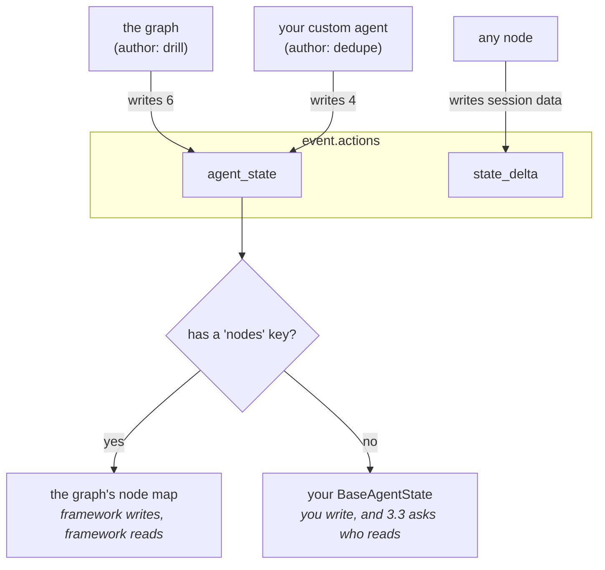

# 2.1 — Two people writing in one notebook

## One-line answer

`event.actions.agent_state` is not one kind of record but **two sharing a field** — the graph writes
a map of node statuses and a custom agent writes its own private object — and in a fifteen-event run
that is six of the first, four of the second, and five events carrying neither.

## The story

There is a notebook by the phone in the hall, and two people write in it.

Your mother takes messages. *"Sharma called about the water tank, ring back after six."* One line,
sometimes two, whenever the phone goes.

Your brother keeps the milk account in the same notebook, because it is the notebook that is there.
*"12/4 — 2L — 96."* A date, a quantity, a number.

Nobody ever agreed on this arrangement and nobody has ever been confused by it, because the two
kinds of line do not look remotely alike. You can open the notebook at any page and tell, without
reading a whole entry, which sort you are looking at. One has somebody's name in it and the word
"called". The other is three numbers and a slash.

The trouble would start on the day someone wrote *"Milk man called, 2L short"* — a line that is
shaped like a message and is really about the account. Then you would need a rule instead of a
glance.

## The idea in plain language

Day 60's [4.3](../../../day-60-durable-execution/parts/04-the-adk-surface/4.3-what-adk-writes-into-the-log.md)
established the big idea: ADK's checkpoint is not a separate file. It is **extra events in the
session log**, carrying a field called `agent_state`, and after a crash the dead run's own record
shows which nodes had finished and which was still going.

This part adds the thing that part did not need and today's section 3 cannot do without: **there are
two different writers using that field.**

- The **graph** writes a map. One entry per node, each holding that node's status and the
  bookkeeping from [1.2](../01-two-ways-to-stop/1.2-the-token-you-keep-while-you-fetch-a-photocopy.md)
  — `interrupts`, `resume_inputs` and the rest. It is written by the runtime, about the runtime's own
  progress through the graph, and you never write one by hand.
- A **custom agent** — a `BaseAgent` with its own `_run_async_impl`, like the scoring station in
  today's drill — writes whatever object it likes, as long as that object is a `BaseAgentState`.
  This one is yours. Nothing puts it there but your code.

Both land in the same field of the same events in the same log. Telling them apart is a matter of
looking at the shape: the graph's has a key called `nodes`, and yours has whatever you called your
fields.

Why does that matter enough for a part? Because the two records have completely different
**lifecycles**, and the whole of section 3 is about one of those lifecycles having a hole in it. The
graph's map is written and read by the framework. Your object is written by the framework on your
behalf, and — as [3.3](../03-the-agents-own-note/3.3-the-rough-column-nobody-marks.md) measures —
read back only under one condition that nobody tells you about.

Seeing that they are two things, in one field, is the prerequisite for noticing that only one of them
comes back.

## Why Sutra needs it

Sutra's triage graph has stations that do list work — score four candidate duplicates, check three
knowledge-base articles. Progress *inside* one of those stations is exactly the kind of thing a
custom agent's own state is for, and it is the kind of thing that is expensive to redo, because
under Phase 10's quota rules each item may be a model request.

So Sutra will want to write that second kind of record. Before it does, it needs to know that the
record it writes is a different animal from the one the framework writes, living in the same field,
with different rules about who reads it back.

## The mechanism

`layers.py` reads the clean run of the drill off disk and prints one line per event: who wrote it,
which node it belongs to, and which of the two kinds of checkpoint it carries — decided by whether
the record has a `nodes` key.

```bash
cd days/day-61-pause-resume-checkpoints/lab
uv run python drill.py
uv run python layers.py
```

**Line by line:**

- `drill.py` runs first because `layers.py` only reads. Keeping the producing and the inspecting in
  separate scripts means the inspection can be re-run over and over without changing what it is
  inspecting.
- `kind()` is the whole classifier, and it is one condition: `"nodes" in state`. That is not a
  heuristic — the graph's record is a map under that key and an agent's `BaseAgentState` has whatever
  fields its class declared, so the presence of `nodes` is decisive for the records this runtime
  writes.
- The `state_delta` column is printed alongside deliberately. It is a *third* thing that travels in
  `event.actions`, it is not a checkpoint, and having it visible here is what stops it being confused
  with one in [3.4](../03-the-agents-own-note/3.4-write-it-on-the-shared-board.md).

Measured on 2026-09-06:

```text
  15 events in the clean run of the drill.

  #   author     node_info.path       carries                    state_delta
  0   user       -                    -                          
  1   drill      -                    graph  (NodeState map)     
  2   drill      drill@1/summarise@1  -                          {"ticket": "customer signed out mid-form during single sign-on"}
  3   drill      -                    graph  (NodeState map)     
  4   drill      -                    graph  (NodeState map)     
  5   dedupe     drill@1/dedupe@1     agent  (BaseAgentState)    
  6   dedupe     drill@1/dedupe@1     agent  (BaseAgentState)    
  7   dedupe     drill@1/dedupe@1     agent  (BaseAgentState)    
  8   dedupe     drill@1/dedupe@1     agent  (BaseAgentState)    
  9   dedupe     drill@1/dedupe@1     -                          
  10  drill      -                    graph  (NodeState map)     
  11  drill      -                    graph  (NodeState map)     
  12  drill      drill@1/report@1     -                          
  13  drill      -                    graph  (NodeState map)     
  14  drill      -                    graph  (NodeState map)     

  graph checkpoints 6   agent checkpoints 4   plain events 5
```

Read the `author` column first, because it is the clearest signal in the table. Events written by
`drill` are the graph's; events written by `dedupe` are the scoring agent's. **Every single agent
checkpoint is authored by `dedupe` and every single graph checkpoint is authored by `drill`.** The
two writers are visible by name.

Now the counts. **Six graph checkpoints, four agent checkpoints, five events carrying neither**,
adding to fifteen. Each of those numbers has a cause worth knowing:

- **Four agent checkpoints** because there are four candidates and the scoring station writes one
  after each. That is a rate you chose, and [2.4](2.4-how-often-you-press-save.md) is about choosing
  it.
- **Six graph checkpoints** because the graph writes one every time a node's status changes —
  entering a node, leaving it, three nodes. You did not choose this number and cannot.
- **Five plain events** — the user's message at 0, the two nodes' actual outputs at 2 and 12, the
  agent's closing event at 9, and the run's final event at 14.

Event 9 is the one to look at twice. It is authored by `dedupe`, it sits at the end of the agent's
four checkpoints, and it carries **no** checkpoint at all. That is not the agent forgetting. It is
the agent deliberately tearing its note up, which is [3.5](../03-the-agents-own-note/3.5-handing-back-the-key.md)'s
subject and one of the sharper surprises in the day.

And event 2 shows the third passenger. `state_delta` carries `{"ticket": "..."}` — the summarise
station writing into session state. That is neither kind of checkpoint. It is a change to the
session's own data, it rides in the same `actions` object, and keeping it clearly separate in your
head now will save you in [3.4](../03-the-agents-own-note/3.4-write-it-on-the-shared-board.md), where
the difference between *the agent's private note* and *the session's shared state* turns out to
decide whether a resume works.



## When it breaks

The break is assuming one field means one kind of thing, and it breaks the moment you write code
that reads the log — a debugging script, a dashboard, a retention job.

Here is the version you can reach on purpose. Read every checkpoint in the file as though they were
all the graph's:

```bash
cd days/day-61-pause-resume-checkpoints/lab
uv run python -c "
from _store import checkpoints
for row in checkpoints('drill_clean.json'):
    print(sorted(row['nodes']))
"
```

**Line by line:**

- `checkpoints()` returns every non-empty `agent_state` in the file, oldest first — both kinds,
  because the store does not separate them.
- `row['nodes']` is the assumption under test. It is correct for six of the ten records and wrong for
  four.

```text
['summarise']
['summarise']
['dedupe', 'summarise']
Traceback (most recent call last):
  File "<string>", line 4, in <module>
KeyError: 'nodes'
```

Three lines of plausible output and then a `KeyError`. Note what that means for a script that does
something less obviously wrong than indexing — a length, a filter, a count. It would not raise. It
would silently give an answer computed over the wrong subset, and the number would look reasonable,
because six and ten are both plausible counts of checkpoints in a fifteen-event run.

The smallest fix is the classifier `layers.py` already uses: branch on `"nodes" in row` before
touching anything else, and handle both arms rather than assuming the one you happened to be
thinking about.

## In production

**What a professional writes instead.** They do not classify by shape at all if they can avoid it.
Shape-sniffing works here because the two records happen to be distinguishable, which is a property
of today's classes and not a promise. Where the log is read by anything other than the framework —
an operations tool, a support script — the durable move is to put a discriminator in your own state
object: a field like `kind: "dedupe-progress"` that says what this record is, so your reader is
matching on something you control rather than on the absence of a key ADK chose.

**What degrades at scale.** The graph's six-per-run is fixed by the number of nodes, but your
agent's count is proportional to the work, and list work grows. A station scoring four candidates
writes four; the same station over a real archive writes hundreds, and every one of them is a full
copy of the state object, not a delta. [2.4](2.4-how-often-you-press-save.md) measures what that
costs and Day 60's
[7.1](../../../day-60-durable-execution/parts/07-in-production/7.1-what-a-checkpoint-costs.md) sets
the retention rule that stops it accumulating for ever.

**The failure mode that only appears with real traffic.** Two agents in one graph with the same
name. The agent's record is keyed by agent name, so two stations both called `worker` write into the
same slot and read each other's progress. In a three-node teaching graph this is impossible to
achieve by accident; in a graph assembled from reusable sub-graphs it is one careless default away,
and the symptom is a station that skips work it never did.

**The review comment a senior engineer leaves:** *"This dashboard counts checkpoints by counting
events with a non-null `agent_state`. That field carries two different records — the graph's node
map and each custom agent's own state — so this number is the sum of two unrelated things and will
move when someone adds a node, which has nothing to do with what the dashboard claims to show. Split
them."*

**The interview question:** *"Where does an agent framework keep its checkpoints?"* An honest
answer: *"In ADK 2.7.1 there is no separate checkpoint store — they are events in the ordinary
session log, in `event.actions.agent_state`. What surprised me is that the field carries two
different kinds of record. The graph writes a map of node statuses, keyed by node name; a custom
agent writes its own `BaseAgentState` subclass. I measured a fifteen-event run: six graph
checkpoints, four agent checkpoints, five plain events. They are told apart by whether the record has
a `nodes` key, and they are authored by different names in the log. That distinction matters because
the two are read back under different rules, and only one of them is read back reliably."*

## Check yourself

```bash
cd days/day-61-pause-resume-checkpoints/lab
uv run python layers.py
```

Now add a fifth candidate to `CANDIDATES` in `_drill.py`, re-run `drill.py` and then `layers.py`, and
write down all three counts. Say which of the three changed, which did not, and why.

**Out loud, without scrolling up:** two different records share one field in the event log. What are
they, who writes each, and how do you tell them apart by looking?

**Next:** [2.2 — Reading the back of the card](2.2-opening-the-fuse-box.md).
