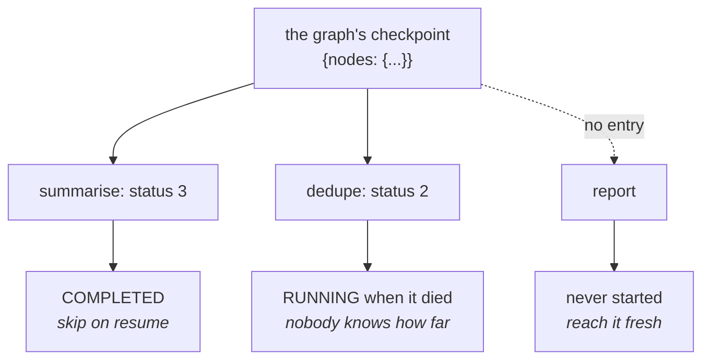

# 2.2 — Opening the fuse box

## One-line answer

The graph's checkpoint is a small readable map of node name to status — measured on a killed run it
is `summarise: 3` and `dedupe: 2`, five of eight fields left at their defaults and omitted — and the
station that never started is not in the map at all.

## The story

The light in the back room stops working, so you open the metal door of the distribution board on
the wall.

Inside there are eight switches in a row, and a strip of paper stuck to the inside of the door with
somebody's handwriting on it: *kitchen, back room, geyser, plugs upstairs*. Four names for eight
switches. The other four have nothing written against them, because when the house was wired those
circuits were not connected to anything yet, and nobody has been back to update the paper.

You look along the row. Most of the switches are up. One — the one the paper calls *back room* — is
down. That is the whole diagnosis, and it took a second, because the board is not a description of
how the wiring works. It is a **statement of what is currently on and what is currently off**, small
enough to take in at a glance.

The four blank lines matter too, and in a way that is easy to miss. A blank line does not mean that
circuit is off. It means nobody ever connected it. Those are different situations, and the board
tells you which is which by whether there is a label at all.

## The idea in plain language

[2.1](2.1-two-people-writing-in-one-notebook.md) showed that two kinds of record share the
`agent_state` field. This part opens the first kind — **the graph's** — and reads it.

It is worth doing literally, with the file on screen, because the thing turns out to be much smaller
and much plainer than people expect. Before opening it, most readers imagine a checkpoint contains
something like a snapshot of the program: variables, a stack, a position in the code. It does not.
It contains a **status per node**, and almost nothing else.

The statuses are the enum [1.2](../01-two-ways-to-stop/1.2-the-token-you-keep-while-you-fetch-a-photocopy.md)
printed. The two that appear in a killed run are:

- **`3 COMPLETED`** — this node finished. On a resume, do not run it again.
- **`2 RUNNING`** — this node was executing when the record was written. Nobody ever wrote a `3` for
  it, so nobody knows whether it got anywhere.

And the third thing, which is the one the fuse box's blank labels stand for: **a node that never
started does not appear in the map at all.** Absence is not a status. It is the absence of a status,
and it means *this had not begun*.

That gives three states from two pieces of information, which is the minimum a resume needs: skip
it, redo it, or reach it for the first time.

## Why Sutra needs it

Day 65 kills the triage graph at four different moments and asks, each time, whether it came back
correctly. Every one of those questions is answered by reading this map — which stations show `3`,
which shows `2`, which are missing — and comparing that against what the run actually did to the
outside world.

There is also a debugging reason that arrives sooner. When a resume behaves oddly, the first useful
question is *what did the run think it had done?* That is a file you can print, and a reader who has
printed it once on a three-node graph will print it again on a nine-node one.

## The mechanism

`box.py` opens the store left by the hard-kill arm of
[1.1](../01-two-ways-to-stop/1.1-the-call-that-dropped-and-the-call-that-ended.md) — a run that was
destroyed mid-list and never resumed — and pretty-prints its last graph checkpoint.

```bash
cd days/day-61-pause-resume-checkpoints/lab
uv run python twostops.py
uv run python box.py
```

**Line by line:**

- `twostops.py` runs first because it produces `stop_exit.json`. `box.py` only reads, so the two can
  be re-run independently once the store exists.
- `box.py` filters `checkpoints()` down to records containing `nodes`, which is
  [2.1](2.1-two-people-writing-in-one-notebook.md)'s classifier — the agent's own records are in this
  same file and are a different subject.
- The last section compares `NodeState.model_fields` against the keys actually present, so the list
  of omitted fields is computed from the installed class rather than typed out from memory. If a
  future ADK adds a field, this output gains a line without anybody editing it.

Measured on 2026-09-06:

```text
  stop_exit.json: 7 events, 13257 bytes

  the last graph checkpoint, pretty-printed:
{
      "nodes": {
          "summarise": {
              "status": 3,
              "interrupts": [],
              "resume_inputs": {}
          },
          "dedupe": {
              "status": 2,
              "interrupts": [],
              "resume_inputs": {}
          }
      }
  }

  what each node's entry means:
    summarise    status 3  finished, do not run it again
    dedupe       status 2  was running when the lights went out

  fields omitted because they are still at their default:
    input
    attempt_count
    run_counter
    run_id
    parent_run_id
```

Four things to take from that.

**The whole checkpoint is nine lines of JSON.** Two nodes, a status each, two empty collections
each. That is the complete record of a run's progress through the graph. There is no stack, no
variables, no position in anybody's Python.

**`summarise` is 3 and `dedupe` is 2.** That is the run's own account of the kill: the first station
finished, the second was mid-work. It matches what
[1.1](../01-two-ways-to-stop/1.1-the-call-that-dropped-and-the-call-that-ended.md)'s output showed
happening, which is the point — the record is a true statement about a process that no longer
exists.

**`report` is not there.** The drill has three stations. The map has two. The third never started, so
it has no entry, and that absence is how a resume knows to reach it fresh rather than to skip or
retry it. If you are ever tempted to initialise a checkpoint map with every node at some default,
this is the reason not to: the empty slot is carrying information.

**Five of the eight fields are missing, and that is fine.** `input`, `attempt_count`, `run_counter`,
`run_id` and `parent_run_id` are all at their defaults, and the serialiser leaves defaults out.
Those fields do real work — `attempt_count` for retries, `run_id` and `parent_run_id` for the dynamic
graphs Day 56 touched — but a straight three-node chain uses none of them. A checkpoint is only as
big as the run was complicated.

The `interrupts` and `resume_inputs` on both nodes are empty, and now they mean something specific
rather than being noise: this run was **killed**, not **paused**. A paused node would have a call id
in `interrupts` and a status of `4`. Comparing this file against that shape is how
[1.2](../01-two-ways-to-stop/1.2-the-token-you-keep-while-you-fetch-a-photocopy.md)'s two dumps stop
being abstract.



## When it breaks

The break is reading the wrong record, and it is easy to reach because both kinds are in the file
and the wrong one is *bigger*, so it looks more informative.

```bash
cd days/day-61-pause-resume-checkpoints/lab
uv run python -c "
import json
from _store import checkpoints
last = checkpoints('stop_exit.json')[-1]
print(json.dumps(last))
print('nodes' in last)
"
```

**Line by line:**

- `checkpoints()[-1]` is the most recent checkpoint of any kind, which is the obvious thing to reach
  for and the wrong thing.
- Printing `'nodes' in last` alongside it turns "this looks odd" into a definite answer.

```text
{"scored": ["4521", "4633"], "results": {"4521": 3, "4633": 2}}
False
```

That is the **agent's** note, not the graph's, because the scoring station wrote after the graph did.
A reader who wanted the node statuses and grabbed the last checkpoint gets a record with no `nodes`
key, no statuses, and no mention of any node — and if their next line indexes `['nodes']` they get
the `KeyError` from [2.1](2.1-two-people-writing-in-one-notebook.md), while if it does something
softer they get a confident wrong answer.

The smallest fix is what `box.py` does: filter first, then take the last of the filtered list.

The second break is expecting the map to tell you how far *inside* a node the work got. It cannot.
`dedupe: 2` says the station was running. It does not say two candidates of four were scored — that
fact lives in the other record entirely, which is what section 3 is about, and it is the reason
section 3 exists.

## In production

**What a professional writes instead.** They print this map in their incident tooling. A stuck or
mis-resumed run generates the question *what did it think it had done?*, and a support tool that can
answer it in one command — node, status, and the missing ones listed explicitly — removes an entire
category of guessing. The one addition worth making is to render absence as a row saying
`not started` rather than leaving it out, because a human reading a list of nine nodes should not
have to notice which three are missing.

**What degrades at scale.** The map is per-node, so it grows with graph size, not with work done —
which is the good direction. What does grow badly is a graph with a dynamic fan-out, where nodes are
created per item: now the map has one entry per item, `run_id` and `parent_run_id` stop being
defaults, and the nine readable lines above become a few hundred. At that size nobody reads it; they
query it, and it needs to be somewhere queryable rather than inside a JSON blob in an event.

**The failure mode that only appears with real traffic.** A node at status `2` that is not actually
running anywhere. The record says `RUNNING` because that is what was true when it was written, and
nothing rewrites it when the process dies — there is nobody left to do the writing. So in any real
system a population of runs sits permanently at `2`, and telling *running now* from *was running when
it died* needs something the map does not have: a timestamp, a lease, or a heartbeat. Deciding which,
and how stale is stale, is real work that this map does not do for you.

**The review comment a senior engineer leaves:** *"This treats a node missing from the checkpoint map
as an error and refuses to resume. It is not an error — it means the node had not started, which is
the normal case for everything downstream of where the run died. As written this can only resume runs
that got past the last node, which is the one case that does not need resuming."*

**The interview question:** *"What is actually inside a workflow checkpoint?"* An honest answer:
*"Less than people expect. In ADK 2.7.1 I printed one from a run I had killed: it is a map from node
name to a small record, and the only field that had a non-default value was the status. Nine lines of
JSON for a three-node graph. Two of my nodes were in it — one COMPLETED, one RUNNING when the process
died — and the third was absent entirely, because it had never started. Those three cases are exactly
what a resume needs: skip, redo, run fresh. What it deliberately does not contain is any position
inside a node, which is why per-item progress has to be stored separately."*

## Check yourself

```bash
cd days/day-61-pause-resume-checkpoints/lab
uv run python box.py
```

Now change `kill_after` from `2` to `4` in the hard-kill arm of `twostops.py`, re-run both scripts,
and write down the two statuses. Then say which node is now missing from the map, and which one has
changed status.

**Out loud, without scrolling up:** a resume reads the graph's checkpoint and sees three
possibilities for a given node. What are they, and how is the third one represented?

**Next:** [2.3 — The recipe and the pan](2.3-the-recipe-and-the-pan.md).
