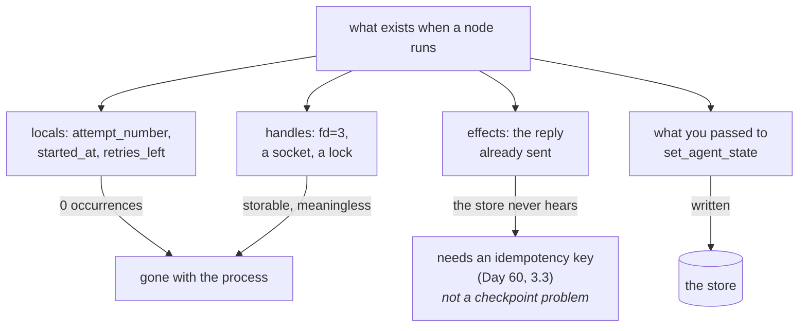

# 2.3 — The recipe and the pan

## One-line answer

A checkpoint holds only what you deliberately put in it — measured, three plausible local variable
names appear **zero times** in the whole store — and the three things it structurally cannot hold
are your locals, any handle owned by the dead process, and the fact that an effect already left the
building.

## The story

Your aunt is teaching you her sambar over the phone and you are writing it down as she talks.

You end up with a good page. Quantities, the order things go in, the bit about adding the tamarind
water late. Weeks later you cook it from that page and it comes out right.

Now imagine the doorbell goes halfway through and you are gone for ten minutes. You come back to the
kitchen holding the page, and the page is no help at all for the only question you have, which is:
**did I already put the salt in?**

The page never claimed it would know. It is a recipe. It describes what to do, not what you have
done. The state of the cooking is in the pan, and the pan does not write anything down.

And there is a worse version, which is the one that actually costs you. If the question had been
*did I already serve a bowl to your uncle*, the page would be no help either — but this time you
cannot fix it by tasting, because the bowl has left the kitchen.

## The idea in plain language

[2.2](2.2-opening-the-fuse-box.md) read what a checkpoint holds. This part is about the boundary of
that, because the boundary is where resumes go wrong, and it is a sharper line than most people
expect.

A checkpoint is not a photograph of your program. It is a **thing you wrote**, and the only reason
anything is in it is that some code put it there. So the rule is short: *if you did not write it
down, it does not exist after the process dies.*

Three categories fall outside, and they are worth separating because the fixes are completely
different.

1. **Local variables.** Anything in a Python function — a counter, a start time, a list you built —
   lives in the process's memory and dies with it. There is no mechanism by which a checkpoint could
   know about them, because nothing ever looked at them.
2. **Handles.** A file descriptor, an open socket, a database connection, a lock. These are worse
   than absent, because you *can* write one down — a file descriptor is just a small number — and
   the number is meaningless anywhere else. Storing it produces a checkpoint that looks like it
   contains a resource and does not.
3. **Effects that already happened.** The email that went out, the row that was written, the ticket
   that was closed. The checkpoint cannot know about these unless something recorded them, and the
   gap between *doing the thing* and *recording that you did it* is exactly Day 60's
   [3.1](../../../day-60-durable-execution/parts/03-doing-it-twice/3.1-the-uncertainty-gap.md) — the
   uncertainty gap, which is a real interval that a kill can land in.

The first two have the same fix and it is a one-liner: **put it in the state object, or accept
losing it.** The third does not have that fix, and it is important to be clear about why. Writing
"I sent the email" into a checkpoint after sending the email does not close the gap; it just moves
it. That problem is idempotency, it is Day 60's, and today's mechanism does not solve it.

## Why Sutra needs it

Sutra's triage graph ends by writing a reply. Somewhere in Phase 10 and 11 it will also send things.
Every one of those is category three, and a reader who has learned that "checkpoints make runs
resumable" without learning where checkpoints stop will assume the write step is covered. It is not,
and Day 64's approval gate has to reason carefully about exactly this — approve a thing, then die,
then resume, and now who knows whether the thing happened?

Categories one and two arrive sooner and more quietly. A scoring station that counts its own retries
in a local, or holds a file open across candidates, works perfectly until the first resume.

## The mechanism

`notinbox.py` takes the killed run from
[1.1](../01-two-ways-to-stop/1.1-the-call-that-dropped-and-the-call-that-ended.md), shows what its
two checkpoints do hold, and then demonstrates each of the three absences rather than asserting them.

```bash
cd days/day-61-pause-resume-checkpoints/lab
uv run python notinbox.py
```

**Line by line:**

- The first block prints both checkpoints side by side — the graph's node map and the agent's own
  note — so that "what is missing" is measured against a concrete "what is present".
- Category one is tested by **searching the entire store text** for three plausible local-variable
  names. Searching the raw file rather than the parsed checkpoint is deliberate: it rules out the
  variable hiding somewhere else in the log, which a narrower check would not.
- Category two opens a real file, prints the descriptor while it is open and again after the `with`
  block releases it. The point is made by the second number, not the first.
- Category three writes a line to `outbox.log` — standing in for an effect that leaves the system —
  and then re-reads the checkpoint to show it is unchanged. The file is deleted at the end so the
  script can be run repeatedly.

Measured on 2026-09-06:

```text
  what the killed run's checkpoints DO hold:
    graph: {"summarise": {"status": 3, "interrupts": [], "resume_inputs": {}}, "dedupe": {"status": 2, "interrupts": [], "resume_inputs": {}}}
    agent: {"scored": ["4521", "4633"], "results": {"4521": 3, "4633": 2}}

  1. a local variable. The node had one; search the whole store for it:
    attempt_number   occurrences in the store: 0
    started_at       occurrences in the store: 0
    retries_left     occurrences in the store: 0

  2. a file handle. It is a number owned by one process:
    inside the with block             fd=3  closed=False
    once the block lets it go         closed=True
    a checkpoint could store the number 3. In another process it names nothing,
    and the block above needed only an indent to invalidate it - a kill needs less.

  3. an effect that already happened. Append one, then read the checkpoint again:
    outbox.log now holds: 'reply sent to customer 4610'
    the checkpoint still says: {"scored": ["4521", "4633"], "results": {"4521": 3, "4633": 2}}
    nothing in the checkpoint knows the reply went out. Day 60's idempotency key is
    the answer, and it is a different mechanism from this one.
```

**Zero, zero, zero.** Three names that a real scoring station might plausibly keep in a local, and
none of them occurs anywhere in a 13,000-byte store. That is not a near miss or a truncation — the
store has no representation of them at all, because nothing in the code ever handed them to
anything that writes.

Put next to the line above it, the contrast is the whole lesson. `scored` and `results` are in the
store, in full, twice over. They are there for exactly one reason: the station calls
`ctx.set_agent_state` with them. `attempt_number` is not there for exactly one reason: it does not.
There is no third rule.

**Category two's finding is the second number, not the first.** `fd=3` while open, `closed=True`
after the block. A descriptor is a small integer that means something only inside the process that
was issued it, and even inside that process it stopped meaning anything the moment the block ended.
Writing `3` into a checkpoint would produce a record that a resuming process can read, parse
successfully, and act on — and the file it names would be whatever that other process happens to
have open as descriptor 3, which is a genuinely alarming class of bug.

**Category three is the one to sit with.** `outbox.log` now holds `'reply sent to customer 4610'`.
The checkpoint is byte for byte what it was. Two things are true of the world and only one of them
is written down anywhere the run can see. A resume will read the checkpoint, see two candidates
scored, and know nothing whatsoever about the reply — so if the resumed run reaches the send step
again, it sends again.

That is not a checkpointing bug and it cannot be fixed by checkpointing harder. It is the
uncertainty gap, and the mechanism that closes it — an idempotency key, written *before* the effect
and checked after — is Day 60's
[3.3](../../../day-60-durable-execution/parts/03-doing-it-twice/3.3-the-key-names-the-intention.md).
Today's job is only to be exact about which problem is which.



## When it breaks

The break that costs an evening is category one, because it fails on the *resume* rather than on the
run, so the tests pass.

Reach it on purpose. `locals.py` wraps the scoring station so it counts its own work in an
ordinary Python local, kills the process after two candidates, and resumes in a second process:

```bash
cd days/day-61-pause-resume-checkpoints/lab
uv run python locals.py
```

**Line by line:**

- The wrapper keeps `seen` as an ordinary local, which is precisely the habit under test — it is the
  natural way to count something inside a loop.
- The two phases run as **separate subprocesses**. They have to: `os._exit(9)` destroys the
  interpreter it is called in, so a single process cannot both die and then resume. Any version of
  this experiment written as one process measures nothing, because the second half never runs.
- `rerun_on_resume=True` is set so the station actually runs again on resume. Without it the station
  is skipped and there is no second count to compare — which is Day 60's finding and
  [3.4](../03-the-agents-own-note/3.4-write-it-on-the-shared-board.md)'s subject.

```text
  -- the first process, killed after two candidates (exit 9) --
    dedupe: scored 4521 -> 3
      seen = 1
    dedupe: scored 4633 -> 2
      seen = 2

  -- a second process, resuming the same run (exit 0) --
    dedupe: scored 4521 -> 3
      seen = 1
    dedupe: scored 4633 -> 2
      seen = 2
    dedupe: scored 4701 -> 0
      seen = 3
    dedupe: scored 9999 -> 1
      seen = 4
      seen = 5
    report: 4 candidates scored, closest is 4521
```

The counter reaches 2, the process dies, and in the second process it starts again **at 1**. It is
not restored, it is not carried, and nothing warns you. Any decision made on that number — *stop
after three attempts*, *log every fifth* — is now made on a number that silently resets at every
kill, so a run that is killed repeatedly can retry for ever while its counter never gets past two.

Two details in that output are not about locals and are worth naming so they do not confuse.
`seen = 5` appears without a `scored` line above it, because the station yields a closing event
after the last candidate — that is [3.5](../03-the-agents-own-note/3.5-handing-back-the-key.md)'s
subject. And the second process re-scores `4521` and `4633`, which it should not need to: the
station's own checkpoint recorded them and was not read back. That is the largest finding in the
day and it is section 3's, not this part's.

The fix is one line and it is not clever: put the counter in the state object that is already being
written, next to `scored`.

The second break is category two, and it is worth saying because it looks so reasonable: opening a
file at the top of a node and holding it across the whole list. That works, and it costs nothing,
until a resume — at which point the node has a fresh handle and no memory of how much it had written,
and the file has content from the first attempt that nothing accounts for.

## In production

**What a professional writes instead.** They treat the state object as the node's **only** memory
across a kill, and they are deliberate about it: everything the node needs after a resume goes in
there explicitly, and everything else is understood to be scratch. The practical habit is to write
the state object's class first, before the node's body, because the class is a statement of what
survives — and writing it first makes the omissions visible while they are still cheap.

**What degrades at scale.** The temptation to put more in. Since only what you write survives, the
obvious move is to write everything, and then the state object grows to hold the retrieved
documents, the model's last reply, a cache. Now every checkpoint copies all of it, and
[2.4](2.4-how-often-you-press-save.md)'s arithmetic gets expensive fast. The discipline is that a
checkpoint holds what is needed to *not repeat work*, not what is needed to *avoid thinking*.

**The failure mode that only appears with real traffic.** A handle that is stored indirectly. Nobody
writes `fd=3` into a checkpoint on purpose. What they do write is a temporary file path, a
connection name, a lock token — all of which serialise cleanly and all of which name something owned
by a process that no longer exists. The resumed run reads a valid-looking path to a file the
operating system cleaned up, or a lock token that has since been reissued to somebody else, and the
failure surfaces far away from the cause.

**The review comment a senior engineer leaves:** *"This node keeps its retry count in a local and
its progress in the state object. On a resume the progress comes back and the retry count starts at
zero, so a run that keeps getting killed retries indefinitely and the cap you wrote never fires. If
it has to survive a kill, it goes in the state object; if it does not, say so in a comment so the
next person does not have to work out which of these two you meant."*

**The interview question:** *"What can't a checkpoint capture?"* An honest answer: *"Only what you
explicitly wrote survives, and I checked how absolute that is — three plausible local variable names
appear zero times in a 13,000-byte store. Three categories are outside. Locals, which simply die
with the process. Handles like file descriptors, which are worse because they serialise fine and
mean nothing in another process. And effects that already left the system — the reply that went out —
which the checkpoint cannot know about at all. The first two are fixed by putting them in the state
object. The third is not a checkpointing problem, it is idempotency, and conflating them is how you
end up sending the same reply twice and believing your checkpoints prevented it."*

## Check yourself

```bash
cd days/day-61-pause-resume-checkpoints/lab
uv run python notinbox.py
```

Now pick one of the three variable names in category one, add it as a field on `DedupeState` in
`_drill.py`, re-run `drill.py` and then `notinbox.py`, and write down what the occurrence count
becomes. Then say what you had to do to move a number from 0.

**Out loud, without scrolling up:** name the three things a checkpoint cannot hold, and say which
one of them is *not* fixed by putting it in the state object, and why.

**Next:** [2.4 — How often you press save](2.4-how-often-you-press-save.md).
