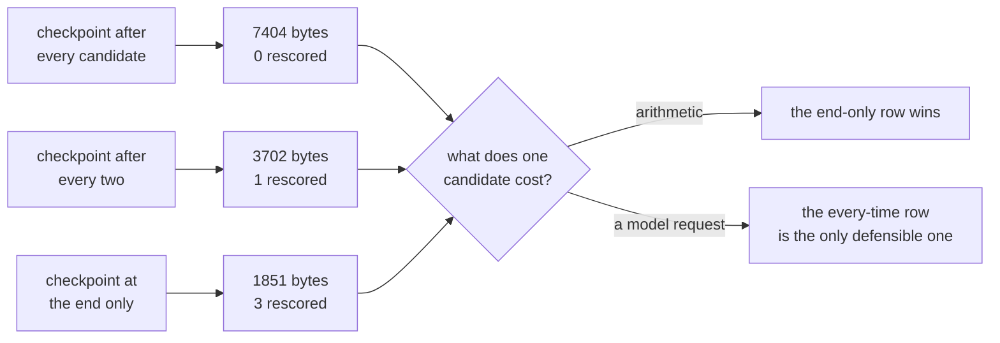

# 2.4 — How often you press save

## One-line answer

Checkpoint frequency is a straight trade of storage against redone work — measured on the drill,
one checkpoint per candidate costs 7,408 bytes and loses nothing, one at the end costs 1,852 bytes
and loses three candidates — and the right answer is decided by what a unit of work costs, not by
what a checkpoint costs.

## The story

You are typing something long and it matters. A report, an application, a letter you have been
putting off.

Some people hit save every couple of sentences, almost without noticing, because at some point in
their life they lost an afternoon's work and their hands learned it. Some people type for an hour
and never touch it.

Neither of them is wrong in a general way. What makes one of them right is a question about the
work: **how much would you mind retyping?** If it is a form where you are copying numbers off a
sheet, losing ten minutes is annoying and no more — the numbers are still on the sheet, you just
type them again. If it is ten minutes of getting a difficult paragraph to finally come out right,
losing it is not annoying, it is the loss of something you might not be able to reproduce.

Same keystroke, same file, same cost to save. Completely different answer, because the thing you
would be redoing is different.

## The idea in plain language

The drill's scoring station writes a checkpoint after every candidate. That was a choice, and this
part is about making it deliberately.

The trade has exactly two sides.

- **Checkpoint more often**: more events in the log, more bytes, more writes. In exchange, a kill
  costs you less, because less work sits between the last checkpoint and the moment the lights went
  out.
- **Checkpoint less often**: fewer bytes. A kill costs more, because everything since the last
  checkpoint has to be done again.

The mistake is to reason about this in bytes. Bytes are the visible cost, so they are what people
optimise, and they are almost always the wrong side of the trade — because a byte costs a fraction
of nothing and **the work between two checkpoints might be a model request**, which under Addendum
02's zero-budget rules is the scarcest thing in this entire project.

So the rule is not "checkpoint often" or "checkpoint rarely". It is: **one checkpoint per unit of
work you would mind repeating**, and then let the byte count be whatever it turns out to be.

One term, because the rest of the part uses it: the **redo interval** is the work between the last
checkpoint and the kill. It is what a resume has to do over again, and it is the only quantity in
this trade that is denominated in something you care about.

Day 60's [7.1](../../../day-60-durable-execution/parts/07-in-production/7.1-what-a-checkpoint-costs.md)
answers the neighbouring question — what all this storage adds up to and how long you keep it. This
part is only about the spacing.

## Why Sutra needs it

Sutra's stations do list work, and Phase 10 turns some of that list work into model requests against
a free tier measured in requests per day. The moment a candidate costs a request, the redo interval
stops being measured in milliseconds and starts being measured in a resource that does not refill
until tomorrow.

Day 65 kills the triage graph on purpose and asks what was lost. The answer will be exactly the redo
interval, so choosing it now is choosing what that gate measures later.

## The paper behind it

**Principles of transaction-oriented database recovery** · `doi:10.1145/289.291` · 1983 ·
<https://doi.org/10.1145/289.291>

The paper that gave the field its vocabulary for exactly this trade-off: what a checkpoint is, what
has to be redone after a crash, and why the interval between checkpoints is the knob that decides
recovery cost.

Taught in full on Day 47:
[`papers/01-transaction-oriented-recovery.md`](../../../day-47-persistent-sessions/papers/01-transaction-oriented-recovery.md).

## The mechanism

`often.py` measures the byte cost of one stored event from the real clean run, then lays out three
cadences over the same four candidates: a checkpoint after every one, after every two, and only at
the end.

```bash
cd days/day-61-pause-resume-checkpoints/lab
uv run python drill.py
uv run python often.py
```

**Line by line:**

- `bytes_per_event()` divides the clean store's size by its event count rather than using a constant.
  A number typed into the document would be a guess about a fixture that changes whenever the drill
  changes; a number computed from the file cannot drift.
- The three rows are `every = 1, 2, 4` over four candidates, so `written = 4 // every` and
  `lost = every - 1`. Those two expressions are the entire model — the rest of the script is
  formatting.
- `lost` is expressed in **candidates**, not bytes, deliberately. The whole argument of the part is
  that the left-hand column is the one denominated in something that matters.

Measured on 2026-09-06:

```text
  one stored event costs 1852 bytes in this fixture, measured from drill_clean.json.
  the list is 4 candidates: 4521, 4633, 4701, 9999

  every    checkpoints  a kill at the worst moment costs   bytes
  1        4            0 candidates rescored              7408
  2        2            1 candidate rescored               3704
  4        1            3 candidates rescored              1852

  The rule the table is for: one checkpoint per unit of work you would hate to
  repeat, and never one per loop iteration for its own sake. Here a candidate costs
  no model request, so the cheapest column wins. Replace scoring with a model call
  and the top row is the only defensible one.
```

Your own run will show a byte figure a few units either side of 1,852. The store holds a freshly
generated invocation id each time, and `bytes_per_event()` divides by it — which is a small, honest
reminder that the byte column is the incidental one.

The table is small and the reading of it is the point.

**The byte column spans a factor of four.** 7,408 down to 1,852. In isolation that looks like a real
saving and it is the number a reviewer's eye goes to, because it is the only column with big
numbers in it.

**The other column spans zero to three candidates.** And that is the column that actually decides,
because its unit changes meaning depending on what a candidate is:

| if one candidate costs… | then losing three costs… | the defensible cadence |
| --- | --- | --- |
| a word-overlap score, as in this drill | microseconds of arithmetic | the cheapest — checkpoint once |
| one free-tier model request | three requests out of a daily allowance | the dearest — checkpoint every time |

**Nothing about the byte column changed between those two rows of the table.** The storage cost is
identical in both cases. Only the value of the thing you would be redoing moved, and it moved the
answer all the way from one end to the other.

That is why "how often should I checkpoint?" has no general answer, and why a document that gives
you one is not to be trusted. The question is not answerable without knowing what a unit of work
costs.

Two more things the table does not show, and both matter in practice.

**The saving is capped and the loss is not.** Checkpointing less often can save you at most all of
your checkpoint bytes, which is a small, known number. Checkpointing less often can cost you, at
worst, the entire list — and if the list is long and each item is expensive, that number has no
particular limit.

**A checkpoint is a full copy, not a delta.** Look back at the four agent checkpoints in
[2.1](2.1-two-people-writing-in-one-notebook.md): each one contains everything scored so far, so the
last is the biggest. The cost of checkpointing every item over a list of *n* items grows with the
square of *n*, not with *n*. On four candidates that is invisible. On four hundred it is not, and
the fix — checkpoint a cursor rather than an accumulated result — is a design decision made at the
state class, which is why [2.3](2.3-the-recipe-and-the-pan.md) suggested writing that class first.



## When it breaks

The break is checkpointing on a schedule instead of on a boundary — every *n* iterations, or worse,
on a timer. It looks tidier and it quietly writes down states nobody can use.

Reach it on purpose by checkpointing in the middle of a unit of work rather than at the end of one:

```bash
cd days/day-61-pause-resume-checkpoints/lab
uv run python -c "
from _drill import CANDIDATES, DedupeState, score
state = DedupeState()
for candidate in CANDIDATES:
    state.scored.append(candidate)          # claimed before it is done
    print(f'  checkpoint here -> {state.model_dump()}')
    state.results[candidate] = score(candidate)
" 2>/dev/null | head -3
```

**Line by line:**

- `state.scored.append(...)` happens *before* the score is computed, which is the natural shape when
  a checkpoint is placed by a rule about position rather than by a rule about completion.
- Printing `model_dump()` at that instant shows exactly what would be written if the process died
  there.

```text
  checkpoint here -> {'scored': ['4521'], 'results': {}}
  checkpoint here -> {'scored': ['4521', '4633'], 'results': {'4521': 3}}
  checkpoint here -> {'scored': ['4521', '4633', '4701'], 'results': {'4521': 3, '4633': 2}}
```

Look at the first line. `scored` says `4521` and `results` is **empty**. A resume reading that
checkpoint skips `4521` — it is in the done list — and then finishes with no score for it. The run
completes, reports success, and has silently dropped a candidate.

That is worse than checkpointing too rarely, and it is a different failure entirely. Too rarely
costs you repeated work, which is expensive and correct. A checkpoint written mid-unit costs you
**correctness**, and it does so without any error, because the record is internally well-formed and
merely untrue.

The rule that prevents it: a checkpoint is written **after** a unit of work is complete and its
result is in the state, never between the claim and the completion. The drill does this — look at
the order in `_drill.py`, where `state.results[candidate]` is assigned before `state.scored.append`,
and `set_agent_state` comes after both.

## In production

**What a professional writes instead.** They pick the checkpoint boundary at the point where the
work becomes irreversible or expensive, and they say so in a comment, because it is a decision that
looks arbitrary to the next reader. The habit that survives review is to make the state object
record a **cursor plus results**, and to write it once per completed item, so that the boundary and
the unit of work are the same thing by construction rather than by discipline.

**What degrades at scale.** The quadratic growth above, and write amplification behind it. Every
checkpoint is a full serialisation of the state and, in ADK's design, an event appended to a session
that some service is persisting. On a long list that is a lot of writes to a store that is also
serving reads, and the symptom is not "checkpointing is slow" but "the session service is slow",
which sends people looking in the wrong place.

**The failure mode that only appears with real traffic.** Variable item cost. The table above
assumes candidates cost the same, so the redo interval is uniform. In a real archive one document is
a hundred times the size of another, and the worst-case redo is set by the most expensive item, not
the average. A cadence tuned on average cost is comfortable almost always and occasionally loses the
one item you could least afford to redo.

**The review comment a senior engineer leaves:** *"This checkpoints every ten items. Why ten? If an
item is a model call, nine of them is nine requests out of a daily allowance and this should be one.
If an item is arithmetic, checkpointing at all is wasted writes and this should be at the end. Ten
is the number you get when you have not asked what an item costs — put the answer in a comment next
to the constant."*

**The interview question:** *"How do you decide how often to checkpoint?"* An honest answer: *"By
what a unit of work costs to redo, not by what a checkpoint costs to store. I measured the trade on
a four-item list: one checkpoint per item was 7,404 bytes and lost nothing, one at the end was 1,851
and lost three items. The byte column is a factor of four and it is the wrong column — the storage
cost is identical whether an item is a word count or a model request, and only the second of those
makes redoing three of them expensive. The other thing I would watch is that a checkpoint is a full
copy of accumulated state, so checkpointing every item over a long list grows with the square of the
list; the fix is to store a cursor rather than an accumulator. And the boundary matters as much as
the frequency — a checkpoint written between claiming an item and finishing it produces a record
that is well-formed and false, and a resume will skip work it never did."*

## Check yourself

```bash
cd days/day-61-pause-resume-checkpoints/lab
uv run python often.py
```

Now edit `CANDIDATES` in `_drill.py` to hold eight entries, re-run `drill.py` and `often.py`, and
write down how the three byte figures move. Then say which of the two columns you would put in front
of a reviewer first, and why.

**Out loud, without scrolling up:** two systems checkpoint at different rates over the same list.
What single fact about the work decides which one is right, and why is the byte count not that fact?

**Next:** [3.1 — The delivery diary](../03-the-agents-own-note/3.1-the-mark-on-the-doorframe.md).
