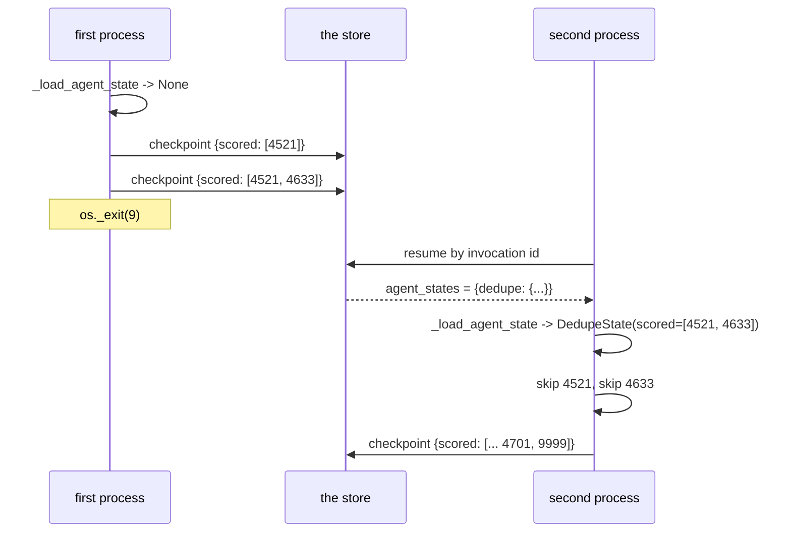

# 3.1 — The mark on the doorframe

## One-line answer

A custom agent gets its own checkpoint — a `BaseAgentState` subclass written with
`ctx.set_agent_state` and read back with `_load_agent_state` — and when that agent is the App's root
it works exactly as advertised: killed after two candidates, a fresh process loads
`DedupeState(scored=['4521', '4633'])` and skips them.

## The story

A painter is whitewashing a flat, room by room, on his own.

He does not keep the list in his head, because he has been doing this long enough to know better.
As he finishes each room he makes a small pencil tick on the inside of the doorframe, low down where
the paint will cover it later.

He goes for lunch. He comes back at three. He does not stand in the hall trying to remember whether
he did the back bedroom — he walks along, glances at the doorframes, sees two ticks, and starts on
the third room.

The whole arrangement rests on something so obvious nobody says it: **he is the one who made the
marks and he is the one who comes back to read them.** The marks are in his own private code, in a
place he chose, meaning what he decided they mean. Nobody handed him a system. It works because the
same person is on both ends of it.

## The idea in plain language

[2.2](../02-inside-the-box/2.2-opening-the-fuse-box.md) read the graph's checkpoint and found it
records progress **between** nodes: this one finished, that one was running. What it cannot record
is progress **inside** a node, and that is the gap this section is about.

If your node scores four candidates and dies after two, the graph's map says one thing: `dedupe: 2`,
it was running. It does not say *two of four*. Nothing in the graph's vocabulary can.

So ADK gives a custom agent a second mechanism, entirely its own:

- You define a class holding whatever you need to remember, inheriting from **`BaseAgentState`**.
- You call **`ctx.set_agent_state(name, agent_state=...)`** and yield an event, and the object is
  written into the log.
- On the way back, **`self._load_agent_state(ctx, YourClass)`** returns it.

That is the pencil tick. You chose what to write, you chose where in the loop to write it, and you
read it back yourself.

One term first, because the rest of the section turns on it. **`ctx.agent_states`** is the
dictionary the runtime hands your agent at the start of a run, keyed by agent name, holding whatever
checkpoints it has decided your agent should see. `_load_agent_state` is a thin wrapper over that
dictionary — it looks your name up in it and validates the result into your class. Which means the
question *"did my checkpoint come back?"* is really the question *"is my name in `ctx.agent_states`?"*

That distinction sounds pedantic. It is the whole of [3.3](3.3-the-rough-column-nobody-marks.md).

This part establishes the mechanism working, in the arrangement where it does work: the agent as the
App's **root agent**. Sections that follow take the identical agent and move it.

## Why Sutra needs it

Sutra's triage graph has a research station that will, in Phase 10, spend a model request per
candidate it examines. A kill halfway through that list must not cost the requests already spent —
Day 65's phase gate says so directly, and the free-tier allowance means there is no slack to absorb
the repeat.

The graph's own checkpoint cannot help, because the loss is inside one node. This mechanism is the
only one ADK offers for it, so Sutra has to know both that it exists and — starting in
[3.3](3.3-the-rough-column-nobody-marks.md) — exactly when it does nothing.

## The mechanism

Here is the state class and the node body, from `_drill.py`:

```python
class DedupeState(BaseAgentState):
    """The sticky note. One field: which candidates this node has already scored."""

    scored: list[str] = []
    results: dict[str, int] = {}


class Dedupe(BaseAgent):
    kill_after: int = 0

    async def _run_async_impl(self, ctx: InvocationContext) -> AsyncGenerator[Event, None]:
        state = self._load_agent_state(ctx, DedupeState)
        print(f"  dedupe: agent_states keys = {sorted(ctx.agent_states)}")
        print(f"  dedupe: loaded checkpoint {state!r}")
        if state is None:
            state = DedupeState()
        for candidate in CANDIDATES:
            if candidate in state.scored:
                print(f"  dedupe: skip {candidate} (already scored)")
                continue
            state.results[candidate] = score(candidate)
            state.scored.append(candidate)
            ctx.set_agent_state(self.name, agent_state=state)
            yield self._create_agent_state_event(ctx)
```

**Line by line:**

- `DedupeState(BaseAgentState)` — the base class is required. `set_agent_state` will not take an
  arbitrary object, and the class is also what `_load_agent_state` validates into on the way back, so
  it is the schema of your checkpoint whether you think of it that way or not.
- `scored` and `results` are two fields rather than one because they answer two questions: *what have
  I finished* and *what did I find*. The first is what makes the resume skip; the second is the work
  itself.
- `state = self._load_agent_state(ctx, DedupeState)` is the first statement in the body, before any
  work. That ordering is not style — a node that does work before checking for a checkpoint has
  already done the thing the checkpoint existed to avoid.
- The two `print` lines expose `ctx.agent_states` and the loaded object. They exist for teaching, and
  they are the instruments that make sections 3.3 and 5.2 measurable rather than mysterious.
- `if state is None: state = DedupeState()` — `_load_agent_state` returns `None` on a first run, not
  an empty object. [3.2](3.2-a-blank-page-and-no-page-at-all.md) is about why that branch is
  load-bearing.
- `if candidate in state.scored: continue` is the resume actually paying off. Everything else in this
  class exists to make this one line correct.
- `state.results[...] = ...` **before** `state.scored.append(...)`: the result is recorded before the
  candidate is claimed as done, so no checkpoint can ever say "finished" about something with no
  result. That is [2.4](../02-inside-the-box/2.4-how-often-you-press-save.md)'s mid-unit failure,
  avoided by ordering.
- `set_agent_state` then `yield self._create_agent_state_event(ctx)` — setting alone writes nothing.
  The state travels **on an event**, which is why [2.1](../02-inside-the-box/2.1-two-people-writing-in-one-notebook.md)
  found four agent checkpoints as four separate events in the log. This is also trap #3 from plan
  §5.1 in its natural habitat: the node yields as it goes rather than collecting and returning at the
  end, and a checkpoint written by an agent that batched its events would arrive only after the work
  it was supposed to protect.

Verified against `adk.dev/runtime/resume/`, fetched 2026-09-06, which states that custom agents must
*"generate and save the agent state for each completed step of the agent's overall task"* and include
*"an `end_of_agent=True` status upon successful completion"* — the second half is
[3.5](3.5-handing-back-the-key.md)'s subject.

Now run it with that agent as the App's root, killed after two candidates and resumed in a fresh
process:

```bash
cd days/day-61-pause-resume-checkpoints/lab
uv run python pen.py --root
```

**Line by line:**

- `--root` builds an `App` whose `root_agent` **is** the `Dedupe` agent — no graph, no other
  stations. That is the arrangement under test.
- The start and the resume run as separate subprocesses, because `os._exit(9)` destroys the
  interpreter that calls it. This is the same two-process shape
  [2.3](../02-inside-the-box/2.3-the-recipe-and-the-pan.md) needed.
- The script prints `ctx.agent_states` keys on entry to both processes, so the mechanism is visible
  rather than inferred from the outcome.

Measured on 2026-09-06:

```text
=== the same agent, as the App's root agent ===

  -- the first process, killed after two (exit 9) --
    dedupe: agent_states keys = []
    dedupe: loaded checkpoint None
    dedupe: scored 4521 -> 3
    dedupe: scored 4633 -> 2
    *** the process is killed here ***

  -- a fresh process (exit 0) --
    dedupe: agent_states keys = ['dedupe']
    dedupe: loaded checkpoint DedupeState(scored=['4521', '4633'], results={'4521': 3, '4633': 2})
    dedupe: skip 4521 (already scored)
    dedupe: skip 4633 (already scored)
    dedupe: scored 4701 -> 0
    dedupe: scored 9999 -> 1

  agent checkpoints in the log: 4
  the last one: {'scored': ['4521', '4633', '4701', '9999'], 'results': {'4521': 3, '4633': 2, '4701': 0, '9999': 1}}
```

This is the mechanism working, and it is worth reading the two processes as a pair.

**First process:** `agent_states keys = []` and `loaded checkpoint None`. Nothing to resume, because
nothing has run. It scores two and dies.

**Second process:** `agent_states keys = ['dedupe']`. The name is there. `_load_agent_state` finds
it and returns a real object with the two scored candidates in it. The two `skip` lines are the whole
point of the exercise — **work that was not repeated** — and then it finishes the list.

**Four checkpoints in the log, and the last one has all four candidates.** The run completed
correctly across a process boundary, and the only thing that crossed that boundary was a JSON object
in a session file.



## When it breaks

The break is forgetting the `yield`. `set_agent_state` mutates the context; it does not write
anything. Nothing warns you, and the run works perfectly — until a resume.

```bash
cd days/day-61-pause-resume-checkpoints/lab
uv run python -c "
import inspect
from google.adk.agents.invocation_context import InvocationContext
print(inspect.getsource(InvocationContext.set_agent_state).split('\"\"\"')[0].strip())
"
```

**Line by line:**

- Printing the signature straight from the installed package settles what the call does and does not
  do, without depending on this document staying current.
- Splitting on the docstring delimiter keeps the output to the declaration, which is the part under
  discussion.

```text
def set_agent_state(
      self,
      agent_name: str,
      *,
      agent_state: BaseAgentState | None = None,
      end_of_agent: bool = False,
  ) -> None:
```

`-> None`. It returns nothing, writes nothing and takes no session. It records an intention on the
context, and the event you yield afterwards is what carries that intention into the log. A node that
calls it in a loop and yields nothing produces a run with **zero** agent checkpoints and no
complaint from anybody.

The second break is subtler and shows up in review rather than at runtime: **mutating the state
object after yielding**. The state is serialised when the event is written, so a mutation after the
yield lands in the *next* checkpoint rather than the one you were looking at. The drill avoids it by
having exactly one mutation site per iteration, immediately before the `set_agent_state`.

## In production

**What a professional writes instead.** They keep the state class small and make it a **cursor**
rather than an accumulator wherever they can — `next_index: int` beats `scored: list[str]` on a long
list, for the quadratic reason [2.4](../02-inside-the-box/2.4-how-often-you-press-save.md) gave. They
also put a `schema_version` on it from the first commit, because
[6.1](../06-in-production/6.1-the-batch-number-on-the-strip.md) shows what it costs to add one later.

**What degrades at scale.** The load is a validation. `_load_agent_state` runs
`state_type.model_validate(...)` on every entry into the agent, so the state class's parsing cost is
paid on every resume, and on a state object that has grown to hold retrieved documents that is not
free. More importantly it is a *strict* validation, which is exactly what
[5.1](../05-failure-lab/5.1-two-clerks-checking-one-delivery.md) is about.

**The failure mode that only appears with real traffic.** Two agents sharing a name. The checkpoint
is keyed by `self.name`, so two stations both called `worker` — easy in a graph assembled from
reusable pieces — read and overwrite each other's progress. The symptom is a station that skips work
it never did, which looks like a logic bug in the station rather than a naming collision.

**The review comment a senior engineer leaves:** *"This calls `set_agent_state` and then yields a
plain output event. Those are two different events — the state is attached to the one
`_create_agent_state_event` builds, so as written nothing is checkpointed and the loop only looks
resumable. Yield the state event, and add a test that kills the run and asserts the second attempt
skips something."*

**The interview question:** *"How does a long-running step inside an agent avoid redoing work after a
crash?"* An honest answer: *"It keeps its own checkpoint, separate from the workflow's. In ADK you
subclass `BaseAgentState` with whatever you need to remember, call `ctx.set_agent_state` after each
completed item and yield a state event — setting alone writes nothing, which is the mistake I would
watch for. On the way back in, `_load_agent_state` looks your agent's name up in `ctx.agent_states`
and validates it into your class, returning `None` if there is nothing there. I measured it: killed
after two of four candidates, the resuming process loaded `scored=['4521','4633']` and skipped both.
The important caveat is that this depends on your name being in `ctx.agent_states`, and whether it is
depends on where the agent sits."*

## Check yourself

```bash
cd days/day-61-pause-resume-checkpoints/lab
uv run python pen.py --root
```

Now comment out the `yield self._create_agent_state_event(ctx)` line in `_drill.py`, re-run, and
write down what the second process loads. Then put it back.

**Out loud, without scrolling up:** name the three calls that make a custom agent's checkpoint work,
and say which one of them actually causes something to be written down.

**Next:** [3.2 — A blank page and no page at all](3.2-a-blank-page-and-no-page-at-all.md).
