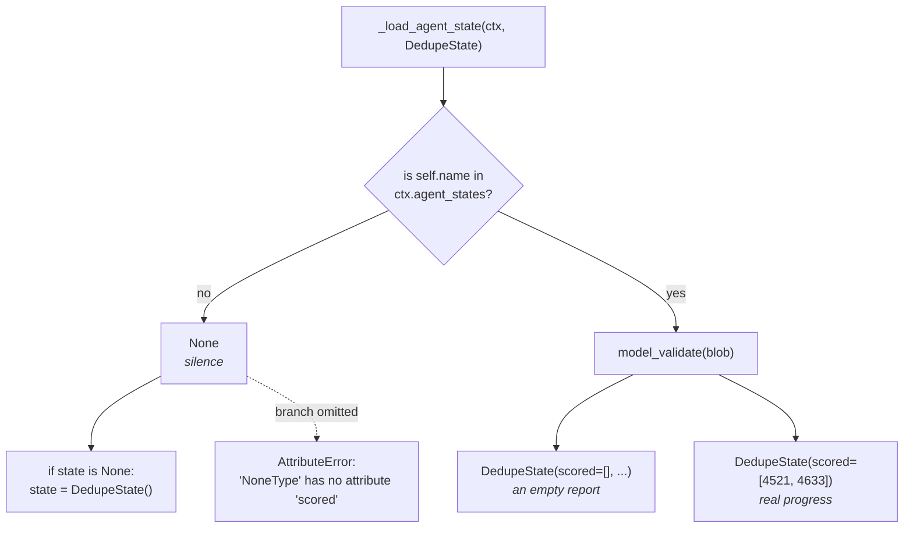

# 3.2 — A blank page and no page at all

## One-line answer

`_load_agent_state` returns `None` when there is no checkpoint, not a defaulted object — its body is
four lines and the first branch is `if ctx.agent_states is None or self.name not in ctx.agent_states`
— so the `if state is None` branch is the only thing between a first run and
`AttributeError: 'NoneType' object has no attribute 'scored'`.

## The story

You ring the workshop to ask how many of the twenty chairs are finished.

The first time, the man says: *"None yet. We started this morning, nothing is done."* That is
useful. You know work has begun, you know where it stands, and you can plan around it.

The second time you ring, nobody picks up.

Those two are not the same answer and you would never treat them as the same, even though both leave
you with zero finished chairs. "None yet" is a report. Silence is the absence of a report — the
workshop might be shut, the order might never have arrived, the number you have might be wrong.

The mistake that costs you is planning as though silence meant *"none yet"*. It is a small
mistake. It is also the only one available, because those are the only two things that can happen
when you ring.

## The idea in plain language

[3.1](3.1-the-mark-on-the-doorframe.md) had one line in the node body that looked like defensive
padding:

```python
if state is None:
    state = DedupeState()
```

**Line by line:**

- `_load_agent_state` has returned, and the variable it returned may hold nothing at all.
- `DedupeState()` builds a fresh state with its fields at their declared defaults — an empty list and
  an empty dict.
- Without this, `state` stays `None` and the very next statement that touches `state.scored` raises.

This part is about why that branch is not padding.

`_load_agent_state` has two possible outcomes and they mean different things:

- **`None`** — there is no checkpoint for this agent. Either nothing has run yet, or something ran
  and never checkpointed. This is *silence*.
- **an instance of your class** — there is a checkpoint, and here it is. If its fields happen to be
  empty, that is a real report saying *nothing done yet*.

Python makes the difference sharp, because `None` has no fields at all. Reading `state.scored` off
it does not give you an empty list; it raises `AttributeError`. So a node that omits the branch does
not degrade gracefully — it dies on its first run, before it has done anything, which is at least
loud.

What makes this worth a part of its own rather than a footnote is that the pair *silence* and *empty
report* comes back twice more today, and each time the distinction is the whole finding:

- [3.3](3.3-the-rough-column-nobody-marks.md) — a checkpoint that was **written** and comes back as
  silence anyway.
- [5.2](../05-failure-lab/5.2-marked-present-by-default.md) — silence that comes back as an **empty
  report**, invented by the framework, when nothing was ever written.

If those two sound like the same sentence in different orders, that is exactly right, and it is
exactly why the difference between `None` and `DedupeState()` has to be clear before either of them
can be understood.

## Why Sutra needs it

Sutra's stations will each carry this branch, so it is worth understanding rather than copying.
And the distinction it encodes is load-bearing later: at
[5.2](../05-failure-lab/5.2-marked-present-by-default.md), telling *silence* from *an empty report*
is the only way to notice that the framework has handed the agent a checkpoint nobody wrote. A
station whose code cannot tell those apart cannot see that bug at all.

## The mechanism

`none.py` prints the loader's real signature and body from the installed package, then shows the two
answers side by side and what happens if you confuse them.

```bash
cd days/day-61-pause-resume-checkpoints/lab
uv run python none.py
```

**Line by line:**

- `inspect.signature` and `inspect.getsource` read `google-adk==2.7.1` as installed. The return type
  is the claim being made, so it is quoted from the package rather than described.
- The `AttributeError` is triggered deliberately, in a `try`, so the error text in the output is a
  real traceback message rather than a paraphrase of one.
- The last line prints `BaseAgentState.model_config`, which is the setting
  [5.1](../05-failure-lab/5.1-two-clerks-checking-one-delivery.md) turns into a failure.

Measured on 2026-09-06:

```text
  the signature, from the installed package:
    _load_agent_state(self, ctx: 'InvocationContext', state_type: 'Type[AgentState]') -> 'Optional[AgentState]'

  its body, verbatim:
      if ctx.agent_states is None or self.name not in ctx.agent_states:
        return None
      else:
        return state_type.model_validate(ctx.agent_states.get(self.name))

  so the two answers are different objects:
    no checkpoint at all      -> None
    an empty checkpoint       -> DedupeState(scored=[], results={})

  and the difference matters, because None has no fields:
    AttributeError: 'NoneType' object has no attribute 'scored'

  BaseAgentState.model_config: {'extra': 'forbid'}
```

The body is four lines and every one of them is worth reading, because this function is the entire
interface between your agent and its own memory.

**`if ctx.agent_states is None or self.name not in ctx.agent_states: return None`** — the two ways to
get silence. Either the runtime handed the agent no state dictionary at all, or it handed one that
does not contain this agent's name. Both produce `None`, and the function does not distinguish them.

That second condition is the one to remember. **It is a lookup by name in a dictionary the runtime
prepared.** Your checkpoint being *in the log* is not what this function tests. It tests whether your
name is a key in `ctx.agent_states`. Those are different questions, they are usually the same answer,
and [3.3](3.3-the-rough-column-nobody-marks.md) is the case where they are not.

**`return state_type.model_validate(...)`** — the stored blob is validated into your class on the way
back. Not cast, not merged: validated, with whatever strictness your class declares. The last line of
the output shows that strictness is `{'extra': 'forbid'}`, and
[5.1](../05-failure-lab/5.1-two-clerks-checking-one-delivery.md) is what happens when yesterday's blob meets
today's class under that rule.

**`Optional[AgentState]` in the signature.** The type says it: this can be nothing. A node that does
not branch on it has ignored the function's own declared contract.

And the error, verbatim: `AttributeError: 'NoneType' object has no attribute 'scored'`. That is what
the missing branch produces, on the first run, before any work — which is the friendliest possible
version of this mistake and the reason it rarely survives to production.



## When it breaks

The break is simply omitting the branch, and it is loud:

```bash
cd days/day-61-pause-resume-checkpoints/lab
uv run python -c "
state = None
state.scored.append('4521')
"
```

**Line by line:**

- `state = None` is what `_load_agent_state` returns on a first run, written out directly.
- `.scored.append(...)` is the next thing the node body does. Nothing else is needed to reproduce it.

```text
Traceback (most recent call last):
  File "<string>", line 3, in <module>
AttributeError: 'NoneType' object has no attribute 'scored'
```

That fires on the very first run, before any work, which makes it the friendliest version of this
mistake — it does not survive a single execution.

Now the shortcut, because it is what a reader will reach for and the answer is not what I expected.
`state = self._load_agent_state(...) or DedupeState()` is shorter and reads better, and the obvious
worry is that it collapses the two cases: an empty stored checkpoint would be falsy, get discarded,
and be replaced by a fresh object. That worry is wrong, and it is worth being wrong about in public:

```bash
cd days/day-61-pause-resume-checkpoints/lab
uv run python -c "
from _drill import DedupeState
for label, value in (('None (silence)', None), ('DedupeState() (empty report)', DedupeState())):
    kept = (value or DedupeState()) is value
    print(f'  {label:<32} bool={bool(value)!s:<6} the or-fallback keeps it: {kept}')
"
```

**Line by line:**

- `bool(value)` is what `or` consults, so printing it shows the behaviour's actual cause rather than
  an assumption about it.
- `is value` asks identity, not equality: did the expression give back the very object that came out
  of the store, or a different one?

```text
  None (silence)                   bool=False  the or-fallback keeps it: False
  DedupeState() (empty report)     bool=True   the or-fallback keeps it: True
```

**An empty pydantic model is truthy.** Unlike an empty dict or an empty list, a `BaseModel` with no
data in it is `True`, because pydantic defines neither `__bool__` nor `__len__` and Python's default
for an object is truthy. So the `or` shortcut does the right thing: it replaces silence and keeps a
real empty checkpoint.

Which means the honest verdict on the shortcut is not "it is a bug" but something more useful: **it
is correct today for a reason that has nothing to do with what you meant.** You mean *absent*; you
wrote *falsy*; the two coincide because of a property of pydantic. They stop coinciding the moment
the state stops being a pydantic model — a plain `dict`, which people do use, is falsy when empty,
and the same line silently starts discarding real checkpoints.

`if state is None` costs one extra line and tests the thing you actually mean, which is why
[3.1](3.1-the-mark-on-the-doorframe.md) writes it that way.

## In production

**What a professional writes instead.** They branch explicitly on `is None`, and they usually log the
two cases differently — *starting fresh* against *resuming from a checkpoint* — because that single
log line is the one that answers "did the resume actually resume?" during an incident, and it costs
nothing to emit. [3.3](3.3-the-rough-column-nobody-marks.md) is a bug that a system with that log
line finds in a minute and a system without it does not find at all.

**What degrades at scale.** Nothing about this call itself; it is a dictionary lookup and a
validation. What degrades is the *ambiguity*. At one agent, `None` means "first run". At forty
agents, some of which are conditional, `None` means "first run, or this agent has never been reached
on this path, or someone renamed it in the last deploy". Distinguishing those needs information the
loader does not have, and the usual answer is to record a run's expected agent set when it starts.

**The failure mode that only appears with real traffic.** A renamed agent. The lookup is by
`self.name`, so renaming a station from `dedupe` to `duplicate_check` means every in-flight run
resumes into silence and starts its list again, at full cost, with no error and no log line
mentioning a rename. This is a deploy-shaped failure that Day 60's
[6.1](../../../day-60-durable-execution/parts/06-failure-lab/6.1-the-resume-that-met-different-code.md)
handles for the state's *shape* and nothing handles for its *key*.

**The review comment a senior engineer leaves:** *"`or DedupeState()` happens to be correct here,
because an empty pydantic model is truthy — but it says 'falsy' where you mean 'absent', and those
only agree because the state is a BaseModel. If anyone ever changes this to a plain dict it starts
throwing away real checkpoints without a word. Write `if state is None`; it is one line and it tests
what you mean."*

**The interview question:** *"What does your framework hand you when there is nothing to resume?"* An
honest answer: *"In ADK, `None` — not an empty state object, which is a distinction I would not have
predicted and had to read the source to be sure of. The body is four lines: if the agent's name is
not a key in `ctx.agent_states` it returns `None`, otherwise it validates the stored blob into your
class. So there are two different zero-progress answers — silence and an empty report — and they mean
different things. I checked whether the shortcut everybody writes, `load(...) or MyState()`,
collapses them — I assumed it did, and it does not: an empty pydantic model is truthy, unlike an
empty dict. So it is accidentally correct. I would still write the `is None` branch, because the
shortcut says 'falsy' where it means 'absent', and those two only agree as long as the state stays a
pydantic model."*

## Check yourself

```bash
cd days/day-61-pause-resume-checkpoints/lab
uv run python none.py
```

Now work out on paper what `value or DedupeState()` would do if `DedupeState` were a plain `dict`
instead of a pydantic model, for both an empty stored checkpoint and a missing one. Then check
yourself with `python -c "print(bool({}), bool([]), bool(0))"`.

**Out loud, without scrolling up:** what are the two different things `_load_agent_state` can return
that both mean "no work done yet", and what does the framework actually check to decide between
them?

**Next:** [3.3 — The rough column nobody marks](3.3-the-rough-column-nobody-marks.md).
