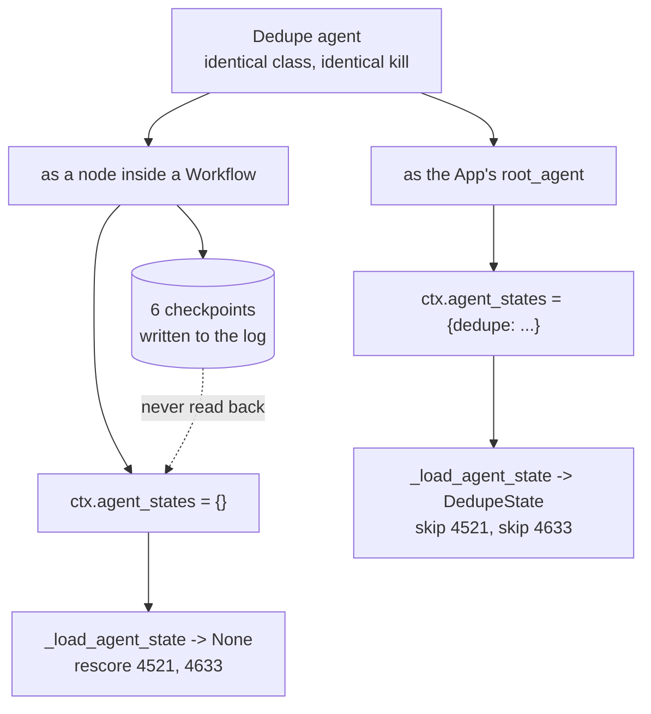

# 3.3 — The rough column nobody marks

## One-line answer

The identical agent that resumes correctly as a root agent gets `agent_states keys = []` when it is
a node inside a `Workflow` — its checkpoints are in the log, **six of them**, written by the same
code to the same file — and it rescores every candidate from the start because nothing ever hands
them back.

## The story

Your school maths papers had a wide margin down the right-hand side marked *rough work*.

You used it properly. Every long division, every bit of algebra you did not trust yourself to do in
your head, laid out neatly in that column with the question number beside it. It was genuine work
and it was on the paper you handed in.

And then the results came back and you had lost marks on a question where the rough column showed,
plainly, that you had got the right answer and copied it into the box wrong.

You take it to the teacher. She is sympathetic and she does not change the mark. *"We mark what is in
the boxes."*

Nothing was lost. Nothing was hidden. The work was done, it was written down, it was handed in, and
it was in the same building as the person marking it. It just was not in the place that gets read.

## The idea in plain language

[3.1](3.1-the-mark-on-the-doorframe.md) showed the custom agent's checkpoint working: killed after
two candidates, resumed, skipped both, finished the list. That agent was the App's **root agent**.

Sutra's stations are not root agents. They are **nodes inside a graph** — that is what Day 53
established as the 2.x composition model and what Day 58 built the triage graph out of. So the
question this part asks is the only one that matters for Sutra: does the same mechanism work when
the agent is a node?

It does not, and the way it fails is the reason this part exists.

It does not fail by raising. It does not fail by refusing to write. The checkpoints are written —
they are in the log, you can `cat` them — and on resume the agent is simply handed an empty
`ctx.agent_states`, so [3.2](3.2-a-blank-page-and-no-page-at-all.md)'s *silence* comes back and the
node starts its list again from the beginning.

Every individual piece behaves exactly as documented. The write works. The log is correct. The
resume happens. `_load_agent_state` does precisely what its four lines say. And the outcome is that
the work is done twice.

This is worth stating carefully because it is easy to over-claim. The finding is **not** "ADK's
agent checkpoints are broken". It is narrower and more useful:

> A custom agent's own checkpoint is read back when that agent is the root of the App. When the same
> agent is a node inside a `Workflow`, it is written and not read back.

`adk.dev/runtime/resume/`, fetched 2026-09-06, tells you to *"generate and save the agent state for
each completed step of the agent's overall task"* and says nothing about where the agent has to sit
for that to be of any use. So there is no document to have read more carefully. There is only the
measurement.

## Why Sutra needs it

This is the shape Sutra actually has. The triage graph's research station is a custom agent inside a
`Workflow`, and by Phase 10 each candidate it examines costs a model request out of a daily free-tier
allowance.

If that station keeps its progress in its own `BaseAgentState`, then a kill halfway through the list
costs every request already spent, and the code will look completely correct while it does so — the
checkpoints will be in the log, and anybody debugging it will find them and conclude the
checkpointing works.

Day 65's phase gate asks whether a killed triage run resumes without losing or repeating work. A
station built on this mechanism fails that gate silently, which is the worst way to fail it.

## The mechanism

`pen.py` runs the **same agent class**, killed at the same point, in two arrangements. The only
difference between the arms is where the agent sits.

```python
def root_app(kill_after: int = 0) -> App:
    return App(
        name="sutra_drill",
        root_agent=Dedupe(name="dedupe", kill_after=kill_after),
        resumability_config=ResumabilityConfig(is_resumable=True),
    )


def graph_app(kill_after: int = 0) -> App:
    from _drill import build

    return build(kill_after=kill_after)
```

**Line by line:**

- `root_app` puts the `Dedupe` agent directly in `root_agent`. Nothing wraps it.
- `graph_app` calls the drill's `build()`, which puts that same class into a three-node `Workflow`
  between `summarise` and `report`.
- `resumability_config=ResumabilityConfig(is_resumable=True)` is identical in both, so resumability
  is not the variable.
- `kill_after` is identical in both, so the kill point is not the variable. **The arrangement is the
  only thing that differs.**

Run the arm from [3.1](3.1-the-mark-on-the-doorframe.md) again, then the graph arm:

```bash
cd days/day-61-pause-resume-checkpoints/lab
uv run python pen.py --root
uv run python pen.py
```

**Line by line:**

- Each arm deletes its own store first and uses its own filename, so neither can read the other's
  events.
- Both arms print `sorted(ctx.agent_states)` on entry to every process. That single line is the
  measurement; everything else is context for it.

Measured on 2026-09-06:

```text
=== the same agent, as a node inside the Workflow ===

  -- the first process, killed after two (exit 9) --
    summarise: 'customer signed out mid-form during single sign-on'
    dedupe: agent_states keys = []
    dedupe: loaded checkpoint None
    dedupe: scored 4521 -> 3
    dedupe: scored 4633 -> 2
    *** the process is killed here ***

  -- a fresh process (exit 0) --
    dedupe: agent_states keys = []
    dedupe: loaded checkpoint None
    dedupe: scored 4521 -> 3
    dedupe: scored 4633 -> 2
    dedupe: scored 4701 -> 0
    dedupe: scored 9999 -> 1
    report: 4 candidates scored, closest is 4521

  agent checkpoints in the log: 6
  the last one: {'scored': ['4521', '4633', '4701', '9999'], 'results': {'4521': 3, '4633': 2, '4701': 0, '9999': 1}}
```

Put the second process of each arm side by side, because that is where the whole finding lives:

| | as the root agent ([3.1](3.1-the-mark-on-the-doorframe.md)) | as a node in the graph (here) |
| --- | --- | --- |
| `agent_states keys` on resume | `['dedupe']` | `[]` |
| `_load_agent_state` returns | `DedupeState(scored=['4521', '4633'], …)` | `None` |
| candidates rescored | 0 — two `skip` lines | **2** — `4521` and `4633` again |
| agent checkpoints in the log | 4 | **6** |

**`agent_states keys = []` on the resume.** Not a wrong value, not a stale value — the dictionary the
runtime hands the agent has nothing in it. By [3.2](3.2-a-blank-page-and-no-page-at-all.md)'s reading
of the loader's four lines, `self.name not in ctx.agent_states` is true, so it returns `None`, so the
node builds a fresh state and starts at the top of the list.

**Six checkpoints, not four.** This is the number that turns a suspicion into a fact. Four
candidates were scored in the second process and two in the first, and all six writes landed in the
log. The checkpoint mechanism did not fail. It wrote everything it was asked to write. **The writes
are there and nothing reads them.**

You can look at them directly, which is worth doing once so it stops being a story about a counter:

```bash
cd days/day-61-pause-resume-checkpoints/lab
uv run python -c "
import json
from _store import checkpoints
for row in checkpoints('pen_graph.json'):
    if 'scored' in row:
        print('  ', json.dumps(row['scored']))
"
```

**Line by line:**

- `checkpoints()` reads every stored `agent_state` off the disk file the killed run and the resuming
  run shared.
- Filtering on `'scored' in row` keeps the agent's own notes and drops the graph's node map, which is
  [2.1](../02-inside-the-box/2.1-two-people-writing-in-one-notebook.md)'s classifier.

```text
   ["4521"]
   ["4521", "4633"]
   ["4521"]
   ["4521", "4633"]
   ["4521", "4633", "4701"]
   ["4521", "4633", "4701", "9999"]
```

Read the third line. After the kill, the resuming process wrote `["4521"]` — it started the list
again from nothing, in the same file, immediately underneath a checkpoint that already said
`["4521", "4633"]`. The evidence of the lost work is sitting two lines above the work being redone.



## When it breaks

It has already broken — that is what the section above is. What is worth adding here is **how you
would find this in your own code**, because the failure produces no error, no warning and no log
line, and the checkpoints being present is actively misleading.

There is exactly one honest test, and it is behavioural: kill the run and assert that the second
attempt does **less** work than the first.

```bash
cd days/day-61-pause-resume-checkpoints/lab
uv run python -c "
import subprocess, sys
from pathlib import Path
Path('pen_graph.json').unlink(missing_ok=True)
first = subprocess.run([sys.executable,'pen.py','child','graph','start'], capture_output=True, text=True)
second = subprocess.run([sys.executable,'pen.py','child','graph','resume'], capture_output=True, text=True)
scored = lambda p: sum('dedupe: scored' in ln for ln in p.stdout.splitlines())
print(f'  first process scored  {scored(first)}')
print(f'  second process scored {scored(second)}')
print(f'  resume did less work: {scored(second) < 4}')
"
```

**Line by line:**

- The two `subprocess.run` calls are the start and the resume, run as separate processes for the
  usual `os._exit` reason.
- `scored()` counts lines matching `dedupe: scored` specifically, not just `scored` — the report
  station's own summary line contains the word too, and counting it would inflate the second process
  by one and make the numbers say something slightly untrue.
- The assertion is `< 4`: a correct resume scores at most the two candidates that were left.

```text
  first process scored  2
  second process scored 4
  resume did less work: False
```

**`False`.** The second process did *more* work than the first, not less. That is a test that can go
red (Principle 11) and it is the only kind of test that catches this, because every structural
check — is the state class right, is `set_agent_state` called, are the checkpoints in the log — comes
back green.

Write that test before you rely on an agent's own checkpoint, in any arrangement. It is three lines
and it is the difference between believing your resume works and knowing it.

## In production

**What a professional writes instead.** They do not put per-item progress in a node's own
`BaseAgentState` at all when the node lives in a graph. They put it in **session state**, which is
restored, and [3.4](3.4-write-it-on-the-shared-board.md) measures that working — with a second
condition attached that is easy to miss and equally necessary.

**What degrades at scale.** The cost of this bug is proportional to the item cost times the kill
rate, and both go up in production. On a laptop, killed once a week, rescoring two word-counts is
free. In a container that gets rescheduled during every deploy, with each item a model request
against a daily allowance, the same code loses real quota every time anybody ships — and the graph
still completes, so nothing pages anybody.

**The failure mode that only appears with real traffic.** The partial-duplicate effect. Rescoring is
harmless here because scoring is pure. If the per-item work has a side effect — writing a row,
sending a notification, incrementing a counter — then this bug does not merely waste the work, it
**repeats the effect**, and the run reports success. That is Day 60's uncertainty-gap territory
([3.1](../../../day-60-durable-execution/parts/03-doing-it-twice/3.1-the-uncertainty-gap.md)) arriving
through a door nobody was watching.

**The review comment a senior engineer leaves:** *"This station checkpoints into its own agent state
and it is a node in the workflow. I checked the same class as a root agent and it resumes fine, so
the code reads as correct — but as a node, `ctx.agent_states` comes back empty and the list restarts.
The checkpoints are in the log, which is what makes this hard to spot. Move the progress to session
state, and add the kill-and-count test, because nothing structural will catch a regression here."*

**The interview question:** *"Have you ever had a checkpoint that was written correctly and still
did not work?"* An honest answer: *"Yes, and it taught me not to trust that a write implies a read. In
ADK 2.7.1 a custom agent can keep its own progress in a `BaseAgentState`. I killed a run mid-list and
resumed it: as the App's root agent it loaded the checkpoint and skipped the two finished items. The
identical class as a node inside a Workflow got an empty `ctx.agent_states` and started the list
again — while its six checkpoints sat in the log, including one written by the resuming process
immediately below one that already had more progress in it. Nothing raised. The documentation
describes the write pattern without mentioning the distinction. The lesson I took is that the only
test worth having is behavioural: kill it, resume it, and assert the second attempt does less work
than the first."*

## Check yourself

```bash
cd days/day-61-pause-resume-checkpoints/lab
uv run python pen.py --root
uv run python pen.py
```

Now put the two `agent_states keys` lines from the two resumes side by side and write both down.
Then predict what the graph arm's checkpoint count would be if the kill happened after three
candidates instead of two, and check it.

**Out loud, without scrolling up:** the same agent class, the same kill, two arrangements — what is
the single observable difference on resume, and why does the presence of checkpoints in the log not
prove the mechanism is working?

**Next:** [3.4 — Write it on the shared board](3.4-write-it-on-the-shared-board.md).
