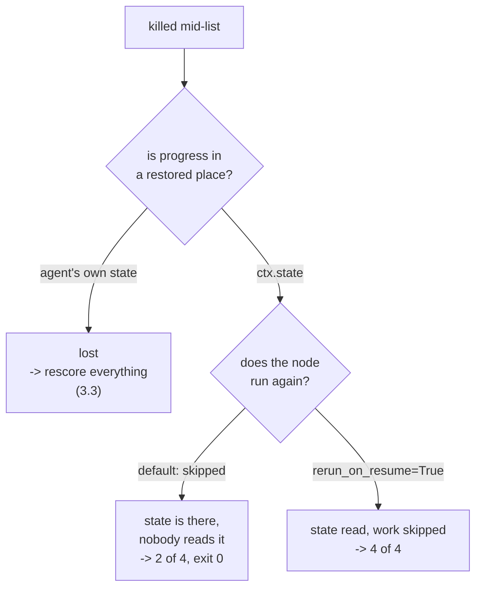

# 3.4 — Write it on the shared board

## One-line answer

Moving progress from the agent's own state into `ctx.state` makes it survive — but on its own that
is **half a repair**, and the half produces a run that scores two of four candidates, reports
success and exits 0; the second half is `rerun_on_resume=True`, and only both together give four of
four.

## The story

The office has a whiteboard on the wall by the door with the week's jobs on it, and everybody writes
on it.

You are working through a list and you keep your own running notes in your diary, because that is
what you have always done. Then you are off for two days, and somebody else picks up your list.
They stand at the whiteboard, see the four jobs, see the two ticks somebody put up there, and carry
on from the third.

Your diary is in your bag at home. It has better notes in it than the board does. It is also
completely useless to the person doing the work, and the fact that it exists and is accurate changes
nothing at all.

But there is a second thing that had to be true, and it is easy to miss because it is about the
person rather than the board: **somebody had to actually come and stand in front of it.** If your
colleague had assumed the list was finished and gone to the next job, the board would have been
right, up to date, readable, and unread.

## The idea in plain language

[3.3](3.3-the-rough-column-nobody-marks.md) established the hole: an agent's own `BaseAgentState` is
written but not read back when the agent is a node in a graph. This part is the repair, and it has
two halves that are easy to confuse because each one, alone, looks like it works.

**The first half: put the progress somewhere that is restored.**

That place is **session state** — `ctx.state`, the session's own dictionary, which Day 60 already
measured as surviving a resume. It is not the agent's private note. It belongs to the session, it is
carried in `state_delta` on events (which is the third passenger
[2.1](../02-inside-the-box/2.1-two-people-writing-in-one-notebook.md) pointed at and told you to keep
separate), and the runtime replays those deltas when it rebuilds the session.

The trade is real and worth naming: session state is **shared**. Every node can read and write it,
so a key called `scored` is a name in a namespace the whole graph uses, and two stations both
choosing `progress` will overwrite each other. The agent's own state had no such problem — it was
keyed by agent name and private. You are giving up privacy to get durability.

**The second half: make sure the node runs again.**

Day 60's
[4.4](../../../day-60-durable-execution/parts/04-the-adk-surface/4.4-the-node-that-dies-is-the-node-that-does-not-run.md)
measured that ADK 2.7.1, by default, **skips the node that was running when the process died** and
carries on to its successor. So a node can have perfect, restored, correct progress waiting for it
in session state and never be given the chance to read it.

`rerun_on_resume=True` is the field that changes that. `adk.dev/graphs/dynamic/`, fetched
2026-09-06, describes the two modes: with it true *"the node body re-runs from the top"*, and with it
false *"the resume payload is routed to the node's successor as input, bypassing the interrupted
node"*.

Neither half is sufficient. The measurement below is what makes that concrete, because the
half-repaired run does not look broken.

## Why Sutra needs it

This is the correct shape for the triage graph's research station, and Day 65's gate depends on it
being right. But the more important reason is the failure mode in the middle.

A station repaired only halfway **produces an answer, reports success and exits zero** while having
done half the work. Sutra's whole posture (Principle 10) is that errors surface rather than hide, and
this is a case where the framework's default hides one. Knowing that the two halves are separate is
what stops a reader from shipping the plausible half.

## The mechanism

`instead.py` is the same drill with one change: the scoring station keeps its progress in `ctx.state`
rather than in its own `BaseAgentState`.

```python
class StateDedupe(BaseAgent):
    kill_after: int = 0

    async def _run_async_impl(self, ctx: InvocationContext) -> AsyncGenerator[Event, None]:
        scored: dict[str, int] = dict(ctx.session.state.get("scored") or {})
        print(f"  dedupe: session state came back with {len(scored)} scored")
        for candidate in CANDIDATES:
            if candidate in scored:
                print(f"  dedupe: skip {candidate} (already scored)")
                continue
            scored[candidate] = score(candidate)
            yield Event(
                invocation_id=ctx.invocation_id,
                author=self.name,
                actions={"state_delta": {"scored": dict(scored)}},
            )
```

**Line by line:**

- `ctx.session.state.get("scored")` reads the session's dictionary instead of calling
  `_load_agent_state`. There is no `None`-versus-empty subtlety here — a missing key gives `None`,
  and `or {}` turns it into an empty dict, which is the correct reading because session state has no
  equivalent of [3.2](3.2-a-blank-page-and-no-page-at-all.md)'s two distinct answers.
- `dict(...)` copies it. Mutating the session's own object in place would change state without an
  event to record the change, and the record is the thing that survives.
- The event carries `actions={"state_delta": {...}}` rather than an agent state. That delta is what
  the runtime applies to the session and replays on a resume.
- The delta contains the **whole** `scored` dict each time, not just the new key. That is the
  full-copy cost [2.4](../02-inside-the-box/2.4-how-often-you-press-save.md) warned about, and on a
  long list it is what you would replace with a cursor.
- There is no `set_agent_state` call anywhere in this class, which is why the measurement below
  reports zero agent checkpoints in the log.

Run it with `rerun_on_resume` left at its default:

```bash
cd days/day-61-pause-resume-checkpoints/lab
uv run python instead.py
```

**Line by line:**

- The two phases are separate subprocesses, as always, because `os._exit(9)` destroys the interpreter.
- The summary at the end counts three separate things — agent checkpoints, `state_delta` events, and
  candidates finally scored — so that "the state survived" and "the work got done" cannot be confused
  with each other.

Measured on 2026-09-06:

```text
=== progress in ctx.state, rerun_on_resume left at its default ===

  -- the first process, killed after two (exit 9) --
    summarise: 'customer signed out mid-form during single sign-on'
    dedupe: session state came back with 0 scored
    dedupe: scored 4521 -> 3
    dedupe: scored 4633 -> 2
    *** the process is killed here ***

  -- a fresh process (exit 0) --
    report: 2 candidates scored, closest is 4521

  agent checkpoints (BaseAgentState) in the log: 0
  state_delta events carrying 'scored':           2
  candidates scored in the end:                   2 of 4
  the last state_delta: {'4521': 3, '4633': 2}
```

**The state survived.** `report` printed `2 candidates scored, closest is 4521`, and the report
station reads `ctx.state["scored"]`. It could only have seen those two scores because the deltas
written by the dead process were replayed into the resumed session. The first half of the repair
works exactly as intended.

**And the run is wrong.** Four candidates were to be scored. Two were. The resumed process shows
**no** `dedupe:` lines at all — the station did not run, because it was the node that was executing
when the process died and the default is to skip it and route to the successor. `report` ran, did its
job faithfully on the data it had, and produced a confident sentence about two candidates.

**Exit code 0.** Nothing raised. Nothing warned. `candidates scored in the end: 2 of 4` is a line
this lab prints on purpose; a real system would print the reply and move on.

That is the dangerous state, and it is dangerous precisely because the repair looked successful: the
state came back, which is the thing you were trying to fix, so the temptation to stop here is
strong.

Now the second half:

```bash
cd days/day-61-pause-resume-checkpoints/lab
uv run python instead.py --rerun
```

**Line by line:**

- `--rerun` sets `rerun_on_resume=True` on the `StateDedupe` node and changes nothing else. Same
  class, same kill point, same store handling.

```text
=== progress in ctx.state, rerun_on_resume=True ===

  -- the first process, killed after two (exit 9) --
    summarise: 'customer signed out mid-form during single sign-on'
    dedupe: session state came back with 0 scored
    dedupe: scored 4521 -> 3
    dedupe: scored 4633 -> 2
    *** the process is killed here ***

  -- a fresh process (exit 0) --
    dedupe: session state came back with 2 scored
    dedupe: skip 4521 (already scored)
    dedupe: skip 4633 (already scored)
    dedupe: scored 4701 -> 0
    dedupe: scored 9999 -> 1
    report: 4 candidates scored, closest is 4521

  agent checkpoints (BaseAgentState) in the log: 0
  state_delta events carrying 'scored':           4
  candidates scored in the end:                   4 of 4
  the last state_delta: {'4521': 3, '4633': 2, '4701': 0, '9999': 1}
```

`session state came back with 2 scored`, two `skip` lines, two new candidates, **4 of 4**. That is
the behaviour [3.1](3.1-the-mark-on-the-doorframe.md) got from the root agent, now obtained inside a
graph — and obtained by two changes, not one.

The three arms together:

| | where progress lives | `rerun_on_resume` | result |
| --- | --- | --- | --- |
| [3.3](3.3-the-rough-column-nobody-marks.md) | the agent's own state | default | 4 of 4, **2 rescored** |
| here, default | `ctx.state` | default | **2 of 4**, exit 0 |
| here, `--rerun` | `ctx.state` | `True` | 4 of 4, 0 rescored |

Read the middle row against the top one. The half-repair is in one sense *worse* than the original
bug: [3.3](3.3-the-rough-column-nobody-marks.md) wasted work and got the right answer, while this
loses work and gets a wrong one. Wasted effort is expensive; a confidently wrong answer is a
different category of problem.



## When it breaks

The break is the shared namespace, and it is the price of the fix rather than a mistake in it.

`ctx.state` is one dictionary for the whole graph. Two stations that both pick an obvious key name
will silently share it:

```bash
cd days/day-61-pause-resume-checkpoints/lab
uv run python -c "
state = {}
for station in ('dedupe', 'kb_lookup'):
    progress = dict(state.get('scored') or {})
    progress[f'{station}-item-1'] = 1
    state['scored'] = progress
    print(f'  after {station:<10} state[scored] = {state[\"scored\"]}')
print()
print('  the second station read the first one\'s progress as its own.')
"
```

**Line by line:**

- Two stations, each doing exactly what `StateDedupe` does: read `scored`, add its own item, write it
  back.
- Neither is buggy in isolation. The collision is entirely in the choice of key.

```text
  after dedupe     state[scored] = {'dedupe-item-1': 1}
  after kb_lookup  state[scored] = {'dedupe-item-1': 1, 'kb_lookup-item-1': 1}

  the second station read the first one's progress as its own.
```

The second station started its list believing one item was already done. In this toy the items have
distinguishable names; with integer indices or document ids drawn from the same archive they would
not, and the second station would skip real work.

The fix is namespacing, and it should be mechanical rather than remembered: key the session state by
the station's own name — `ctx.state[f"{self.name}:scored"]` — so a collision requires two stations to
share a name, which is a thing you can lint for.

There is a second, subtler break worth knowing about: `rerun_on_resume=True` means the node body
**re-runs from the top**, so anything it does before its skip-check runs again too. If the station
opens something, logs something or increments something above the loop, that happens once per resume.
The skip-check protects the loop, not the preamble.

## In production

**What a professional writes instead.** Progress in session state under a namespaced key,
`rerun_on_resume=True` on any node that keeps per-item progress, and a comment on that field saying
why — because it looks like a performance setting and is actually a correctness one. The state
itself is a cursor where the list is long, for
[2.4](../02-inside-the-box/2.4-how-often-you-press-save.md)'s quadratic reason.

**What degrades at scale.** Session state is replayed to rebuild the session, so everything ever
written to it is carried for the life of the session. A station writing a full progress dict per item
puts every intermediate version of that dict in the log. On four candidates that is four small
deltas; on a long list it is the dominant content of the session, and it is also, by Day 60's
[7.1](../../../day-60-durable-execution/parts/07-in-production/7.1-what-a-checkpoint-costs.md), text
you now have a retention obligation for.

**The failure mode that only appears with real traffic.** Parallel branches writing the same key.
Day 54 measured that two branches writing one state key produce a last-writer-wins result with an
ordering that is not stable across processes. Progress dictionaries are exactly the kind of thing a
fan-out writes, and the symptom — one branch's progress vanishing — appears only when the fan-out is
wide enough and the timing unlucky enough, which is to say in production and not in your tests.

**The review comment a senior engineer leaves:** *"Good — progress is in session state so it survives.
But this node does not set `rerun_on_resume`, so on a resume it gets skipped and the state you
carefully preserved is read by nobody; the run finishes with half the list done and exits zero. I
would also namespace the key by the station name before a second station picks `scored`."*

**The interview question:** *"You moved your progress into shared state so it would survive a
restart. Are you done?"* An honest answer: *"No, and I found that out by measuring rather than
reasoning. Putting per-item progress in ADK's session state does make it survive — I killed a run
after two of four items and the state came back. But the run still finished with two of four done and
exited zero, because ADK's default on resume is to skip the node that was running and route to its
successor. The state was correct, restored, and read by nobody. It needed `rerun_on_resume=True` as
well, and then it was four of four. The thing I would take to another system is that 'the state
survived' and 'the work completed' are two different assertions and I now test both — the half-fixed
version was more dangerous than the original bug, because the original wasted work and got the right
answer while this one lost work and reported success."*

## Check yourself

```bash
cd days/day-61-pause-resume-checkpoints/lab
uv run python instead.py
uv run python instead.py --rerun
```

Now change the key `scored` in `instead.py` to `dedupe:scored` in all three places, re-run both arms,
and confirm the numbers are unchanged. Then say what that rename bought you, given that nothing about
the output moved.

**Out loud, without scrolling up:** progress in session state survives a kill. Name the second thing
that has to be true before that survival does you any good, and describe what the run looks like when
it is missing.

**Next:** [3.5 — Handing back the key](3.5-handing-back-the-key.md).
