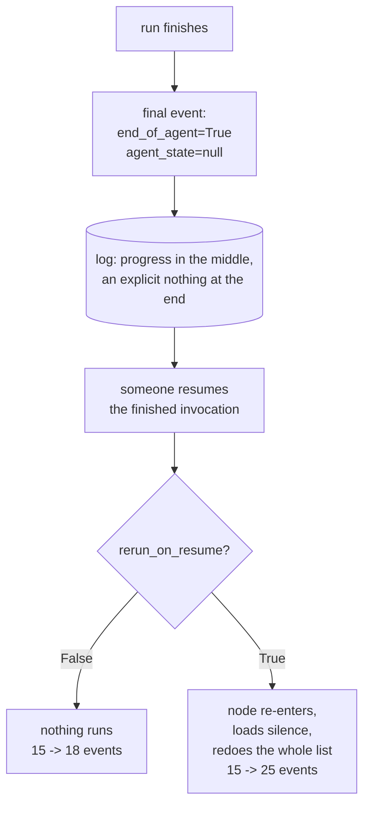

# 3.5 — Handing back the key

## One-line answer

`end_of_agent=True` writes a final event whose `agent_state` is **null** — the note is torn up on
purpose — and resuming an already-finished invocation is therefore not a no-op: with
`rerun_on_resume=True` it rescores all four candidates and takes the log from 15 events to 25, while
with it False nothing runs at all.

## The story

You have been given a key to the office so you can finish a job over the weekend.

On Monday you finish, and you hand the key back. That is the right thing to do, and everybody would
agree it is the right thing to do: you should not be holding a key to a place you have no current
business in.

Now suppose on Tuesday somebody hands you the key again, without saying why.

You would go in and start working. Not because you think there is work — because there is nothing
about being handed a key that says *"the job is done"*. The key is not a message. You gave back the
only thing you had that recorded where you were, and now you are standing in the office with no
notes and a job you half remember.

Handing the key back was correct. It also destroyed the only thing that would have told you not to
start again.

## The idea in plain language

[3.1](3.1-the-mark-on-the-doorframe.md) showed the writing side of a custom agent's checkpoint. There
is a closing move that goes with it, and `adk.dev/runtime/resume/`, fetched 2026-09-06, states it as
a requirement: a custom agent should include *"an `end_of_agent=True` status upon successful
completion."*

What that call actually does is the point of this part, and it is not what most readers assume. It
does not mark the checkpoint as finished. It **clears** it. The final event carries
`agent_state=None`, and the note the agent had been keeping is gone from the last record in the log.

That is a sensible design. A completed agent should not leave a half-written progress note lying
around for some future resume to pick up and misinterpret — you hand the key back.

But it creates a specific situation that this part exists to measure. After a run finishes, the log
contains progress checkpoints in the middle and an explicit *nothing* at the end. So if anybody
resumes that invocation — a retried queue message, a duplicated notification, an operator pasting an
id twice — the agent is handed silence, exactly as though it had never run.

What happens next is decided entirely by the field
[3.4](3.4-write-it-on-the-shared-board.md) told you that you need.

## Why Sutra needs it

[3.4](3.4-write-it-on-the-shared-board.md) ended with an instruction: set `rerun_on_resume=True` on
any station that keeps per-item progress, or a mid-run kill silently loses work. That instruction is
correct and this part is its bill.

The same flag that makes a kill survivable makes a **redundant** resume expensive, because the node
re-runs and the note that would have told it to stop was cleared on completion. Sutra will resume
runs from queue messages, and queue messages arrive more than once — Day 60's
[3.3](../../../day-60-durable-execution/parts/03-doing-it-twice/3.3-the-key-names-the-intention.md)
established that at-least-once delivery is the normal case, not the pathological one.

So Sutra needs to know that "resume" is not a safe no-op on a finished run, and that guarding against
a duplicate resume is a separate piece of work from guarding against a lost one.

## The mechanism

`endof.py` runs the drill to completion, prints every event the scoring station wrote, and then
resumes the finished invocation twice — changing exactly one field between the two attempts.

```bash
cd days/day-61-pause-resume-checkpoints/lab
uv run python endof.py
```

**Line by line:**

- The first block prints `set_agent_state`'s own docstring, filtered to the three bullet points that
  state its three behaviours. The framework's description of its own API is the primary source for
  what the call means.
- The middle block lists every event authored by `dedupe` with both `end_of_agent` and `agent_state`
  side by side, so the closing event's shape is visible rather than described.
- `arm()` runs a fresh complete drill and then resumes it, in separate subprocesses, once with
  `rerun_on_resume=True` and once with it False. Everything else — the class, the store handling, the
  candidate list — is identical between the two arms.
- Every child invocation passes all three arguments, so a child process can never fall through into
  `main()` and spawn children of its own.

Measured on 2026-09-06:

```text
  set_agent_state's own docstring, the three cases:
   * If end_of_agent is True, will set the end_of_agent flag to True and
   * Otherwise, if agent_state is not None, will set the agent_state and
   * Otherwise, will clear the agent_state and end_of_agent flag, to allow the

  the dedupe node emitted 5 events. Their agent_state, in order:
    end_of_agent=None  agent_state={"scored": ["4521"], "results": {"4521": 3}}
    end_of_agent=None  agent_state={"scored": ["4521", "4633"], "results": {"4521": 3, "4633": 2}}
    end_of_agent=None  agent_state={"scored": ["4521", "4633", "4701"], "results": {"4521": 3, "463
    end_of_agent=None  agent_state={"scored": ["4521", "4633", "4701", "9999"], "results": {"4521":
    end_of_agent=True  agent_state=None

  events after the run: 15   checkpoints: 10

  now resume that finished invocation, changing one field:

    rerun_on_resume=True   events 15 -> 25
                           what ran: dedupe: scored 4521 -> 3, dedupe: scored 4633 -> 2, dedupe: scored 4701 -> 0, dedupe: scored 9999 -> 1
    rerun_on_resume=False  events 15 -> 18
                           what ran: nothing at all
```

**Five events from one station, and the fifth is the interesting one.** Four carry growing progress.
The fifth carries `end_of_agent=True` and `agent_state=None`. The note was not marked complete — it
was replaced with nothing. That is the key going back on the hook.

**Then the two resumes, and they could hardly be further apart.**

`rerun_on_resume=True`: the log goes from **15 events to 25**, and the station rescores all four
candidates. It ran the entire list again, on a run that had already finished, and produced a second
complete set of results in the same session.

`rerun_on_resume=False`: **15 to 18**, and nothing ran. The three extra events are the runtime's own
bookkeeping for an invocation that had nothing to do.

Now put that beside [3.4](3.4-write-it-on-the-shared-board.md)'s conclusion, because the two together
are the honest position:

| | mid-run kill, then resume | finished run, resumed again |
| --- | --- | --- |
| `rerun_on_resume=False` | **2 of 4 scored**, exit 0 (3.4) | nothing runs — harmless |
| `rerun_on_resume=True` | 4 of 4, nothing rescored (3.4) | **whole list rescored** |

There is no setting that is right in both columns. `True` is correct for the failure you are trying
to survive and wrong for the duplicate you were not thinking about; `False` is the reverse. The
field does not encode "be correct" — it encodes *which* of two situations you have decided to be
correct in.

And the reason the top-right cell is harmless while the bottom-right is not comes straight from the
docstring: `end_of_agent=True` **cleared** the progress. A re-running node finds silence, not a
finished note, so it has no way to conclude that there is nothing left to do.



## When it breaks

The break is treating a resume as idempotent, and the measurement above is already it. What is worth
adding is how visible the damage is afterwards, because that decides whether anybody notices.

```bash
cd days/day-61-pause-resume-checkpoints/lab
uv run python -c "
import json
from _store import checkpoints
rows = [c for c in checkpoints('endof.json') if 'scored' in c]
print(f'  agent checkpoints in the finished-then-resumed log: {len(rows)}')
for row in rows:
    print('   ', json.dumps(row['scored']))
"
```

**Line by line:**

- Reads the store left behind by the `rerun_on_resume=True` arm — a run that completed and was then
  resumed once.
- Printing each `scored` list in order shows the shape of the duplication rather than just its size.

```text
  agent checkpoints in the finished-then-resumed log: 8
    ["4521"]
    ["4521", "4633"]
    ["4521", "4633", "4701"]
    ["4521", "4633", "4701", "9999"]
    ["4521"]
    ["4521", "4633"]
    ["4521", "4633", "4701"]
    ["4521", "4633", "4701", "9999"]
```

**Eight checkpoints where four is the whole job.** The sequence restarts cleanly in the middle, and
both halves are internally correct — which is what makes this hard to spot in a log viewer. There is
no error, no gap, no anomaly in any single record. The only evidence is that the story is told twice.

In this drill the second telling is harmless: scoring is pure, so the results are identical and the
final answer is right. Change the per-item work to something with an effect — a row written, a
notification sent, a counter incremented — and the same eight checkpoints represent **eight actions
where four were intended**, with the run reporting success both times.

That is Day 60's
[3.5](../../../day-60-durable-execution/parts/03-doing-it-twice/3.5-exactly-once-is-about-effects.md)
exactly: the protection you need is not on the resume, it is on the effect.

## In production

**What a professional writes instead.** They do not rely on the resume path being safe. They make the
**caller** idempotent: before resuming, check whether the invocation has already completed, and treat
a resume of a completed run as a no-op that is logged rather than performed. That check is cheap —
the log already contains an `end_of_agent=True` event — and it belongs in the same thin resume entry
point that [1.3](../01-two-ways-to-stop/1.3-bring-the-cloth-or-bring-the-receipt.md) argued should
validate the invocation id, because both are the same job: deciding whether this resume should happen
at all.

**What degrades at scale.** Duplicate resumes stop being hypothetical. A queue with at-least-once
delivery, a retry on a timeout that actually succeeded, two workers picking up the same notification —
all of these produce a second resume of a run that is already finished, and at volume they produce
them constantly. A system whose correctness depends on nobody resuming twice is a system that is
already wrong and has not noticed.

**The failure mode that only appears with real traffic.** The redundant resume that lands *while the
first one is still running*. Everything above assumes the two resumes are sequential. When they
overlap, two processes are re-entering the same node against the same session, and the last-writer
behaviour Day 54 measured on parallel branches applies to their state writes. The result is not
merely duplicated work but interleaved progress records, and the run can end with a `scored` map that
neither process would have produced alone.

**The review comment a senior engineer leaves:** *"`rerun_on_resume=True` is right for the kill case,
but note what it costs you here: this handler resumes on every queue message, the queue is
at-least-once, and a resume of a finished invocation re-runs the whole station because
`end_of_agent` cleared its progress. I measured a similar case at 15 events becoming 25. Check for a
terminal event before resuming, and put the idempotency key on the write step rather than trusting
the resume to be safe."*

**The interview question:** *"Is resuming a completed run safe?"* An honest answer: *"I assumed so and
it is not, at least not in ADK 2.7.1 with the setting you need for the other failure. On completion a
custom agent is supposed to call `set_agent_state(end_of_agent=True)`, and that does not mark the
progress finished — it clears it, writing a final event with a null `agent_state`. So a later resume
hands the agent silence. With `rerun_on_resume=True`, which you need so that a mid-run kill does not
skip the node, the station then redoes its entire list: I measured a finished run going from 15
events to 25, with all four items scored a second time. With the flag False nothing happens, but then
the kill case loses work. There is no value that is right for both, so the resume has to be guarded by
the caller — check for the terminal event — and the effects have to carry their own idempotency
keys."*

## Check yourself

```bash
cd days/day-61-pause-resume-checkpoints/lab
uv run python endof.py
```

Now find the fifth `dedupe` event in the output and write down its two fields. Then say, without
running it, what the event count would be if the finished invocation were resumed **twice** with
`rerun_on_resume=True`, and check yourself by resuming it again.

**Out loud, without scrolling up:** what does `end_of_agent=True` actually do to the agent's stored
note, and why does that make a second resume of a finished run redo the whole job rather than
nothing?

**Next:** [4.1 — The monthly generator test](../04-the-drill/4.1-the-monthly-generator-test.md).
