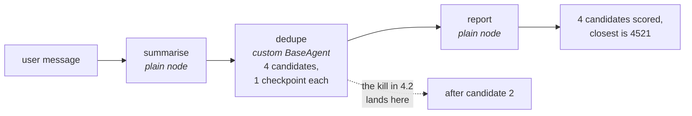

# 4.1 — The monthly generator test

## One-line answer

Before you break anything you need a known-good baseline, and the drill's is exact: **15 events, 10
checkpoints, 0 model requests**, printed by a run that finishes normally — every later number in
this section is read against those three.

## The story

The hospital runs its backup generator on the first Saturday of every month, for twenty minutes,
with nothing wrong.

It looks like a waste. The mains are fine, the generator is fine, and everybody knows it is fine. A
man walks down, starts it, watches some dials, writes numbers on a clipboard, and shuts it off.

The numbers are the reason. Not the fact that it started — anyone would notice if it did not start.
The numbers: what the output voltage settled at, how long it took to pick up load, how much fuel it
used. Written down, month after month, in the same columns.

Because the day it matters, at two in the morning with the mains gone, nobody has any way to tell
whether the generator is behaving well or badly except by comparing it against what it does when
nothing is wrong. Without the clipboard, "it is running" is the only observation available, and "it
is running" is not the question.

## The idea in plain language

Sections 1 to 3 measured pieces of the mechanism. This section runs the whole thing end to end —
start it, kill it, pick it up in a new process — and to do that honestly it needs a **baseline**: the
same run, uninterrupted, with its numbers written down.

The drill is three stations, and it is worth naming them once because the rest of the section refers
to them constantly:

| station | what it is | what it does |
| --- | --- | --- |
| `summarise` | a plain function node | writes the ticket into session state |
| `dedupe` | a custom `BaseAgent` node | scores four candidate duplicates, checkpointing after each |
| `report` | a plain function node | turns the scores into one sentence |

That shape is deliberate: it is the smallest thing that contains both kinds of checkpoint from
[2.1](../02-inside-the-box/2.1-two-people-writing-in-one-notebook.md), so a kill can be aimed at the
interesting place — inside the custom agent's list, where the graph's own node map cannot record
progress.

Three numbers come out of the clean run and each one is a different question:

- **events written** — how much the log grows for one complete run.
- **checkpoints** — how many of those events carry a checkpoint of either kind.
- **model requests** — zero, and stated rather than assumed, because Addendum 02 makes it the
  currency and a day that quietly spent some would be a day whose arithmetic cannot be trusted.

## Why Sutra needs it

Day 65 kills the triage graph at four different moments and asks whether it came back correctly.
"Correctly" is only answerable against a baseline: a resumed run should end with the same results as
an uninterrupted one, and it should not have done materially more work to get there.

Without the clean numbers, the strongest available statement about a resumed run is "it finished",
which — as [3.4](../03-the-agents-own-note/3.4-write-it-on-the-shared-board.md) showed, where a run
finished with half its work done and exit code 0 — is not a statement about correctness at all.

## The mechanism

`drill.py` deletes any previous store, runs the three stations to completion, and prints the
baseline.

```bash
cd days/day-61-pause-resume-checkpoints/lab
uv run python drill.py
```

**Line by line:**

- `fresh(STORE)` deletes `drill_clean.json` first. A baseline measured over a file that already had
  events in it would be a baseline of two runs.
- `start(build(), STORE)` builds the App with `kill_after=0` — the drill with its kill disabled — and
  runs it with a new message, which is [1.3](../01-two-ways-to-stop/1.3-bring-the-cloth-or-bring-the-receipt.md)'s
  start form.
- `events(STORE)` and `checkpoints(STORE)` read the numbers back **off the disk file** rather than
  counting what the run yielded in memory. What survived the process is the only thing the next
  section can use.
- `model requests 0` is printed as a literal, and it is true by construction: `score()` in `_drill.py`
  is set intersection over two strings. No provider is configured, no key is read, nothing opens a
  socket.

Measured on 2026-09-06:

```text
  summarise: 'customer signed out mid-form during single sign-on'
  dedupe: agent_states keys = []
  dedupe: loaded checkpoint None
  dedupe: scored 4521 -> 3
  dedupe: scored 4633 -> 2
  dedupe: scored 4701 -> 0
  dedupe: scored 9999 -> 1
  report: 4 candidates scored, closest is 4521

  invocation id     e-a77bf16c-c264-4c34-bc59-5eea8de3a2a7
  events written    15
  checkpoints       10
  store on disk     27783 bytes
  model requests    0
```

The narration first, because it is the control against which every later run is read.

`agent_states keys = []` and `loaded checkpoint None` — on a first run there is nothing to resume, so
[3.2](../03-the-agents-own-note/3.2-a-blank-page-and-no-page-at-all.md)'s *silence* is the correct
and expected answer here. When the same two lines appear on a **resume**, in
[3.3](../03-the-agents-own-note/3.3-the-rough-column-nobody-marks.md), they are the bug. The lines
are identical; only the context makes one of them wrong.

Then four candidates scored, in order, with `4521` winning at 3 shared words. That is the correct
answer to this ticket and it is what a resumed run has to reproduce.

Now the three numbers:

- **15 events.** [2.1](../02-inside-the-box/2.1-two-people-writing-in-one-notebook.md) broke these
  down: six graph checkpoints, four agent checkpoints, five plain events.
- **10 checkpoints.** Six plus four. Two thirds of everything written during this run is
  bookkeeping about progress rather than the work itself — which is the honest cost of durability on
  a graph this small, and it shrinks as a proportion as the stations do more.
- **0 model requests.** Stated, not assumed.

The invocation id is the one line that will differ on your machine: it is generated fresh per run.
The byte count moves slightly with it, which is why
[2.4](../02-inside-the-box/2.4-how-often-you-press-save.md)'s figure is computed rather than typed.



## When it breaks

The break is not the one you would guess, and finding that out is worth the two commands.

The obvious worry is contamination: run the drill twice into the same store, get two runs' worth of
events, and record that as the baseline. ADK refuses:

```bash
cd days/day-61-pause-resume-checkpoints/lab
uv run python -c "
import warnings, contextlib, io
warnings.simplefilter('ignore')
from _drill import build
from _run import fresh, start
from _store import events
fresh('twice.json')
with contextlib.redirect_stdout(io.StringIO()):
    start(build(), 'twice.json')
print('after one run:', len(events('twice.json')), 'events')
try:
    with contextlib.redirect_stdout(io.StringIO()):
        start(build(), 'twice.json')
except Exception as exc:
    print(f'second start raised {type(exc).__name__}: {str(exc).splitlines()[0]}')
" 2>/dev/null
```

**Line by line:**

- `redirect_stdout` swallows the drill's station-by-station narration, which is 4.1's subject above
  and noise here.
- The `try` is around the **second** `start()` only. If it succeeded, the store would hold two runs
  and the printed count would say so.

```text
after one run: 15 events
second start raised AlreadyExistsError: Session with id S1 already exists.
```

Good news, stated plainly: you cannot quietly stack two starts into one session. `create_session`
refuses, loudly, by name.

The real break is subtler and it is the one that will bite in the next two parts. **A resumed run's
log is not comparable to a clean run's log by event count**, because the resumed store contains
*both* attempts — the events the killed process wrote and the events the resuming process wrote.
[4.3](4.3-the-mason-who-comes-back-in-the-morning.md) ends at 19 events, and 19 against a baseline of
15 is not a regression, a leak or a duplication. It is two partial runs in one file, which is exactly
what a resumable system is supposed to produce.

So the baseline's event count is a **shape** number, useful for saying "six graph checkpoints, four
agent checkpoints, five plain events" and for noticing when a refactor changes that mix. It is not a
number a resumed run should match, and a test asserting that it is will be red for a correct system.
The numbers that *are* comparable across a kill are the final answer and the model-request count,
which is why those two are the assertions worth writing.

## In production

**What a professional writes instead.** They capture the baseline as an **assertion**, not as
printed output — a test that runs the graph end to end and checks the result, the event count and
the request count against known values. Printed numbers are for a human reading a document; a
committed test is what tells you six weeks later that a refactor changed the shape of the log. That
test is what the hub's §5 build brief asks for.

**What degrades at scale.** Exact event counts stop being stable. Retries, timeouts and a graph with
conditional edges all move the number legitimately, so an assertion of `== 15` becomes flaky and gets
deleted, which is worse than never having had it. The version that survives asserts on the things
that should not move — the final answer, the number of model requests, and that a resumed run does
no more work than a clean one — and merely records the event count for a human.

**The failure mode that only appears with real traffic.** A baseline measured on an empty archive.
This drill has four candidates and a fixed ticket, so it is perfectly reproducible. A real desk's
run length depends on how many candidates the archive returns, which depends on the ticket, so
"normal" is a distribution rather than a number, and a comparison against a single clean run will
flag ordinary variation as a regression.

**The review comment a senior engineer leaves:** *"There is no clean-run assertion anywhere in this
suite. Every test here kills something and checks it recovers, which means if the graph starts
producing the wrong answer without being killed, nothing goes red. Add the boring test first: run it,
assert the answer, assert zero model requests."*

**The interview question:** *"How do you know a resumed run is correct?"* An honest answer: *"By
comparing it against an uninterrupted one, which means capturing that first. I record three things
from a clean run — the final answer, the number of events in the log, and the number of model
requests, which for this drill is zero by construction. Then a resumed run has to produce the same
answer without doing materially more work. Without the baseline the only available assertion is 'it
finished', and I have seen a run finish with half its list done and exit zero, so 'it finished' is
not a correctness claim."*

## Check yourself

```bash
cd days/day-61-pause-resume-checkpoints/lab
uv run python drill.py
```

Run it twice in a row and confirm the event count is 15 both times. Then say which line of
`drill.py` makes that true, and what the second run would have printed without it.

**Out loud, without scrolling up:** name the three numbers this baseline records and say what
question each one answers about a run that was killed and resumed.

**Next:** [4.2 — Pulling the plug mid-cycle](4.2-pulling-the-plug-mid-cycle.md).
