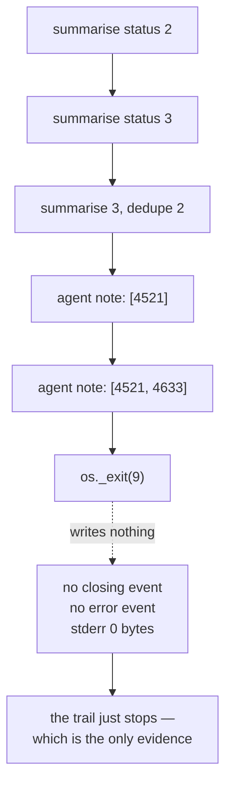

# 4.2 — Pulling the plug mid-cycle

## One-line answer

`os._exit(9)` is the closest thing Python has to a power cut — no handlers, no flush, **zero bytes of
stderr** — and what it leaves behind is exactly seven events: three graph checkpoints tracking the
stations and two agent checkpoints holding two of four candidates.

## The story

The washing machine is halfway through a cycle and the drum is turning, and you pull the plug out of
the wall.

Not switch it off at the front, where it would drain and stop and beep. Pull the plug. It stops
being a machine and becomes a metal box with wet clothes in it.

Later you push the plug back in. It does not carry on. It does not say what it was doing. It sits
there with its display blank, and everything you can learn about what it had got to, you learn by
opening the door and looking at the clothes.

That is the honest version of a crash, and it is worth insisting on it rather than testing the polite
kind. A machine that is switched off properly gets to tidy up. A machine that loses power gets
nothing, and the state of the clothes is the entire record.

## The idea in plain language

[1.1](../01-two-ways-to-stop/1.1-the-call-that-dropped-and-the-call-that-ended.md) established that a
run can stop two ways, and that the two leave nearly identical evidence. This part performs the
harsher one properly, and looks at the wreckage in full.

`os._exit(9)` is the tool, and the reason to use it rather than `sys.exit` or an exception is worth
being precise about:

| what you call | what still runs |
| --- | --- |
| an exception | `except`, `finally`, context managers, `atexit`, buffer flush |
| `sys.exit()` | the same — it raises `SystemExit` |
| **`os._exit()`** | **nothing at all** |

`os._exit` goes straight to the operating system. No `finally` block executes, no `with` statement
closes anything, no buffered write is flushed, and no exception is available for any framework to
catch and record. It is the only one of the three that honestly simulates a power cut or a container
being killed, and it is therefore the only one worth building a durability claim on.

What that means for the log is the thing to hold on to: **whatever reached the disk before that
instant is all there is, for ever.** Not "mostly all". There is no cleanup pass, no last write, no
opportunity for anything to be tidied.

## Why Sutra needs it

Day 65's phase gate is *kill it mid-run; it resumes*, and the value of that gate depends entirely on
how the kill is performed. A gate that kills the run with an exception is testing the polite path,
where the framework got to write an error event and flush its buffers — and
[5.3](../05-failure-lab/5.3-the-clerk-who-wrote-rejected-in-pen.md) shows that the polite path behaves
*differently*, and worse, than the brutal one.

So the drill has to be able to die properly, and the kill has to happen inside the interesting place:
partway through the custom agent's list, where the graph's own node map cannot record progress.

## The mechanism

`kill.py` runs the drill in a **subprocess** with `kill_after=2`, so the child destroys itself after
two candidates, and then the parent — which is still alive — reads the wreckage off the disk.

```bash
cd days/day-61-pause-resume-checkpoints/lab
uv run python kill.py
```

**Line by line:**

- The script re-executes itself as a child (`kill.py child`). This is structural, not stylistic:
  `os._exit(9)` destroys the interpreter that calls it, so a script that killed itself in-process
  could not then report on what happened.
- `subprocess.run(..., capture_output=True)` collects the child's output, and the parent prints both
  the child's narration and the child's **exit code and stderr length**, which is the evidence about
  how it died.
- `Path(STORE).unlink(missing_ok=True)` first, so the seven events counted at the end are one run's.
- `events()`, `invocation_id()` and `checkpoints()` all read the JSON file, which is the only thing
  that outlived the child.

Measured on 2026-09-06:

```text
  summarise: 'customer signed out mid-form during single sign-on'
  dedupe: agent_states keys = []
  dedupe: loaded checkpoint None
  dedupe: scored 4521 -> 3
  dedupe: scored 4633 -> 2
  *** the process is killed here ***

  the process is gone. exit code 9, stderr 0 bytes
  events on disk      7
  invocation id       e-d60f9a15-85c7-4a9d-9974-21f03432e443
  the checkpoint trail, oldest first:
    {"nodes": {"summarise": {"status": 2, "interrupts": [], "resume_inputs": {}}}}
    {"nodes": {"summarise": {"status": 3, "interrupts": [], "resume_inputs": {}}}}
    {"nodes": {"summarise": {"status": 3, "interrupts": [], "resume_inputs": {}}, "dedupe": {"status": 2, "interrupts": [], "resume_inputs": {}}}}
    {"scored": ["4521"], "results": {"4521": 3}}
    {"scored": ["4521", "4633"], "results": {"4521": 3, "4633": 2}}
```

**`exit code 9, stderr 0 bytes`.** That is the signature of a real kill. Nine is the status
`os._exit(9)` was given, and there is no traceback, no message, no warning — nothing was raised, so
nothing had anything to print. Compare it against
[1.1](../01-two-ways-to-stop/1.1-the-call-that-dropped-and-the-call-that-ended.md)'s exception arm,
which exited 1 and wrote a `RuntimeError` into the log. The empty stderr here is the whole
difference, and it is the reason this is the harder case to recover from and the more realistic one
to test.

**Seven events, and the trail explains every one.** Read the five checkpoints in order — this is the
run narrating its own death:

1. `summarise` at status **2** — the first station has started.
2. `summarise` at status **3** — it has finished.
3. `summarise` 3, `dedupe` **2** — the second station has started. This is the record
   [2.2](../02-inside-the-box/2.2-opening-the-fuse-box.md) opened and read field by field.
4. `{"scored": ["4521"]}` — the agent's own note after the first candidate.
5. `{"scored": ["4521", "4633"]}` — after the second. Then the plug comes out.

Two things are worth noticing about that list.

**The two kinds interleave.** Three graph checkpoints, then two agent checkpoints, in one trail, in
one field, exactly as [2.1](../02-inside-the-box/2.1-two-people-writing-in-one-notebook.md)
described. The trail is a single chronological story told by two writers.

**Nothing records the kill.** There is no final event saying "and then it died". The trail simply
stops. That absence is the *only* signal that this run is unfinished, which is
[1.1](../01-two-ways-to-stop/1.1-the-call-that-dropped-and-the-call-that-ended.md)'s point arriving
as a concrete file: a killed run is identified by what is missing from its log, because a killed
process cannot write anything, including the fact that it is dying.



## When it breaks

The break is testing with the wrong kind of stop, and it is easy to reach by accident because
`sys.exit` looks like the obvious way to end a process.

```bash
cd days/day-61-pause-resume-checkpoints/lab
uv run python -c "
import os, sys
def polite():
    try:
        sys.exit(9)
    finally:
        print('  finally ran: the process got to tidy up')
def brutal():
    try:
        os._exit(9)
    finally:
        print('  this line never prints')
if os.environ.get('BRUTAL'):
    brutal()
try:
    polite()
except SystemExit:
    print('  and SystemExit was catchable')
"
```

**Line by line:**

- `polite()` calls `sys.exit(9)`, which raises `SystemExit` — so the `finally` runs and the caller can
  catch it.
- `brutal()` calls `os._exit(9)` inside an identical `try`/`finally`, to show that the `finally` does
  not run.
- The `BRUTAL` environment variable selects which one executes, so both can be demonstrated from the
  same snippet.

```text
  finally ran: the process got to tidy up
  and SystemExit was catchable
```

Both lines printed. `sys.exit` is an **exception**, so a `finally` ran and an `except` caught it. Any
durability test built on it is testing a stop where your own cleanup code, the framework's cleanup
code and the interpreter's buffer flush all got to run.

The brutal arm prints nothing at all:

```bash
cd days/day-61-pause-resume-checkpoints/lab
BRUTAL=1 uv run python -c "
import os, sys
def brutal():
    try:
        os._exit(9)
    finally:
        print('  this line never prints')
brutal()
"; echo "exit: $?"
```

**Line by line:**

- Identical `try`/`finally` around `os._exit`, so the only variable is which call ends the process.
- `echo "exit: $?"` reports the status to the shell, because the process itself cannot.

```text
exit: 9
```

No output, and the exit status arrives from the operating system rather than from Python. That is
what you must test against, and a suite that only ever raises has never tested durability at all —
it has tested error handling, which is a different subject with a different failure mode.

## In production

**What a professional writes instead.** They test **both**, and they test the signals a real
deployment sends: `SIGTERM` first, which a container runtime gives you before it gives up, and then
`SIGKILL`, which it does not let you handle. `os._exit` stands in for the second. A durability claim
that has only been tested against a graceful shutdown is a claim about the case that was already
fine.

**What degrades at scale.** The kill stops being an exceptional event. Every deploy, every autoscale
event and every node rotation kills runs in the middle, so a system at any real size is executing
this path continuously rather than in a test. The consequence is that the resume path is not an
emergency measure — it is a normal, hot code path, and it deserves the same tests and the same
monitoring as the happy one.

**The failure mode that only appears with real traffic.** The kill that lands mid-write. Everything
above is clean because the process dies between two flushes. Under load a kill can land inside one,
and the store's last record is then half-written JSON. Whether your resume survives that depends on
the store, and the way to find out is to truncate a store file on purpose and try — not to reason
about how narrow the window is, because a narrow window multiplied by a large number of runs is a
daily occurrence.

**The review comment a senior engineer leaves:** *"The recovery test raises an exception inside the
node to simulate a crash. That is not a crash — `finally` blocks run, buffers flush, and the
framework gets to write an error event, which is a materially different log from the one a killed
pod leaves. Use a real signal, or `os._exit`, or this test is green for a case that was never at
risk."*

**The interview question:** *"How do you test that your system survives a crash?"* An honest answer:
*"By causing a real one rather than an exception. `sys.exit` raises `SystemExit`, so `finally` blocks
and buffer flushes still run and the framework can record what happened; `os._exit` runs nothing at
all, which is what a power cut or a `SIGKILL` looks like from inside the process. I kill the run in a
subprocess so the parent survives to inspect the store, and the signature of a genuine kill is exit
code 9 with zero bytes of stderr. What the store then holds is exactly what reached disk before that
instant — in my drill, seven events, ending with the agent's note after two of four candidates and
no record whatsoever that anything went wrong."*

## Check yourself

```bash
cd days/day-61-pause-resume-checkpoints/lab
uv run python kill.py
```

Now change `kill_after=2` to `kill_after=3` in `kill.py`'s `child()`, re-run, and write down the new
event count and the last line of the trail. Then say which of the two kinds of checkpoint changed
and which did not.

**Out loud, without scrolling up:** why is `os._exit` the right tool for this test and `sys.exit` the
wrong one, and what single piece of evidence in the output tells you a real kill happened?

**Next:** [4.3 — The mason who comes back in the morning](4.3-the-mason-who-comes-back-in-the-morning.md).
