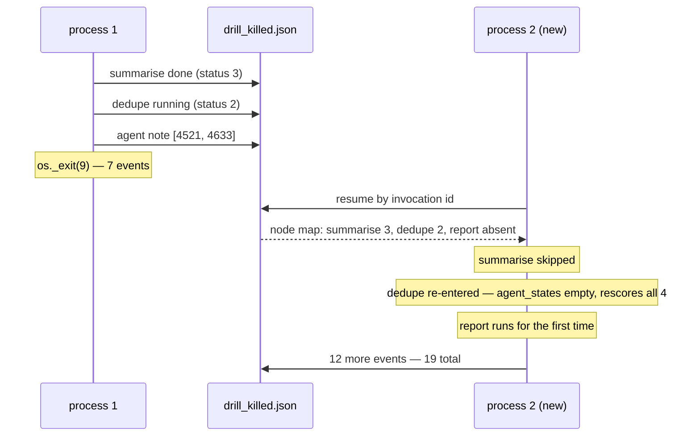

# 4.3 — The mason who comes back in the morning

## One-line answer

A brand-new process finishes the run the dead one started — `summarise` is skipped as already
completed and `report` runs for the first time, ending at all three nodes status 3 — but the log
goes 7 → 19 rather than to the baseline's 15, and the extra four events are the dedupe list being
scored a second time.

## The story

Two men are building a boundary wall, and at the end of the day one of them has laid about half of
it.

He goes home. The next morning the other one turns up instead — the first is unwell — and he has
never seen this job before. He does not stand there stuck. He looks at the wall.

Half-built walls are extremely informative if you know how to read one. The courses that are laid
are laid. The mortar that has gone off has gone off. There is a line where the work stops, and a
string still pulled tight along the top showing the level it is meant to reach.

He carries on from the line. Nobody handed him a report, and there is nobody to ask.

What he cannot see is anything that was in the first man's head. Whether a brick near the bottom was
a bit off and he meant to come back to it. Whether the sand in the corner is the right mix or
yesterday's leftovers. The wall records the *work*, completely and reliably, and records the
*intentions* not at all.

## The idea in plain language

[4.2](4.2-pulling-the-plug-mid-cycle.md) left seven events in a file and a dead process. This part is
the other half: a **completely new process**, sharing nothing with the first except that file and an
invocation id, finishing the job.

Nothing is inherited. Not memory, not open files, not variables, not the Python interpreter. The new
process is handed one string — the invocation id from
[1.3](../01-two-ways-to-stop/1.3-bring-the-cloth-or-bring-the-receipt.md) — and it reads a JSON file.
That is the entire channel between the two attempts, and it is worth pausing on how narrow it is,
because everything durability gives you has to fit through it.

What the resuming process does with the graph's checkpoint is exactly what
[2.2](../02-inside-the-box/2.2-opening-the-fuse-box.md) predicted from reading it:

- `summarise` was at status **3** — completed. It is **not** run again.
- `dedupe` was at status **2** — running when the lights went out. It is re-entered.
- `report` was **absent** from the map — never started. It runs for the first time.

Three nodes, three different treatments, all decided by a small map of statuses. That is the
mechanism doing its job, and this part is where it is finally visible end to end rather than as a
field in a file.

And then there is the part that is not clean, which this part has to report honestly rather than
skip: the dedupe station scores all four candidates again.

## Why Sutra needs it

This is Day 65's gate, rehearsed on three nodes instead of five. Start a run, kill it, pick it up
elsewhere, and check what came back — and just as importantly, check **what was redone**, because a
run that completes correctly by repeating everything has not been resumed in any sense worth the
word.

It also establishes the shape of the number Day 65 will be reading. A resumed store's event count is
not the baseline's; [4.1](4.1-the-monthly-generator-test.md) said so and this is where it becomes
concrete.

## The paper behind it

**Distributed snapshots: determining global states of distributed systems** ·
`doi:10.1145/214451.214456` · 1985 · <https://doi.org/10.1145/214451.214456>

The paper that made "a recorded state you can restart from" a precise idea rather than an intuition:
what it means for a snapshot of a running system to be consistent, and why a state assembled from
records written at different moments can still be one the system could really have been in.

Taught in full on Day 60:
[`papers/01-distributed-snapshots.md`](../../../day-60-durable-execution/papers/01-distributed-snapshots.md).

## The mechanism

`pickup.py` reads the invocation id straight out of the store the killed process left, and resumes.

```bash
cd days/day-61-pause-resume-checkpoints/lab
uv run python kill.py
uv run python pickup.py
```

**Line by line:**

- `kill.py` must run first; `pickup.py` has nothing to pick up otherwise. They are separate commands
  on purpose — two invocations of the shell, to make the point that these are two unrelated processes.
- `invocation_id(STORE)` reads the id off the first event in the file. In a real system this arrives
  in a queue message or from an operator; here the file is the only place it exists.
- `resume(build(), STORE, invocation)` builds a **fresh App** — same class, new object — and calls
  `run_async` with the id and no new message.
- The before-and-after event counts bracket the resume, so the growth is attributable to it.

Measured on 2026-09-06:

```text
  picking up e-d60f9a15-85c7-4a9d-9974-21f03432e443
  events before 7

  dedupe: agent_states keys = []
  dedupe: loaded checkpoint None
  dedupe: scored 4521 -> 3
  dedupe: scored 4633 -> 2
  dedupe: scored 4701 -> 0
  dedupe: scored 9999 -> 1
  report: 4 candidates scored, closest is 4521

  events after  19
  final checkpoint {'nodes': {'summarise': {'status': 3, 'interrupts': [], 'resume_inputs': {}}, 'dedupe': {'status': 3, 'interrupts': [], 'resume_inputs': {}}, 'report': {'status': 3, 'interrupts': [], 'resume_inputs': {}}}}
```

**The good half first, because it is real.**

There is no `summarise:` line in that output. The first station did not run. Its status was 3 and the
runtime skipped it, which is the whole promise of a checkpoint honoured in one absence.

`report:` **is** there, and it produces the right answer — `4 candidates scored, closest is 4521`,
identical to [4.1](4.1-the-monthly-generator-test.md)'s baseline. A station that had never started
ran for the first time, in a different process, using session state written by a process that no
longer exists.

The final checkpoint has all three nodes at **status 3**. The run is complete, and its own record
says so.

**Now the half that is not clean.** The dedupe station rescored all four candidates —
`agent_states keys = []`, `loaded checkpoint None`, and four `scored` lines including `4521` and
`4633`, which the dead process had already done.

That is [3.3](../03-the-agents-own-note/3.3-the-rough-column-nobody-marks.md) arriving in the
end-to-end run: the agent's own checkpoints are in this very file — `kill.py` printed them, two of
them, in its trail — and `ctx.agent_states` comes back empty because the agent is a node inside a
`Workflow`. The graph's checkpoint worked perfectly. The agent's did not, and the difference between
those two is the whole of section 3.

**And that explains the event count.** 7 → 19, against a baseline of 15:

| | events |
| --- | --- |
| clean run ([4.1](4.1-the-monthly-generator-test.md)) | 15 |
| killed process left | 7 |
| after the pickup | **19** |

Nineteen is not fifteen and that is not a bug. The store holds **both attempts** — the seven events
of the dead run plus twelve from the resuming one. Of those twelve, four are agent checkpoints for
work that had already been done, which is the cost of the section 3 problem stated in events.

The resumed run is *correct*. It is not *efficient*, and on this drill the difference costs nothing
because scoring is arithmetic. Under Phase 10's rules, where a candidate is a model request, those
four events are four requests out of a daily allowance, spent on work that was already paid for.



## When it breaks

The break is picking up the wrong thing, and the id is the only handle so it is the only thing that
can be wrong.

```bash
cd days/day-61-pause-resume-checkpoints/lab
uv run python -c "
import warnings; warnings.simplefilter('ignore')
from _drill import build
from _run import resume
from _store import events
before = len(events('drill_killed.json'))
try:
    resume(build(), 'drill_killed.json', 'e-not-a-real-invocation')
except Exception as exc:
    print(f'  {type(exc).__name__}: {str(exc).splitlines()[0]}')
print(f'  events before {before}, after {len(events(\"drill_killed.json\"))}')
" 2>/dev/null
```

**Line by line:**

- The store is the real one left by `kill.py`, so this is a wrong id against a genuine session rather
  than a wrong id against nothing.
- The event count is printed before and after, because the question is not only "did it raise" but
  "did it write anything to a store it should not have touched".

```text
  ValidationError: 1 validation error for str
  events before 19, after 21
```

Two things there, and the second is the one worth carrying away.

The error is [1.3](../01-two-ways-to-stop/1.3-bring-the-cloth-or-bring-the-receipt.md)'s finding
again: an unknown invocation id is not rejected as unknown. It fails downstream with a pydantic
complaint about a string, because the graph started with no message and handed the first node `None`.

And **the store grew from 19 to 21 anyway.** A resume against an id that never existed still appended
two events to a real session. It did not corrupt the results — the run had already finished — but
it wrote into somebody's log on the strength of an id nobody issued, which is exactly why the resume
path needs the caller-side check that [1.3](../01-two-ways-to-stop/1.3-bring-the-cloth-or-bring-the-receipt.md)
argued for and [3.5](../03-the-agents-own-note/3.5-handing-back-the-key.md) sharpened into "check for
a terminal event before resuming".

## In production

**What a professional writes instead.** They make the pickup a **job**, not a command: something
takes a lease on the run, resumes it, and releases the lease, so that two workers cannot pick up the
same invocation at once. The id alone is not enough coordination — nothing in `run_async` prevents
two simultaneous resumes, and the store above will happily accept events from both.

**What degrades at scale.** The log grows with every attempt, not with the work. A run killed and
resumed four times holds five partial attempts, and its event count tells you nothing about the size
of the job. Any query written against event counts — cost attribution, "how big is a typical run" —
needs to divide by attempts or it is measuring the failure rate instead.

**The failure mode that only appears with real traffic.** The resume that arrives after somebody has
already fixed the problem by hand. An operator reruns the ticket manually, and then the queue's retry
fires and resumes the original invocation. Both complete, both are correct in isolation, and the
customer gets two replies. Nothing in the resume mechanism can see the manual run; the protection has
to be on the effect, which is Day 60's
[3.5](../../../day-60-durable-execution/parts/03-doing-it-twice/3.5-exactly-once-is-about-effects.md).

**The review comment a senior engineer leaves:** *"The resume works, but check what it repeated. The
dedupe station rescored everything the dead process had already scored, because that station keeps
its progress in its own agent state and gets an empty `agent_states` inside a graph. Right now that
is four cheap scores; when that station calls a model it is four requests every time a pod is
recycled. Move the progress into session state and set `rerun_on_resume`."*

**The interview question:** *"Walk me through what happens when a killed job is picked up by another
worker."* An honest answer: *"The new process is handed one thing — the invocation id — and reads the
run's log from shared storage. In my drill the graph's checkpoint had three nodes in three states:
one completed, which was skipped; one that was running when the process died, which was re-entered;
and one that was never in the map at all, which ran for the first time. The final result was
identical to an uninterrupted run. What I would flag is that the log went from 7 events to 19 against
a clean baseline of 15 — the store holds both attempts, which is expected — and that four of those
events were the middle station redoing work it had already recorded, because its own checkpoint is
not restored inside a graph. So 'it resumed correctly' and 'it resumed efficiently' were two
different answers and I had to check both."*

## Check yourself

```bash
cd days/day-61-pause-resume-checkpoints/lab
uv run python kill.py
uv run python pickup.py
```

Now run `pickup.py` a second time without re-running `kill.py`, and write down the event count. Then
explain, using [3.5](../03-the-agents-own-note/3.5-handing-back-the-key.md), why it did what it did.

**Out loud, without scrolling up:** three nodes, three different fates on resume. Name them, say what
decided each, and say which one of the three cost you work you had already paid for.

**Next:** [4.4 — Written on the back of your hand](4.4-written-on-the-back-of-your-hand.md).
