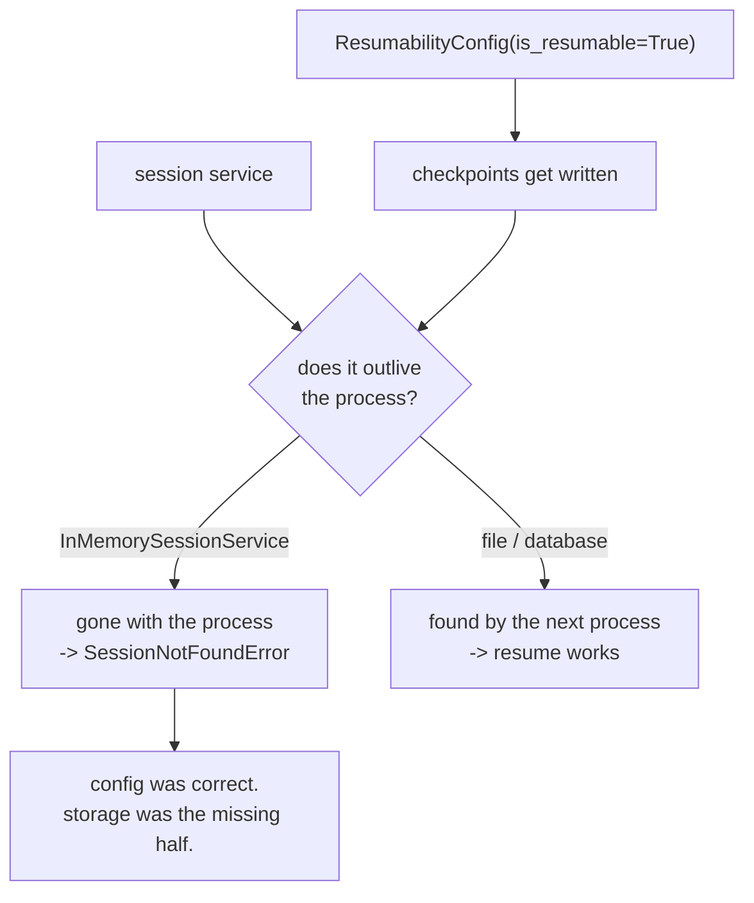

# 4.4 — Written on the back of your hand

## One-line answer

`is_resumable=True` and a durable store are two separate decisions, and getting only the first gives
you a run that is configured to be resumable and cannot be found: same App, same flag, an in-memory
service in a fresh process, and the resume dies on `SessionNotFoundError: Session not found: S1`.

## The story

Somebody gives you a phone number in the street and you have no paper, so you write it on the back of
your hand with a pen.

You have done the right thing. You wrote it down instead of trusting yourself to remember it, which
is the entire discipline and the reason you will still have the number in an hour.

Then you wash your hands before eating.

Nothing about the decision to write it down was wrong. The number is simply gone, because writing it
down and *keeping* it were two separate problems and you only solved the first. The pen was never the
weak part.

## The idea in plain language

Everything so far has quietly relied on a piece of machinery that has not been examined: the store.

There are two separate switches, and the day's mechanism needs both:

1. **`resumability_config=ResumabilityConfig(is_resumable=True)`** on the App. This is what makes ADK
   write checkpoints at all — the node map, the agent states, the whole apparatus of sections 2 and
   3. Day 60's [4.1](../../../day-60-durable-execution/parts/04-the-adk-surface/4.1-one-field-on-the-app.md)
   is the field's own part.
2. **A session service that outlives the process.** This is where those checkpoints go, and ADK does
   not choose it for you.

The first is a **configuration** decision. The second is a **storage** decision. They are set in
different places, they fail in different ways, and having only the first is the failure this part is
about — because it looks exactly like having both, right up until a real crash.

Two terms, since the rest of the part leans on them:

- A **session service** is the object that stores and retrieves sessions and their events.
  `InMemorySessionService` keeps them in a Python dictionary; a database-backed one writes them
  somewhere that survives.
- The lab's **`FileSessionService`** is thirty lines in `_store.py`: `InMemorySessionService` with its
  dictionary flushed to a JSON file after every appended event. It is not a production store. It is a
  store you can `cat`, which is what a day about reading checkpoints wants — and it is the only
  reason every measurement in this day was possible.

Day 47 decided **not** to install SQLAlchemy, and that decision still stands, so the lab needed
something. This part is where that choice gets stated openly rather than hidden in a helper.

## Why Sutra needs it

Sutra's triage graph runs on a laptop today and in a container later. The `is_resumable` flag will be
set correctly from the day it is written, because it is one line in the App and it is in every
example.

The store is the part that gets left at its default, because the default works — everything passes,
locally, in one process. It fails the first time the process that resumes is not the process that
started, which is precisely the case Day 65's gate exists to test and precisely the case that never
happens on the machine where the code was written.

## The mechanism

`storage.py` builds the **same App** the drill uses, with `is_resumable=True`, and tries to resume a
real run that is genuinely on disk — using an in-memory service in a fresh process.

```bash
cd days/day-61-pause-resume-checkpoints/lab
uv run python kill.py
uv run python storage.py
```

**Line by line:**

- `kill.py` first, so `drill_killed.json` really does contain a resumable run. The point is only made
  if the data exists and is still unreachable.
- `build()` is the drill's own App builder, unmodified — `is_resumable` is `True`, exactly as in
  every other part of this day.
- `Runner(app=app, session_service=InMemorySessionService())` is the single changed line. A fresh
  in-memory service in a fresh process starts empty by definition.
- `invocation_id(STORE)` still reads the real id off the JSON file, so the resume is asking for
  something that unambiguously exists.
- The `try` around the resume catches and prints, because the refusal is the measurement.
- The last block attempts the `DatabaseSessionService` import to show what the real answer would cost.

Measured on 2026-09-06:

```text
  is_resumable: True
  session service: InMemorySessionService (a fresh one, in a fresh process)

  SessionNotFoundError: Session not found: S1

  the run is on disk in drill_killed.json - this process simply cannot see it.
  The config made the run resumable. Only the storage made it durable.

  For a real store, Day 47 named the one this repo has not installed:
    ImportError: The 'sqlalchemy' package is required to use this feature. Please install it by running: pip install google-adk[db]
```

**`is_resumable: True`.** Printed first, deliberately. Every checkpoint this day has examined was
written because of that flag, and it is still on. Nothing about the configuration is wrong.

**`SessionNotFoundError: Session not found: S1`.** Not "cannot resume", not "invocation missing" —
the *session* is not found, which is a level below anything this day has discussed. The runtime never
got as far as looking at checkpoints, because there was no session to look in.

That error message is worth recognising on sight. It does not say "your storage is wrong", and a
developer meeting it will reasonably go looking for a bug in their session id or their user id. The
actual cause is a service that was never going to have the data.

**The data is right there.** `drill_killed.json` holds seven events, the node map and two agent
checkpoints — [4.2](4.2-pulling-the-plug-mid-cycle.md) printed them. Nothing is corrupt or missing.
This process simply has no path to it, because the object it was told to ask has an empty dictionary
in it.

**And the honest footnote.** `DatabaseSessionService` — the real answer — raises `ImportError`,
because this repository has not installed the `db` extra. That is Day 47's standing decision, not an
oversight, and the lab's `FileSessionService` exists because of it. Naming that here rather than
quietly using the helper is the difference between teaching the mechanism and teaching this
repository's workaround as though it were the mechanism.



## When it breaks

The break that costs an evening is the one where **everything passes**, because the test never
crossed a process boundary.

```bash
cd days/day-61-pause-resume-checkpoints/lab
uv run python -c "
import asyncio, warnings, contextlib, io
warnings.simplefilter('ignore')
from _drill import build
from _store import APP, SESSION, USER
from google.adk.runners import Runner
from google.adk.sessions import InMemorySessionService
from google.genai import types

async def main():
    service = InMemorySessionService()          # one service, one process
    await service.create_session(app_name=APP, user_id=USER, session_id=SESSION)
    runner = Runner(app=build(), session_service=service)
    msg = types.Content(role='user', parts=[types.Part(text='t')])
    invocation = None
    with contextlib.redirect_stdout(io.StringIO()):
        async for event in runner.run_async(user_id=USER, session_id=SESSION, new_message=msg):
            invocation = event.invocation_id
        async for _ in runner.run_async(user_id=USER, session_id=SESSION, invocation_id=invocation):
            pass
    print('  start and resume in ONE process, in-memory service: no error')
asyncio.run(main())
" 2>/dev/null
```

**Line by line:**

- One `InMemorySessionService`, created once and used for both the start and the resume — which is
  what a test written in a single function naturally does.
- The resume uses the real invocation id returned by the start, so it is a genuine resume and not a
  second start.
- `redirect_stdout` hides the drill's narration; the presence or absence of an error is the whole
  result.

```text
  start and resume in ONE process, in-memory service: no error
```

No error. A test shaped like that is green, and it is green for a system that will lose every run the
moment the process it was started in goes away — which is the only situation anybody wanted
durability for.

The fix is not a better assertion. It is a **different shape of test**: the resume has to happen in a
process that did not perform the start, which is why every measurement in this day runs its arms as
subprocesses. That is more awkward to write, and it is the only version that tests anything.

## In production

**What a professional writes instead.** A database-backed session service, chosen deliberately and
named in the deployment config, plus a startup assertion that the configured service is not the
in-memory one outside of tests. That assertion is three lines and it converts a silent data-loss
mode into a refusal to boot.

**What degrades at scale.** The store becomes the bottleneck and the dependency. Every checkpoint is
a write, and section 2 measured that two thirds of a run's events are checkpoints, so a resumable
system writes several times more than a non-resumable one. The session service is now on the critical
path of every node transition, and its availability is your availability — which is a trade worth
making and worth making knowingly.

**The failure mode that only appears with real traffic.** A store that is durable but not **shared**.
A local file works perfectly for this lab and for one machine. Two replicas each with their own file
produce runs that are durable and unresumable-by-anyone-else, and the symptom is that resumes succeed
only when the load balancer happens to route them back to the same pod. That is worse than the
in-memory case, because it works most of the time.

**The review comment a senior engineer leaves:** *"`is_resumable` is set and the recovery test passes,
but the test starts and resumes with the same service object in the same process, so it has never
proved anything about durability. Split it across two processes, and add a boot check that the
session service is not `InMemorySessionService` when the environment is not `test`."*

**The interview question:** *"You turned resumability on and it still lost the run. What happened?"*
An honest answer: *"Almost certainly the store, not the flag — they are two separate decisions and
only one of them is in the App config. I reproduced it: same App, `is_resumable=True`, a real killed
run sitting on disk, and a fresh process with an `InMemorySessionService` fails with
`SessionNotFoundError: Session not found` — not a resume error, a *session* error, one level below
anything to do with checkpoints. What makes it dangerous is that a test written in one process with
one service object passes, because the dictionary is still there. The only test worth having starts
in one process and resumes in another."*

## Check yourself

```bash
cd days/day-61-pause-resume-checkpoints/lab
uv run python kill.py
uv run python storage.py
```

Now open `_store.py` and find the two methods `FileSessionService` overrides. Say what each one does
and why a store that flushed only on `create_session` would have made every measurement in this day
impossible.

**Out loud, without scrolling up:** name the two separate things that have to be true for a run to
survive a process, say which one `is_resumable` gives you, and quote the error you get when only that
one is set.

**Next:** [5.1 — Two clerks checking one delivery](../05-failure-lab/5.1-two-clerks-checking-one-delivery.md).
