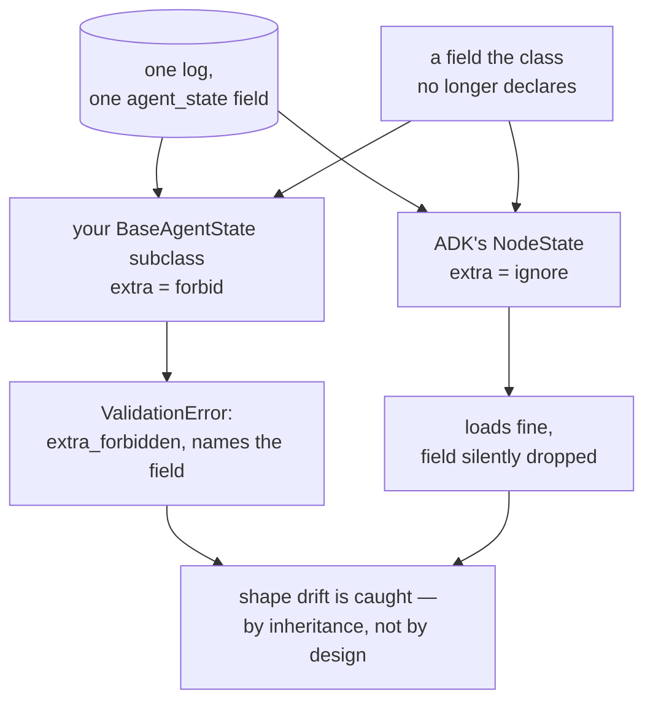

# 5.1 — Two clerks checking one delivery

## One-line answer

The two checkpoint classes in ADK 2.7.1 disagree about drift: `BaseAgentState` is
`{'extra': 'forbid'}` and raises `extra_forbidden` on a field it no longer knows, while `NodeState`
is `{'extra': 'ignore'}` and accepts the same drift silently — so the strict one is the one **you**
write, and its strictness is luck rather than design.

## The story

The same delivery arrives at two shops on the same street.

At the first, the man counts the boxes against his list, finds one that is not on it, and stops. He
will not sign. Not out of awkwardness — his rule is that the paper and the pile have to agree, and
they do not, so somebody needs to find out why before this goes any further.

At the second, the man counts, finds the same extra box, shrugs, and signs. It is not on his list, so
it is not his problem. The delivery is accepted and the box goes into the store room.

Both are running a consistent policy. Neither is being careless in his own terms. But only one of
them has generated a question, and the question was worth generating — that box was for the first
shop, and now nobody will find out until somebody looks for it.

## The idea in plain language

Day 60's [6.1](../../../day-60-durable-execution/parts/06-failure-lab/6.1-the-resume-that-met-different-code.md)
established the general problem: a resume reads a record that a **previous version of your program**
wrote, and the fix is a schema stamp that turns a silent wrong answer into a refusal.

This part is the ADK-specific half of that, and it exists because of something you cannot see from
outside: the two kinds of checkpoint from
[2.1](../02-inside-the-box/2.1-two-people-writing-in-one-notebook.md) — the graph's node map and your
agent's own state — **are validated under different rules.**

Both are pydantic models. Pydantic has a setting called `extra`, which decides what happens when the
data being loaded has a field the class does not declare:

| `extra` | what happens to an unknown field |
| --- | --- |
| `forbid` | validation fails — `extra_forbidden` |
| `ignore` | the field is dropped, silently, and loading succeeds |

`BaseAgentState`, which your state class inherits from, is `forbid`. `NodeState`, which the graph
writes, is `ignore`. One log, one field, two policies.

The practical consequence is a small, useful piece of luck: **when you drop a field from your state
class, an old checkpoint will refuse to load rather than load wrongly.** That is the behaviour you
want. It is worth knowing that you did not choose it, that it comes from a base class you inherited
without reading, and that it protects only one of the two shapes of drift.

Because there are two, and this is the distinction the rest of the part turns on:

- **Shape drift** — a field appears or disappears. `forbid` catches a removed field, loudly.
- **Meaning drift** — the fields are identical and what they *mean* has changed. Nothing catches
  this, in either class, at any strictness setting. It is [6.1](../06-in-production/6.1-the-batch-number-on-the-strip.md)'s
  subject.

## Why Sutra needs it

Sutra will deploy while runs are in flight; that is what a deploy is. Its stations will gain and lose
state fields as the graph is developed through Phases 9 to 15, and every one of those changes meets a
checkpoint written by the previous build.

Knowing which changes fail loudly and which pass silently is the difference between a deploy that
stops and asks and a deploy that quietly produces wrong answers for a day. And knowing that the loud
half is inherited rather than designed is what stops a reader assuming they are protected in general.

## The mechanism

`drift.py` takes one stored checkpoint written by Monday's code and validates it against both
classes.

```bash
cd days/day-61-pause-resume-checkpoints/lab
uv run python drift.py
```

**Line by line:**

- `MONDAY = {"scored": ["4521"], "cursor": 1}` is a checkpoint from a build whose state class had a
  `cursor` field. Tuesday's deploy dropped `cursor` and added `results` — an ordinary refactor, the
  kind nobody writes a migration for.
- `DedupeStateV2` is Tuesday's class, declaring `scored` and `results` and knowing nothing about
  `cursor`.
- Both `model_config` values are printed **from the installed classes**, so the policies are read out
  of `google-adk==2.7.1` rather than asserted by this document.
- The `try` catches and prints the validation error in full, because the verbatim text is what a
  reader will meet in a log at eleven at night.
- The last experiment runs the *same* drift against `NodeState` — a status plus an unknown `cursor` —
  to show the other policy on identical input.

Measured on 2026-09-06:

```text
  Monday's stored checkpoint: {"scored": ["4521"], "cursor": 1}
  Tuesday's class:            DedupeStateV2(scored, results)

  BaseAgentState.model_config = {'extra': 'forbid'}
  pydantic_core._pydantic_core.ValidationError
  1 validation error for DedupeStateV2
  cursor
    Extra inputs are not permitted [type=extra_forbidden, input_value=1, input_type=int]
      For further information visit https://errors.pydantic.dev/2.13/v/extra_forbidden

  NodeState.model_config     = {'extra': 'ignore', 'ser_json_bytes': 'base64'}
  the same drift, on the graph's own checkpoint: NodeState(status=<NodeStatus.COMPLETED: 3>, input=None, attempt_count=1, interrupts=[], resume_inputs={}, run_counter=0, run_id=None, parent_run_id=None)

  Two models, two policies, one field in the log. The one you write is the strict one.
```

**The error is a good error.** It names the field — `cursor` — the reason — `Extra inputs are not
permitted` — the value it found, and its type. A person reading that in a log knows within a second
that a checkpoint predates a deploy. Compare it with the pydantic error
[1.3](../01-two-ways-to-stop/1.3-bring-the-cloth-or-bring-the-receipt.md) produced, `1 validation
error for str`, which names nothing useful. Same library, wildly different diagnostic value,
depending on whether the failure happens at the boundary that knows what the data is.

**And it happens at all only because of `{'extra': 'forbid'}`**, which is on `BaseAgentState` and
therefore on every state class in this curriculum, inherited without anybody deciding it.

**The second half is the contrast.** `NodeState` is `{'extra': 'ignore'}`, and the same drift
produces no error at all — a fully-formed `NodeState` with `status=COMPLETED` and every other field
at its default. The `cursor` key was dropped on the floor. No warning, no log line, nothing.

That is defensible for the graph's own record: ADK owns both ends of it, and being permissive lets a
node map written by one ADK version load into another. It is simply a different bargain from the one
your state class is making, and the two records live in the same field of the same events.



## When it breaks

The break is assuming `forbid` protects you generally. It catches a **removed** field. It does
nothing about an **added** one, and nothing whatsoever about meaning.

```bash
cd days/day-61-pause-resume-checkpoints/lab
uv run python -c "
from google.adk.agents.base_agent import BaseAgentState

class V3(BaseAgentState):
    scored: list[str] = []
    results: dict[str, int] = {}
    attempts: int = 0            # Wednesday's deploy ADDS a field

old = {'scored': ['4521'], 'results': {'4521': 3}}
loaded = V3.model_validate(old)
print(f'  a checkpoint with no attempts field loads fine: {loaded!r}')
print(f'  and attempts silently becomes {loaded.attempts}, which nothing measured')
" 2>/dev/null
```

**Line by line:**

- `V3` adds a field with a default, which is how fields are almost always added.
- The old checkpoint simply has no `attempts` key, so pydantic uses the default — this is not an
  extra field, so `forbid` has nothing to say about it.

```text
  a checkpoint with no attempts field loads fine: V3(scored=['4521'], results={'4521': 3}, attempts=0)
  and attempts silently becomes 0, which nothing measured
```

`attempts=0` on a run that may have attempted something several times. The value is a **default
standing in for an unknown**, and it is indistinguishable from a genuine zero. If the new code caps
retries at three, this resumed run gets a fresh budget of three every time it is resumed, which is
exactly the runaway Day 59 spent a section containing.

So the honest summary of what `forbid` buys you:

| the change | caught? |
| --- | --- |
| a field was removed from the class | **yes** — `extra_forbidden`, by name |
| a field was added to the class | no — the default fills in silently |
| a field means something different now | no — see [6.1](../06-in-production/6.1-the-batch-number-on-the-strip.md) |

One row out of three, and it is the row you get for free.

## In production

**What a professional writes instead.** They do not rely on the inherited policy at all, in either
direction. New fields get defaults that are **obviously invalid** rather than plausible —
`attempts: int = -1` — so that code downstream can tell "not recorded" from "recorded as zero",
which is the same *silence versus empty report* distinction
[3.2](../03-the-agents-own-note/3.2-a-blank-page-and-no-page-at-all.md) drew, arriving in a new
place. And removals get a deliberate decision rather than a `ValidationError` in production: either
keep the field as ignored-and-deprecated for one release, or drain in-flight runs before deploying.

**What degrades at scale.** The number of in-flight runs at deploy time. With a handful, a
`ValidationError` on resume is a nuisance somebody investigates. With thousands, it is a wave of
failures that all look identical and all fire at once, and the incident is about a schema change that
nobody flagged as risky because it was "just a refactor".

**The failure mode that only appears with real traffic.** Two versions running at the same time.
During a rolling deploy, some processes have Tuesday's class and some still have Monday's, and runs
resume onto whichever they land on. Now the `ValidationError` is intermittent and depends on routing,
which is the hardest possible signature to debug — the same run resumes successfully on one attempt
and fails on the next with no change to the data.

**The review comment a senior engineer leaves:** *"This PR drops `cursor` from the state class. That
is not a refactor — `BaseAgentState` is `extra='forbid'`, so every checkpoint written before this
deploy will fail to load with `extra_forbidden`. Either keep the field for a release or drain the
in-flight runs first. And note the graph's own `NodeState` is `extra='ignore'`, so do not generalise
from whatever you saw it do."*

**The interview question:** *"What happens to a checkpoint when you change the class that reads it?"*
An honest answer: *"It depends on the pydantic `extra` policy, and in ADK 2.7.1 the two checkpoint
classes disagree — I had to print both to find out. The state class you write inherits
`extra='forbid'`, so removing a field makes old checkpoints fail loudly with `extra_forbidden`, which
names the field. ADK's own `NodeState` is `extra='ignore'` and drops the unknown field silently. The
useful conclusion is that the loud behaviour is inherited rather than designed, and it only covers
one of three cases: a removed field raises, an added field silently takes its default — which is
indistinguishable from a real value — and a field whose meaning changed is invisible to any
strictness setting. So the real protection is a version stamp, not the validator."*

## Check yourself

```bash
cd days/day-61-pause-resume-checkpoints/lab
uv run python drift.py
```

Now add `cursor: int = 0` to `DedupeStateV2` in `drift.py`, re-run, and write down what changes. Then
say which of the three rows in the table above you just moved, and which two you did not.

**Out loud, without scrolling up:** two checkpoint classes, one log. What is each one's `extra`
policy, which of them is yours, and what kind of change does its strictness fail to notice?

**Next:** [5.2 — Marked present by default](5.2-marked-present-by-default.md).
