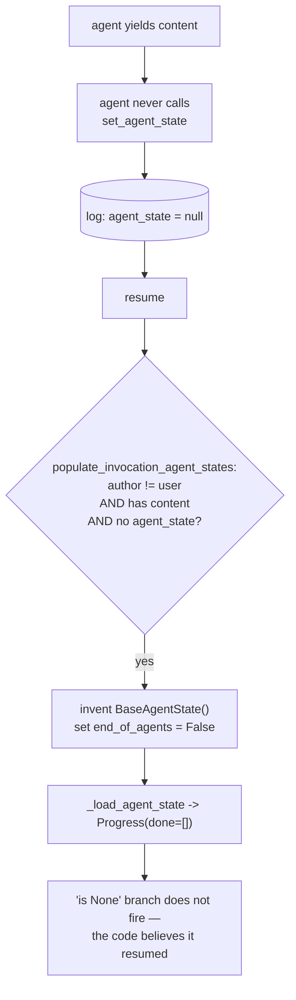

# 5.2 — Marked present by default

## One-line answer

An agent that produces output and never checkpoints gets a checkpoint **invented for it**: both
stored `agent_state` values in the log are `null`, and on resume `_load_agent_state` returns
`Progress(done=[])` rather than `None` — so "not `None`" stops meaning "I have real progress".

## The story

The attendance register at a coaching class is meant to be marked by the teacher at the start of each
session.

One teacher is careless about it. He teaches, the students are there, he never picks the register up.
The office needs the register filled in, because fees and certificates hang off it, so somebody
downstairs has a rule: if a class ran and nothing was marked, mark everyone present.

It is a reasonable rule. The class did run. There is no reason to think anybody was absent.

And now the register has entries in it that nobody observed. A row that says "present" for a student
who was not there looks exactly like a row that says "present" for a student who was, because they
are the same row. The register has stopped being a record of who attended and become a record of who
was probably there, and nothing on the page says which kind of row you are reading.

## The idea in plain language

[3.2](../03-the-agents-own-note/3.2-a-blank-page-and-no-page-at-all.md) drew the distinction this
part breaks: `_load_agent_state` returns `None` for **silence** and an object for **a real report**,
and those mean different things.

This part is the case where ADK fills in the register.

The rule, in the runtime's own words and code, is this: if an agent **generated content** during a
run but never set an agent state, then on resume the runtime creates an empty `BaseAgentState` for it
rather than leaving it absent.

That is not unreasonable — it is the office's rule, and it exists so that downstream machinery has
something consistent to work with. But it has a consequence that lands directly on the code every
reader of section 3 has now written:

```python
state = self._load_agent_state(ctx, DedupeState)
if state is None:
    state = DedupeState()
```

**Line by line:**

- The branch tests `is None`, which [3.2](../03-the-agents-own-note/3.2-a-blank-page-and-no-page-at-all.md)
  established is the correct test for absence.
- On a resume where the runtime has invented a state, `_load_agent_state` does **not** return `None`,
  so this branch does not fire.
- The code then proceeds as though it had loaded a real checkpoint — which it did, in the sense that
  an object came back, and did not, in the sense that no code ever wrote it.

So the failure is not that you get the wrong data. You get an **empty** state, which happens to be
the same thing the `is None` branch would have built. Today, that is harmless.

It stops being harmless the moment a real checkpoint would have contained something a fresh one does
not — a `schema_version` from [6.1](../06-in-production/6.1-the-batch-number-on-the-strip.md), an
attempt count, a run id — because now the run is proceeding on invented defaults while its code
believes it is proceeding on a restored record.

## Why Sutra needs it

Sutra's stations produce output. Every one of them yields content, which is the trigger for this rule.

And [3.3](../03-the-agents-own-note/3.3-the-rough-column-nobody-marks.md) has already established
that a station inside a graph gets an empty `ctx.agent_states` on resume. Put the two together and
the question becomes sharp: when a Sutra station gets an object back from `_load_agent_state`, what
does that object actually prove? This part is the reason the answer is "less than you would think",
and the reason any station that needs to know *whether it has really resumed* has to record that
itself rather than infer it.

## The mechanism

`ghost.py` builds the smallest agent that triggers the rule: it yields one content event and never
calls `set_agent_state`. It is killed, and then resumed in a fresh process.

```python
class Silent(BaseAgent):
    """Emits real output. Never writes a checkpoint. That is the whole bug."""

    async def _run_async_impl(self, ctx: InvocationContext) -> AsyncGenerator[Event, None]:
        state = self._load_agent_state(ctx, Progress)
        print(f"_load_agent_state -> {state!r}")
        yield Event(
            invocation_id=ctx.invocation_id,
            author=self.name,
            content=types.Content(role="model", parts=[types.Part(text="scored 4521")]),
        )
```

**Line by line:**

- `_load_agent_state(ctx, Progress)` is printed first thing on **both** runs, so the same call can be
  compared across the process boundary. That printed value is the entire measurement.
- The yielded `Event` carries `content` — this is what "generated content" means to the runtime, and
  it is the trigger for the rule.
- There is deliberately **no** `set_agent_state` call anywhere. This agent writes no checkpoint at
  all, which is what makes any state that appears on resume an invention rather than a restoration.

```bash
cd days/day-61-pause-resume-checkpoints/lab
uv run python ghost.py
```

**Line by line:**

- The first process is launched with `BOOM=1`, which makes the agent destroy the process with
  `os._exit(9)` after yielding — the honest kill from
  [4.2](../04-the-drill/4.2-pulling-the-plug-mid-cycle.md).
- Between the two processes, the parent prints **every** `agent_state` in the file, so the claim
  "nothing was written" is evidence rather than assertion.
- The final block prints the runtime source responsible, because a finding this surprising should
  come with the code that causes it.

Measured on 2026-09-06:

```text
  _load_agent_state -> None
  *** process destroyed ***
  exit 9

  2 events on disk. Every agent_state in the file:
    author=user    agent_state=null
    author=silent  agent_state=null

  a fresh process resumes it:
    _load_agent_state -> Progress(done=[])

  the source that invents it, populate_invocation_agent_states:
            event.author != "user"
            and event.content
            and not self.agent_states.get(key)
        ):
          # If the agent has generated some contents but its agent_state is not
          # set, set its agent_state to an empty agent_state.
          self.agent_states[key] = BaseAgentState().model_dump(mode="json")
          # Invalidate the end_of_agent flag
          self.end_of_agents[key] = False
```

Read the three stages in order, because each one is needed for the last to be surprising.

**First process: `_load_agent_state -> None`.** Correct. Nothing has run, nothing is stored, so
silence is the right answer.

**On disk: both `agent_state` values are `null`.** Two events — the user's message and the agent's
content — and neither carries a checkpoint. This is the crucial line, and it is why the script prints
*every* stored state rather than a count: there is no checkpoint in this file. Not an empty one. None.

**Second process: `_load_agent_state -> Progress(done=[])`.** An object. Not `None`. A fully-formed
instance of the reader's own state class, with its fields at their defaults, returned by a function
whose four-line body [3.2](../03-the-agents-own-note/3.2-a-blank-page-and-no-page-at-all.md) read
carefully — and which returns a value only when `self.name in ctx.agent_states`.

So the name **is** in `ctx.agent_states`, and nothing wrote it there. The last block is the code that
did:

> `# If the agent has generated some contents but its agent_state is not set, set its agent_state to
> an empty agent_state.`

The runtime's own comment, stating the rule plainly. `self.agent_states[key] = BaseAgentState()...`
— it inserts the key. And the line below it, `self.end_of_agents[key] = False`, invalidates the
completion flag at the same time, which is worth noting because it means this rule also un-finishes
an agent that had finished.



## When it breaks

The break is any code that treats a returned object as evidence of a real resume. Here is the
version that hurts, using a state class with a field that a genuine checkpoint would have set:

```bash
cd days/day-61-pause-resume-checkpoints/lab
uv run python -c "
from google.adk.agents.base_agent import BaseAgentState

class Progress(BaseAgentState):
    schema_version: int = 0     # a real checkpoint always writes 2
    done: list[str] = []

invented = Progress.model_validate(BaseAgentState().model_dump(mode='json'))
genuine  = Progress(schema_version=2, done=['4521'])
for label, state in (('invented by the runtime', invented), ('written by your code', genuine)):
    print(f'  {label:<26} {state!r}   is None: {state is None}')
" 2>/dev/null
```

**Line by line:**

- `invented` is built exactly the way the runtime builds it — `BaseAgentState().model_dump()` — and
  then validated into the reader's own class, which is what `_load_agent_state` does on the way back.
- `genuine` is what the agent's own code would have written.
- Both are printed with `is None` alongside, because that is the test the node performs.

```text
  invented by the runtime    Progress(schema_version=0, done=[])   is None: False
  written by your code       Progress(schema_version=2, done=['4521'])   is None: False
```

**`is None: False` for both.** The node's guard cannot distinguish them. And the invented one carries
`schema_version=0` — a value that no version of your code has ever written, which will now be
compared against the current version by [6.1](../06-in-production/6.1-the-batch-number-on-the-strip.md)'s
check and will fail, on a run whose only crime was not checkpointing.

That is the shape of the trouble: the invented state is not merely uninformative, it is **actively
misleading**, because its defaults are indistinguishable from recorded values and they will be
reasoned about as though somebody chose them.

The smallest fix is to make the difference detectable, which means never relying on a default to mean
"recorded". Give the field a value no real checkpoint would have — `schema_version: int = -1` — and
now an invented state announces itself the first time anything looks at it.

## In production

**What a professional writes instead.** They write a checkpoint on entry, before any work, even an
empty one. It costs one event and it removes this entire category: if the agent always writes, then
a state that comes back is always one the agent wrote, and the invented-state rule never fires
because the condition `not self.agent_states.get(key)` is never true. That is a one-line habit that
makes a runtime behaviour irrelevant instead of something you have to remember.

**What degrades at scale.** Nothing about the mechanism, but the *diagnosis* gets much harder. At one
agent, an unexpected empty state is a puzzle you can chase to its source in an afternoon. Across a
graph of many stations, some of which legitimately have empty progress, an invented state is
invisible — it looks exactly like a station that genuinely had nothing done yet, and there is no
field anywhere that distinguishes them unless you put one there.

**The failure mode that only appears with real traffic.** Combined with
[3.5](../03-the-agents-own-note/3.5-handing-back-the-key.md), this rule has a second effect that
takes a while to notice: `self.end_of_agents[key] = False` **un-finishes** an agent. A station that
completed, cleared its note with `end_of_agent=True`, and then produced content is a station whose
completion flag can be reset on a later resume — so the run's own record of what is finished is not
monotonic, and any logic that reads it as "this is done, permanently" is wrong in a way that only
shows up on the second or third resume of a run.

**The review comment a senior engineer leaves:** *"This station reads `_load_agent_state` and treats
a non-None result as 'we are resuming'. ADK invents an empty state for any agent that produced
content and did not checkpoint, so that condition is true on runs that never wrote anything. Write a
checkpoint on entry so the state is always yours, or put a sentinel in the class so an invented one
is recognisable."*

**The interview question:** *"Can a framework give you a checkpoint nobody wrote?"* An honest answer:
*"ADK 2.7.1 does, and I only found it because I printed every stored state instead of trusting the
loader. If an agent generates content during a run but never calls `set_agent_state`, then on resume
the runtime inserts an empty `BaseAgentState` for it — the source comment says so explicitly — and
also flips its end-of-agent flag back to False. So `_load_agent_state` returns an object rather than
None, and the standard `if state is None` guard does not fire. The data is empty rather than wrong,
which makes it harmless right up until your state class has a field whose default is meaningful, and
then you are reasoning about values nobody recorded. The fix I would use is to checkpoint on entry so
the state is always one your code wrote."*

## Check yourself

```bash
cd days/day-61-pause-resume-checkpoints/lab
uv run python ghost.py
```

Now add a `ctx.set_agent_state(self.name, agent_state=Progress())` call and a state event before the
content event in `Silent`, re-run, and write down what the resuming process loads and what the stored
`agent_state` values become. Then say why that change makes the runtime's rule stop applying.

**Out loud, without scrolling up:** under what condition does ADK create a checkpoint your code never
wrote, and what does that do to the `if state is None` guard every station in section 3 carries?

**Next:** [5.3 — The clerk who wrote REJECTED in pen](5.3-the-clerk-who-wrote-rejected-in-pen.md).
