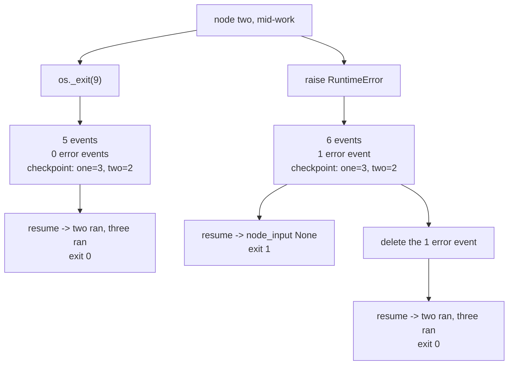

# 5.3 — The clerk who wrote REJECTED in pen

## One-line answer

Two runs stopped at the same point with **identical checkpoints** resume differently: the destroyed
process resumes cleanly to `exit code 0`, the one that raised refuses — and deleting the single error
event from its store, changing nothing else, makes it resume cleanly too.

## The story

You hand in a file at a counter and there is a problem with it, and what happens next depends
entirely on which clerk you got.

The first one looks at it, cannot deal with it, and puts it back in the tray. He is called away, or
his shift ends, or the counter closes. Your file sits there. Tomorrow somebody else picks it up,
looks at it fresh, and processes it.

The second one looks at it, cannot deal with it, and writes **REJECTED** across the top in pen, with
his initials and the date, because that is the correct and conscientious thing to do — he has
recorded what he found so that nobody has to work it out again.

Tomorrow somebody else picks up your file. They see the word, in pen, and put it back. So does the
person after them. The file is otherwise complete and there is nothing wrong with it that a fresh
pair of eyes would not have sorted out, and it will never be processed again, because the most
careful person who ever touched it left a permanent mark saying it was finished with.

## The idea in plain language

[1.1](../01-two-ways-to-stop/1.1-the-call-that-dropped-and-the-call-that-ended.md) measured that a
killed run and a failed run leave nearly the same evidence: the same checkpoint, and one extra event
in the failed case carrying the traceback. It ended by saying the instinct that more information is
better is *correct about diagnosis and backwards about recovery*.

This is that claim, tested.

The experiment holds everything constant except how the run stops. Same graph, same node, same point
in the work, same store handling. One arm destroys the process; the other raises an exception. Both
leave a node at status `2 RUNNING` and a predecessor at `3 COMPLETED`.

Then both are resumed, and they behave differently. And because "the exception one behaves
differently" could have a dozen causes, there is a third arm — a **control** — that takes the failed
store, deletes exactly one event, changes nothing else, and resumes again.

That control is what turns an observation into a finding. Without it, the honest statement would be
"something about the failing run makes it unresumable". With it, the statement is "**this one event**
makes it unresumable", which is a fact you can act on.

## Why Sutra needs it

Day 65 kills the triage graph four times and asks whether it comes back. If some of those kills are
exceptions and some are process deaths, and the two are not equally recoverable, then the gate's
result depends on how the killing was done — and a gate whose answer depends on the shape of the test
rather than the quality of the system is not a gate.

More practically: Sutra's stations raise. Principle 10 requires it — errors surface rather than being
swallowed, which is plan §5.1's trap #4. This part is where that principle meets durability and the
two turn out to be in tension, which is a thing worth knowing before Day 64 builds an approval gate
on top of both.

## The mechanism

`polite.py` uses a deliberately minimal three-node chain rather than the drill, so nothing about
custom agents or their checkpoints is in the way. Each node takes its predecessor's output as
`node_input`.

```python
@node
def two(node_input: str) -> Event:
    print("two ran")
    if os.environ.get("BOOM"):
        if mode == "raise":
            raise RuntimeError("died in two")
        print("*** process destroyed ***")
        sys.stdout.flush()
        os._exit(9)
    return Event(output=f"{node_input}|two")
```

**Line by line:**

- `node_input: str` is the annotation that makes the failure visible later. This node genuinely
  requires its predecessor's output.
- `BOOM` is read from the environment so the *same* function is used for the dying run and the
  resuming run. If the resume used a different function, the experiment would be comparing two
  programs.
- `mode` selects which death. Both happen at the same statement, after `two ran` is printed, so the
  work completed before the stop is identical.
- `sys.stdout.flush()` before `os._exit` because `os._exit` does not flush — without it the arms
  would differ in their *output* as well as their stopping, and only one of those is under test.

```bash
cd days/day-61-pause-resume-checkpoints/lab
uv run python polite.py
```

**Line by line:**

- Every phase runs as a subprocess, for the usual `os._exit` reason.
- The control arm reads the failed store, filters out events with an `error_code`, writes the result
  to a new file, and resumes that. Nothing else is touched — same events, same order, same ids, one
  event fewer.

Measured on 2026-09-06:

```text
=== the process was destroyed ===
  one ran
  two ran
  *** process destroyed ***
  process exit code: 9
  events: 5   error events: 0
  last checkpoint: {"one": {"status": 3, "interrupts": [], "resume_inputs": {}}, "two": {"status": 2, "interrupts": [], "resume_inputs": {}}}

=== an exception was raised ===
  one ran
  two ran
  process exit code: 1
  events: 6   error events: 1
  last checkpoint: {"one": {"status": 3, "interrupts": [], "resume_inputs": {}}, "two": {"status": 2, "interrupts": [], "resume_inputs": {}}}
  error event: RuntimeError: died in two

--- resume after the destroyed process ---
  two ran
  three ran
  exit code: 0

--- resume after the exception ---
  exit code: 1
  Input should be a valid string [type=string_type, input_value=None, input_type=NoneType]
  For further information visit https://errors.pydantic.dev/2.13/v/string_type

=== the control: the same store, 9 events minus the 1 error event ===

--- resume after the exception, error event deleted ---
  two ran
  three ran
  exit code: 0
```

**The two stores are the same where it matters.** Compare the `last checkpoint` lines:

```text
{"one": {"status": 3, ...}, "two": {"status": 2, ...}}
```

Identical. Both runs got node `one` finished and node `two` started. Any reasoning about "where did
it get to" gives the same answer for both.

The only differences are `events: 5` against `events: 6`, and `error events: 0` against `1`.

**Now the resumes, and they could not be further apart.**

The destroyed run: `two ran`, `three ran`, `exit code: 0`. Node `two` is re-entered, gets its
predecessor's output, completes, and node `three` runs. That is a textbook resume.

The failed run: **`exit code: 1`**, and node `two` never printed. The error is
`Input should be a valid string ... input_value=None` — node `two` was called with `node_input=None`,
so the run died at the seam before the body executed. The same node, in the same graph, from a store
with the same checkpoint.

**And the control settles it.** Take the failed store, remove the one event carrying `error_code`,
resume: `two ran`, `three ran`, `exit code: 0`.

One event. Nothing else changed — not the checkpoint, not the node statuses, not the ids, not the
order. Delete it and the unresumable run becomes resumable.

So the finding, stated exactly:

> A run that failed politely enough to record **why** it failed is, in ADK 2.7.1, harder to resume
> than one that was destroyed without warning. The error event is what makes the difference.

That is genuinely awkward, and it is worth not softening. Writing down what went wrong is correct
behaviour — it is Principle 10, it is trap #4, it is the thing that makes an incident diagnosable.
And on this runtime it costs you the automatic resume.



## When it breaks

The break is the conclusion a reader might reach from the above, and it is the wrong one, so it is
worth reaching it and rejecting it out loud.

The tempting fix is: *stop raising*. Catch the exception in the node, return something, and the run
stays resumable.

```bash
cd days/day-61-pause-resume-checkpoints/lab
uv run python -c "
from google.adk import Event
def two_swallowing(node_input: str) -> Event:
    try:
        raise RuntimeError('died in two')
    except RuntimeError:
        return Event(output=f'{node_input}|two')      # the failure disappears
print('  the node returns:', two_swallowing('t|one').output)
print('  and the log will record: nothing at all')
" 2>/dev/null
```

**Line by line:**

- The node catches its own failure and returns a normal-looking output, which is exactly what
  "keep it resumable" would mean in practice.
- Printing the output shows what the next node receives: a value that claims the work succeeded.

```text
  the node returns: t|one|two
  and the log will record: nothing at all
```

The run now completes, resumably, and is **wrong**. Node `three` receives `t|one|two` and has no way
to know that `two` did nothing. This is plan §5.1's **trap #4** — swallowing exceptions so the
runtime cannot see them — and it is worse than the problem it solves: the failed run refused to
resume loudly, while this one succeeds quietly and produces a bad answer.

The real fix is not in the node. It is in the resume path, and it follows directly from
[1.1](../01-two-ways-to-stop/1.1-the-call-that-dropped-and-the-call-that-ended.md)'s conclusion: a
run that recorded a failure should be resumed **deliberately**, by something that has decided the
failure was transient, not automatically by a retry loop that cannot tell the two apart. The
behaviour measured here is inconvenient, and it is also, read charitably, a runtime declining to
silently retry something that already said it went wrong.

## In production

**What a professional writes instead.** They separate the two paths. Killed runs go into an automatic
resume queue. Failed runs go into a queue a human or a policy looks at, where the decision is *"is
this failure transient?"* — and only after that decision does anything resume them. That is more
machinery than "retry everything", and it is the machinery that stops a system from retrying a
genuine bug forever.

**What degrades at scale.** The failed-run queue is the one that grows quietly. Killed runs resume
themselves and disappear; failed runs accumulate, each one representing a decision nobody has made.
A system with no dashboard for that queue discovers it during an incident, at which point it contains
weeks of runs and nobody knows which are still relevant.

**The failure mode that only appears with real traffic.** A transient failure that is recorded as an
error and therefore never retried — a timeout, a 429, a momentarily unavailable dependency. Under
this runtime's behaviour those runs do not come back on their own, and because each one is
individually explicable, the pattern only becomes visible in aggregate. The 429 case is not
hypothetical for Sutra: Addendum 02's whole posture assumes free-tier rate limits are hit routinely,
and Day 72 has to reconcile "back off and retry" with "this run recorded an error".

**The review comment a senior engineer leaves:** *"The retry worker resumes anything with an
incomplete checkpoint. That means it will resume runs that failed with a real exception, over and
over, because the checkpoint looks the same as a crashed one — and I checked, on this runtime it will
not even succeed: the error event in the log makes the resume fail at the node boundary. Split the
queues on whether the log has an error event, and give the failed one an owner."*

**The interview question:** *"Is a run that failed cleanly easier or harder to recover than one that
was killed?"* An honest answer: *"I would have said easier, and I measured the opposite. I stopped the
same node two ways — an exception and `os._exit` — and both left an identical checkpoint. The
destroyed one resumed to exit 0. The one that raised failed on resume, with the node receiving `None`
where it declared a string. To be sure it was the error event and not something else about the
failing path, I deleted that single event from the store, changed nothing else, and it resumed
cleanly. So recording why you failed costs you the automatic resume on that runtime. The wrong
response is to stop raising — that is swallowing the error, and then the run completes with a wrong
answer instead of refusing. The right one is to route recorded failures to a path that decides
whether the failure was transient, rather than retrying them blindly."*

## Check yourself

```bash
cd days/day-61-pause-resume-checkpoints/lab
uv run python polite.py
```

Now open `polite_raise.json` and `polite_exit.json` and count the events in each. Then find the one
field that exists in a record in the first file and in no record in the second, and name it.

**Out loud, without scrolling up:** two runs stopped at the same node with the same checkpoint. One
resumes and one does not. What is the single difference between their logs, and what experiment
proved that it was the cause rather than a coincidence?

**Next:** [6.1 — The batch number on the strip](../06-in-production/6.1-the-batch-number-on-the-strip.md).
