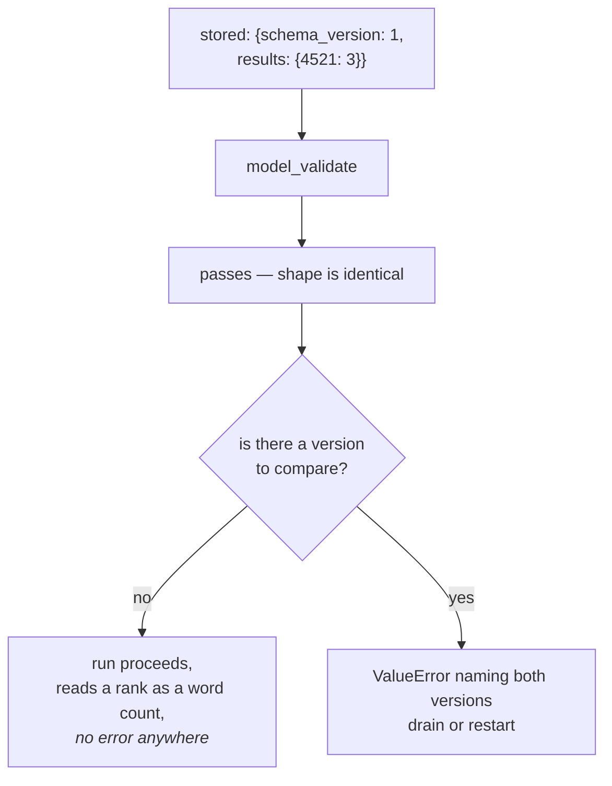

# 6.1 — The batch number on the strip

## One-line answer

A checkpoint whose fields are unchanged and whose **meaning** changed parses without complaint —
`StampedState(schema_version=1, scored=['4521'], results={'4521': 3})`, no error anywhere — and the
only thing that turns that silent wrong answer into a refusal is a version field your code compares.

## The story

Two strips of tablets in the same drawer look the same. Same size, same white foil, same name printed
along the edge.

They are not the same. One is from before the manufacturer changed the strength; the older strip is
250 milligrams a tablet and the newer one is 500. Everything else about them — the shape, the
packaging, the name — is identical, because the company saw no reason to redesign a strip over a
formulation change.

The only thing on either strip that distinguishes them is the batch number, printed small along one
edge. Nobody reads it. It is not there for you; it is there so that when something goes wrong,
somebody can work out which strip they are holding.

And on the day the strength changed, that little number stopped being bookkeeping and became the only
safe way to take the tablet.

## The idea in plain language

[5.1](../05-failure-lab/5.1-two-clerks-checking-one-delivery.md) laid out three kinds of drift and
measured which ones ADK notices:

| the change | caught by `extra='forbid'`? |
| --- | --- |
| a field was removed from the class | yes |
| a field was added to the class | no |
| **a field means something different now** | **no** |

This part is the third row, which is the one nothing can catch — not a stricter validator, not a
better type annotation, not a more careful review of the class.

The reason it cannot be caught is worth stating plainly, because it is not a limitation of pydantic:
**the stored data is valid.** `results: dict[str, int]` is satisfied by `{"4521": 3}` whether the
`3` means "ranked third" or "three words in common". There is no signal in the data. There is no
signal in the class. The two builds disagree about semantics and agree about everything a computer
can check.

So the only available fix is to **add** a signal — a number that changes when the meaning changes,
carried in the checkpoint, compared on the way back in. That is what a schema version is, and it is
the batch number on the strip: not useful to the reader, present for the day something changes
underneath a shape that stayed the same.

Day 60's [6.1](../../../day-60-durable-execution/parts/06-failure-lab/6.1-the-resume-that-met-different-code.md)
established this argument and stamped the **events** of a hand-rolled log. This part puts the same
idea where ADK actually stores things — on your `BaseAgentState` subclass — and shows the refusal it
buys.

## Why Sutra needs it

Sutra's stations will be refactored repeatedly between here and the capstone. The dangerous change is
never the one that adds or removes a field, because
[5.1](../05-failure-lab/5.1-two-clerks-checking-one-delivery.md) measured that removals fail loudly
and additions are at least visible in a diff. The dangerous change is the one where a reviewer says
*"we should store the score normalised"* and one line inside the station changes what the numbers in
an existing field mean.

There is also a reason to do it **now** rather than later, and it is the point that costs people
time: adding a `schema_version` field to a state class is itself a field addition, so old
checkpoints load with its default. If the default is `1` and you are on version 2, every historical
checkpoint claims to be version 1 whether it is or not. The field is only trustworthy from the deploy
that introduced it, which means the cheapest moment to add it is the first commit.

## The mechanism

`stamp.py` builds a checkpoint whose shape is unchanged and whose meaning is not, loads it both ways,
and shows what the version comparison adds.

```python
class StampedState(BaseAgentState):
    """Same fields as the drill's state, plus the one that makes a refusal possible."""

    schema_version: int = 2
    scored: list[str] = []
    results: dict[str, int] = {}


CURRENT = 2


def load(blob: dict) -> StampedState:
    state = StampedState.model_validate(blob)
    if state.schema_version != CURRENT:
        raise ValueError(
            f"checkpoint schema_version={state.schema_version}, this build expects {CURRENT}; "
            f"refusing to resume - drain or restart the run"
        )
    return state
```

**Line by line:**

- `schema_version: int = 2` sits on the state class, so it is written into every checkpoint the agent
  produces as an ordinary field. Nothing special carries it.
- `CURRENT = 2` is the build's own version, a module constant. It has to live in the code rather than
  be derived from anything, because the whole point is to compare the code against the data.
- `load()` wraps `model_validate` rather than replacing it. Validation still happens first — this is
  an additional check, not an alternative one.
- The comparison is `!=` rather than `<`. A checkpoint from a *newer* build is just as dangerous as
  one from an older build, and that happens during a rollback, which is exactly when nobody wants a
  surprise.
- The message names both numbers and says what to do. An error that says only "version mismatch"
  sends somebody to read the source; this one is actionable from the log line.

```bash
cd days/day-61-pause-resume-checkpoints/lab
uv run python stamp.py
```

**Line by line:**

- The script validates the same blob twice: once with plain `model_validate`, to show it passing, and
  once through `load()`, to show it refused. Showing the pass first is what makes the refusal mean
  something.

Measured on 2026-09-06:

```text
  a v1 checkpoint that still parses cleanly: {"schema_version": 1, "scored": ["4521"], "results": {"4521": 3}}
  parsed without complaint: StampedState(schema_version=1, scored=['4521'], results={'4521': 3})

  that is the danger: in v1 `results` was a rank, in v2 it is a word count.
  Nothing about the shape says so. The stamp does:

    ValueError: checkpoint schema_version=1, this build expects 2; refusing to resume - drain or restart the run

    a current checkpoint loads: StampedState(schema_version=2, scored=['4521'], results={'4521': 3})
```

**`parsed without complaint`.** That is the whole problem in one line. Pydantic is satisfied. Every
field is present and correctly typed. `extra='forbid'` has nothing to object to, because there is no
extra field — the shapes are identical. A resume that used only `model_validate`, which is what
`_load_agent_state` does, would proceed happily.

And what it would proceed to do is treat a **rank** as a **word count**. In v1, `{"4521": 3}` meant
*this candidate came third*; in v2 it means *this candidate shares three words with the ticket*. Under
v1's meaning, 3 is a mediocre result. Under v2's, on a four-word overlap scale, 3 is the best score in
the archive. The resumed run would report the opposite of what the stored data says, with no error
anywhere, and the answer would look entirely reasonable.

**Then the stamp.** `ValueError: checkpoint schema_version=1, this build expects 2; refusing to
resume — drain or restart the run.` Loud, specific, and actionable: it names both versions and it
tells the operator the two real options.

**And the control.** A version-2 checkpoint loads. The check discriminates rather than always
refusing, which is the property that makes it a check rather than a switch.



## When it breaks

The stamp breaks when somebody changes the meaning and forgets to bump the number, which is not a
hypothetical — it is the default outcome, because the change that needs the bump is a change *inside
a function*, nowhere near the class.

```bash
cd days/day-61-pause-resume-checkpoints/lab
uv run python -c "
from stamp import CURRENT, StampedState, load
# The deploy that changed 'results' from a rank to a word count, and forgot the bump.
v1_blob_relabelled = {'schema_version': CURRENT, 'scored': ['4521'], 'results': {'4521': 3}}
state = load(v1_blob_relabelled)
print(f'  loaded without complaint: {state!r}')
print(f'  the stamp says {state.schema_version}, the data means something else, and nothing knows')
" 2>/dev/null
```

**Line by line:**

- The blob carries `schema_version` equal to `CURRENT`, which is what an un-bumped deploy produces:
  new code writing the old number.
- `load()` is the real function from `stamp.py`, not a copy, so this is the actual guard being
  defeated.

```text
  loaded without complaint: StampedState(schema_version=2, scored=['4521'], results={'4521': 3})
  the stamp says 2, the data means something else, and nothing knows
```

The guard passes, because the guard compares a number to a number and both numbers are 2. A version
field does not detect meaning changes; it **records a claim** about them, and the claim is only as
good as the discipline that maintains it.

That is worth being blunt about rather than dressing up: the stamp converts a silent failure into a
loud one **only when somebody remembers to increment it**. What makes it worth having anyway is
where the remembering happens. Bumping a constant is a visible one-line diff in a pull request, and
"you changed what `results` means — bump the version" is a review comment somebody can actually
leave. The alternative is no artefact at all and nothing to point at.

The habit that makes it stick is to put the constant next to the class, with a comment listing what
each version meant, so the diff that changes the meaning and the diff that changes the number are the
same diff.

## In production

**What a professional writes instead.** The version lives beside the class with a short history above
it — `# 1: results was a rank. 2: results is a word-overlap count.` — so the next person can see what
changed and when. And the check is not scattered through the stations: it is one function every
station calls on the way in, so adding a station cannot accidentally skip it.

**What degrades at scale.** The number of in-flight runs when a version changes. A refusal is the
right behaviour and it is not free — every run written by the old build now needs a decision. The two
options the error names are the two that exist: **drain**, meaning stop starting new runs and let the
old ones finish before deploying, or **restart**, meaning abandon those runs and begin them again.
Both cost something, and choosing between them at deploy time, under pressure, is worse than having
decided in advance.

**The failure mode that only appears with real traffic.** The rollback. Version 3 goes out, writes
version-3 checkpoints for an hour, and is rolled back to version 2 because of an unrelated bug. Now
the running build is older than the data, which is why the comparison is `!=` and not `<` — a `<`
check passes here and reads version-3 data with version-2 meanings, which is the original failure
with the arrow reversed and the operator's confidence higher, because they have just rolled *back* to
a known-good build.

**The review comment a senior engineer leaves:** *"This PR changes `results` from a rank to a word
count. The field name, the type and the shape are all unchanged, so every in-flight checkpoint will
load cleanly into the new code and be interpreted with the wrong meaning — no error, wrong answers.
Bump `SCHEMA_VERSION`, add a line to the history comment, and say in the description whether we are
draining or restarting."*

**The interview question:** *"How do you version a checkpoint?"* An honest answer: *"With a plain
integer field on the state object and a constant in the code, compared with `!=` rather than `<` so a
rollback is caught as well as a roll-forward. The reason it has to exist is that the dangerous change
is not a field appearing or disappearing — those are visible, and in ADK a removed field actually
fails loudly because `BaseAgentState` is `extra='forbid'`. The dangerous change is when the shape is
identical and the meaning moved: I made a v1 checkpoint where a number meant a rank and loaded it into
a build where the same number means a word count, and pydantic accepted it without a word. I would
also be honest that the stamp does not *detect* anything — it records a claim, and it fails if
somebody changes the meaning without bumping the number. Its real value is that it turns an invisible
semantic change into a one-line diff a reviewer can argue about."*

## Check yourself

```bash
cd days/day-61-pause-resume-checkpoints/lab
uv run python stamp.py
```

Now change `CURRENT` to `3` in `stamp.py`, re-run, and write down which of the two checkpoints now
refuses. Then say what would have happened with a `<` comparison instead of `!=`.

**Out loud, without scrolling up:** name the one kind of schema drift that no validator can catch,
explain why not, and say what a version stamp actually does about it — being precise about the word
"detect".

**Next:** [6.2 — The photocopy in the drawer](6.2-the-photocopy-in-the-drawer.md).
