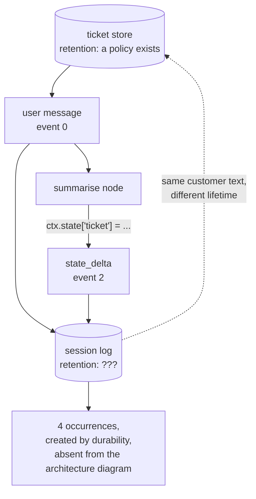

# 6.2 — The photocopy in the drawer

## One-line answer

Turning on resumability makes a **second copy** of the customer's words with a different lifetime
from the first — the ticket text appears **4 times** in a store that exists only because of
checkpointing — so what goes into a checkpoint is a data-boundary decision, not a convenience one.

## The story

You rent a flat, and the agent asks for a copy of your ID.

He photocopies it at the shop downstairs, staples it to the file, and puts the file in a drawer. That
is the last anybody thinks about it. The tenancy runs for two years, you move out, the deposit comes
back, everybody is content.

Your ID is still in the drawer.

Not because anyone decided to keep it. Nobody ever decided anything about it — the copy was made for
one purpose, that purpose ended, and there was never a moment where somebody was supposed to go and
take it out. The original is in your wallet where it belongs, and the copy is in an office you have
no relationship with any more, in a drawer nobody has a rule about.

## The idea in plain language

Every part of this day has treated a checkpoint as a **mechanism**. This one treats it as **data**,
because that is what it is once it is on disk, and it is data with a property that makes it different
from the data it came from: **a different lifetime.**

The ticket lives in the ticket store, where it is subject to whatever rules the ticket store has —
retention, access control, deletion when a customer asks. The checkpoint is a copy of some of that
text, in a session log, which has its own storage, its own access rules and — unless somebody
decided otherwise — no retention rule at all.

Day 60's [7.1](../../../day-60-durable-execution/parts/07-in-production/7.1-what-a-checkpoint-costs.md)
answered *how much* and *how long*: the bytes, and the retention rule you must set the day you turn
durability on. This part answers the question one step earlier — **what goes in at all** — because
retention governs how long a copy lives and this governs whether it is made.

The four questions worth asking of anything you are about to put in a state object:

1. Would you be happy for it to sit on disk after the run ends?
2. Would you be happy for it to be read by whoever debugs a stuck run?
3. Can it be recomputed instead of stored?
4. Does deleting the customer delete this too?

Question three is the one that actually removes work rather than adding process, and it is the one
most easily missed. A checkpoint exists to avoid redoing something expensive. If a value is cheap to
recompute from something already stored, storing it buys nothing and costs a copy.

## Why Sutra needs it

Day 69 is *PII and data boundaries — synthetic data only*, and it will audit where customer text
lives in this system. Everything written from Day 60 onwards is a new place, created by this phase,
and a reader who has not noticed will not include it in that audit.

The specific trap for Sutra is that the checkpoint is invisible in the architecture diagram. Days 46
to 51 drew the ticket store, the memory store, the retrieval index and the cache, and somebody
auditing that diagram would find them all. The session log is not on it. It arrived as a
*durability* feature and it is holding the same text.

## The mechanism

`leaks.py` takes the clean run's store and searches it for the customer's own words.

```bash
cd days/day-61-pause-resume-checkpoints/lab
uv run python drill.py
uv run python leaks.py
```

**Line by line:**

- The search is over the **raw file text**, not the parsed checkpoints, so nothing is missed by
  looking in the wrong field.
- For each event containing the ticket, the script reports *where* — `content`, `actions.state_delta`
  — because "it is in the store" and "it is in three different structures in the store" are different
  facts, and the second one is what makes deletion hard.
- The credential scan at the end is a regular expression over the same text. On this fixture it finds
  nothing, and the script says so, which is the honest way to report a check that passed on a
  fixture rather than implying it would pass on real data.

Measured on 2026-09-06:

```text
  drill_clean.json: 27783 bytes, 15 events

  the ticket text is 'customer signed out mid-form during single sign-on'
  it appears in the store 4 times, in:
    event 0   author=user       content
    event 2   author=drill      actions.state_delta

  the four questions to ask of anything you put in a checkpoint:
    - would you be happy for it to sit on disk after the run ends?
    - would you be happy for it to be read by whoever debugs a stuck run?
    - can it be recomputed instead of stored?
    - does deleting the customer delete this too?

  credential-shaped words in this store: 0 (a fixture; yours will differ)
```

**Four occurrences, two events.** The ticket text is in the store twice as often as there are events
carrying it, because within each event it appears in more than one structure — once in the content
and once in the serialised action.

**And look at what those two events are.** Event 0 is the user's message: unavoidable, that is the
input. Event 2 is `actions.state_delta` — the `summarise` station writing the ticket into session
state, which is one line of a node body:

```python
ctx.state["ticket"] = node_input
```

**Line by line:**

- One assignment. It reads like scratch space — putting a value where the next station can reach it.
- It is also a write into the session's durable state, which
  [3.4](../03-the-agents-own-note/3.4-write-it-on-the-shared-board.md) established is replayed on
  every resume, which means it is stored.

Nobody writing that line is thinking about data retention. They are thinking about passing a value
between two stations. That is the whole point of this part: **the copy is created by a line that
looks like plumbing.**

Now apply question three to it. Is the ticket recoverable from somewhere else in this same store?
Yes — it is in event 0, the user's message, which is always there. So this copy buys nothing except
convenience, and the version that costs nothing is to read it from the message rather than to stash
it. That is not a rule for every case; it is what asking the question produces in this one.

The `credential-shaped words: 0` line deserves its own sentence, and it is a caveat rather than a
result. This is a synthetic fixture with an invented ticket, so of course there is nothing. On a real
desk the same scan over the same file is a genuinely useful thing to run, because tickets contain
what customers paste into them, and what customers paste into them includes things they should not.



## When it breaks

The break is a deletion that succeeds and leaves the text behind.

```bash
cd days/day-61-pause-resume-checkpoints/lab
uv run python -c "
from pathlib import Path
from _drill import TICKET
archive = {'4610': TICKET}
del archive['4610']                       # the customer asked to be forgotten
store = Path('drill_clean.json').read_text(encoding='utf-8')
print(f'  rows left in the archive: {len(archive)}')
print(f'  occurrences left in the session log: {store.count(TICKET)}')
" 2>/dev/null
```

**Line by line:**

- `archive` stands in for the system of record, and the `del` is the deletion that a data-subject
  request produces.
- The store is read straight from disk afterwards, because the question is what survived the
  deletion rather than what the deletion returned.

```text
  rows left in the archive: 0
  occurrences left in the session log: 4
```

The archive is empty and the text is still there, four times, in a file created by the durability
feature. Every individual step was correct: the deletion deleted the record it was pointed at, and
the checkpointing checkpointed what it was asked to. Nobody joined them up, because the session log
was never on the list of places the data lives.

The fix is not clever, and it is not a code change: it is putting the session log on that list, and
then giving it the retention rule Day 60's
[7.1](../../../day-60-durable-execution/parts/07-in-production/7.1-what-a-checkpoint-costs.md)
argued for. What this part adds is the step before — writing less into it in the first place, so
there is less to govern.

## In production

**What a professional writes instead.** They put **references** in checkpoints rather than content
wherever the reference is enough: a ticket id instead of the ticket text, a document id instead of
the retrieved passage. It costs a lookup on resume and it means the durable copy is a pointer that
becomes harmless the moment the thing it points at is deleted. Where the content genuinely must be
stored — because recomputing it costs a model request, which under Addendum 02 is the thing you were
protecting — that is a deliberate trade, and it belongs in a comment next to the field.

**What degrades at scale.** The number of places a customer's text has been copied to. By this point
in the curriculum the same ticket exists in the ticket store, the memory store from Day 48, the
retrieval index from Day 49, the response cache from Day 51 and now the session log. Each arrived for
a good reason and none of them was a decision about data. A deletion request has to reach all five,
and the list only exists if somebody has been maintaining it.

**The failure mode that only appears with real traffic.** Debug access. A stuck run gets
investigated, which means somebody reads its session log, which means somebody who would not normally
have access to a customer's words is reading them — from a file that exists for operational reasons
and is therefore probably not behind the same access controls as the ticket store. This is the
question in the list that people skip, and it is the one that involves a real human reading real
text.

**The review comment a senior engineer leaves:** *"This node stashes the whole ticket body in session
state so the next node can read it. That state is durable and replayed on every resume, so you have
just created a second copy of customer text with no retention rule and no entry in the data map. The
message is already in the log — read it from there, or store the id."*

**The interview question:** *"What did turning on durability do to your data footprint?"* An honest
answer: *"It created a second copy of customer text with a different lifetime, and I measured it —
the ticket body appears four times in the session store, in two events, one of which is a single line
in a node that stashes it into session state for the next node to read. That line looks like
plumbing and is actually a durable write. The consequence I would flag is deletion: I removed the
ticket from the archive and the text was still in the session log four times, because the log was
never on the list of places the data lives. So the questions I ask now before putting anything in a
checkpoint are whether it can be recomputed instead, and whether deleting the customer deletes this
too — and where the answer is a reference rather than the content, I store the reference."*

## Check yourself

```bash
cd days/day-61-pause-resume-checkpoints/lab
uv run python leaks.py
```

Now remove the line `ctx.state["ticket"] = node_input` from `summarise` in `_drill.py`, re-run
`drill.py` and `leaks.py`, and write down the new occurrence count. Then say what broke in `report`,
and what that tells you about whether the copy was buying anything.

**Out loud, without scrolling up:** durability created a second copy of the customer's words. Name
the four questions you ask before putting anything into a checkpoint, and say which one of them
removes work rather than adding process.

**Next:** you have finished the parts. Return to the hub's [§4 Build brief](../../LESSON.md) and
write `sutra/checkpoints.py` until `lab/gate.py` goes green.
