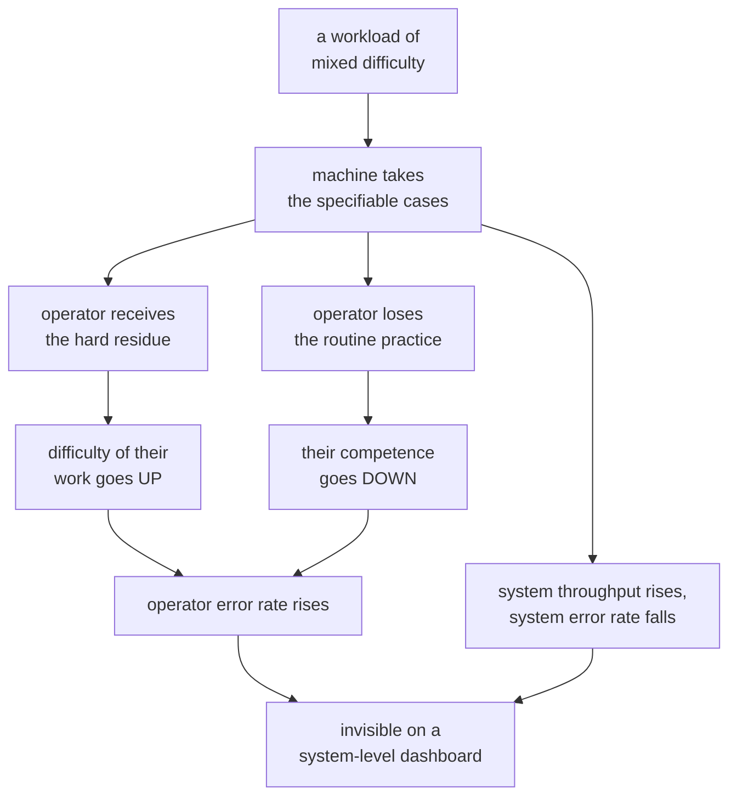

# Ironies of automation

> *Ironies of automation* · `doi:10.1016/0005-1098(83)90046-8` · Automatica 19(6), 775–779, 1983
> · <https://doi.org/10.1016/0005-1098(83)90046-8>
>
> Record checked live on 2026-09-06 via `https://api.crossref.org/works/10.1016/0005-1098(83)90046-8`;
> the title, journal, volume, issue, pages and year above are copied from that record.

## One-line answer

Automating the routine part of a job leaves the human the hard part **and** takes away the
practice that made them good at it — and the demo below measures both halves: with the machine on
the operator's own error rate is **59.4%** against **0.0%** with it off, while the *system's*
error rate goes the other way, **26.8%** against **50.0%**.

## The story

You get a new car with a satnav and you drive the same route to work every day for two years. You
follow the voice. You take the turnings it tells you to take. You arrive, every time, without
having thought about it once.

Then one morning the screen does not come on.

You know the route in the sense that you have driven it four hundred times. You do not know it in
the sense that you can drive it. There is a roundabout where you have never once chosen an exit,
because a voice has always chosen for you, and you sit at it now with three options and no idea.

Here is the awkward part. You are not worse at driving than you were two years ago. You are worse
at *this*, specifically, and you are worse at it because of the two years — the very repetition
that would have taught you the route was done for you. The device did not fail to teach you. It
succeeded at making the teaching unnecessary, and the teaching was the thing you needed on the
one morning it mattered.

## The idea in plain language

The paper is about control rooms and process plants, and its argument survives the change of
setting completely.

Its starting point is what engineers do when they automate. They take the parts of a job that can
be described precisely and give them to a machine, and they leave the rest to a person, because
the rest cannot be described precisely. That is sensible, and it is what everybody does. It is
also the source of both ironies.

**The first irony: the operator is left the hard part.** The tasks that could not be automated are
not a random sample of the job. They are, by construction, exactly the ones the machine's
designers could not specify — the ambiguous, the novel, the ones requiring judgement. So
automation systematically hands the human the difficult residue and calls it "supervision".

**The second irony: the operator loses the skill.** Skill comes from doing the work, and
particularly from doing the routine work often enough that the unusual case is recognisable
against it. Take the routine away and the practice goes with it. The person is then asked to
handle the hardest cases with less practice than they had before automation, and — because these
situations arrive rarely and usually badly — under pressure.

Put together, the paper's uncomfortable claim is that **automation does not reduce the demand on
the human; it raises it**, while simultaneously removing what would have met it.

Two terms, defined once, because both are used loosely elsewhere.

**Deskilling** is the loss of practised competence caused by not exercising it. It is not
forgetting facts — the satnav driver still knows what a roundabout is. It is the loss of the fast,
unreflective fluency that comes from repetition.

A **monitoring task** is watching an automatic system for the rare occasion it needs you. The
paper's third point, and the one most often quoted, is that humans are poorly suited to this
regardless of training: attention to an uneventful display falls away, and the failure is a
property of the arrangement rather than of the person.

## Why Sutra needs it

This day builds a system whose entire purpose is to interrupt a person and ask them to check a
machine's work. That is a monitoring task, and this paper is the argument that monitoring tasks
degrade.

[7.1](../parts/07-what-the-human-sees/7.1-the-tick-box-nobody-reads.md) is where the argument
lands directly: it measures the ceiling of an approval screen and finds that a one-line card can
catch **1 of 8** planted mistakes. The paper explains why the story does not end there — the
reviewer's real performance sits below that ceiling and falls further the longer the system works
well, because a queue of correct drafts is exactly the training regime that produces automatic
approval.

[7.2](../parts/07-what-the-human-sees/7.2-the-card-that-makes-checking-possible.md) is the
paper's own recommendation applied: it says the answer is not to exhort the operator but to
support them, by having the machine do the cross-referencing and present the result. And
[8.2](../parts/08-in-production/8.2-the-three-numbers-to-put-on-a-wall.md)'s yield metric is the
measurement that tells you whether the degradation has happened.

The paper is also read again on Day 63, where the policy table decides how often a person is
asked — because the frequency of the interruption is the variable this paper says determines
whether the interruption works.

## The mechanism

The paper's argument is not a mathematical model, so the mechanism worth writing out is its
causal chain, stated so that each link is separately checkable:

1. A workload contains cases of varying difficulty.
2. Automation is built for the cases that can be specified — which correlate with being easy.
3. Therefore the machine takes the easy cases and the human receives the hard ones. **The
   difficulty of the human's remaining work rises**, with no change in the human.
4. Practice comes from handling cases. The machine has removed most of the cases.
5. Therefore the human's competence declines over time. **The capability meeting the work falls**,
   as the work gets harder.
6. Both effects push the same way, and neither is visible in the system's overall performance,
   which improves — because the machine is handling volume the human never could.

Step 6 is the part that makes the paper more than a complaint. **The system gets better while the
human's position gets worse**, and a measurement of the system alone shows only the improvement.
Any dashboard that reports overall error rate will report success throughout.

That is also the trap in demonstrating it, and it is worth naming because the demo below had to
be designed around it. If you model the operator alone, you "prove" that automation is bad, which
is not the paper's claim and would be a straw man. The paper takes for granted that the machine
is there because the volume demands it. Both halves — the system improving and the operator's own
position deteriorating — have to be on screen together, or the demonstration argues for something
the paper never said.



## The paper in one demo

The whole argument, made runnable, with a switch that turns the automation off.

```text
days/day-62-human-in-the-loop/lab/papers/ironies-of-automation/
├── ironies.py   # the operator, the workload, and the run
└── demo.py      # print the run, with and without the machine
```

Two files. There is no agent, no model call and no framework, because none of those is the
paper's contribution — the contribution is the causal chain above, and anything else in the
directory would be a different document.

`ironies.py` holds the model:

```python
GAIN = 0.01  # skill regained per case the operator handles
DECAY = 0.01  # skill lost per case handled without them
CEILING = 1.0
FLOOR = 0.30
CAPACITY = 200  # cases one operator can get to at all


@dataclass
class Operator:
    """Someone whose competence follows from what they have recently been doing."""

    skill: float = CEILING
    handled: int = 0
    correct: int = 0
    seen: list[float] = field(default_factory=list)

    def rust(self) -> None:
        self.skill = max(FLOOR, self.skill - DECAY)

    def decide(self, difficulty: float) -> bool:
        """True when the operator gets this case right."""
        self.handled += 1
        self.seen.append(difficulty)
        right = self.skill >= difficulty
        self.correct += right
        self.skill = min(CEILING, self.skill + GAIN)
        return right
```

**Line by line:**

- `skill` starts at `CEILING` — the operator begins fully competent, so any decline in the run is
  caused by the automation and not by a low starting point.
- `rust()` is step 4 of the chain: skill falls by `DECAY` for every case handled **without** them.
  It is called on the automated cases, which is the only place the machine touches the operator at
  all.
- `decide()` is steps 1 and 3: `right = self.skill >= difficulty` is deterministic on purpose. A
  probability here would turn the demo into a study of a coin flip; the paper's claim is about a
  systematic relationship, and a threshold expresses it without noise.
- `self.skill = min(CEILING, self.skill + GAIN)` — practice works. Handling a case makes them
  better. This matters: without it the model would only ever decay and would be assuming its
  conclusion.
- `CAPACITY = 200` is the addition that keeps the demo honest, and the module docstring says so.
  The paper assumes the machine exists because the volume exceeds one person. Without a capacity
  limit the ablation would show automation as pure harm, which is not the claim.
- `FLOOR = 0.30` stops skill decaying to zero. An operator who has not done the job in a while is
  worse, not helpless.

`run()` walks the workload past the operator once:

```python
def run(case_list: list[float], threshold: float | None) -> dict:
    operator = Operator()
    automated = 0
    unhandled = 0
    for difficulty in case_list:
        if threshold is not None and difficulty <= threshold:
            automated += 1
            operator.rust()
            continue
        if operator.handled >= CAPACITY:
            unhandled += 1
            continue
        operator.decide(difficulty)
    ...
```

**Line by line:**

- `threshold` is the ablation switch. A float means the machine handles everything at or below
  that difficulty and is right about all of it — its design contract, and the reason it was
  deployed. `None` turns it off.
- `difficulty <= threshold` is step 2: the machine takes the easy cases. This single comparison is
  the entire mechanism by which the operator ends up with the hard ones.
- `operator.rust()` fires on the automated branch, before `continue`. The operator is idle for
  that case and loses a little practice, which is the second irony in one line.
- `operator.handled >= CAPACITY` counts cases nobody gets to. With the machine off this is where
  the overflow goes, and it is what stops the ablation from looking like a free win.
- The `cases()` function feeding this returns a fixed cycle of difficulties, identical in both
  arms, so the two runs are compared on exactly the same work.

Run it with the machine on:

```bash
cd days/day-62-human-in-the-loop/lab/papers/ironies-of-automation
uv run python demo.py
```

**Line by line:**

- `COUNT = 400` cases against `CAPACITY = 200` — the volume genuinely exceeds one person, which is
  the premise.
- `THRESHOLD = 0.55` means the machine handles a little over half the difficulty range.

Measured on 2026-09-06:

```text
  machine ON  (handles difficulty <= 0.55)
  cases in the workload            400
  operator capacity                200
  cleared by the machine           220
  handled by the operator          180
  never looked at by anyone        0
  median difficulty they faced     0.77
  their skill at the end           0.6
  the operator got wrong           107
  THEIR error rate                 59.4%
  the SYSTEM got wrong             107  (26.8% of the workload)
```

Now the ablation — the same 400 cases, the same operator, no machine:

```bash
uv run python demo.py --no-automation
```

**Line by line:**

- One flag, one changed argument: `threshold` becomes `None`. Nothing else differs, including the
  case list.

```text
  machine OFF (the ablation)
  cases in the workload            400
  operator capacity                200
  cleared by the machine           0
  handled by the operator          200
  never looked at by anyone        200
  median difficulty they faced     0.52
  their skill at the end           1.0
  the operator got wrong           0
  THEIR error rate                 0.0%
  the SYSTEM got wrong             200  (50.0% of the workload)
```

Read the two pairs of numbers against each other.

**The operator's own position, with the machine on:** median difficulty **0.77** against **0.52**,
final skill **0.6** against **1.0**, error rate **59.4%** against **0.0%**. Harder work, less
skill, more mistakes. Both ironies, measured, on the same person facing the same workload.

**The system's position, with the machine on:** **26.8%** of the workload got the wrong outcome,
against **50.0%** without it. The machine halved the system's error rate. It was the right thing
to deploy.

Both of those are true at once, and that is the paper's point rather than a tension in the demo.
The switch turns off the automation and the system gets worse while the human gets better — which
is exactly why the arrangement is an irony rather than a mistake, and why "remove the automation"
is not the lesson the paper supports.

## When it breaks

The paper is from 1983, it is about industrial process control, and it is worth being precise
about where its claims do and do not carry.

**Where it does not hold.** The second irony depends on the human's competence coming from the
routine work. Where the skill comes from somewhere else — training, another job, a domain the
person practises independently — the deskilling half weakens considerably. A doctor reviewing a
model's suggestion does not lose their medical training because a triage system took the easy
cases; they may lose calibration for that specific queue, which is a smaller effect.

**Where it was measured.** It was not, in the sense a modern reader expects. This is an argument
paper drawing on control-room experience, not a controlled study with an effect size. Anyone
citing a number from it is citing something that is not there. The demo above is a *model* of the
argument and its numbers are properties of the model's constants, not measurements of people.

**What it assumed.** One operator, one plant, a stable process and automation that is fixed once
installed. Modern agent systems break the last of those constantly: the model changes under the
reviewer, so the pattern of errors they have learned to expect stops being valid at exactly the
moment they have finished learning it. That is a fourth irony the paper did not have to consider.

**The follow-up that narrowed it.** The literature since has largely moved from "the operator
degrades" to *how the interface can prevent it*, which is the same move
[7.2](../parts/07-what-the-human-sees/7.2-the-card-that-makes-checking-possible.md) makes with the
`Checks:` block. That is a genuine narrowing: the paper's ironies are properties of a particular
division of labour, not of automation as such, and dividing the labour differently changes them.

## In production

**What survived.** The core observation is now standard practice wherever automation supervises
anything consequential, usually without attribution. Three concrete descendants:

- **Keeping the human in practice deliberately.** Aviation's requirement that pilots hand-fly
  regularly is this paper's second irony turned into a rule. The agent-system equivalent is
  sampling: routing a fraction of easy cases to a person specifically so their calibration
  survives, and paying the cost knowingly.
- **Designing the interface for noticing rather than reading.** The paper's recommendation to
  support the operator rather than exhort them is the direct ancestor of the computed-check line
  in [7.2](../parts/07-what-the-human-sees/7.2-the-card-that-makes-checking-possible.md).
- **Treating the monitoring task as the thing to measure.** The yield metric in
  [8.2](../parts/08-in-production/8.2-the-three-numbers-to-put-on-a-wall.md) exists because this
  paper's failure is invisible in system-level performance.

**What did not survive.** The paper's implicit setting — one skilled operator, watching one
process, all day — is gone. Modern review work is a queue of unrelated decisions handled by
whoever is on a rota, often by people with no deep model of the system at all. That makes the
deskilling argument weaker (there was less skill to lose) and the first irony **much stronger**:
the residue that reaches the reviewer is now hard *and* unfamiliar. The paper's proposed
remedies, which centre on the operator's understanding of the process, do not transfer well to
someone seeing this ticket type for the first time — which is why the practical answer has moved
almost entirely to the interface.

**What replaced it.** Where the paper said *keep the operator engaged*, current practice says
*put the evidence and the computed checks on the card, ask less often, and measure whether the
human's involvement is changing outcomes.* That is a lower ambition than the paper's, and it is
the one that works when the human is a rota rather than an expert.

## Check yourself

```bash
cd days/day-62-human-in-the-loop/lab/papers/ironies-of-automation
uv run python demo.py
uv run python demo.py --no-automation
```

Now change `THRESHOLD` in `demo.py` from `0.55` to `0.30` and run both arms again. The machine
takes fewer cases. Predict, before you run it, what happens to the operator's median difficulty,
their final skill, and the system's error rate — then check which of your three predictions was
wrong.

**Out loud, without scrolling up:** *what did this paper actually claim, and what do we do
differently now?* The claim is two ironies and their common cause. What we do differently is that
we no longer try to solve it by keeping the operator engaged — we solve it at the interface, and
we measure whether the human's involvement changed anything.

**Next:** back to the hub, [Day 62](../LESSON.md).
