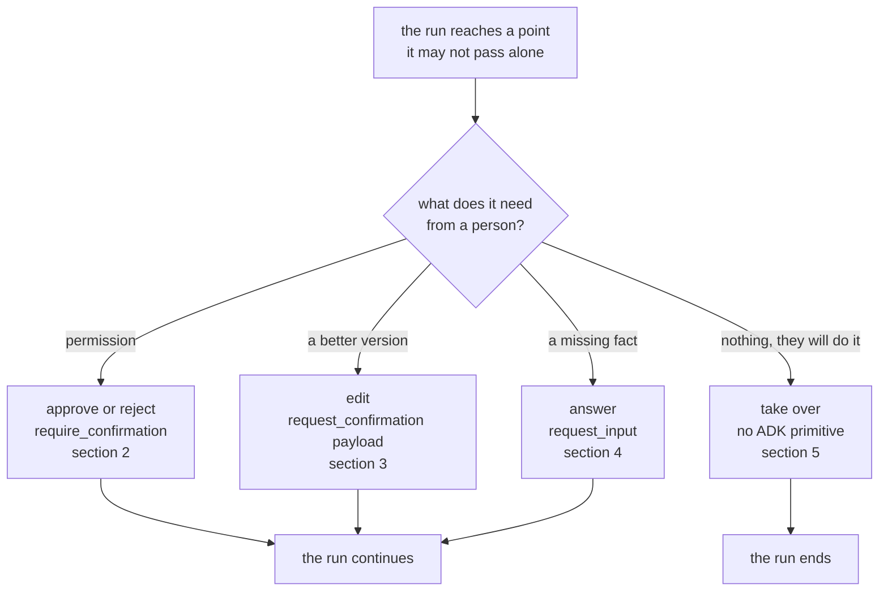

# 1.1 — Four questions wearing one name

## One-line answer

"Human in the loop" is not one design but four — **approve**, **edit**, **answer**, **take
over** — and they differ in what the person is shown, what they are allowed to do, what the
run does meanwhile, and what happens when nobody replies.

## The story

You take a shirt to a tailor to be altered. Over the next week he needs you four times, and
each time he needs something different from you.

The first time, he holds up the shirt with the sleeves pinned and asks: shall I cut here?
You say yes. He cuts.

The second time, he has already pinned the hem. You look at it, fold it up another finger's
width yourself, and hand it back. He did not ask a question. He showed you his work, and you
changed it.

The third time he telephones. He has run out of the grey thread and wants to know whether
you mind a slightly darker grey. He cannot carry on at all until you say something. That is
not because he needs permission. It is because he does not have the information.

The fourth time, he tells you the collar is beyond saving. You take the shirt home and wear
it with the collar as it is.

Four interruptions, and all four would go in a notebook under one heading: *waiting for
customer*. That notebook would be useless. In the first case he needs a yes or a no. In the
second he needs the garment back. In the third he needs a fact. In the fourth he needs to
stop and hand over the shirt.

## The idea in plain language

**Human in the loop** means a system that stops part-way through its own work and waits for
a person before going on. In this curriculum the system is the triage desk: it reads a
support ticket, looks for similar past tickets, drafts a reply, and — the part that matters
today — does not send that reply on its own.

The phrase is used as though it names one mechanism. It names at least four, and they differ
enough that a design which handles one handles none of the others properly.

| Pattern | The person is shown | They may | Meanwhile the run | If nobody replies |
| --- | --- | --- | --- | --- |
| **Approve or reject** | what is about to happen | say yes or no | is stopped before an action | the action does not happen |
| **Edit** | what the agent produced | change it and hand it back | is stopped holding a draft | there is a draft nobody owns |
| **Answer a question** | a question | supply a missing fact | is stopped lacking an input | it cannot proceed at all |
| **Take over** | the whole job | do it themselves | must end, not resume | the job is done and the run is not |

Four rows, four different failure modes. Only the first is what most people picture when
they say "we will add a human in the loop".

Three distinctions do the real work:

1. **Approve is about permission. Answer is about information.** An approval gate that is
   really a missing input is a design bug, because the agent should have looked the fact up.
   Sutra's own count of that mistake is in
   [4.3](../04-ask-a-question/4.3-the-question-you-should-not-have-asked.md).
2. **Edit is not approve with extra fields.** When the person changes the output, what the
   system does next is *not what the system produced*, and every record saying otherwise is
   now wrong. That is [3.3](../03-edit/3.3-what-the-record-says-the-customer-got.md).
3. **Take over has no resume.** The other three end with the run continuing. This one ends
   with the run stopping, and a system with no way to record *a person dealt with it* leaks
   half-finished runs for ever ([5.2](../05-take-over/5.2-the-run-nobody-closed.md)).

Two terms this day uses constantly, defined once here.

A **run** is one execution of the agent's work, from a request to a result. Day 60 drew the
line that matters: a run is not the operating-system process it happens to be running in,
and it can outlive that process. That argument is
[Day 60, part 1.1](../../../day-60-durable-execution/parts/01-what-a-run-is/1.1-the-run-is-not-the-process.md).

A **pending question** is a run that has stopped, plus everything needed to pick it up
again: what was asked, what the person was shown, and where the answer should be sent.

## Why Sutra needs it

Day 58 wired the triage graph end to end, and its last stage sends a reply to a customer.
Nothing in the system currently stops that from happening unsupervised.

Day 63 writes the policy that decides **which** actions need a person and why. Day 64 builds
the gate. Neither can be designed by someone who believes there is one kind of human
involvement, because the policy table needs a column naming which of the four, and the gate
needs four code paths.

The concrete thing that breaks without this part: Day 64 has to implement rejection, and a
reader who has only met *approve* will implement rejection as *not approving*. That loses
the reason, loses the audit trail, and leaves the agent free to attempt the same thing again
on the next turn.

## The mechanism

The four patterns are not four libraries. They are four shapes of the same pause, and ADK
2.7.1 gives real machinery to three of them and leaves the fourth to you.



One structural fact sits under all four: **the pause is a tool call that never receives a
response.** ADK marks such a call in the event's `long_running_tool_ids`, and the runner
stops rather than waiting. Here is that field on a real run, with no model and no network:

```bash
cd days/day-62-human-in-the-loop/lab
uv run python ask.py
```

**Line by line:**

- `ask.py` builds a real `LlmAgent` and a real `InMemoryRunner` and hands them a model that
  reads its answers off a list instead of a network. That model is `_scripted.py`, and it is
  why this whole day costs zero requests against the free tier.
- The agent is given ADK's built-in `request_input` tool and the scripted model calls it.
  Nothing about the pause depends on the model being real: the pause is the runner's
  behaviour, not the model's.

Measured on 2026-09-05:

```text
  the tool offered to the model: adk_request_input
  call     adk_request_input  args={'message': 'Which order number is the duplicate charge on?', 'response_schema': {'type': 'string'}}
  long_running_tool_ids: ['fc-ask-1']
  -> the run stops here with no response for that call

  the human answers: 'ORD-8874'
  model: Thank you, drafting now.

  model turns used: 2
```

Read the third line rather than the first. `long_running_tool_ids` is how the runner tells
its caller *this call has no answer yet, and I am not going to wait for one*. Every pattern
ADK implements is built on that mechanism: a tool that returns `None`.

Verified against `adk.dev/tools-custom/function-tools/`, fetched 2026-09-05, which puts it
in one sentence: *"Once a long running function tool is invoked the agent runner pauses the
agent run and lets the agent client to decide whether to continue or wait until the
long-running operation finishes."* The symbols were also read out of the installed
`google-adk==2.7.1` at `google/adk/tools/long_running_tool.py`, where the entire
implementation of "pause" is `self.is_long_running = True` beside a function returning
`None`.

## When it breaks

The failure this part exists to prevent raises nothing at all. It is a design that treats
the four as one, and it surfaces as a question the person cannot act on.

🎬 **The scene:** the desk is wired so that every stop produces the same screen — one line of
text and two buttons, *approve* and *reject*.

😬 **The naive fix:** route all four of the tailor's situations through it. *Shall I cut
here?* becomes approve or reject, which is right. *Is this hem the right length?* becomes
approve or reject. *Which grey thread?* becomes approve or reject. *The collar is beyond
saving* becomes approve or reject.

💥 **Why it fails:** the last two are not yes-or-no questions, so the person answers the
question they were given instead of the one that was meant. Pressing *reject* on "which grey
thread?" does not tell the agent which grey thread. It tells the agent that grey thread was
refused. The run then either stops for good or asks again, and the information the system
actually needed never arrives.

💡 **The insight:** the shape of an interruption is set by **what the system is missing**,
not by how the interruption is displayed. Missing permission, missing quality, missing
information and missing appetite are four different things to be missing.

You can see the collapse in ADK's own output. Run the approve pattern and refuse:

```bash
uv run python approve.py --reject
```

**Line by line:**

- `--reject` sends back `{"confirmed": false}` instead of `{"confirmed": true}`. Everything
  else about the run is identical: the same ticket, the same draft, the same tool.

Measured on 2026-09-05:

```text
--- turn 2: the human answers confirmed=False ---
  response send_reply  -> {'error': 'This tool call is rejected.'}

  sent: 0  []
```

That is the entire content of a "no". It is the correct answer to *shall I cut here?* and it
is a useless answer to *which grey thread?* — the agent learns that this call was refused and
nothing whatsoever about what to do instead. Section 2.3 is about how much a rejection has to
carry beyond that string, and section 4 is about the pattern you should have used when the
thing you needed was a fact.

## In production

**What a professional writes instead.** They do not add "HITL" as a feature. They write the
four rows above as four mechanisms with four records, and then write down which actions use
which. That written list is Day 63's policy table, and the reason it comes before the code is
that a team which builds the gate first invariably builds only the approve row and then bends
the other three into it.

**What changes at scale.** With one ticket a day, all four feel like "someone will look at
it". With a thousand they diverge hard. Approvals can be batched and delegated. Edits cannot
be batched, because each one is a piece of writing. Questions can often be removed altogether
by fetching the fact. Take-overs need a second interface entirely, because the person is now
doing the work rather than judging it. A system that modelled all four as one thing has one
queue, one screen and one metric for four workloads with nothing in common.

**The failure mode that only appears with real traffic.** The *answer* pattern is the one
that quietly consumes a team. Each question is individually reasonable and takes a moment,
and because each is individually reasonable nobody counts them. Sutra's count is in
[4.3](../04-ask-a-question/4.3-the-question-you-should-not-have-asked.md): five of seven
questions on a single ticket had their answers already on that ticket. You cannot see that
from inside one interruption. You see it only when you group the questions by type.

**The review comment a senior engineer leaves:** *"This adds one `pending_approval` table
with a `decision` boolean. What row does an edit write? What row does 'the customer phoned
and I sorted it out myself' write? Right now both write `decision = true`, and in six months
nobody will be able to tell those three cases apart in an incident review."*

**The interview question:** *"You said you put a human in the loop. What exactly was the human
allowed to do?"* An honest answer names patterns rather than a feature: *"Three different
things, kept separate. Approvals on the send step, which were a boolean. Edits on the draft,
which came back as a payload — so the text we shipped was not the text the model wrote, and
the audit record had to store both. And a take-over path for when the customer had phoned in,
which ends the run instead of resuming it. We got that last one wrong first time and found it
because runs were sitting open for weeks."*

## Check yourself

```bash
cd days/day-62-human-in-the-loop/lab
uv run python ask.py
uv run python ask.py --choice
```

Both runs stop in the same place for the same reason. Look at the `args` line in each, and
say which of the four patterns each one is, and what the person would have to be shown for
their answer to be worth anything.

**Out loud, without scrolling up:** name the four patterns, and for each one say what the run
does while it waits and what happens if the person never replies.

**Next:** [1.2 — Waiting is a state, not a pause](1.2-waiting-is-a-state-not-a-pause.md).
