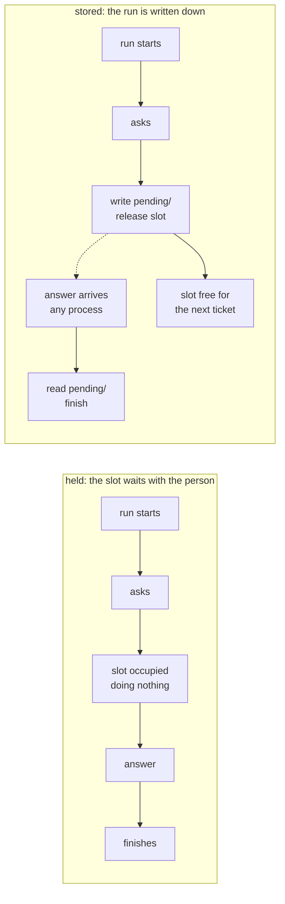

# 1.2 — Waiting is a state, not a pause

## One-line answer

A run that holds a worker slot while a person thinks is a bug, and the measurement is
blunt: on the same twelve tickets with two workers, holding finishes **5** and never starts
**5**, while writing the run down finishes **9** and holds **no** slot at all.

## The story

You take a taxi to a friend's house to collect a bag. You ask the driver to wait outside
while you go in.

Inside, your friend cannot find the bag. You wait in the hallway while they look upstairs.
Then their neighbour arrives and there is a conversation you cannot walk out of. Outside,
the meter is running. The driver cannot take another fare, because he is holding a car for
someone who is standing in a hallway doing nothing.

The obvious thing to do is pay him, let him go, and telephone for another taxi when you
actually have the bag in your hand. Nothing about the errand gets faster. The waiting is
exactly as long as it was. But the waiting stops costing a car.

That is the whole of this part. The person is going to take as long as they take. The
question is whether something expensive is held open while they do.

## The idea in plain language

When code calls a function and waits for it to return, the waiting is free in the sense that
nobody had to design it. The call stack holds the place. Local variables stay where they
are. The program picks up on the next line.

That is a **pause in the code**, and it works because the wait is short and the thing doing
the waiting is cheap.

A human is neither. They answer when they get to it, which may be after they have had lunch,
after the weekend, or never. If your run is a pause in the code for that whole period, then
for that whole period you are holding:

- a process, or at least a task inside one;
- everything that run has loaded into memory;
- a connection, if the request came in over one;
- and a **slot** — a unit of the fixed capacity your system has to do work at all.

The alternative is to make waiting a **state**. Instead of holding the place in memory, you
write down everything needed to pick the work up again, put it somewhere durable, and let
the process go. The question sits in storage. Nothing is held. When the answer arrives, some
process — not necessarily the same one — reads the record and carries on.

Three words for the same idea, so you recognise it wherever you meet it:

- A **worker slot** is one unit of concurrent capacity: one thread, one task, one container,
  whatever your system actually runs out of.
- To **park** a run is to write it down and release the slot.
- To **hold** a run is to keep the slot occupied for the duration of the wait.

This is the same distinction Day 60 drew between a run and a process, applied to a wait
instead of a crash. Day 60 argued that a run must be able to survive its process dying;
this part argues that it must be able to survive its process *leaving*. The machinery is
the same machinery, which is why Day 61 built it before this day needed it.

## Why Sutra needs it

Day 63 is about to decide which of the desk's actions need a person, and one of the arguments
it has to make is *how many* actions can be gated before the gate becomes a wall. That
argument is arithmetic, and the arithmetic depends entirely on whether a waiting run costs a
slot.

If waiting is a pause, the number of tickets Sutra can have in flight is the number of worker
slots, and every gated ticket occupies one for as long as a person takes. If waiting is a
state, the number of tickets in flight is limited by storage, which is to say not limited.

Day 64 then has to build the gate, and it cannot store a pending approval it did not design a
record for.

## The mechanism

The simulation holds everything constant except the one decision. Twelve tickets arrive on a
fixed schedule, each needing one human answer, and the people answering take different
numbers of ticks. Two designs run against the identical list:

```bash
cd days/day-62-human-in-the-loop/lab
uv run python waiting.py
```

**Line by line:**

- `ARRIVALS` is a fixed list of `(ticket, tick it arrives, ticks the human takes)`. It is a
  constant, not a random draw, so the two designs are compared on exactly the same work and
  the result is the same every run.
- `simulate(slots, hold_while_waiting)` is one loop over ticks. The only line that differs
  between the two designs is whether `free += 1` happens when the run starts waiting or when
  the answer arrives.
- `peak` records the highest number of slots in use at any tick, which is the number that
  decides how much machine you have to pay for.

Measured on 2026-09-05:

```text
  12 tickets, 2 worker slots, 20 ticks

  design   finished  peak slots  never started
  held            5           2              5
  stored          9           0              0

  the stored design leaves 3 files in pending/, each one a run that no process is holding open
```

Five of the twelve tickets were **never started** under the holding design. Not delayed —
never picked up at all, because both slots were occupied by runs that were doing nothing
except waiting for a person.

Now the response most teams reach for, which is to buy more slots:

```bash
uv run python waiting.py --slots 8
```

**Line by line:**

- Only the slot count changes. Same arrivals, same human delays, same code.

```text
  12 tickets, 8 worker slots, 20 ticks

  design   finished  peak slots  never started
  held            9           6              0
  stored          9           0              0
```

Four times the capacity buys the holding design exactly what the stored design already had
with none. Both finish 9, and the difference is that one of them needed six slots at peak and
the other needed zero.

That is the finding worth carrying: **the fix for a gate that throttles your throughput is
not more workers, it is not holding the slot.** More workers moves the wall. Parking removes
it.

The stored design's runs live in files, and you can look at one:

```bash
cat pending/4601.json
```

**Line by line:**

- `pending/` is the directory `_pending.py` writes into, one JSON file per parked run. A file is
  the whole of what the stored design keeps while it waits.
- `4601` is the first ticket in `ARRIVALS`, so this is a run that parked on the very first tick.

```json
{
  "ticket": "4601",
  "asked_at": {
    "tick": 0
  },
  "answer_expected_after": 3
}
```

That file is the run. Nothing else about it exists anywhere while it waits.



## When it breaks

The holding design does not fail with an error. It fails as capacity that quietly is not
there, and the shape it takes in production is a queue that grows while the machine looks
idle.

🎬 **The scene:** the desk is deployed with a pool of eight workers. Throughput is fine.
Someone adds an approval step on the send action, exactly as Day 63 will recommend.

😬 **The naive fix:** when throughput collapses the next morning, raise the pool to
thirty-two.

💥 **Why it fails:** the workers are not busy. They are blocked. Every graph and every gauge
shows near-zero processor use and a pool at its limit, which is a combination that reads as
"the pool is too small" and is actually "the pool is being used as a filing cabinet". Raising
it to thirty-two moves the collapse to whenever thirty-two people are thinking at once, which
on a bad day is Monday.

💡 **The insight:** a resource sized for *doing work* must never be spent on *not doing
work*. The moment a run's next step depends on something outside the machine, the machine
should stop holding it.

There is one honest error you can reach here, and it is the reason parking cannot be an
afterthought. Park a run without recording what the person was shown, and the resume has
nothing to act on:

```bash
uv run python roundtrip.py resume 9999
```

```text
    pid 18536  nothing to resume for 9999
```

No traceback, no failure, no work. That is the failure mode of a half-designed pending
record: it does not crash, it simply cannot continue, and the run is now stuck in a state
with no path out of it. What the record has to contain is
[6.3](../06-nobody-answered/6.3-where-the-question-goes.md)'s subject.

## In production

**What a professional writes instead.** They do not park runs in a directory. The pending
question goes in a table with the run identifier, the question, a digest of what the person
was shown, a state (`open`, `answered`, `expired`, `done`), a deadline and an owner. The
directory in this lab is the same shape with the durability removed, which is fine for
teaching and is not fine for a system where two processes may read the same pending record at
once.

**What degrades at scale or under concurrency.** The moment parking works, the pending store
becomes the bottleneck instead of the worker pool, and it fails differently: it grows. Nothing
evicts an unanswered question unless something is written to evict it, so a system that parks
correctly and never expires anything accumulates questions until somebody notices the table.
The count that matters is not how many are open but **how long the oldest has been open**,
and that number belongs on a dashboard from the first day the gate ships.

Concurrency arrives with the answer, not with the parking. Two clicks on the same approval
button, or one click and one retry, produce two answers to one question, and if the resume is
not guarded they produce two actions. That is the whole of
[1.3](1.3-late-twice-or-never.md).

**The failure mode that only appears with real traffic.** With a handful of tickets a day, a
holding design looks completely fine, because the odds of two people thinking at the same
moment are low. The collapse is not gradual: it arrives the first day that the number of
simultaneous open questions exceeds the pool, and until that day every measurement says the
design is fine. This is why the arithmetic above is worth doing before the gate ships rather
than after.

**The review comment a senior engineer leaves:** *"`await approval_future` inside the request
handler means one held connection per pending approval, and our approvals are answered by
people on a different working day. Write the question to a table, return, and pick it up on a
separate path. Otherwise the first time ten approvals are open at once, the service stops
accepting new tickets and the dashboards will say the machine is idle."*

**The interview question:** *"What happens to the run while it waits for the human?"* The
answer that shows you have shipped one: *"Nothing holds it. We write the pending question to
a table and let the worker go. I have measured what the other design costs — on twelve
tickets with two workers, holding finished five and never started five, and parking finished
nine and held no slots. The tempting fix is more workers, and it does help: at eight workers
holding also finished nine. But it needed six slots at peak to do what parking did with
zero."*

## Check yourself

```bash
cd days/day-62-human-in-the-loop/lab
uv run python waiting.py
uv run python waiting.py --slots 8
ls pending/
```

Now change `HORIZON` in `waiting.py` from `20` to `60` and run it again. The held design
stops starving — `never started` goes to `0` — and it still does not catch up. Write down the
two `finished` numbers, and be ready to say what the remaining gap is made of, and why giving
a system more ticks is not a design decision you get to make.

**Out loud, without scrolling up:** explain why the held design finished five tickets and the
stored design finished nine, when both had the same workers and the same humans taking the
same time to answer.

**Next:** [1.3 — Late, twice, or never](1.3-late-twice-or-never.md).
